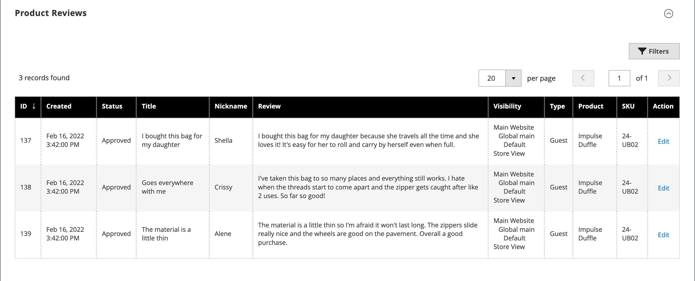

# Paramètres du produit - [!UICONTROL Product Reviews]

La section _[!UICONTROL Product Reviews]_répertorie toutes les critiques soumises par les clients à propos du produit. Cette section s’affiche avec les autres informations sur les produits uniquement après le premier enregistrement d’un nouveau produit. Pour plus d’informations, voir [Avis sur le produit](../merchandising-promotions/product-reviews.md).

{width="600" zoomable="yes"}

## Référence du champ

| Champ | Description |
|--- |--- |
| [!UICONTROL ID] | ID numérique unique généré pour l’entrée de révision du produit |
| [!UICONTROL Created] | Date de publication du réexamen |
| [!UICONTROL Status] | Statut de révision (`Pending`, `Approved` ou `Not Approved`) |
| [!UICONTROL Title] | Titre de la révision |
| [!UICONTROL Nickname] | Surnom de l’utilisateur qui a quitté la révision |
| [!UICONTROL Review] | Avis du client sur le produit actuel |
| [!UICONTROL Visibility] | Visibilité dans les révisions de magasin |
| [!UICONTROL Type] | Type d’utilisateur qui a quitté la révision (`Guest` ou `Customer`) |
| [!UICONTROL Product] | Nom du produit révisé |
| [!UICONTROL SKU] | Unité de gestion des stocks unique affectée au produit |
| [!UICONTROL Action] | Ouvre le produit en mode d&#39;édition |

{style="table-layout:auto"}

## Modération des critiques pour un produit spécifique

1. Dans la barre latérale _Admin_, accédez à **[!UICONTROL Catalog]** > **[!UICONTROL Products]**.

1. Recherchez le produit et ouvrez-le en mode d’édition.

1. Faites défiler l’écran jusqu’à la section _[!UICONTROL Product Reviews]_.

1. Cliquez sur **[!UICONTROL Edit]** pour une révision de produit avec `Pending` statut afin d’afficher et de modifier les détails.

1. Définir le statut de la révision :

   - Pour approuver une révision en attente, sélectionnez `Approved`.
   - Pour rejeter une révision, sélectionnez `Not Approved`.
   - Vous pouvez redéfinir le statut de révision sur `Pending` à tout moment.

1. Cliquez ensuite sur **[!UICONTROL Save Review]**.

Les révisions avec les statuts `Pending` et `Not Approved` ne sont pas affichées sur le storefront.
