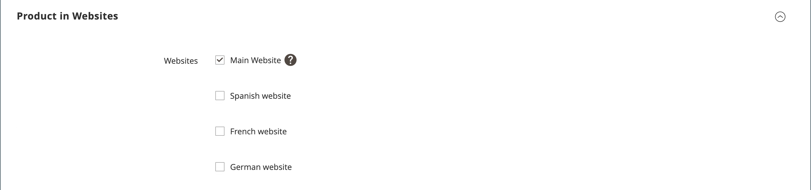

# Paramètres du produit - [!UICONTROL Product in Websites]

La section _[!UICONTROL Product in Websites]_&#x200B;identifie chaque site web sur lequel le produit est disponible, en fonction de la [hiérarchie de magasins](../stores-purchase/stores.md).

{width="550"}

**_Pour copier un produit sur un autre site web :_**

1. Ouvrez le produit en mode d’édition.

1. Faites défiler l’écran vers le bas et développez la section  sur _[!UICONTROL Product in Websites]_.

   {width="600" zoomable="yes"}

1. Cochez la case du site web sur lequel vous souhaitez placer le produit copié.

   Pour une seule installation de site web, la case à cocher du site web est cochée par défaut.

1. Sélectionnez l’ **[!UICONTROL Store View]** où vous souhaitez faire une copie du produit existant.

1. Cliquez sur **[!UICONTROL Save]** et procédez comme suit :

   - Lorsque vous revenez à l’enregistrement de produit, définissez le programme de sélection **[!UICONTROL Store View]** sur la vue de magasin à laquelle le produit a été copié. Lorsque vous êtes invité à confirmer le changement de portée, cliquez sur **[!UICONTROL OK]**.

   - Saisissez le **[!UICONTROL Price]** du produit pour cette vue de magasin.

   Étant donné que la portée de la devise de base est définie sur `website`, il est possible de vendre le produit à un prix différent sur chaque site web.

1. Une fois l’opération terminée, cliquez sur **[!UICONTROL Save]**.
