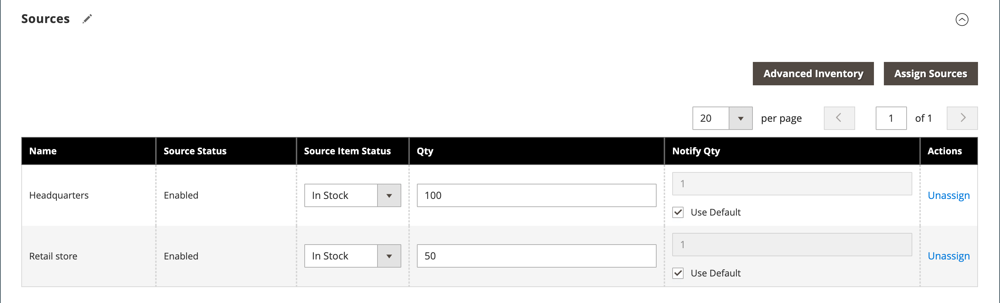

# Paramètres du produit - [!UICONTROL Sources]

La variable _[!UICONTROL Sources]_la section des paramètres du produit répertorie les sources à partir desquelles le produit peut être distribué. Il est utilisé pour affecter et annuler l’affectation des sources ainsi que pour gérer la quantité et la disponibilité du produit. Cette section s’affiche uniquement si plusieurs sources sont définies pour votre magasin. Pour plus d’informations sur les sources, voir [Gestion des sources](../inventory-management/sources-manage.md).

## Attribution d’une source à un produit

1. Cliquez sur **[!UICONTROL Assign Source]**.

1. Cochez la case correspondant aux sources requises.

1. Cliquez sur **[!UICONTROL Done]**.

1. Sélectionner **[!UICONTROL Source Item Status]** et saisissez la variable **[!UICONTROL Qty]** et **[!UICONTROL Notify Qty]** selon les besoins.

1. Cliquez sur **[!UICONTROL Save]** pour enregistrer les modifications.

{width="600" zoomable="yes"}

## Référence de champ

| Champ | Description |
|--- |--- |
| [!UICONTROL Name] | Nom unique d’une source. |
| [!UICONTROL Source Status] | Détermine si le produit est activé ou désactivé dans le catalogue. |
| [!UICONTROL Source Item Status] | Détermine la disponibilité actuelle du produit. Options : **[!UICONTROL In Stock]**- Rend le produit disponible à l’achat. **[!UICONTROL Out of Stock]** - À moins que les commandes en arrière-plan ne soient activées, empêche que le produit soit disponible à l’achat et supprime la liste du catalogue. |
| [!UICONTROL Qty] | Montants des stocks disponibles pour chaque source. |
| [!UICONTROL Notify Qty] | Un montant pour _Notifier pour la quantité_ pour cette source spécifique si `Notify Quantity Use Default` n’est pas sélectionnée. |
| [!UICONTROL Notify Qty Use Default] | Indique d’utiliser le paramètre par défaut pour _Notifier pour la quantité_ dans le paramètre Inventaire avancé du produit ou Global dans la configuration du magasin. Pour plus d’informations sur les paramètres d’inventaire avancés de votre produit, voir [Configuration des options de produit avancées](../inventory-management/product-options.md). |
| [!UICONTROL Actions] | Pour une source affectée, cliquez sur **[!UICONTROL Unassign]** pour rendre la source indisponible pour le produit. Pour une source non attribuée, cliquez sur **[!UICONTROL Assign Sources]** pour rendre une source disponible pour le produit. Pour plus d’informations sur [!UICONTROL Assign Sources] options, voir [Attribution de sources par produit](../inventory-management/sources-assign-per-product.md). |

{style="table-layout:auto"}
