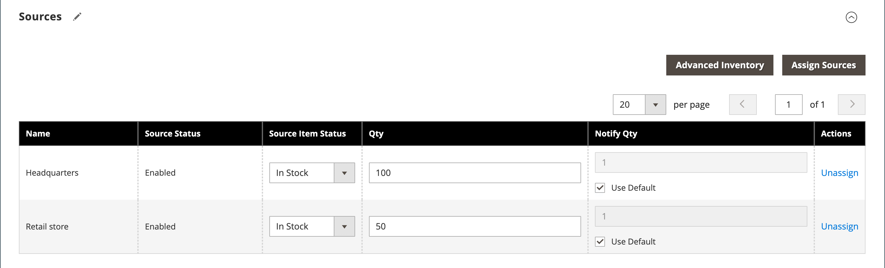

# Paramètres du produit - [!UICONTROL Sources]

La section _[!UICONTROL Sources]_&#x200B;des paramètres du produit répertorie les sources à partir desquelles le produit peut être distribué. Il permet d’affecter et d’annuler l’affectation des sources, ainsi que de gérer la quantité et la disponibilité du produit. Cette section s’affiche uniquement si plusieurs sources sont définies pour votre boutique. Pour plus d’informations sur les sources, voir [Gérer les sources](../inventory-management/sources-manage.md).

## Attribution d’une source à un produit

1. Cliquez sur **[!UICONTROL Assign Source]**.

1. Cochez la case correspondant aux sources requises.

1. Cliquez sur **[!UICONTROL Done]**.

1. Sélectionnez **[!UICONTROL Source Item Status]** et saisissez les valeurs **[!UICONTROL Qty]** et **[!UICONTROL Notify Qty]** selon vos besoins.

1. Cliquez sur **[!UICONTROL Save]** pour enregistrer les modifications.

{width="600" zoomable="yes"}

## Référence du champ

| Champ | Description |
|--- |--- |
| [!UICONTROL Name] | Nom unique d’une source. |
| [!UICONTROL Source Status] | Détermine si le produit est activé ou désactivé dans le catalogue. |
| [!UICONTROL Source Item Status] | Détermine la disponibilité actuelle du produit. Options : **[!UICONTROL In Stock]**- Rend le produit disponible à l’achat. **[!UICONTROL Out of Stock]** - Sauf si les commandes en souffrance sont activées, empêche l&#39;achat du produit et supprime la liste du catalogue. |
| [!UICONTROL Qty] | Montant du stock disponible pour chaque origine. |
| [!UICONTROL Notify Qty] | Montant de l&#39;option _Notifier pour la quantité_ pour cette origine spécifique si `Notify Quantity Use Default` n&#39;est pas sélectionnée. |
| [!UICONTROL Notify Qty Use Default] | Indique d&#39;utiliser le paramètre par défaut _Notifier pour la quantité_ dans le stock avancé du produit ou le paramètre global dans la configuration du magasin. Pour plus d&#39;informations sur les paramètres d&#39;inventaire avancés de votre produit, voir [Configurer les options avancées du produit](../inventory-management/product-options.md). |
| [!UICONTROL Actions] | Pour une source affectée, cliquez sur **[!UICONTROL Unassign]** pour que la source ne soit pas disponible pour le produit. Pour une source non affectée, cliquez sur **[!UICONTROL Assign Sources]** pour rendre une source disponible pour le produit. Pour plus d’informations sur [!UICONTROL Assign Sources] options, voir [Attribution de sources par produit](../inventory-management/sources-assign-per-product.md). |

{style="table-layout:auto"}

