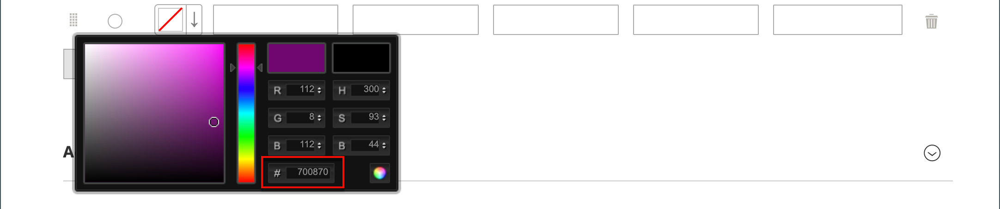
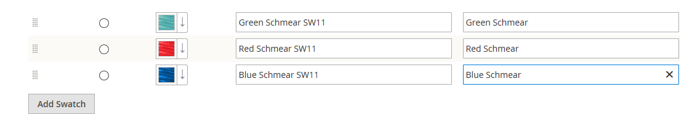

# Échantillons de produits

Les clients ont de grandes attentes concernant le choix d’une couleur et il est essentiel que les descriptions de produit représentent précisément chaque couleur, motif ou texture disponible. Par exemple, les pantalons de l’exemple suivant ne sont pas disponibles en rouge, vert et bleu. Elles sont disponibles uniquement dans des nuances spécifiques de rouge, vert et bleu, probablement propres à ce produit.

{width="700" zoomable="yes"}

Pour [produits configurables](product-create-configurable.md), la couleur peut être indiquée par un échantillon visuel, un échantillon de texte ou un contrôle d’entrée. Les nuanciers peuvent être utilisés sur la page de produits, dans les listes de produits et dans [navigation par couches](navigation-layered.md). Sur la page du produit, les échantillons sont synchronisés pour afficher l’image du produit correspondante lorsque l’échantillon est sélectionné. Lorsque le client sélectionne l’échantillon, la valeur correspondante apparaît dans le champ de saisie et l’échantillon est défini comme la sélection actuelle.

>[!NOTE]
>
>Les attributs d’échantillon peuvent être configurés pour ne pas afficher les images de produit simples correspondantes lorsque l’échantillon est sélectionné en définissant la variable _[!UICONTROL Update Product Preview Image]_valeur de l’option `No` sur le [!UICONTROL Attribute Edit] dans Admin.

## Esquisses basées sur du texte

Si une image n’est pas disponible pour un échantillon, la valeur d’attribut apparaît sous forme de texte. Un échantillon de texte est semblable à un bouton avec un libellé de texte et se comporte de la même manière qu’un échantillon avec une image. Lorsque des échantillons basés sur du texte sont utilisés pour afficher les tailles disponibles, toute taille qui n’est pas disponible est dépassée.

{width="700" zoomable="yes"}

## Nuancier dans la navigation par couches

Les nuanciers peuvent également être utilisés dans la navigation par couches, si la variable _[!UICONTROL Use in Layered Navigation]_de l’attribut de couleur est défini sur `Yes`. L’exemple suivant montre des échantillons d’images basés sur du texte et des couleurs dans la navigation par couches.

{width="700" zoomable="yes"}

## Création d’échantillons pour les produits

Les nuanciers peuvent être définis comme un composant de la `color` d’un produit spécifique ou configuré localement en tant que [images produit](product-image.md#upload-an-image).

Dans les exemples précédents, le pantalon &quot;Sylvia Capri&quot; est disponible dans des valeurs spécifiques de `red`, `green`, et `blue`. Puisque les échantillons ont été pris de l’image du produit, chaque échantillon est une vraie représentation de la couleur. La variable `color` est utilisé pour gérer les informations pour toutes les couleurs et tous les échantillons de produits.

### Étape 1 : création des échantillons

Utilisez l’une des méthodes suivantes pour créer des échantillons pour vos produits.

#### Méthode 1 : ajout d’un échantillon de couleur

1. Pour capturer la véritable couleur d’un produit, ouvrez l’image dans un éditeur de photos et utilisez l’outil de chute d’oeil pour identifier la couleur exacte et prendre note de la valeur hexadécimale équivalente.

   {width="400"}

1. Sur le _Administration_ barre latérale, accédez à **[!UICONTROL Stores]** > _[!UICONTROL Attributes]_>**[!UICONTROL Product]**.

1. Dans la grille, ouvrez le _color_ en mode d’édition.

1. Vérifiez que **[!UICONTROL Catalog Input Type for Store Owner]** est défini sur `Visual Swatch`.

1. Si vous préférez ne pas afficher les images de produit simples correspondantes lorsque l’échantillon est sélectionné sur la page d’affichage du produit, définissez **[!UICONTROL Update Product Preview Image]** to `No`.

1. Sous _[!UICONTROL Manage Swatch (Values of Your Attribute)]_, cliquez sur **[!UICONTROL Add Swatch]**et procédez comme suit :

   {width="600" zoomable="yes"}

   - Dans le _Échantillon_ , cliquez sur le nouvel échantillon et sélectionnez **[!UICONTROL Choose a color]** dans le menu.

     {width="500" zoomable="yes"}

   - Dans le sélecteur de couleurs, placez le curseur dans la variable **#** , supprimez la valeur actuelle et saisissez la valeur hexadécimale de six caractères de la nouvelle couleur.

     {width="500" zoomable="yes"}

   - Pour enregistrer l’échantillon, cliquez sur le bouton _Roue en couleur_ (  ) dans le coin inférieur droit du sélecteur de couleurs.

   - Dans le _Administration_ , saisissez un libellé pour décrire la couleur à l’intention de l’administrateur de magasin.

     Vous pouvez également saisir la traduction de la couleur pour chaque langue prise en charge. Dans l’exemple suivant, le SKU est inclus à titre de référence dans la variable _Administration_ car les couleurs ne sont utilisées que pour un produit spécifique. Vous pouvez inclure un espace ou un trait de soulignement dans le libellé, mais pas un trait d’union.

   - Dans le _Is Default_ , sélectionnez l’échantillon à utiliser par défaut.

   - Pour modifier l’ordre des échantillons de couleurs, cliquez sur le bouton _[!UICONTROL Order]_ et faites glisser l’élément vers un nouvel emplacement dans la liste.

     {width="400"}

1. Lorsque vous avez terminé, cliquez sur **[!UICONTROL Save Attribute]** et actualisez le cache lorsque vous y êtes invité.

1. Ouvrez chaque produit en mode d’édition et mettez à jour le **Couleur** avec l’échantillon correct.

   Pour mettre à jour plusieurs produits en même temps, procédez comme suit.

#### Méthode 2 : téléchargement d’une image d’échantillon

1. Pour capturer une image pour un échantillon, ouvrez l’image du produit dans un éditeur de photos et enregistrez une zone carrée de l’image qui représente la couleur, le motif ou la texture.

   Si nécessaire, vous pouvez répéter cette action pour chaque variante du produit.

   La taille et les dimensions de l’échantillon sont déterminées par le thème. En règle générale, l’enregistrement d’une image en tant que carré permet de conserver les proportions d’un modèle.

   {width="400"}

1. Sur le _Administration_ barre latérale, accédez à **[!UICONTROL Stores]** > _[!UICONTROL Attributes]_>**[!UICONTROL Product]**.

1. Dans la grille, ouvrez le **[!UICONTROL color]** en mode d’édition.

1. Vérifiez que **[!UICONTROL Catalog Input Type for Store Owner]** est défini sur `Visual Swatch`.

1. Si vous préférez ne pas afficher les images de produit simples correspondantes lorsque l’échantillon est sélectionné sur la page d’affichage du produit, définissez **[!UICONTROL Update Product Preview Image]** to `No`.

1. Sous _[!UICONTROL Manage Swatch]_(valeurs de votre attribut), cliquez sur **[!UICONTROL Add Swatch]**et procédez comme suit :

   - Dans le _[!UICONTROL Swatch]_, cliquez sur le nouvel échantillon pour afficher le menu et choisissez **[!UICONTROL Upload a file]**.

   - Accédez au fichier d’échantillon que vous avez préparé et sélectionnez le fichier à charger.

   - Répétez ces étapes pour chaque échantillon d’image.

   - Saisissez les libellés pour l’administrateur et le storefront.

     Dans cet exemple, le SKU est inclus dans l’étiquette d’administration à titre de référence, car ces couleurs ne sont utilisées que pour un produit spécifique. Vous pouvez inclure un espace ou un trait de soulignement dans le libellé, mais pas de trait d’union.

     {width="500" zoomable="yes"}

1. Lorsque vous avez terminé, cliquez sur **[!UICONTROL Save Attribute]** et actualisez le cache lorsque vous y êtes invité.

1. Ouvrez chaque produit en mode d’édition et mettez à jour le **[!UICONTROL Color]** avec l’échantillon correct.

   Pour mettre à jour plusieurs produits en même temps, procédez comme suit.

### Étape 2 : Mettre à jour les produits

1. Sur le _Administration_ barre latérale, accédez à **[!UICONTROL Catalog]** > **[!UICONTROL Products]**.

1. Utilisez la variable **[!UICONTROL Filter]** pour afficher la liste par nom ou SKU et inclure uniquement les produits applicables.

1. Dans la grille, cochez la case de chaque produit auquel s’applique l’échantillon.

1. Définir **[!UICONTROL Actions]** to `Update Attributes`.

   Dans cet exemple, toutes les configurations bleues du pantalon sont sélectionnées.

   {width="600" zoomable="yes"}

1. Faites défiler l’écran vers le bas jusqu’à **[!UICONTROL Color]** et sélectionnez l’attribut **[!UICONTROL Change]** .

   {width="400"}

1. Sélectionnez l’échantillon qui s’applique aux produits sélectionnés, puis cliquez sur **[!UICONTROL Save]**.

1. Lorsque vous y êtes invité, actualisez le cache.

   {width="200"}

## Ajout d’échantillons à un produit simple

1. Sur le _Administration_ barre latérale, accédez à **[!UICONTROL Catalog]** > **[!UICONTROL Products]**.

1. Ouvrez un produit en mode d’édition, vérifiez son état (doit être activé).

1. Cliquez sur **[!UICONTROL Create Configurations]** (sous la balise `Configurations` ).

1. Dans la fenêtre contextuelle, sélectionnez l’attribut Couleur et **[!UICONTROL Next]**.

1. Sélectionnez des échantillons de couleurs dans l’attribut que vous souhaitez inclure dans ce produit.

1. Dans la barre de progression, cliquez sur **[!UICONTROL Next]**.

1. [Configuration des images, du prix et de la quantité](product-create-configurable.md#step-3-configure-the-images-price-and-quantity).

   Au cours de cette étape, définissez les images, le prix et la quantité de chaque configuration. Les options disponibles sont les mêmes pour chacune d’elles et vous pouvez en choisir une seule. Vous pouvez appliquer le même paramètre à tous les SKU, appliquer un paramètre unique à chaque SKU ou ignorer les paramètres pour l’instant.

1. Lorsque la configuration des images, du prix et de la quantité est terminée, cliquez sur **[!UICONTROL Next]** dans le coin supérieur droit.

   Les variations de produit actuelles s’affichent au bas de la section Configuration . Si les configurations vous conviennent, cliquez sur **[!UICONTROL Generate Products]**.
