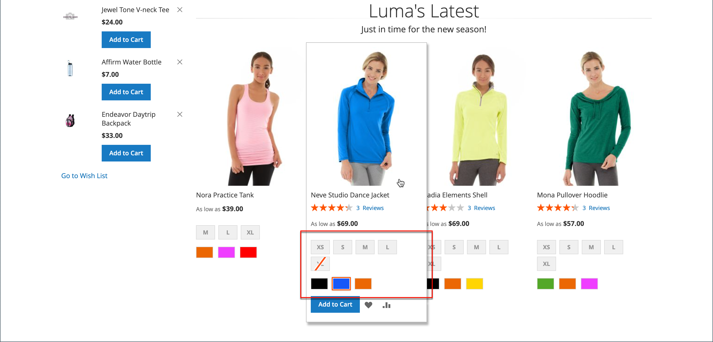
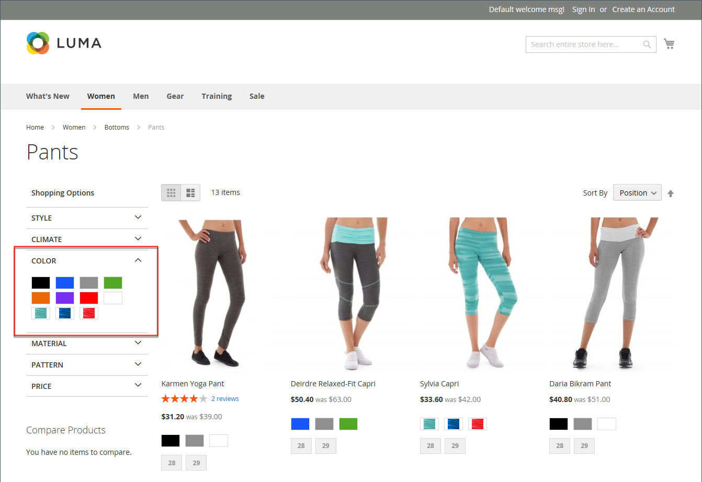
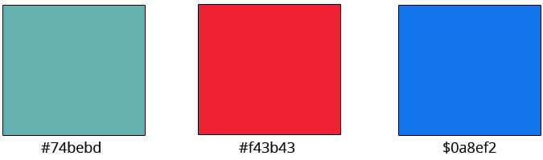
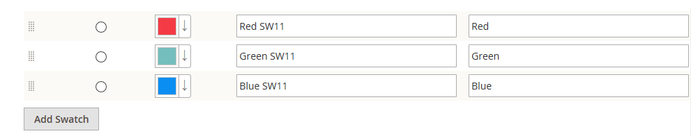
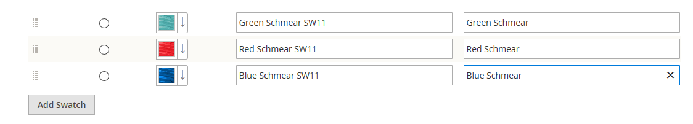
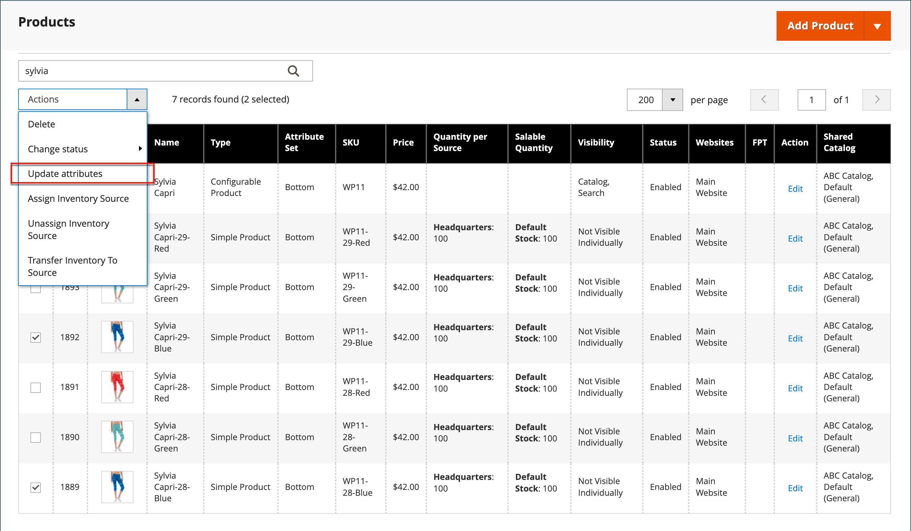

# Échantillons de produits

Les clients attendent beaucoup d’eux qu’ils choisissent une couleur. Il est donc essentiel que les descriptions des produits représentent précisément chaque couleur, modèle ou texture disponible. Par exemple, les pantalons de l’exemple suivant ne sont pas disponibles en rouge, vert et bleu. Ils sont plutôt disponibles uniquement dans des nuances spécifiques de rouge, vert et bleu, qui sont probablement uniques à ce produit.

{width="700" zoomable="yes"}

Pour les [produits configurables](product-create-configurable.md), la couleur peut être indiquée par un échantillon visuel, un échantillon de texte ou un contrôle de saisie. Les nuanciers peuvent être utilisés sur la page de produits, dans les listes de produits et dans [navigation superposée](navigation-layered.md). Sur la page du produit, les échantillons sont synchronisés pour afficher l’image du produit correspondante lorsque l’échantillon est sélectionné. Lorsque le client sélectionne l’échantillon, la valeur correspondante apparaît dans le champ de saisie et l’échantillon est signalé comme étant la sélection en cours.

>[!NOTE]
>
>Les attributs d’échantillon peuvent être configurés pour ne pas afficher les images de produits simples correspondantes lorsque l’échantillon est sélectionné en définissant la valeur de l’option _[!UICONTROL Update Product Preview Image]_sur `No` dans la page [!UICONTROL Attribute Edit] de l’Administration.

## Nuanciers basés sur du texte

Si aucune image n’est disponible pour un échantillon, la valeur de l’attribut s’affiche sous forme de texte. Un échantillon basé sur du texte est comme un bouton avec un libellé de texte et se comporte de la même manière qu’un échantillon avec une image. Lorsque des échantillons basés sur du texte sont utilisés pour afficher les tailles disponibles, toute taille qui n’est pas disponible est barrée.

{width="700" zoomable="yes"}

## Nuanciers dans la navigation superposée

Les nuanciers peuvent également être utilisés dans une navigation superposée, si la propriété _[!UICONTROL Use in Layered Navigation]_de l’attribut de couleur est définie sur `Yes`. L’exemple suivant illustre des échantillons de texte et d’images en couleurs dans un panneau de navigation superposé.

{width="700" zoomable="yes"}

## Création d’échantillons pour les produits

Les nuanciers peuvent être définis en tant que composant de l’attribut `color` ou configurés localement pour un produit spécifique et chargés en tant qu’[images du produit](product-image.md#upload-an-image).

Dans les exemples précédents, les pantalons « Sylvia Capri » sont disponibles en valeurs spécifiques de `red`, `green` et `blue`. Comme les échantillons sont issus de l’image du produit, chacun d’eux est une véritable représentation de la couleur. L’attribut `color` est utilisé pour gérer les informations relatives à tous les échantillons et couleurs de produits.

### Étape 1 : création des échantillons

Utilisez l’une des méthodes suivantes pour créer des échantillons pour vos produits.

#### Méthode 1 : ajout d’un échantillon de couleur

1. Pour capturer la couleur réelle d’un produit, ouvrez l’image dans un éditeur de photos et utilisez l’outil Pipette pour identifier la couleur exacte et prendre note de la valeur hexadécimale équivalente.

   {width="400"}

1. Dans la barre latérale _Admin_, accédez à **[!UICONTROL Stores]** > _[!UICONTROL Attributes]_>**[!UICONTROL Product]**.

1. Dans la grille, ouvrez l’attribut _color_ en mode d’édition.

1. Vérifiez que **[!UICONTROL Catalog Input Type for Store Owner]** est défini sur `Visual Swatch`.

1. Si vous préférez ne pas afficher les images de produit simples correspondantes lorsque l’échantillon est sélectionné sur la page d’affichage du produit, définissez **[!UICONTROL Update Product Preview Image]** sur `No`.

1. Sous _[!UICONTROL Manage Swatch (Values of Your Attribute)]_, cliquez sur **[!UICONTROL Add Swatch]**et procédez comme suit :

   {width="600" zoomable="yes"}

   - Dans la colonne _Échantillon_, cliquez sur le nouvel échantillon et sélectionnez **[!UICONTROL Choose a color]** dans le menu.

     {width="500" zoomable="yes"}

   - Dans le sélecteur de couleurs, placez le curseur dans le champ **#**, supprimez la valeur actuelle, puis saisissez la valeur hexadécimale de six caractères de la nouvelle couleur.

     {width="500" zoomable="yes"}

   - Pour enregistrer l’échantillon, cliquez sur l’icône _Roue de couleur_ (  ) dans le coin inférieur droit du sélecteur de couleurs.

   - Dans la colonne _Admin_, saisissez un libellé pour décrire la couleur à l’administrateur de la boutique.

     Le cas échéant, vous pouvez également saisir la traduction de la couleur pour chaque langue prise en charge. Dans l’exemple suivant, le SKU est inclus pour référence dans le libellé _Admin_, car les couleurs sont utilisées uniquement pour un produit spécifique. Vous pouvez inclure un espace ou un trait de soulignement dans le libellé, mais pas un trait d’union.

   - Dans la colonne _Par défaut_, sélectionnez l’échantillon qui doit être l’option par défaut.

   - Pour modifier l’ordre des échantillons de couleurs, cliquez sur l’icône _[!UICONTROL Order]_ et faites glisser l’élément vers un nouvel emplacement dans la liste.

     {width="400"}

1. Une fois l’opération terminée, cliquez sur **[!UICONTROL Save Attribute]** et actualisez le cache lorsque vous y êtes invité.

1. Ouvrez chaque produit en mode d’édition et mettez à jour l’attribut **Color** avec l’échantillon approprié.

   Pour mettre à jour plusieurs produits en même temps, procédez comme suit.

#### Méthode 2 : chargement d’une image d’échantillon

1. Pour capturer une image pour un échantillon, ouvrez l’image du produit dans un éditeur de photos et enregistrez une zone carrée de l’image qui représente la couleur, le motif ou la texture.

   Si nécessaire, vous pouvez répéter cette action pour chaque variation du produit.

   La taille et les dimensions de l’échantillon sont déterminées par le thème. En règle générale, l’enregistrement d’une image en tant que carré permet de préserver les proportions d’un motif.

   {width="400"}

1. Dans la barre latérale _Admin_, accédez à **[!UICONTROL Stores]** > _[!UICONTROL Attributes]_>**[!UICONTROL Product]**.

1. Dans la grille, ouvrez l’attribut **[!UICONTROL color]** en mode d’édition.

1. Vérifiez que **[!UICONTROL Catalog Input Type for Store Owner]** est défini sur `Visual Swatch`.

1. Si vous préférez ne pas afficher les images de produit simples correspondantes lorsque l’échantillon est sélectionné sur la page d’affichage du produit, définissez **[!UICONTROL Update Product Preview Image]** sur `No`.

1. Sous _[!UICONTROL Manage Swatch]_(valeurs de votre attribut), cliquez sur **[!UICONTROL Add Swatch]**et procédez comme suit :

   - Dans la colonne _[!UICONTROL Swatch]_, cliquez sur le nouvel échantillon pour afficher le menu et choisissez **[!UICONTROL Upload a file]**.

   - Accédez au fichier d’échantillon que vous avez préparé et choisissez le fichier à charger.

   - Répétez ces étapes pour chaque image d’échantillon.

   - Saisissez les libellés pour l’administrateur et le storefront.

     Dans cet exemple, le SKU est inclus dans l’étiquette d’administration à titre de référence, car ces couleurs ne sont utilisées que pour un produit spécifique. Vous pouvez inclure un espace ou un trait de soulignement dans le libellé, mais ne pouvez pas inclure de trait d’union.

     {width="500" zoomable="yes"}

1. Une fois l’opération terminée, cliquez sur **[!UICONTROL Save Attribute]** et actualisez le cache lorsque vous y êtes invité.

1. Ouvrez chaque produit en mode d’édition et mettez à jour l’attribut **[!UICONTROL Color]** avec l’échantillon approprié.

   Pour mettre à jour plusieurs produits en même temps, procédez comme suit.

### Étape 2 : mettre à jour les produits

1. Dans la barre latérale _Admin_, accédez à **[!UICONTROL Catalog]** > **[!UICONTROL Products]**.

1. Utilisez l’**[!UICONTROL Filter]** pour afficher la liste par nom ou SKU et inclure uniquement les produits applicables.

1. Dans la grille, cochez la case de chaque produit auquel s’applique l’échantillon.

1. Définissez **[!UICONTROL Actions]** sur `Update Attributes`.

   Dans cet exemple, toutes les configurations bleues du pantalon sont sélectionnées.

   {width="600" zoomable="yes"}

1. Faites défiler jusqu’à l’attribut **[!UICONTROL Color]** et cochez la case **[!UICONTROL Change]** .

   {width="400"}

1. Sélectionnez l’échantillon qui s’applique aux produits sélectionnés, puis cliquez sur **[!UICONTROL Save]**.

1. Lorsque vous y êtes invité, actualisez le cache.

   {width="200"}

## Ajout d’échantillons à un produit simple

1. Dans la barre latérale _Admin_, accédez à **[!UICONTROL Catalog]** > **[!UICONTROL Products]**.

1. Ouvrez un produit en mode d’édition, vérifiez le statut du produit (doit être activé).

1. Cliquez sur **[!UICONTROL Create Configurations]** bouton (sous l’onglet `Configurations` ).

1. Dans la fenêtre pop-up, choisissez l’attribut Couleur et **[!UICONTROL Next]**.

1. Sélectionnez des échantillons de couleurs à partir de l’attribut que vous souhaitez inclure dans ce produit.

1. Dans la barre de progression, cliquez sur **[!UICONTROL Next]**.

1. [Configurez les images, le prix et la quantité](product-create-configurable.md#step-3-configure-the-images-price-and-quantity).

   À cette étape, définissez les images, le prix et la quantité de chaque configuration. Les options disponibles sont les mêmes pour chacune et vous ne pouvez en choisir qu’une seule. Vous pouvez appliquer le même paramètre à tous les SKU, appliquer un paramètre unique à chaque SKU ou ignorer les paramètres pour l’instant.

1. Lorsque la configuration des images, du prix et de la quantité est terminée, cliquez sur **[!UICONTROL Next]** dans le coin supérieur droit.

   Les variations actuelles du produit s’affichent au bas de la section Configuration . Si les configurations vous conviennent, cliquez sur **[!UICONTROL Generate Products]**.
