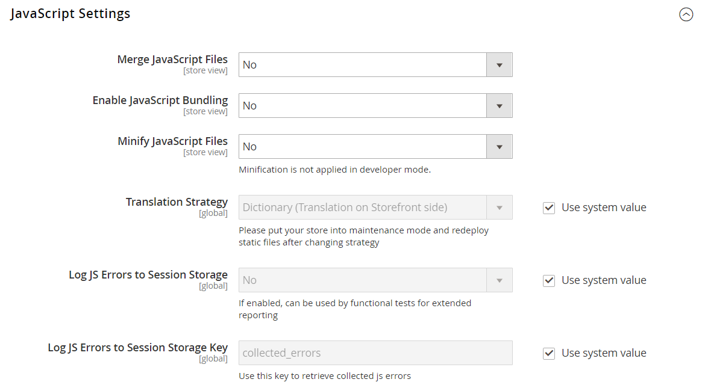

# [!UICONTROL Advanced] > [!UICONTROL Developer]

{{config}}

>[!NOTE]
>
>Ces paramètres de configuration sont disponibles dans [mode développeur](../../systems/developer-tools.md#operation-modes) uniquement.

## [!UICONTROL Frontend Development Workflow]

<!-- zoom -->

Pour plus d’informations sur la modification de ces paramètres, voir [Workflow de développement Frontière](../../systems/developer-tools.md#frontend-development-workflow) dans le _Guide des systèmes d’administration_.

| Champ | [Portée](../../getting-started/websites-stores-views.md#scope-settings) | Description |
|--- |--- |--- |
| [!UICONTROL Workflow Type] | Global | Détermine si la compilation Less a lieu côté client ou côté serveur pendant le développement. Options :  **`Client side less compilation`**- La compilation a lieu dans le navigateur à l’aide de la bibliothèque native less.js. **`Server side less compilation`** - La compilation a lieu sur le serveur à l’aide de la bibliothèque Less PHP. Il s’agit du mode par défaut pour la production. |

{:style=&quot;table-layout:auto&quot;}

## [!UICONTROL Developer Client Restrictions]

<!-- zoom -->

Pour plus d’informations sur la modification de ce paramètre, voir [Restrictions du client](../../systems/developer-tools.md#client-restrictions) dans le _Guide des systèmes d’administration_.

| Champ | [Portée](../../getting-started/websites-stores-views.md#scope-settings) | Description |
|--- |--- |--- |
| [!UICONTROL Allow IPs (comma separated)] | Affichage en magasin | Crée une liste autorisée d’adresses IP qui peuvent utiliser les outils de développement sur un site en direct, sans interférer avec les clients du magasin. Toute modification apportée au site lors de l’utilisation d’un outil de développement tel que _Traduction en ligne_, sont visibles uniquement à partir des adresses IP de la liste autorisée. |

{:style=&quot;table-layout:auto&quot;}

## [!UICONTROL Template Settings]

<!-- zoom -->

Pour plus d’informations sur la modification de ces paramètres, voir [Optimisation des fichiers de ressources](../../systems/developer-tools.md#optimizing-resource-files) dans le _Guide des systèmes d’administration_.

| Champ | [Portée](../../getting-started/websites-stores-views.md#scope-settings) | Description |
|--- |--- |--- |
| [!UICONTROL Allow Symlinks] | Affichage en magasin | Activation [liens symboliques](https://en.wikipedia.org/wiki/Symbolic_link) peut exposer votre site à des risques de sécurité et n’est pas recommandé pour un magasin de production. |
| [!UICONTROL Minify Html] | Affichage en magasin | Détermine si le HTML des modèles de magasin est réduit. Options : `Yes` / `No` |

{:style=&quot;table-layout:auto&quot;}

## [!UICONTROL Debug]

<!-- zoom -->

Pour plus d’informations sur la modification de ces paramètres, voir [Conseils sur le chemin du modèle](../../systems/developer-tools.md#template-path-hints) dans le _Guide des systèmes d’administration_.

| Champ | [Portée](../../getting-started/websites-stores-views.md#scope-settings) | Description |
|--- |--- |--- |
| [!UICONTROL Enable Template Path Hints for Storefront] | Affichage en magasin | Ajoute une notation au storefront qui indique le chemin d’accès à chaque modèle utilisé sur la page. Options : `Yes` / `No` |
| [!UICONTROL Enable Template Path Hints for Admin] | Global | Ajoute une notation à l’administrateur qui indique le chemin d’accès à chaque modèle utilisé sur la page. Options : `Yes` / `No` |
| [!UICONTROL Add Block Class Type to Hints] | Affichage en magasin | Inclut les noms des blocs dans les conseils de chemin d’accès au modèle. Options : `Yes` / `No` |

{:style=&quot;table-layout:auto&quot;}

## [!UICONTROL Translate Inline]

<!-- zoom -->

Pour plus d’informations sur la modification de ces paramètres, voir [Traduire en ligne](../../systems/developer-tools.md#translate-inline) dans le _Guide des systèmes d’administration_.

| Champ | [Portée](../../getting-started/websites-stores-views.md#scope-settings) | Description |
|--- |--- |--- |
| [!UICONTROL Enable for Storefront] | Affichage en magasin | Active le traducteur intégré pour le storefront. Le texte de l’interface peut être modifié pour chaque vue de magasin. Pour utiliser le traducteur en ligne sans interférer avec la boutique en ligne, ajoutez votre adresse IP à la liste autorisée Restrictions du client développeur . |
| [!UICONTROL Enable for Admin] | Global | Active le traducteur intégré pour l’administrateur. Contrairement au storefront, l’administrateur ne peut pas être traduit en plusieurs langues. Toutefois, les libellés de champ et le texte de l’interface peuvent être modifiés. |

{:style=&quot;table-layout:auto&quot;}

## [!UICONTROL JavaScript Settings]

<!-- zoom -->

Pour plus d’informations sur la modification de ces paramètres, voir [Optimisation des fichiers de ressources](../../systems/developer-tools.md#optimizing-resource-files) dans le _Guide des systèmes d’administration_.

| Champ | [Portée](../../getting-started/websites-stores-views.md#scope-settings) | Description |
|--- |--- |--- |
| [!UICONTROL Merge JavaScript Files] | Affichage en magasin | Fusionne plusieurs fichiers JavaScript en un seul fichier afin d’améliorer le temps de chargement des pages. |
| [!UICONTROL Enable JavaScript Bundling] | Affichage en magasin | Détermine si plusieurs fichiers JavaScript peuvent être regroupés dans un seul fichier. Options : `Yes` / `No` |
| [!UICONTROL Minify JavaScript Files] | Affichage en magasin | Supprime les caractères, espaces et retraits inutiles afin de réduire la taille du code. |
| [!UICONTROL Move JS code to the bottom of the page] | Global | S’il est activé, déplace le code JS au bas de la page. Options : `Yes` / `No` |
| [!UICONTROL Translation Strategy] | Global | Détermine la méthodologie de traduction utilisée par le système. Options :  **`Dictionary`**- Traduction côté storefront. **`Embedded`** - Traduction côté administrateur. |
| [!UICONTROL Log JS Errors to Session Storage] | Global | S’il est activé, peut être utilisé par des tests fonctionnels pour la création de rapports. Options : `Yes` / `No` |
| [!UICONTROL Log JS Errors to Session Storage Key] | Global | Identifie la clé utilisée pour récupérer les erreurs JS collectées. |

{:style=&quot;table-layout:auto&quot;}

## [!UICONTROL CSS Settings]

<!-- zoom -->

Pour plus d’informations sur la modification de ces paramètres, voir [Optimisation des fichiers de ressources](../../systems/developer-tools.md#optimizing-resource-files) dans le _Guide des systèmes d’administration_.

| Champ | [Portée](../../getting-started/websites-stores-views.md#scope-settings) | Description |
|--- |--- |--- |
| [!UICONTROL Merge CSS Files] | Affichage en magasin | Fusionne plusieurs fichiers CSS en un seul fichier afin d’améliorer le temps de chargement de la page. Options : `Yes` / `No` |
| [!UICONTROL Minify CSS Files] | Affichage en magasin | Supprime les caractères, espaces et retraits inutiles afin de réduire la taille du code. Options : `Yes` / `No` |
| [!UICONTROL Use CSS critical path] | Global | La variable _Chemin critique CSS_ fournit une page CSS critique réduite en ligne dans `<head>` et défend tous les styles non critiques qui sont chargés de manière asynchrone. Options : `Yes` / `No` |

{:style=&quot;table-layout:auto&quot;}

## [!UICONTROL Image Processing Settings]

<!-- zoom -->

| Champ | [Portée](../../getting-started/websites-stores-views.md#scope-settings) | Description |
|--- |--- |--- |
| [!UICONTROL Image Adapter] | Global | Indique l’adaptateur utilisé pour effectuer le rendu des images. Après avoir modifié le paramètre de l’adaptateur, videz le cache des images du catalogue. Options : `PHP GD2` / `ImageMagick`   **_Remarque :_**Le type de fichier ICO est pris en charge uniquement par l’adaptateur ImageMagik. |

{:style=&quot;table-layout:auto&quot;}

## [!UICONTROL Caching Settings]

<!-- zoom -->

| Champ | [Portée](../../getting-started/websites-stores-views.md#scope-settings) | Description |
|--- |--- |--- |
| [!UICONTROL Cache User Defined Attributes] | Global | Lorsqu’elle est activée, met en cache les attributs définis par l’utilisateur et la valeur d’attribut d’entité système (EAV). Cette option peut améliorer les performances, mais nécessite également de l’espace pour la mise en cache. Options : `Yes` / `No` |

{:style=&quot;table-layout:auto&quot;}

## [!UICONTROL Static Files Settings]

<!-- zoom -->

| Champ | [Portée](../../getting-started/websites-stores-views.md#scope-settings) | Description |
|--- |--- |--- |
| [!UICONTROL Sign Static Files] | Global | Lorsque cette option est activée, ajoute une signature numérique à l’URL des fichiers statiques afin que les navigateurs puissent détecter si une version plus récente du fichier est disponible. Si la signature d’un fichier diffère de ce qui est stocké dans le cache du navigateur, la version la plus récente du fichier est utilisée. Les fichiers statiques pouvant être signés sont JavaScript, CSS, images et polices. Options : `Yes` / `No` |

{:style=&quot;table-layout:auto&quot;}

## [!UICONTROL Grid Settings]

<!-- zoom -->

| Champ | [Portée](../../getting-started/websites-stores-views.md#scope-settings) | Description |
|--- |--- |--- |
| [!UICONTROL Asynchronous Indexing|Global] | Détermine le moment où les entités du système de traitement des commandes, telles que les commandes, les factures, les envois et les notes de crédit, sont ajoutées à la grille et réindexées. L’indexation asynchrone peut être utilisée pour éviter les verrous sur les données lors des opérations d’enregistrement et pour réduire le temps de traitement. Options :  **`Disable`**- (Par défaut) Les entités liées aux commandes sont ajoutées à la grille à différents moments. à mesure qu&#39;ils sont sauvés. **`Enable`** - Les entités liées aux commandes ne sont ajoutées à la grille que lors d’une tâche cron planifiée. Cron doit être configuré pour s’exécuter une fois par minute. |

{:style=&quot;table-layout:auto&quot;}
