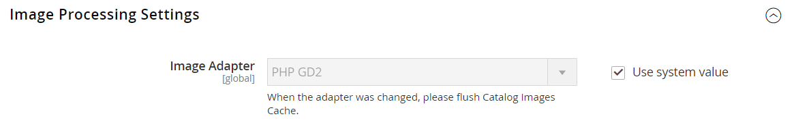

# [!UICONTROL Advanced] > [!UICONTROL Developer]

{{config}}

>[!NOTE]
>
>Ces paramètres de configuration ne sont disponibles qu’en [mode développeur](../../systems/developer-tools.md#operation-modes).

## [!UICONTROL Frontend Development Workflow]

<!-- zoom -->

Pour plus d’informations sur la modification de ces paramètres, consultez [Workflow de développement front-end](../../systems/developer-tools.md#frontend-development-workflow) dans le _Guide des systèmes d’administration_.

| Champ | [Portée](../../getting-started/websites-stores-views.md#scope-settings) | Description |
|--- |--- |--- |
| [!UICONTROL Workflow Type] | Global | Détermine si la compilation Less a lieu côté client ou serveur au cours du développement. Options :  **`Client side less compilation`**- La compilation a lieu dans le navigateur à l’aide de la bibliothèque native less.js. **`Server side less compilation`** - La compilation a lieu sur le serveur en utilisant la bibliothèque Less PHP. Il s’agit du mode par défaut pour la production. |

{style="table-layout:auto"}

## [!UICONTROL Developer Client Restrictions]

<!-- zoom -->

Pour plus d&#39;informations sur la modification de ce paramètre, voir [Restrictions du client](../../systems/developer-tools.md#client-restrictions) dans le _Guide des systèmes d&#39;administration_.

| Champ | [Portée](../../getting-started/websites-stores-views.md#scope-settings) | Description |
|--- |--- |--- |
| [!UICONTROL Allow IPs (comma separated)] | Affichage de la boutique | Crée une place sur la liste autorisée d’adresses IP qui peuvent utiliser les outils de développement d’un site actif, sans interférer avec les clients du magasin. Toutes les modifications apportées au site lors de l’utilisation d’un outil de développement tel que _Traduction en ligne_ ne sont visibles qu’à partir des adresses IP de la place sur la liste autorisée. |

{style="table-layout:auto"}

## [!UICONTROL Template Settings]

<!-- zoom -->

Pour plus d’informations sur la modification de ces paramètres, voir [Optimisation des fichiers de ressources](../../systems/developer-tools.md#optimizing-resource-files) dans le _Guide d’administration des systèmes_.

| Champ | [Portée](../../getting-started/websites-stores-views.md#scope-settings) | Description |
|--- |--- |--- |
| [!UICONTROL Allow Symlinks] | Affichage de la boutique | L’activation de [liens symboliques](https://en.wikipedia.org/wiki/Symbolic_link) peut exposer votre site à des risques de sécurité. Elle n’est pas recommandée pour un magasin de production. |
| [!UICONTROL Minify Html] | Affichage de la boutique | Détermine si l’HTML pour les modèles de magasin est réduit. Options : `Yes` / `No` |

{style="table-layout:auto"}

## [!UICONTROL Debug]

<!-- zoom -->

Pour plus d’informations sur la modification de ces paramètres, voir [Indicateurs de chemin d’accès au modèle](../../systems/developer-tools.md#template-path-hints) dans le _Guide d’administration des systèmes_.

| Champ | [Portée](../../getting-started/websites-stores-views.md#scope-settings) | Description |
|--- |--- |--- |
| [!UICONTROL Enable Template Path Hints for Storefront] | Affichage de la boutique | Ajoute une notation au storefront qui indique le chemin d’accès à chaque modèle utilisé sur la page. Options : `Yes` / `No` |
| [!UICONTROL Enable Template Path Hints for Admin] | Global | Ajoute une notation à Admin qui indique le chemin d’accès à chaque modèle utilisé sur la page. Options : `Yes` / `No` |
| [!UICONTROL Add Block Class Type to Hints] | Affichage de la boutique | Inclut les noms des blocs dans les indications de chemin du modèle. Options : `Yes` / `No` |

{style="table-layout:auto"}

## [!UICONTROL Translate Inline]

<!-- zoom -->

Pour plus d’informations sur la modification de ces paramètres, voir [Traduire en ligne](../../systems/developer-tools.md#translate-inline) dans le _Guide d’administration des systèmes_.

| Champ | [Portée](../../getting-started/websites-stores-views.md#scope-settings) | Description |
|--- |--- |--- |
| [!UICONTROL Enable for Storefront] | Affichage de la boutique | Active le traducteur intégré pour le storefront. Le texte de l’interface peut être modifié pour chaque vue du magasin. Pour utiliser le traducteur en ligne sans interférer avec le magasin en ligne, ajoutez votre adresse IP aux restrictions du développeur client, puis cliquez sur placer sur la liste autorisée. |
| [!UICONTROL Enable for Admin] | Global | Active le traducteur intégré pour l’administrateur. Contrairement au storefront, l’administrateur ne peut pas être traduit dans plusieurs langues. Toutefois, les libellés des champs et tout autre texte de l’interface peuvent être modifiés. |

{style="table-layout:auto"}

## [!UICONTROL JavaScript Settings]

<!-- zoom -->

Pour plus d’informations sur la modification de ces paramètres, voir [Optimisation des fichiers de ressources](../../systems/developer-tools.md#optimizing-resource-files) dans le _Guide d’administration des systèmes_.

| Champ | [Portée](../../getting-started/websites-stores-views.md#scope-settings) | Description |
|--- |--- |--- |
| [!UICONTROL Merge JavaScript Files] | Affichage de la boutique | Fusionne plusieurs fichiers JavaScript en un seul fichier pour améliorer le temps de chargement de la page. |
| [!UICONTROL Enable JavaScript Bundling] | Affichage de la boutique | Détermine si plusieurs fichiers JavaScript peuvent être regroupés en un seul fichier. Options : `Yes` / `No` |
| [!UICONTROL Minify JavaScript Files] | Affichage de la boutique | Supprime les caractères, espaces et mises en retrait inutiles pour réduire la taille du code. |
| [!UICONTROL Move JS code to the bottom of the page] | Global | Si cette option est activée, déplace le code JS vers le bas de la page. Options : `Yes` / `No` |
| [!UICONTROL Translation Strategy] | Global | Détermine la méthodologie de traduction utilisée par le système. Options :  **`Dictionary`**- Traduction côté magasin. **`Embedded`** - Traduction côté administrateur. |
| [!UICONTROL Log JS Errors to Session Storage] | Global | Si cette option est activée, peut être utilisé par des tests fonctionnels pour le compte rendu des performances. Options : `Yes` / `No` |
| [!UICONTROL Log JS Errors to Session Storage Key] | Global | Identifie la clé utilisée pour récupérer les erreurs js collectées. |

{style="table-layout:auto"}

## [!UICONTROL CSS Settings]

<!-- zoom -->

Pour plus d’informations sur la modification de ces paramètres, voir [Optimisation des fichiers de ressources](../../systems/developer-tools.md#optimizing-resource-files) dans le _Guide d’administration des systèmes_.

| Champ | [Portée](../../getting-started/websites-stores-views.md#scope-settings) | Description |
|--- |--- |--- |
| [!UICONTROL Merge CSS Files] | Affichage de la boutique | Fusionne plusieurs fichiers CSS en un seul fichier pour améliorer le temps de chargement de la page. Options : `Yes` / `No` |
| [!UICONTROL Minify CSS Files] | Affichage de la boutique | Supprime les caractères, espaces et mises en retrait inutiles pour réduire la taille du code. Options : `Yes` / `No` |
| [!UICONTROL Use CSS critical path] | Global | Le _chemin d’accès critique CSS_ fournit une feuille de style CSS critique miniaturisée en ligne dans `<head>` et diffère tous les styles non critiques chargés de manière asynchrone. Options : `Yes` / `No` |

{style="table-layout:auto"}

## [!UICONTROL Image Processing Settings]

<!-- zoom -->

| Champ | [Portée](../../getting-started/websites-stores-views.md#scope-settings) | Description |
|--- |--- |--- |
| [!UICONTROL Image Adapter] | Global | Indique la carte utilisée pour le rendu des images. Après avoir modifié le paramètre de la carte, videz le cache des images du catalogue. Options : `PHP GD2` / `ImageMagick`   **_Note:_** Le type de fichier ICO est pris en charge uniquement par l&#39;adaptateur ImageMagik. |

{style="table-layout:auto"}

## [!UICONTROL Caching Settings]

<!-- zoom -->

| Champ | [Portée](../../getting-started/websites-stores-views.md#scope-settings) | Description |
|--- |--- |--- |
| [!UICONTROL Cache User Defined Attributes] | Global | Lorsqu’il est activé, met en cache les attributs définis par l’utilisateur et les attributs de valeur d’attribut d’entité système. Cette option peut améliorer les performances, mais nécessite également de l’espace supplémentaire pour la mise en cache. Options : `Yes` / `No` |

{style="table-layout:auto"}

## [!UICONTROL Static Files Settings]

<!-- zoom -->

| Champ | [Portée](../../getting-started/websites-stores-views.md#scope-settings) | Description |
|--- |--- |--- |
| [!UICONTROL Sign Static Files] | Global | Lorsqu’elle est activée, ajoute une signature numérique à l’URL des fichiers statiques pour permettre aux navigateurs de détecter lorsqu’une version plus récente du fichier est disponible. Si la signature d’un fichier diffère de celle stockée dans le cache du navigateur, la version la plus récente du fichier est utilisée. Les fichiers statiques pouvant être signés sont les JavaScript, CSS, images et polices. Options : `Yes` / `No` |

{style="table-layout:auto"}

## [!UICONTROL Grid Settings]

<!-- zoom -->

| Champ | [Portée](../../getting-started/websites-stores-views.md#scope-settings) | Description |
|--- |--- |--- |
| [!UICONTROL Asynchronous Indexing|Global] | Détermine à quel moment les entités du système de traitement des commandes, telles que les commandes, les factures, les livraisons et les avoirs, sont ajoutées à la grille et réindexées. L’indexation asynchrone peut être utilisée pour éviter les verrous sur les données lors des opérations d’enregistrement et pour réduire le temps de traitement. Options :  **`Disable`**- (Par défaut) Les entités liées aux commandes sont ajoutées à la grille à différents moments. car ils sont enregistrés. **`Enable`** - Les entités liées aux commandes ne sont ajoutées à la grille que lors d’une tâche cron planifiée. Cron doit être configuré pour s’exécuter une fois par minute. |

{style="table-layout:auto"}
