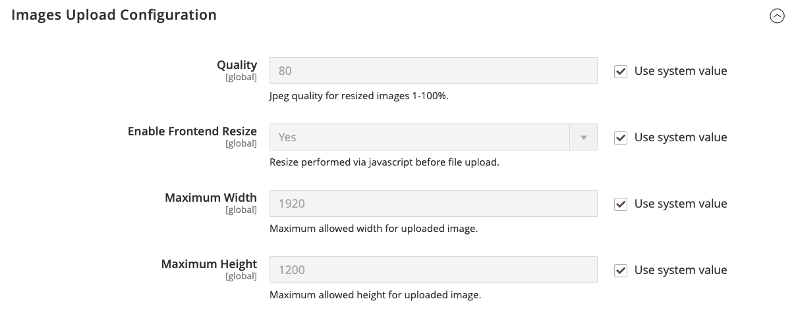
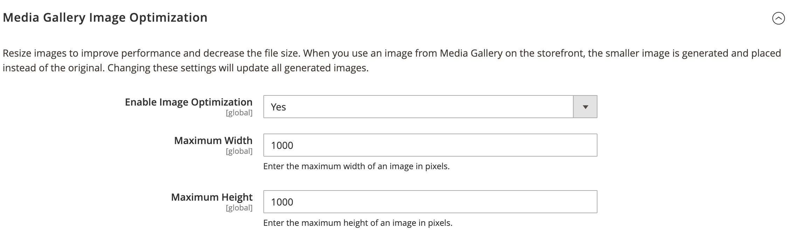

# [!UICONTROL Advanced] > [!UICONTROL System]

{{config}}

## [!UICONTROL Cron (Scheduled Tasks)]

<!-- zoom -->

Pour plus d’informations sur la modification de ces paramètres de configuration, voir [Cron (tâches planifiées)](../../systems/cron.md).

### [!UICONTROL index]

<!-- zoom -->

| Champ | [Portée](../../getting-started/websites-stores-views.md#scope-settings) | Description |
|--- |--- |--- |
| [!UICONTROL Generate Schedules Every] | Global | Détermine la fréquence de génération des plannings, exprimée en minutes. |
| [!UICONTROL Schedule Ahead for] | Global | Détermine le nombre de minutes d&#39;avance pendant lesquelles les plannings sont générés. |
| [!UICONTROL Missed if Not Run Within] | Global | Détermine le nombre de minutes avant qu&#39;une tâche cron qui n&#39;a pas encore été exécutée soit marquée comme manquée. |
| [!UICONTROL History Cleanup Every] | Global | Détermine le nombre de minutes qui s’écoulent avant le nettoyage de l’historique cron. |
| [!UICONTROL Success History Lifetime] | Global | Détermine le nombre de minutes pendant lesquelles l’enregistrement des tâches cron terminées avec succès est conservé dans la base de données. |
| [!UICONTROL Failure History Lifetime] | Global | Détermine le nombre de minutes pendant lesquelles l’enregistrement des tâches cron ayant échoué est conservé dans la base de données. |
| [!UICONTROL Use Separate Process] | Global | Détermine si les tâches cron sont exécutées en parallèle en tant que processus distincts. Options : `Yes` / `No` |

{style="table-layout:auto"}

### [!UICONTROL default]

<!-- zoom -->

| Champ | [Portée](../../getting-started/websites-stores-views.md#scope-settings) | Description |
|--- |--- |--- |
| [!UICONTROL Generate Schedules Every] | Global | Détermine la fréquence de génération des plannings, exprimée en minutes. |
| [!UICONTROL Schedule Ahead for] | Global | Détermine le nombre de minutes d&#39;avance pendant lesquelles les plannings sont générés. |
| [!UICONTROL Missed if Not Run Within] | Global | Détermine le nombre de minutes avant qu&#39;une tâche cron qui n&#39;a pas encore été exécutée soit marquée comme manquée. |
| [!UICONTROL History Cleanup Every] | Global | Détermine le nombre de minutes qui s’écoulent avant le nettoyage de l’historique cron. |
| [!UICONTROL Success History Lifetime] | Global | Détermine le nombre de minutes pendant lesquelles l’enregistrement des tâches cron terminées avec succès est conservé dans la base de données. |
| [!UICONTROL Failure History Lifetime] | Global | Détermine le nombre de minutes pendant lesquelles l’enregistrement des tâches cron ayant échoué est conservé dans la base de données. |
| [!UICONTROL Use Separate Process] | Global | Détermine si les tâches cron sont exécutées en parallèle en tant que processus distincts. Options : `Yes` / `No` |

{style="table-layout:auto"}

## [!UICONTROL MySQL Message Queue Cleanup]

{{ee-feature}}

<!-- zoom -->

| Champ | [Portée](../../getting-started/websites-stores-views.md#scope-settings) | Description |
|--- |--- |--- |
| [!UICONTROL Successful Messages Lifetime] | Global | Détermine la durée de vie en minutes des messages réussis. Saisissez zéro pour ignorer le nettoyage. Valeur par défaut : `10080` (7 jours) |
| [!UICONTROL New Messages Lifetime] | Global | Détermine la durée de vie de nouveaux messages en minutes. Saisissez zéro pour ignorer le nettoyage. Valeur par défaut : `10080` (7 jours) |
| [!UICONTROL Failed Messages Lifetime] | Global | Détermine la durée de vie en minutes des messages ayant échoué. Saisissez zéro pour ignorer le nettoyage. Valeur par défaut : `10080` (7 jours) |
| [!UICONTROL Retry Messages in Progress After] | Global | Détermine la durée pendant laquelle le système attend un message en cours avant de réessayer. Valeur par défaut : `1440` (24 heures) |

{style="table-layout:auto"}

## [!UICONTROL Mail Sending Settings]

<!-- zoom -->

Pour plus d’informations sur la modification de ces paramètres, voir [Configuration des communications par e-mail](../../systems/email-communications.md) dans le _Guide des systèmes d’administration_.

>[!IMPORTANT]
>
>**Avis de sécurité** Nous recommandons à tous les commerçants de définir immédiatement leur configuration d&#39;envoi de courrier pour se protéger contre une exploitation d&#39;exécution de code à distance potentielle récemment identifiée. Jusqu’à ce que ce problème soit résolu, il est vivement recommandé d’éviter d’utiliser [!DNL Sendmail] pour les communications par e-mail Dans le [!UICONTROL Mail Sending Settings], vérifiez que [!UICONTROL Set Return Path] est défini sur `No`.

| Champ | [Portée](../../getting-started/websites-stores-views.md#scope-settings) | Description |
|--- |--- |--- |
| [!UICONTROL Disable Email Communications] | Affichage de la boutique | Détermine si les communications par e-mail sont activées pour le magasin. Options : `Yes` / `No` |
| [!UICONTROL Transport] | Affichage de la boutique | Détermine le type de transport pour les communications par e-mail à partir du magasin. Options : `Sendmail` / `SMTP` |
| [!UICONTROL Host] | Affichage de la boutique | (Pour les serveurs SMTP et Windows uniquement) Détermine le nom utilisé pour faire référence à l’hôte. Valeur par défaut : `localhost` |
| [!UICONTROL Port (25)] | Affichage de la boutique | (Pour les serveurs SMTP et Windows uniquement) Identifie le port utilisé pour les communications par e-mail. Valeur par défaut : `25` |
| [!UICONTROL Set Return-Path] | Affichage de la boutique | Détermine si une adresse de routage est utilisée pour les e-mails renvoyés. Options : `No` / `Yes` / `Specified` |

{style="table-layout:auto"}

### Options SMTP

Lorsque vous sélectionnez SMTP au niveau du type de transfert, des options supplémentaires sont disponibles pour configurer la connexion au serveur SMTP.

<!-- zoom -->

| Champ | [Portée](../../getting-started/websites-stores-views.md#scope-settings) | Description |
|--- |--- |--- |
| [!UICONTROL Username] | Affichage de la boutique | Nom d’utilisateur pour la connexion au serveur SMTP. |
| [!UICONTROL Password] | Affichage de la boutique | Mot de passe pour le login du serveur SMTP. |
| [!UICONTROL Auth] | Affichage de la boutique | Détermine le type d&#39;authentification pour la connexion au serveur SMTP. Options : `NONE` / `PLAIN` / `LOGIN` |
| [!UICONTROL SSL] | Affichage de la boutique | Détermine le type de vérification du certificat de sécurité de l&#39;hôte. Options : `SSL` / `TLS` |

{style="table-layout:auto"}

## [!UICONTROL Currency]

<!-- zoom -->

Pour plus d’informations sur la modification de ce paramètre, voir [Configuration de la devise](../../stores-purchase/currency-configuration.md) dans le _Guide d’expérience d’achat et des magasins_.

| Champ | [Portée](../../getting-started/websites-stores-views.md#scope-settings) | Description |
|--- |--- |--- |
| [!UICONTROL Installed Currencies] | Global | Indique les devises actuellement disponibles pour l’installation de Commerce. Les options incluent toutes les devises disponibles, avec les devises installées sélectionnées. |

{style="table-layout:auto"}

## [!UICONTROL Security]

<!-- zoom -->

Pour plus d’informations sur la modification de ces paramètres, voir [Gestion de session](../../systems/security-session-management.md) dans le _Guide des systèmes d’administration_.

| Champ | [Portée](../../getting-started/websites-stores-views.md#scope-settings) | Description |
|--- |--- |--- |
| [!UICONTROL Max Session Size in Admin] | Global | Limitez la taille maximale de la session en octets. Utilisation `0` à désactiver. |
| [!UICONTROL Max Session Size in Storefront] | Global | Limitez la taille maximale de la session en octets. Utilisation `0` à désactiver. |

{style="table-layout:auto"}

## [!UICONTROL Notifications]

<!-- zoom -->

Pour plus d’informations sur la modification de ces paramètres, voir [Notifications système](../../systems/notifications.md) dans le _Guide des systèmes d’administration_.

| Champ | [Portée](../../getting-started/websites-stores-views.md#scope-settings) | Description |
|--- |--- |--- |
| [!UICONTROL Use HTTPS to Get Feed] | Global | Détermine si les notifications de l’administrateur sont diffusées sur un canal sécurisé. Options : `Yes` / `No` |
| Fréquence de mise à jour | Global | Détermine la fréquence de mise à jour des messages de l&#39;administrateur. Options : `1 Hour` / `2 Hours` / `6 Hours` / `12 Hours` / `24 Hours` |
| [!UICONTROL Last Update] | Global | Indique la date et l&#39;heure de la dernière mise à jour du message. |

{style="table-layout:auto"}

## [!UICONTROL Backup Settings]

<!-- zoom -->

{{$include /help/_includes/backups-note.md}}

Pour plus d’informations sur la modification de ces paramètres, voir [Sauvegardes système](../../systems/backups.md) dans le _Guide des systèmes d’administration_.

| Champ | [Portée](../../getting-started/websites-stores-views.md#scope-settings) | Description |
|--- |--- |--- |
| [!UICONTROL Enable Backup] | Global | Détermine si l’instance de Commerce autorise les sauvegardes. Options : `Yes` / `No` |
| [!UICONTROL Enable Scheduled Backup] | Global | (Affiché lorsque _[!UICONTROL Enable Backup]_est défini sur `Yes`.) Détermine si l’instance de Commerce est automatiquement sauvegardée selon un planning régulier. Options : `Yes` / `No` |
| [!UICONTROL Scheduled Backup Type] | Global | (Affiché lorsque _[!UICONTROL Enable Scheduled Backup]_est défini sur `Yes`.) Détermine les éléments de l’instance de commerce inclus dans la sauvegarde. Options : `Database` / `Database and Media` / `System` / `System (excluding Media)` |
| [!UICONTROL Start Time] | Global | (Affiché lorsque [!UICONTROL Enable Scheduled Backup] est défini sur `Yes`.) Indique l’heure, la minute et la seconde auxquelles la sauvegarde planifiée commence. |
| [!UICONTROL Frequency] | Global | (Affiché lorsque [!UICONTROL Enable Scheduled Backup] est défini sur `Yes`.) Détermine la fréquence de la sauvegarde planifiée. Options : `Daily` / `Weekly` / `Monthly` |
| [!UICONTROL Maintenance Mode] | Global | (Affiché lorsque [!UICONTROL Enable Scheduled Backup] est défini sur `Yes`.) Détermine si le magasin est en mode de maintenance pendant la sauvegarde planifiée. Options : `Yes` / `No` |

{style="table-layout:auto"}

## [!UICONTROL Admin Actions Log Archiving]

{{ee-feature}}

<!-- zoom -->

Pour plus d’informations sur la modification de ces paramètres, voir [Archive du journal des actions](../../systems/action-log-archive.md) dans le _Guide des systèmes d’administration_.

| Champ | [Portée](../../getting-started/websites-stores-views.md#scope-settings) | Description |
|--- |--- |--- |
| [!UICONTROL Log Entry Lifetime, Days] | Affichage de la boutique | Détermine le nombre de jours pendant lesquels les actions d&#39;administration sont conservées dans l&#39;archive Actions d&#39;administration. Valeur par défaut : `60` |
| [!UICONTROL Log Archiving Frequency] | Affichage de la boutique | Détermine la fréquence d’archivage des journaux des actions d’administration. Options : `Daily` / `Weekly` / `Monthly` |

{style="table-layout:auto"}

## [!UICONTROL Full Page Cache]

<!-- zoom -->

Pour plus d’informations sur la modification de ces paramètres, voir [Mise en cache de toutes les pages](../../systems/cache-management.md#full-page-caching) dans le _Guide des systèmes d’administration_.

<!-- zoom -->

| Champ | [Portée](../../getting-started/websites-stores-views.md#scope-settings) | Description |
|--- |--- |--- |
| [!UICONTROL Caching Application] | Global | Détermine l’application utilisée pour gérer le cache de page complète. Options :  **`Built-in Application`**- Déconseillé pour l’environnement de production. **`Varnish Caching`** - Recommandé pour l’environnement de production. |
| [!UICONTROL TTL for public content] | Global | Détermine la durée de vie du cache de contenu public en secondes. Valeur par défaut : `120` |
| [!UICONTROL Handles param size] | global | Spécifie le nombre maximal de [poignées de mise en page](https://developer.adobe.com/commerce/frontend-core/guide/layouts/#layout-handles) à traiter sur le [`{BASE-URL}/page_cache/block/esi`](https://experienceleague.adobe.com/docs/commerce-operations/configuration-guide/cache/use-varnish-esi.html) Point d’entrée HTTP. Limiter la taille peut améliorer la sécurité et les performances. Valeur par défaut : `100` |
| **[!UICONTROL Varnish Configuration]** |  |  |
| [!UICONTROL Access list] | Global | Spécifie les adresses IP qui peuvent purger la configuration Varnish pour générer un fichier de configuration. Séparez les entrées multiples par une virgule. Valeur par défaut : `localhost` |
| [!UICONTROL Backend host] | Global | Indique l’hôte principal qui génère les fichiers de configuration. Valeur par défaut : `localhost` |
| [!UICONTROL Backend port] | Global | Indique le port principal utilisé pour générer les fichiers de configuration. Valeur par défaut : `8080` |
| [!UICONTROL Grace period] | Global | Détermine la durée pendant laquelle le vernis diffuse du contenu obsolète si le serveur principal ne répond pas. Valeur par défaut : `300` |
| **[!UICONTROL Export Configuration]** |  |  |
| [!UICONTROL Export VCL for Varnish 4] | Global | Exporte le `varnish.vcl` fichier pour la version 4. |
| [!UICONTROL Export VCL for Varnish 5] | Global | Exporte le `varnish.vcl` fichier pour la version 5. |
| [!UICONTROL Export VCL for Varnish 6] | Global | Exporte le `varnish.vcl` fichier pour la version 6. |

{style="table-layout:auto"}

## [!UICONTROL Storage Configuration for Media]

<!-- zoom -->

Pour plus d’informations sur la modification de ces paramètres, voir [Utilisation d’une base de données des médias](../../content-design/media-storage-database.md) dans le _Guide de conception et de contenu_.

| Champ | [Portée](../../getting-started/websites-stores-views.md#scope-settings) | Description |
|--- |--- |--- |
| [!UICONTROL Media Storage] | Global | Détermine la méthode utilisée pour stocker les fichiers multimédias. Paramètre par défaut : `File System` |
| [!UICONTROL Environment Update Time] | Global | Détermine la fréquence des mises à jour de l’environnement de fichiers multimédias en secondes. Valeur par défaut : `3600` |

{style="table-layout:auto"}

<!-- zoom -->

>[!IMPORTANT]
>
>La méthode de stockage des médias de base de données a été abandonnée à partir d’Adobe Commerce et de Magento Open Source version 2.4.3.

| Champ | [Portée](../../getting-started/websites-stores-views.md#scope-settings) | Description |
|--- |--- |--- |
| [!UICONTROL Media Storage] | Global | Indique la base de données comme méthode utilisée pour stocker les fichiers multimédias. |
| [!UICONTROL Select Media Database] | Global | Identifie le nom de la base de données utilisée pour le stockage des médias. Paramètre par défaut : `default_setup` |
| [!UICONTROL Synchronize] |  | Synchronise le transfert de tous les médias vers l&#39;emplacement de base de données spécifié. |
| Heure de mise à jour de l’environnement | Global | Détermine la fréquence des mises à jour de l’environnement de fichiers multimédias en secondes. Valeur par défaut : `3600` |

{style="table-layout:auto"}

## [!UICONTROL Bulk Actions]

{{ee-feature}}

<!-- zoom -->

Pour plus d’informations sur la modification de ces paramètres, voir [Actions en bloc](../../systems/action-log-bulk-actions.md) dans le _Guide des systèmes d’administration_.

| Champ | [Portée](../../getting-started/websites-stores-views.md#scope-settings) | Description |
|--- |--- |--- |
| [!UICONTROL Days Saved in Log] | Global | Détermine le nombre de jours pendant lesquels les actions en bloc sont conservées dans le _Journal des actions en bloc_ archive. Valeur par défaut : `60` |

{style="table-layout:auto"}

## [!UICONTROL Scheduled Import/Export File History Cleaning]

{{ee-feature}}

<!-- zoom -->

Pour plus d’informations sur la modification de ces paramètres, voir [Import et export planifiés](../../systems/data-scheduled-import-export.md) dans le _Guide des systèmes d’administration_.

| Champ | [Portée](../../getting-started/websites-stores-views.md#scope-settings) | Description |
|--- |--- |--- |
| [!UICONTROL Save File, Days] | Global | Détermine le nombre de jours pendant lesquels les fichiers d&#39;historique d&#39;importation/exportation sont enregistrés. |
| [!UICONTROL Enable Scheduled File History Cleaning] | Global | Active le nettoyage planifié des fichiers d&#39;import/export. Options : `Yes` / `No` |
| [!UICONTROL Clean Now] |  | Il remplace le nettoyage planifié et nettoie immédiatement les fichiers d’historique d’importation/exportation. |
| [!UICONTROL Start Time] | Global | Indique l’heure, la minute et la seconde du nettoyage du fichier d’historique d’importation/exportation. |
| [!UICONTROL Frequency] | Global | Détermine la fréquence de nettoyage des fichiers d&#39;historique d&#39;import/export. Options : `Daily` / `Weekly` / `Monthly` |
| [!UICONTROL Error Email Recipient] | Global | Adresse e-mail de la personne qui doit recevoir une notification en cas d’erreur lors du nettoyage de l’historique des fichiers d’importation/exportation. Séparez les adresses multiples par une virgule. |
| [!UICONTROL Error Email Sender] | Global | Identifie le contact du magasin qui apparaît comme l’expéditeur de la notification. Expéditeur par défaut : `General Contact` |
| [!UICONTROL Error Email Template] | Global | Identifie le modèle d’e-mail utilisé pour la notification d’erreur de nettoyage du fichier d’importation/exportation. Modèle par défaut : `File History Clean Failed` |

{style="table-layout:auto"}

## [!UICONTROL Image Upload Configuration]

<!-- zoom -->

<!-- [Image Upload Configuration](https://docs.magento.com/user-guide/system/action-log-bulk-actions.html) -->

| Champ | [Portée](../../getting-started/websites-stores-views.md#scope-settings) | Description |
|--- |--- |--- |
| [!UICONTROL Quality] | Global | Détermine la qualité du JPG pour l’image redimensionnée. Une qualité inférieure réduit la taille du fichier. Utilisez 80 à 90 % pour réduire la taille du fichier avec une qualité élevée. Valeur par défaut : `80` |
| [!UICONTROL Enable Frontend Resize] | Global | Activez ce paramètre pour permettre à Commerce de redimensionner les images volumineuses et surdimensionnées que vous pouvez charger pour le _Détails du produit_ page. Commerce redimensionne les fichiers image à l’aide de JavaScript avant de télécharger le fichier. Lorsque l’image est redimensionnée, elle conserve les proportions exactes pour respecter et ne pas dépasser la plus grande taille pour la Largeur maximale ou la Hauteur maximale. Valeur par défaut : `Yes` |
| [!UICONTROL Maximum Width] | Global | Détermine la largeur maximale en pixels de l’image. Lorsque l&#39;image est redimensionnée, elle ne dépasse pas cette largeur. Valeur par défaut : `1920` |
| [!UICONTROL Maximum Height] | Global | Détermine la hauteur maximale en pixels de l’image. Lorsque l’image est redimensionnée, elle ne dépasse pas cette hauteur. Valeur par défaut : `1200` |

{style="table-layout:auto"}

## [!UICONTROL Media Gallery]

<!-- zoom -->

| Champ | [Portée](../../getting-started/websites-stores-views.md#scope-settings) | Description |
|--- |--- |--- |
| [!UICONTROL Enable Old Media Gallery] | Global | Active ou désactive l’ancienne Galerie de médias. |

{style="table-layout:auto"}

## [!UICONTROL Media Gallery Image Optimization]

<!-- zoom -->

| Champ | [Portée](../../getting-started/websites-stores-views.md#scope-settings) | Description |
|--- |--- |--- |
| [!UICONTROL Enable Image Optimization] | Global | Détermine si les images sont redimensionnées afin de réduire la taille de fichier des images insérées dans le contenu. Les images d’origine sont conservées dans la Galerie de médias. |
| [!UICONTROL Maximum Width] | Global | Largeur maximale (en pixels) des images insérées à partir de la Galerie de médias dans le contenu. |
| [!UICONTROL Maximum Height] | Global | Hauteur maximale (en pixels) des images insérées à partir de la Galerie de médias dans le contenu. |

{style="table-layout:auto"}

## [!UICONTROL Adobe Stock Integration]

<!-- zoom -->

Pour plus d’informations sur la configuration de ces paramètres, voir [Intégration d’Adobe Stock](../../content-design/adobe-stock.md) dans le _Guide de conception et de contenu_.

| Champ | [Portée](../../getting-started/websites-stores-views.md#scope-settings) | Description |
|--- |--- |--- |
| [!UICONTROL Enabled Adobe Stock] | Global | Active ou désactive l’intégration Adobe Stock. |
| [!UICONTROL API Key (Client ID)] | Global | Une clé API est requise pour connecter votre boutique au service Adobe Stock. |
| [!UICONTROL Client Secret] | Global | Le secret client pour votre intégration Adobe Stock est requis. |
| [!UICONTROL Test Connection] |  | Exécute un test pour vérifier que la clé API peut être utilisée avec le service Adobe Stock. |

{style="table-layout:auto"}
