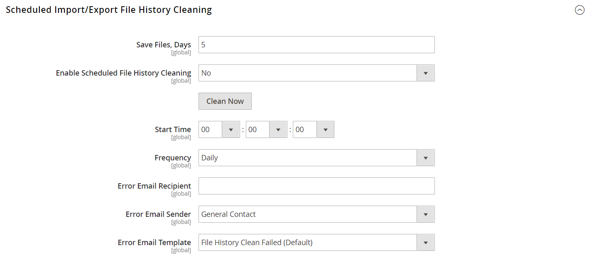

# [!UICONTROL Advanced] > [!UICONTROL System]

{{config}}

## [!UICONTROL Cron (Scheduled Tasks)]

<!-- zoom -->

Pour plus d’informations sur la modification de ces paramètres de configuration, voir [Cron (tâches planifiées)](../../systems/cron.md).

### [!UICONTROL index]

<!-- zoom -->

| Champ | [Portée](../../getting-started/websites-stores-views.md#scope-settings) | Description |
|--- |--- |--- |
| [!UICONTROL Generate Schedules Every] | Global | Détermine la fréquence en minutes, selon laquelle les plannings sont générés. |
| [!UICONTROL Schedule Ahead for] | Global | Détermine le nombre de minutes à l’avance que les plannings sont générés. |
| [!UICONTROL Missed if Not Run Within] | Global | Détermine le nombre de minutes avant qu’une tâche cron qui n’a pas encore été exécutée ne soit marquée comme manquée. |
| [!UICONTROL History Cleanup Every] | Global | Détermine le nombre de minutes qui s’écoulent avant le nettoyage de l’historique cron. |
| [!UICONTROL Success History Lifetime] | Global | Détermine le nombre de minutes pendant lesquelles l’enregistrement des tâches cron terminées est conservé dans la base de données. |
| [!UICONTROL Failure History Lifetime] | Global | Détermine le nombre de minutes pendant lesquelles l’enregistrement des tâches cron en échec est conservé dans la base de données. |
| [!UICONTROL Use Separate Process] | Global | Détermine si les tâches cron sont exécutées en parallèle en tant que processus distincts. Options : `Yes` / `No` |

{style="table-layout:auto"}

### [!UICONTROL default]

<!-- zoom -->

| Champ | [Portée](../../getting-started/websites-stores-views.md#scope-settings) | Description |
|--- |--- |--- |
| [!UICONTROL Generate Schedules Every] | Global | Détermine la fréquence en minutes, selon laquelle les plannings sont générés. |
| [!UICONTROL Schedule Ahead for] | Global | Détermine le nombre de minutes à l’avance que les plannings sont générés. |
| [!UICONTROL Missed if Not Run Within] | Global | Détermine le nombre de minutes avant qu’une tâche cron qui n’a pas encore été exécutée ne soit marquée comme manquée. |
| [!UICONTROL History Cleanup Every] | Global | Détermine le nombre de minutes qui s’écoulent avant le nettoyage de l’historique cron. |
| [!UICONTROL Success History Lifetime] | Global | Détermine le nombre de minutes pendant lesquelles l’enregistrement des tâches cron terminées est conservé dans la base de données. |
| [!UICONTROL Failure History Lifetime] | Global | Détermine le nombre de minutes pendant lesquelles l’enregistrement des tâches cron en échec est conservé dans la base de données. |
| [!UICONTROL Use Separate Process] | Global | Détermine si les tâches cron sont exécutées en parallèle en tant que processus distincts. Options : `Yes` / `No` |

{style="table-layout:auto"}

## [!UICONTROL MySQL Message Queue Cleanup]

{{ee-feature}}

<!-- zoom -->

| Champ | [Portée](../../getting-started/websites-stores-views.md#scope-settings) | Description |
|--- |--- |--- |
| [!UICONTROL Successful Messages Lifetime] | Global | Détermine la durée de vie des messages réussis en minutes. Saisissez zéro pour ignorer le nettoyage. Valeur par défaut : `10080` (7 jours) |
| [!UICONTROL New Messages Lifetime] | Global | Détermine la durée de vie des nouveaux messages en minutes. Saisissez zéro pour ignorer le nettoyage. Valeur par défaut : `10080` (7 jours) |
| [!UICONTROL Failed Messages Lifetime] | Global | Détermine la durée de vie des messages en échec en minutes. Saisissez zéro pour ignorer le nettoyage. Valeur par défaut : `10080` (7 jours) |
| [!UICONTROL Retry Messages in Progress After] | Global | Détermine le délai d’attente du système pour un message en cours avant de réessayer. Valeur par défaut : `1440` (24 heures) |

{style="table-layout:auto"}

## [!UICONTROL Mail Sending Settings]

<!-- zoom -->

Pour plus d’informations sur la modification de ces paramètres, voir [Configuration des communications par courrier électronique](../../systems/email-communications.md) dans le _Guide des systèmes d’administration_.

>[!IMPORTANT]
>
>**Avis de sécurité** Nous recommandons à tous les commerçants de définir immédiatement leur configuration d’envoi de courrier afin de se protéger contre un exploit potentiel d’exécution de code distant récemment identifié. Tant que ce problème n’est pas résolu, il est vivement recommandé d’éviter d’utiliser [!DNL Sendmail] pour les communications par e-mail. Dans le [!UICONTROL Mail Sending Settings], assurez-vous que [!UICONTROL Set Return Path] est défini sur `No`.

| Champ | [Portée](../../getting-started/websites-stores-views.md#scope-settings) | Description |
|--- |--- |--- |
| [!UICONTROL Disable Email Communications] | Affichage en magasin | Détermine si les communications par e-mail sont activées pour le magasin. Options : `Yes` / `No` |
| [!UICONTROL Transport] | Affichage en magasin | Détermine le type de transport des communications par courrier électronique du magasin. Options : `Sendmail` / `SMTP` |
| [!UICONTROL Host] | Affichage en magasin | (Pour les serveurs SMTP et Windows uniquement) Détermine le nom utilisé pour faire référence à l’hôte. Valeur par défaut : `localhost` |
| [!UICONTROL Port (25)] | Affichage en magasin | (Pour les serveurs SMTP et Windows uniquement) Identifie le port utilisé pour les communications par e-mail. Valeur par défaut : `25` |
| [!UICONTROL Set Return-Path] | Affichage en magasin | Détermine si une adresse de routage est utilisée pour les emails renvoyés. Options : `No` / `Yes` / `Specified` |

{style="table-layout:auto"}

### Options SMTP

Lorsque vous sélectionnez SMTP dans le type de transport, des options supplémentaires sont disponibles pour configurer la connexion au serveur SMTP.

<!-- zoom -->

| Champ | [Portée](../../getting-started/websites-stores-views.md#scope-settings) | Description |
|--- |--- |--- |
| [!UICONTROL Username] | Affichage en magasin | Nom d’utilisateur de connexion au serveur SMTP. |
| [!UICONTROL Password] | Affichage en magasin | Mot de passe de la connexion au serveur SMTP. |
| [!UICONTROL Auth] | Affichage en magasin | Détermine le type d’authentification pour la connexion au serveur SMTP. Options : `NONE` / `PLAIN` / `LOGIN` |
| [!UICONTROL SSL] | Affichage en magasin | Détermine le type de vérification pour le certificat de sécurité hôte. Options : `SSL` / `TLS` |

{style="table-layout:auto"}

## [!UICONTROL Currency]

<!-- zoom -->

Pour plus d’informations sur la modification de ce paramètre, voir [Configuration des devises](../../stores-purchase/currency-configuration.md) dans le _Guide d’expérience des magasins et des achats_.

| Champ | [Portée](../../getting-started/websites-stores-views.md#scope-settings) | Description |
|--- |--- |--- |
| [!UICONTROL Installed Currencies] | Global | Indique les devises actuellement disponibles pour l’installation de Commerce. Les options comprennent toutes les devises disponibles, avec les devises installées sélectionnées. |

{style="table-layout:auto"}

## [!UICONTROL Security]

<!-- zoom -->

Pour plus d’informations sur la modification de ces paramètres, voir [Gestion des sessions](../../systems/security-session-management.md) dans le _Guide des systèmes d’administration_.

| Champ | [Portée](../../getting-started/websites-stores-views.md#scope-settings) | Description |
|--- |--- |--- |
| [!UICONTROL Max Session Size in Admin] | Global | Limitez la taille de session maximale en octets. Utilisation `0` pour désactiver. |
| [!UICONTROL Max Session Size in Storefront] | Global | Limitez la taille de session maximale en octets. Utilisation `0` pour désactiver. |

{style="table-layout:auto"}

## [!UICONTROL Notifications]

<!-- zoom -->

Pour plus d’informations sur la modification de ces paramètres, voir [Notifications système](../../systems/notifications.md) dans le _Guide des systèmes d’administration_.

| Champ | [Portée](../../getting-started/websites-stores-views.md#scope-settings) | Description |
|--- |--- |--- |
| [!UICONTROL Use HTTPS to Get Feed] | Global | Détermine si les notifications d’administrateur sont diffusées sur un canal sécurisé. Options : `Yes` / `No` |
| Fréquence de mise à jour | Global | Détermine la fréquence des mises à jour des messages de l’administrateur. Options : `1 Hour` / `2 Hours` / `6 Hours` / `12 Hours` / `24 Hours` |
| [!UICONTROL Last Update] | Global | Indique la date et l’heure de la dernière mise à jour du message. |

{style="table-layout:auto"}

## [!UICONTROL Scheduled Backup Settings]

<!-- zoom -->

Pour plus d’informations sur la modification de ces paramètres, voir [Sauvegardes système](../../systems/backups.md) dans le _Guide des systèmes d’administration_.

{{$include /help/_includes/backups-note.md}}

| Champ | [Portée](../../getting-started/websites-stores-views.md#scope-settings) | Description |
|--- |--- |--- |
| [!UICONTROL Enable Scheduled Backup] | Global | Détermine si l’instance Commerce est automatiquement sauvegardée selon un calendrier régulier. Options : `Yes` / `No` |
| [!UICONTROL Backup Type] | Global | Détermine les éléments de l’instance Commerce inclus dans la sauvegarde. Options : `Database` / `Database and Media` / `System` / `System (excluding Media)` |
| [!UICONTROL Start Time] | Global | Indique l’heure, la minute et la seconde auxquelles la sauvegarde planifiée commence. |
| [!UICONTROL Frequency] | Global | Détermine la fréquence de sauvegarde planifiée. Options : `Daily` / `Weekly` / `Monthly` |
| [!UICONTROL Maintenance Mode] | Global | Détermine si le magasin est mis en mode de maintenance pendant la sauvegarde planifiée. Options : `Yes` / `No` |

{style="table-layout:auto"}

## [!UICONTROL Admin Actions Log Archiving]

{{ee-feature}}

<!-- zoom -->

Pour plus d’informations sur la modification de ces paramètres, voir [Archive de journal des actions](../../systems/action-log-archive.md) dans le _Guide des systèmes d’administration_.

| Champ | [Portée](../../getting-started/websites-stores-views.md#scope-settings) | Description |
|--- |--- |--- |
| [!UICONTROL Log Entry Lifetime, Days] | Affichage en magasin | Détermine le nombre de jours pendant lesquels les actions d’administration sont conservées dans l’archive des actions d’administration. Valeur par défaut : `60` |
| [!UICONTROL Log Archiving Frequency] | Affichage en magasin | Détermine la fréquence d’archivage des journaux des actions d’administration. Options : `Daily` / `Weekly` / `Monthly` |

{style="table-layout:auto"}

## [!UICONTROL Full Page Cache]

{{beta2-patches-updates}}

<!-- zoom -->

Pour plus d’informations sur la modification de ces paramètres, voir [Mise en cache pleine page](../../systems/cache-management.md#full-page-caching) dans le _Guide des systèmes d’administration_.

<!-- zoom -->

| Champ | [Portée](../../getting-started/websites-stores-views.md#scope-settings) | Description |
|--- |--- |--- |
| [!UICONTROL Caching Application] | Global | Détermine l’application utilisée pour gérer le cache de la page entière. Options :  **`Built-in Application`**- Non recommandé pour l’environnement de production. **`Varnish Caching`** - Recommandé pour l’environnement de production. |
| [!UICONTROL TTL for public content] | Global | Détermine la durée de vie du cache de contenu public en secondes. Valeur par défaut : `120` |
| **[!UICONTROL Varnish Configuration]** |  |  |
| [!UICONTROL Access list] | Global | Indique les adresses IP qui peuvent purger la configuration de vernis pour générer un fichier de configuration. Séparez plusieurs entrées par une virgule. Valeur par défaut : `localhost` |
| [!UICONTROL Backend host] | Global | Spécifie l’hôte principal qui génère les fichiers de configuration. Valeur par défaut : `localhost` |
| [!UICONTROL Backend port] | Global | Spécifie le port principal utilisé pour générer les fichiers de configuration. Valeur par défaut : `8080` |
| [!UICONTROL Grace period] | Global | Spécifie la période de grâce en secondes pour la génération d’un fichier de configuration. Valeur par défaut : `300` |
| **[!UICONTROL Export Configuration]** |  |  |
| [!UICONTROL Export VCL for Varnish 4] | Global | Exporte la variable `varnish.vcl` pour la version 4. |
| [!UICONTROL Export VCL for Varnish 5] | Global | Exporte la variable `varnish.vcl` pour la version 5. |
| [!UICONTROL Export VCL for Varnish 6] | Global | Exporte la variable `varnish.vcl` pour la version 6. |

{style="table-layout:auto"}

## [!UICONTROL Storage Configuration for Media]

<!-- zoom -->

Pour plus d’informations sur la modification de ces paramètres, voir [Utilisation d’une base de données multimédia](../../content-design/media-storage-database.md) dans le _Guide de conception et de contenu_.

| Champ | [Portée](../../getting-started/websites-stores-views.md#scope-settings) | Description |
|--- |--- |--- |
| [!UICONTROL Media Storage] | Global | Détermine la méthode utilisée pour stocker les fichiers multimédias. Paramètre par défaut : `File System` |
| [!UICONTROL Environment Update Time] | Global | Détermine la fréquence des mises à jour de l’environnement de fichier multimédia en secondes. Valeur par défaut : `3600` |

{style="table-layout:auto"}

<!-- zoom -->

>[!IMPORTANT]
>
>La méthode de stockage des médias dans la base de données est obsolète depuis Adobe Commerce et Magento Open Source 2.4.3.

| Champ | [Portée](../../getting-started/websites-stores-views.md#scope-settings) | Description |
|--- |--- |--- |
| [!UICONTROL Media Storage] | Global | Spécifie la base de données comme méthode de stockage des fichiers multimédias. |
| [!UICONTROL Select Media Database] | Global | Identifie le nom de la base de données utilisée pour le stockage des médias. Paramètre par défaut : `default_setup` |
| [!UICONTROL Synchronize] |  | Synchronise le transfert de tous les médias vers l’emplacement de base de données spécifié. |
| Heure de mise à jour de l’environnement | Global | Détermine la fréquence des mises à jour de l’environnement de fichier multimédia en secondes. Valeur par défaut : `3600` |

{style="table-layout:auto"}

## [!UICONTROL Bulk Actions]

{{ee-feature}}

<!-- zoom -->

Pour plus d’informations sur la modification de ces paramètres, voir [Actions en bloc](../../systems/action-log-bulk-actions.md) dans le _Guide des systèmes d’administration_.

| Champ | [Portée](../../getting-started/websites-stores-views.md#scope-settings) | Description |
|--- |--- |--- |
| [!UICONTROL Days Saved in Log] | Global | Détermine le nombre de jours pendant lesquels les actions en bloc sont conservées dans la variable _Journal des actions en bloc_ archive. Valeur par défaut : `60` |

{style="table-layout:auto"}

## [!UICONTROL Scheduled Import/Export File History Cleaning]

{{ee-feature}}

<!-- zoom -->

Pour plus d’informations sur la modification de ces paramètres, voir [Import et export planifiés](../../systems/data-scheduled-import-export.md) dans le _Guide des systèmes d’administration_.

| Champ | [Portée](../../getting-started/websites-stores-views.md#scope-settings) | Description |
|--- |--- |--- |
| [!UICONTROL Save File, Days] | Global | Détermine le nombre de jours pendant lesquels les fichiers d’historique d’importation/exportation sont enregistrés. |
| [!UICONTROL Enable Scheduled File History Cleaning] | Global | Permet le nettoyage des fichiers d’importation/exportation planifiés. Options : `Yes` / `No` |
| [!UICONTROL Clean Now] |  | Remplace le nettoyage planifié et nettoie immédiatement les fichiers d’historique d’import/export. |
| [!UICONTROL Start Time] | Global | Indique l’heure, la minute et la seconde du nettoyage du fichier de l’historique d’importation/exportation. |
| [!UICONTROL Frequency] | Global | Détermine la fréquence de nettoyage des fichiers d’historique d’import/export. Options : `Daily` / `Weekly` / `Monthly` |
| [!UICONTROL Error Email Recipient] | Global | Adresse électronique de la personne qui doit recevoir la notification en cas d’erreur lors du nettoyage de l’historique des fichiers d’importation/exportation. Séparez plusieurs adresses par une virgule. |
| [!UICONTROL Error Email Sender] | Global | Identifie le contact du magasin qui apparaît comme l’expéditeur de la notification. Expéditeur par défaut : `General Contact` |
| [!UICONTROL Error Email Template] | Global | Identifie le modèle d&#39;email utilisé pour la notification d&#39;erreur de nettoyage du fichier d&#39;import/export. Modèle par défaut : `File History Clean Failed` |

{style="table-layout:auto"}

## [!UICONTROL Image Upload Configuration]

<!-- zoom -->

<!-- [Image Upload Configuration](https://docs.magento.com/user-guide/system/action-log-bulk-actions.html) -->

| Champ | [Portée](../../getting-started/websites-stores-views.md#scope-settings) | Description |
|--- |--- |--- |
| [!UICONTROL Quality] | Global | Détermine la qualité du JPG de l’image redimensionnée. Une qualité inférieure réduit la taille du fichier. Utilisez 80 à 90 % pour réduire la taille du fichier avec une qualité élevée. Valeur par défaut : `80` |
| [!UICONTROL Enable Frontend Resize] | Global | Activez ce paramètre pour permettre à Commerce de redimensionner les images volumineuses et surdimensionnées que vous pouvez télécharger pour le _Détails du produit_ page. Commerce redimensionne les fichiers image à l’aide de JavaScript avant de télécharger le fichier. Lorsque l’image est redimensionnée, les proportions sont conservées et la taille de l’image ne doit pas dépasser la largeur maximale ou la hauteur maximale. Valeur par défaut : `Yes` |
| [!UICONTROL Maximum Width] | Global | Détermine la largeur maximale en pixels de l’image. Lorsque l’image est redimensionnée, elle ne dépasse pas cette largeur. Valeur par défaut : `1920` |
| [!UICONTROL Maximum Height] | Global | Détermine la hauteur maximale en pixels de l’image. Lorsque l’image est redimensionnée, elle ne dépasse pas cette hauteur. Valeur par défaut : `1200` |

{style="table-layout:auto"}

## [!UICONTROL Media Gallery]

<!-- zoom -->

| Champ | [Portée](../../getting-started/websites-stores-views.md#scope-settings) | Description |
|--- |--- |--- |
| [!UICONTROL Enable Old Media Gallery] | Global | Active ou désactive l’ancienne galerie de médias. |

{style="table-layout:auto"}

## [!UICONTROL Media Gallery Image Optimization]

<!-- zoom -->

| Champ | [Portée](../../getting-started/websites-stores-views.md#scope-settings) | Description |
|--- |--- |--- |
| [!UICONTROL Enable Image Optimization] | Global | Détermine si les images sont redimensionnées afin de réduire la taille de fichier des images insérées dans le contenu. Les images originales sont conservées dans la galerie de médias. |
| [!UICONTROL Maximum Width] | Global | Largeur maximale (en pixels) des images insérées dans le contenu à partir de la galerie de médias. |
| [!UICONTROL Maximum Height] | Global | Hauteur maximale (en pixels) des images insérées dans le contenu à partir de la galerie de médias. |

{style="table-layout:auto"}

## [!UICONTROL Adobe Stock Integration]

<!-- zoom -->

Pour plus d’informations sur la configuration de ces paramètres, voir [Intégration Adobe Stock](../../content-design/adobe-stock.md) dans le _Guide de conception et de contenu_.

| Champ | [Portée](../../getting-started/websites-stores-views.md#scope-settings) | Description |
|--- |--- |--- |
| [!UICONTROL Enabled Adobe Stock] | Global | Active ou désactive l’intégration Adobe Stock. |
| [!UICONTROL API Key (Client ID)] | Global | Une clé API est requise pour connecter votre boutique au service Adobe Stock. |
| [!UICONTROL Client Secret] | Global | Le secret client de votre intégration Adobe Stock est requis. |
| [!UICONTROL Test Connection] |  | Exécute un test pour vérifier que la clé API est valide pour une utilisation avec le service Adobe Stock. |

{style="table-layout:auto"}
