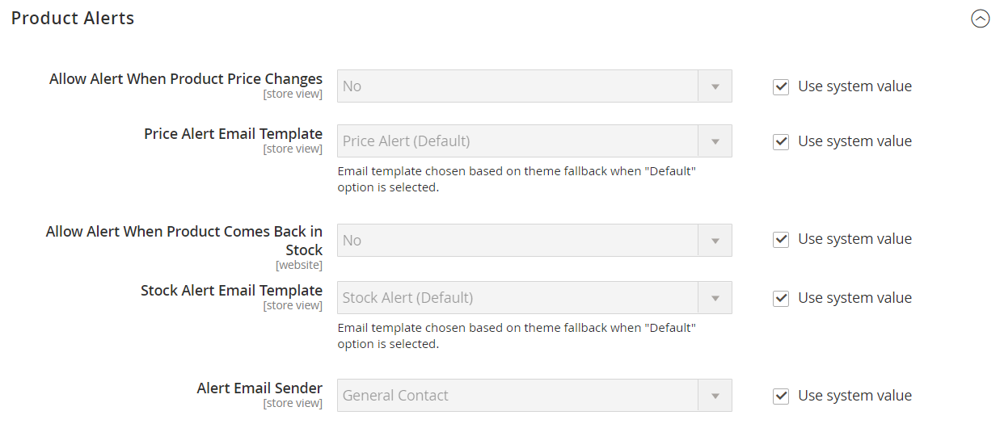
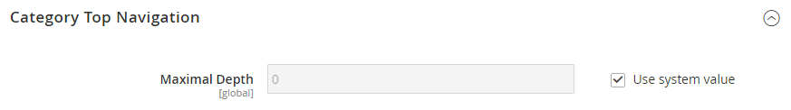

# [!UICONTROL Catalog] > [!UICONTROL Catalog]

{{config}}

## [!UICONTROL Product Fields Auto-Generation]

<!-- zoom -->

<!-- [Product Fields Auto-Generation](https://docs.magento.com/user-guide/catalog/product-fields-autogenerated.html) -->

| Champ | [Portée](../../getting-started/websites-stores-views.md#scope-settings) | Description |
|--- |--- |--- |
| [!UICONTROL Mask for SKU] | Global | Détermine la valeur par défaut du champ SKU en fonction des valeurs d’espace réservé provenant d’autres champs et de tout texte supplémentaire saisi. Espace réservé par défaut :  Nom du produit - `{{name}}` |
| [!UICONTROL Mask for Meta Title] | Global | Détermine la valeur par défaut du champ Meta Title en fonction des valeurs d’espace réservé provenant d’autres champs et de tout texte supplémentaire saisi. Espace réservé par défaut :  Nom du produit - `{{name}}` |
| [!UICONTROL Mask for Meta Keywords] | Global | Détermine la valeur par défaut de la variable _Mots-clés des métadonnées_ d’un champ en fonction des valeurs d’espace réservé d’autres champs et de tout texte supplémentaire saisi. Espace réservé par défaut :  Nom du produit - `{{name}}` |
| [!UICONTROL Mask for Meta Description] | Global | Détermine la valeur par défaut du champ Meta-Description en fonction des valeurs d’espace réservé provenant d’autres champs et de tout texte supplémentaire saisi. Espace réservé par défaut :  Nom du produit - `{{name}}`  Description - `{{description}}` |

{:style=&quot;table-layout:auto&quot;}

## [!UICONTROL Product Reviews]

<!-- zoom -->

<!-- [Product Reviews](https://docs.magento.com/user-guide/marketing/product-reviews.html) -->

| Champ | [Portée](../../getting-started/websites-stores-views.md#scope-settings) | Description |
|--- |--- |--- |
| [!UICONTROL Enabled] | Affichage en magasin | Permet la consultation de produits. Options : `Yes` / `No` |
| [!UICONTROL Allow Guests to Write Reviews] | Site Web | Détermine si les clients doivent ouvrir un compte avec votre boutique pour pouvoir écrire des révisions de produit. |

{:style=&quot;table-layout:auto&quot;}

## [!UICONTROL Storefront]

<!-- zoom -->

<!-- [Storefront](https://docs.magento.com/user-guide/catalog/navigation-product-listings.html) -->

| Champ | [Portée](../../getting-started/websites-stores-views.md#scope-settings) | Description |
|--- |--- |--- |
| [!UICONTROL List Mode] | Affichage en magasin | Détermine le format de la liste des résultats de recherche. Options :  **`Grid Only`**- Formate la liste en tant que grille de lignes et de colonnes. Chaque produit apparaît dans une seule cellule de la grille. **`List Only`** : met en forme la liste avec chaque produit sur une ligne distincte.  **`Grid (default / List)`**- Par défaut, les produits s’affichent en mode Grille et peuvent être basculés en mode Liste. **`List (default / Grid)`** - Par défaut, les produits apparaissent en mode Liste et peuvent être basculés en mode Grille. |
| [!UICONTROL Products per Page on Grid Allowed Values] | Affichage en magasin | Détermine le nombre de produits affichés en mode Grille. Pour sélectionner plusieurs options, saisissez plusieurs valeurs séparées par des virgules. |
| [!UICONTROL Products per Page on Grid Default Value] | Affichage en magasin | Détermine le nombre de produits affichés par page par défaut en mode Grille. |
| [!UICONTROL Products per Page on List Allowed Values] | Affichage en magasin | Détermine le nombre de produits affichés en mode Liste. Pour sélectionner plusieurs options, saisissez plusieurs valeurs séparées par des virgules. |
| [!UICONTROL Products per Page on List Default Value] | Affichage en magasin | Détermine le nombre de produits affichés par page, en mode Liste, par défaut. |
| Tri par liste de produits | Affichage en magasin | Détermine l’ordre de tri de la liste des résultats de la recherche. La sélection des options est déterminée par les paramètres d’affichage de la catégorie et les attributs disponibles qui sont définis pour `Used for Sorting in Product Listing`. La valeur par défaut est définie sur `Use All Available Attributes` et inclut généralement la meilleure valeur, le nom et le prix |
| [!UICONTROL Allow All Products per Page] | Affichage en magasin | Si la variable est définie sur `Yes`, inclut la variable `ALL` dans le contrôle &quot;Afficher par page&quot;. |
| [!UICONTROL Remember Category Pagination] | Global | Si la variable est définie sur `Yes`, les valeurs de pagination de catégorie actuelles sont enregistrées lorsque les clients naviguent d’une catégorie à une autre dans [listes de produits](../../catalog/navigation-product-listings.md). L’enregistrement de la valeur utilise davantage de stockage du cache et peut affecter la manière dont les pages sont indexées par les moteurs de recherche. Options : `Yes` / `No` (par défaut) |
| [!UICONTROL Use Flat Catalog Category] | Global | Active la variable [structure de catégorie plate](../../catalog/catalog-flat.md) (non recommandé). Options : `Yes` / `No` |
| [!UICONTROL Use Flat Catalog Product] | Global | Active la structure de produit plate. (non recommandé) Options : `Yes` / `No` |
| [!UICONTROL Swatches per Product] | Affichage en magasin | Détermine le nombre d’échantillons disponibles pour chaque produit. Valeur par défaut : `16` |
| [!UICONTROL Show Swatches in Product List] | Affichage en magasin | Détermine si les échantillons apparaissent dans la liste de produits. Options : `Yes` / `No` |
| [!UICONTROL Show Swatch Tooltip] | Affichage en magasin | Détermine si l’info-bulle d’échantillon s’affiche. Options : `Yes` / `No` |

{:style=&quot;table-layout:auto&quot;}

## [!UICONTROL Product Alerts]

<!-- zoom -->

<!-- [Product Alerts](https://docs.magento.com/user-guide/catalog/inventory-product-alerts.html) -->

| Champ | [Portée](../../getting-started/websites-stores-views.md#scope-settings) | Description |
|--- |--- |--- |
| [!UICONTROL Allow Alerts When Product Price Changes] | Affichage en magasin | Détermine si des alertes par e-mail sont disponibles pour les changements de prix du produit. Options : `Yes` / `No` |
| [!UICONTROL Price Alert Email Template] | Affichage en magasin | Identifie le modèle utilisé pour les alertes par e-mail de changement de prix de produit. Modèle par défaut : `Product price alert` |
| [!UICONTROL Allow Alert When Product Comes Back in Stock] | Site Web | Détermine si les clients peuvent choisir de recevoir une alerte lorsque le produit revient en stock. Options : `Yes` / `No` |
| [!UICONTROL Stock Alert Email Template] | Affichage en magasin | Identifie le modèle utilisé pour les notifications par e-mail d’alerte de stock. Modèle par défaut : `Product stock alert` |
| [!UICONTROL Alert Email Sender] | Affichage en magasin | Détermine le contact de magasin qui apparaît comme expéditeur du message d’alerte du produit. Options : `General Contact` / `Sales Representative` / `Customer Support` / `Custom Email` |

{:style=&quot;table-layout:auto&quot;}

## [!UICONTROL Product Alerts Run Settings]

<!-- zoom -->

<!-- [Product Alerts Run Settings](https://docs.magento.com/user-guide/catalog/inventory-product-alert-run-settings.html) -->

| Champ | [Portée](../../getting-started/websites-stores-views.md#scope-settings) | Description |
|--- |--- |--- |
| [!UICONTROL Frequency] | Global | Sélectionnez la fréquence d’envoi des alertes de produit. Options : `Daily` / `Weekly` / `Monthly` |
| [!UICONTROL Start Time] | Global | Sélectionnez l’heure de début du processus d’alerte du produit. Cette fois doit être effectuée après toute mise à jour de prix ou d’inventaire. |
| [!UICONTROL Error Email Recipient] | Global | Identifiez l’adresse électronique de la personne (normalement un administrateur de magasin) qui doit recevoir une notification par e-mail lorsqu’une erreur se produit dans le processus d’alerte du produit. |
| [!UICONTROL Error Email Sender] | Global | Sélectionner le rôle de l&#39;email `from`. |
| [!UICONTROL Error Email Template] | Global | Sélectionnez le modèle de courrier électronique à utiliser pour les notifications d’erreur d’alerte de produit. |

{:style=&quot;table-layout:auto&quot;}

## [!UICONTROL Product Image Placeholders]

<!-- zoom -->

<!-- [Product Image Placeholders](https://docs.magento.com/user-guide/catalog/product-image-placeholders.html) -->

| Champ | [Portée](../../getting-started/websites-stores-views.md#scope-settings) | Description |
|--- |--- |--- |
| [!UICONTROL Base Image] | Affichage en magasin | Identifie le fichier d’espace réservé choisi pour l’image de base. |
| [!UICONTROL Small Image] | Affichage en magasin | Identifie le fichier d’espace réservé choisi pour la petite image. |
| [!UICONTROL Swatch] | Affichage en magasin | Identifie le fichier d’espace réservé choisi pour l’échantillon. |
| [!UICONTROL Thumbnail] | Affichage en magasin | Identifie le fichier d’espace réservé choisi pour la miniature. |
| [!UICONTROL Choose File] |  | Accède au fichier et le télécharge en tant qu’image d’espace réservé pour le type . |

{:style=&quot;table-layout:auto&quot;}

## [!UICONTROL Recently Viewed/Compared Products]

<!-- zoom -->

<!-- Recently Viewed/Compared Products](https://docs.magento.com/user-guide/marketing/products-viewed-compared.html) -->

| Champ | [Portée](../../getting-started/websites-stores-views.md#scope-settings) | Description |
|--- |--- |--- |
| [!UICONTROL Synchronize widget products with backend storage] | Global | Détermine la synchronisation des informations du widget de produit, telles que l’ID du produit, avec la base de données. Cela permet de réutiliser les informations sur d’autres périphériques. |
| [!UICONTROL Show for Current] | Site Web | Limite les produits affichés au site web actuel. Options : `Website` / `Store` / `Store View` |
| [!UICONTROL Default Recently Viewed Products Count] | Affichage en magasin | Détermine le nombre maximal de produits récemment consultés qui apparaissent dans la liste. |
| [!UICONTROL Default Recently Compared Products Count] | Affichage en magasin | Détermine le nombre maximal de produits récemment comparés qui apparaissent dans la liste. |
| [!UICONTROL Lifetime of products in Recently Viewed Widget] | Global | Détermine la durée, en secondes, pendant laquelle les produits consultés s’affichent dans la liste récemment affichée. |
| [!UICONTROL Lifetime of products in Recently Compared Widget] | Global | Détermine la durée, en secondes, d’affichage des produits comparés dans la liste récemment comparée. |

{:style=&quot;table-layout:auto&quot;}

## [!UICONTROL Product Video]

<!-- zoom -->

<!-- [Product Videos](https://docs.magento.com/user-guide/catalog/product-video.html) -->

| Champ | [Portée](../../getting-started/websites-stores-views.md#scope-settings) | Description |
|--- |--- |--- |
| [!UICONTROL YouTube API key] | Affichage en magasin | Indique la clé d’API requise pour la connexion au serveur YouTube. |
| [!UICONTROL Autostart base video] | Affichage en magasin | Pour démarrer automatiquement la vidéo une fois la page chargée, définissez sur `Yes`. |
| [!UICONTROL Show related video] | Affichage en magasin | Pour afficher les vidéos associées, définissez sur `Yes`. |
| [!UICONTROL Auto restart video] | Affichage en magasin | Pour activer la relecture automatique de la vidéo, définissez sur `Yes`. |

{:style=&quot;table-layout:auto&quot;}

## [!UICONTROL Price]

<!-- zoom -->

<!--Price](https://docs.magento.com/user-guide/catalog/catalog-price-scope.html) -->

| Champ | [Portée](../../getting-started/websites-stores-views.md#scope-settings) | Description |
|--- |--- |--- |
| [!UICONTROL Catalog Price Scope] | Global | Détermine la portée de la devise de base. Options : `Global` / `Website` |
| [!UICONTROL Default Product Price] | Global |  (Adobe Commerce uniquement) Définit le prix par défaut du produit, le cas échéant. |

{:style=&quot;table-layout:auto&quot;}

## [!UICONTROL Layered Navigation]

>[!NOTE]
>
>La configuration de recherche standard décrite dans cette section diffère de la configuration [Recherche en direct](https://experienceleague.adobe.com/docs/commerce-merchant-services/live-search/overview.html).

<!-- [Layered Navigation - Automatic (equalize price ranges)](https://docs.magento.com/user-guide/catalog/navigation-layered-configuration.html) -->

<!-- zoom -->

<!-- zoom -->

<!-- zoom -->

| Champ | [Portée](../../getting-started/websites-stores-views.md#scope-settings) | Description |
|--- |--- |--- |
| [!UICONTROL Display Product Count] | Affichage en magasin | Détermine si le nombre de produits apparaît après chaque attribut, plage de prix et catégorie. Options : `Yes` / `No` |
| [!UICONTROL Price Navigation Step Calculation] | Affichage en magasin | Détermine la méthode utilisée pour déterminer la variable [étape de navigation par prix](../../catalog/navigation-layered.md#configure-price-navigation)). Options :  `Automatic (equalize price ranges)` - Base le calcul sur la gamme de prix des produits du groupe.  `Automatic (equalize product counts)` - Base le calcul sur le nombre de produits du groupe. Établit un seuil pour le nombre minimum de produits dans le groupe, afin de les empêcher d’être divisés en groupes plus petits.  `Manual` - Utilise la limite de division que vous saisissez pour les intervalles de prix. |
| [!UICONTROL Default Price Navigation Step] | Affichage en magasin | Détermine le nombre de produits inclus dans chaque étape. |
| [!UICONTROL Maximum Number of Price Intervals] | Affichage en magasin | Définit une limite pour le nombre d’intervalles de prix qui apparaissent dans la navigation par couches. |

{:style=&quot;table-layout:auto&quot;}

## [!UICONTROL Category Permissions]

{{ee-feature}}

<!-- zoom -->

<!-- [Category Permissions](https://docs.magento.com/user-guide/catalog/category-permissions.html) -->

| Champ | [Portée](../../getting-started/websites-stores-views.md#scope-settings) | Description |
|--- |--- |--- |
| [!UICONTROL Enable] | Global | Active les restrictions de catégorie. Par défaut, l’utilisation de cette fonctionnalité limite toutes les catégories. Options : `Yes` / `No` |
| [!UICONTROL Allow Browsing Category] | Site Web | Détermine qui est autorisé à parcourir les catégories. Options :  `Yes, for Everyone` - Permet à tous les visiteurs et clients de parcourir la catégorie.  `Yes, for Specified Customer Groups` - Permet uniquement aux membres des groupes de clients sélectionnés de parcourir la catégorie.  `No, Redirect to Landing Page` : refuse l’accès à la catégorie et la redirige vers la page sélectionnée. |
| [!UICONTROL Display Product Prices] | Site Web | Contrôle l’affichage des prix des produits pour la catégorie. Options :  `Yes, for Everyone` - Permet à tout le monde de voir le prix des produits de la catégorie.  `Yes, for Specified Customer Groups` - Permet uniquement aux membres de groupes de clients sélectionnés de voir le prix des produits de la catégorie.  `No` - Désactive l’affichage des prix des produits pour la catégorie. |
| [!UICONTROL Allow Adding to Cart] | Site Web | Détermine qui peut acheter des produits de la catégorie. Options :  `Yes, for Everyone` - Permet à tous de placer des produits de la catégorie dans leur panier.  `Yes, for Specified Customer Groups` - Permet uniquement aux membres de groupes de clients sélectionnés de placer les produits de la catégorie dans leur panier.  `No` - Ne permet à personne de placer des produits de la catégorie dans son panier. |
| [!UICONTROL Disallow Catalog Search by] | Site Web | Identifie les groupes de clients qui ne sont pas autorisés à rechercher des produits dans la catégorie. |

{:style=&quot;table-layout:auto&quot;}

## [!UICONTROL Search Engine Optimization]

<!-- zoom -->

<!-- [Search Engine Optimization](https://docs.magento.com/user-guide/catalog/product-search-engine-optimization.html) -->

| Champ | [Portée](../../getting-started/websites-stores-views.md#scope-settings) | Description |
|--- |--- |--- |
| [!UICONTROL Popular Search Terms] | Affichage en magasin | Détermine si _Termes de recherche populaires_ est implémenté dans le magasin. Ce paramètre ne s’applique pas aux magasins qui utilisent [Recherche en direct](https://experienceleague.adobe.com/docs/commerce-merchant-services/live-search/overview.html). Options : `Enable` / `Disable` |
| [!UICONTROL Product URL Suffix] | Affichage en magasin | Détermine si un suffixe, tel que html ou htm, est appliqué aux URL de produit. En cas d’utilisation, n’insérez pas de point avant le suffixe, car celui-ci est appliqué automatiquement. |
| [!UICONTROL Category URL Suffix] | Affichage en magasin | Détermine si un suffixe, tel que html ou htm, est appliqué aux URL de catégorie. En cas d’utilisation, n’insérez pas de point avant le suffixe, car celui-ci est appliqué automatiquement. |
| [!UICONTROL Use Categories Path for Product URLs] | Affichage en magasin | Détermine si les chemins de catégorie sont inclus dans les URL de produit. Ce faisant, plusieurs URL peuvent pointer vers la même page, ce qui peut avoir une incidence sur le classement de recherche. Pour en savoir plus, voir [Balise méta canonique](../../merchandising-promotions/meta-data.md#canonical-meta-tag). |
| [!UICONTROL Create Permanent Redirect for URLs if URL Key Changed] | Affichage en magasin | Détermine si une redirection permanente est créée automatiquement chaque fois qu’une clé d’URL change. Lorsqu’elle est implémentée, la case à cocher Créer une redirection personnalisée pour l’ancienne URL située sous le champ Clé URL du produit est sélectionnée par défaut. Options : `Yes` / `No` |
| [!UICONTROL Generate "category/product" URL Rewrites] | Global | Détermine si Adobe Commerce génère des données et les enregistre dans les tableaux de réécriture lorsqu’un utilisateur enregistre une catégorie contenant de nombreux produits attribués. Options : `Yes` / `No`   **_Important :_**L’enregistrement de ces données générées dans un tableau de réécriture d’URL peut dégrader les performances. Voir [Redirections automatiques de produits](../../merchandising-promotions/url-redirect-product-automatic.md) pour plus d’informations. |
| [!UICONTROL Page Title Separator] | Affichage en magasin | Identifie le caractère qui sépare le nom de la catégorie et la sous-catégorie dans la barre de titre du navigateur. |
| [!UICONTROL Use Canonical Link Meta Tag for Categories] | Affichage en magasin | Si plusieurs URL pointent vers la même page de catégorie, cette option utilise une méta-balise canonique pour identifier l’URL de catégorie que les moteurs de recherche doivent indexer. L’URL contient un nom complet pour la catégorie à l’aide de la balise meta . Cela réduit la duplication du contenu et améliore l’optimisation du moteur de recherche. Options : `Yes` / `No` |
| [!UICONTROL Use Canonical Link Meta Tag for Products] | Affichage en magasin | Si plusieurs URL pointent vers la même page de produit, cette option utilise une méta-balise canonique pour identifier l’URL de produit que les moteurs de recherche doivent indexer. L’URL inclut un nom complet du produit à l’aide de la balise meta . Cela réduit la duplication du contenu et améliore l’optimisation du moteur de recherche. Options : `Yes` / `No` |

{:style=&quot;table-layout:auto&quot;}

## [!UICONTROL Category Top Navigation]

<!-- zoom -->

<!-- Category Top Navigation](https://docs.magento.com/user-guide/catalog/navigation-top.html) -->

| Champ | [Portée](../../getting-started/websites-stores-views.md#scope-settings) | Description |
|--- |--- |--- |
| [!UICONTROL Maximal Depth] | Global | Détermine le nombre de niveaux de sous-catégorie dans la navigation supérieure. La valeur par défaut de `0` ne limite pas le nombre de niveaux. |

{:style=&quot;table-layout:auto&quot;}

## [!UICONTROL Catalog Search]

Il existe deux variantes de la configuration de recherche catalogue : les paramètres disponibles lorsque [[!DNL Live Search]](https://experienceleague.adobe.com/docs/commerce-merchant-services/live-search/overview.html) est installé et ceux disponibles pour Adobe Commerce natif. Suivez les instructions de votre installation.

### Adobe Commerce avec [!DNL Live Search]

Lorsque la recherche en direct est installée, la recherche catalogue inclut les paramètres de configuration suivants :

<!-- zoom -->

<!-- [Catalog Search for Live Search](https://docs.magento.com/user-guide/catalog/search-configuration.html) -->

| Champ | [Portée](../../getting-started/websites-stores-views.md#scope-settings) | Description |
|--- |--- |--- |
| [!UICONTROL Minimal Query Length] | Affichage en magasin | Nombre minimum de caractères autorisés dans une recherche catalogue. Les valeurs définies pour cette option doivent être compatibles avec la plage correspondante définie dans les configurations de votre moteur de recherche Elasticsearch. Par exemple, si vous définissez cette valeur sur `2` dans Adobe Commerce, mettez à jour la valeur dans votre moteur de recherche. |
| [!UICONTROL Maximum Query Length] | Affichage en magasin | Nombre maximal de caractères autorisés dans une recherche catalogue. Les valeurs définies pour cette option doivent être compatibles avec la plage correspondante définie dans les configurations de votre moteur de recherche Elasticsearch. Par exemple, si vous définissez cette valeur sur 300 dans Adobe Commerce, mettez à jour la valeur dans votre moteur de recherche. |
| [!UICONTROL Number of top search results to cache] | Affichage en magasin | Nombre de termes de recherche et de résultats courants à mettre en cache pour des réponses plus rapides. Saisir la valeur de `0` met en cache tous les termes et résultats de la recherche une seconde fois. Valeur par défaut : `100` |
| [!UICONTROL Autocomplete Limit] | Affichage en magasin | Détermine le nombre maximal de lignes disponibles dans la variable [storefront popover] page. La valeur par défaut peut être modifiée lors de l’installation de Live Search et mise à jour ultérieurement en modifiant ce paramètre de configuration. Valeur par défaut : `8` |

{:style=&quot;table-layout:auto&quot;}

### Adobe Commerce avec Elasticsearch

Native Adobe Commerce avec Elasticsearch comprend les paramètres de configuration suivants :

<!-- zoom -->

<!-- [Catalog Search](https://docs.magento.com/user-guide/catalog/search-configuration.html) -->

>[!IMPORTANT]
>
>En raison de l’annonce de fin de prise en charge de 7 Elasticsearch pour août 2023, il est recommandé à tous les clients Adobe Commerce de migrer vers le moteur de recherche OpenSearch 2.x. Pour plus d’informations sur la migration de votre moteur de recherche lors de la mise à niveau du produit, voir [Migration vers OpenSearch](https://experienceleague.adobe.com/docs/commerce-operations/upgrade-guide/prepare/opensearch-migration.html) dans le _Guide de mise à niveau_.

| Champ | [Portée](../../getting-started/websites-stores-views.md#scope-settings) | Description |
|--- |--- |--- |
| [!UICONTROL Minimal Query Length] | Affichage en magasin | Nombre minimum de caractères autorisés dans une recherche catalogue. Les valeurs définies pour cette option doivent être compatibles avec la plage correspondante définie dans les configurations de votre moteur de recherche Elasticsearch. Par exemple, si vous définissez cette valeur sur `2` dans Adobe Commerce, mettez à jour la valeur dans votre moteur de recherche. |
| [!UICONTROL Maximum Query Length] | Affichage en magasin | Nombre maximal de caractères autorisés dans une recherche catalogue. Les valeurs définies pour cette option doivent être compatibles avec la plage correspondante définie dans les configurations de votre moteur de recherche Elasticsearch. Par exemple, si vous définissez cette valeur sur 300 dans Adobe Commerce, mettez à jour la valeur dans votre moteur de recherche. |
| [!UICONTROL Number of top search results to cache] | Affichage en magasin | Nombre de termes de recherche et de résultats courants à mettre en cache pour des réponses plus rapides. Saisir la valeur de `0` met en cache tous les termes et résultats de la recherche une seconde fois. Valeur par défaut : `100` |
| [!UICONTROL Enable EAV Indexer] | Global | Détermine si vous souhaitez activer ou désactiver l’indexeur EAV de produit. Cette fonctionnalité améliore la vitesse d’indexation et limite l’indexeur de l’utilisation par des extensions tierces. Cette option s’affiche uniquement pour les moteurs de recherche Elasticsearch ou Elasticsearch 5.0+. Option par défaut : `Yes` pour activé |
| [!UICONTROL Autocomplete Limit] | Affichage en magasin | Nombre maximal de requêtes de recherche à afficher sous le champ de recherche pour la saisie automatique de la recherche. La limitation de ce montant augmente les performances des recherches et réduit la taille de la liste affichée. Valeur par défaut : `8` |
| Moteur de recherche | Global | Identifie le moteur de recherche requis pour traiter les demandes de données de catalogue. Elasticsearch 7.6.x est requis pour toutes les installations Adobe Commerce. Option : `Elasticsearch 7` |
| [!UICONTROL Elasticsearch Server Hostname] | Global | Indique le nom du serveur Elasticsearch. Valeur par défaut : `elasticsearch.internal` |
| [!UICONTROL Elasticsearch Server Port] | Global | Indique le numéro de port du serveur utilisé par Elasticsearch. Valeur par défaut : `9200` |
| [!UICONTROL Elasticsearch Index Prefix] | Global | Attribue un préfixe pour identifier l’index Elasticsearch. Valeur par défaut : `magento2` |
| [!UICONTROL Enable Elasticsearch HTTP Auth] | Global | S’il est activé, utilise l’authentification HTTP pour demander un nom d’utilisateur et un mot de passe avant d’accéder au serveur Elasticsearch. Options : `Yes` / `No` |
| [!UICONTROL Elasticsearch HTTP Username] | Global | When _Activation de l’authentification HTTP Elasticsearch_ est défini sur `Yes`, spécifie le nom d’utilisateur pour l’authentification HTTP Elasticsearch. |
| [!UICONTROL Elasticsearch HTTP Password] | Global | When _Activation de l’authentification HTTP Elasticsearch_ est défini sur `Yes`, indique le mot de passe pour l’authentification HTTP Elasticsearch. |
| [!UICONTROL Elasticsearch Server Timeout] | Global | Détermine le nombre de secondes avant l’expiration du serveur. Valeur par défaut : `15` |
| [!UICONTROL Test Connection] |  | Valide la connexion Elasticsearch. |
| [!UICONTROL Enable Search Recommendations] | Affichage en magasin | Détermine si des recommandations de recherche sont proposées lorsqu’une recherche ne renvoie aucun résultat et apparaissent sous la variable `Related search terms` sur la page des résultats de la recherche. Options : `Yes` / `No`  Lorsque cette option est définie sur Oui, d’autres options s’affichent pour _[!UICONTROL Search Recommendations Count]_et_[!UICONTROL Shows Results Count for Each Recommendation]_. |
| [!UICONTROL Search Recommendations Count] | Affichage en magasin | Indique le nombre de termes de recherche proposés comme recommandations. Par défaut, cinq au maximum s’affichent. |
| [!UICONTROL Show Results Count for Each Recommendation] | Affichage en magasin | Lorsque la variable est définie sur `Yes`, le nombre de produits trouvés pour la recommandation de recherche proposée est indiqué entre parenthèses. Options : `Yes` / `No` |
| [!UICONTROL Enable Search Suggestions] | Affichage en magasin | Détermine si les suggestions de recherche s’affichent pour les fautes d’orthographe courantes. Lorsque cette option est activée, des suggestions de recherche sont proposées pour toute requête qui ne renvoie aucun résultat et qui apparaît sous la variable `Did you mean` de la section **Résultats de la recherche** page. Les suggestions de recherche peuvent avoir un impact sur les performances de la recherche. Lorsque la variable est définie sur `Yes`, d’autres options s’affichent pour Activer le Recommendations de recherche et les champs associés. Options : `Yes` / `No` |
| [!UICONTROL Search Suggestions Count] | Affichage en magasin | Détermine le nombre de suggestions de recherche proposées. Par exemple: `2` |
| [!UICONTROL Show Results Count for Each Suggestion] | Affichage en magasin | Détermine si le nombre de résultats de recherche s’affiche pour chaque suggestion. Selon le thème, le nombre apparaît généralement entre crochets après la suggestion. Options : `Yes` / `No` |
| [!UICONTROL Minimum Terms to Match] | Affichage en magasin | Indique une valeur qui correspond au nombre de termes de votre requête que les résultats de la recherche doivent correspondre pour être renvoyés. Cela garantit une pertinence optimale des résultats pour les acheteurs. Les valeurs en pourcentage correspondent à un nombre. Si nécessaire, arrondies et utilisées comme nombre minimum de termes à faire correspondre dans votre requête. La valeur peut être un entier négatif ou positif, un pourcentage négatif ou positif, une combinaison des deux combinaisons ou plusieurs combinaisons. Pour en savoir plus, voir [paramètre minimum_should_match](https://www.elastic.co/guide/en/elasticsearch/reference/current/query-dsl-minimum-should-match.html) dans la documentation de l’Elasticsearch. |

{:style=&quot;table-layout:auto&quot;}

## [!UICONTROL Downloadable Product Options]

<!-- zoom -->

<!-- [Downloadable Product Options](https://docs.magento.com/user-guide/catalog/product-download-options.html) -->

| Champ | [Portée](../../getting-started/websites-stores-views.md#scope-settings) | Description |
|--- |--- |--- |
| [!UICONTROL Order Item Status to Enable Downloads] | Site Web | Détermine l’état d’une commande avant que les téléchargements ne soient disponibles. Options : `Pending` / `Invoiced` |
| [!UICONTROL Default Maximum Number of Downloads] | Site Web | Détermine le nombre par défaut de téléchargements disponibles pour un client. |
| [!UICONTROL Shareable] | Site Web | Détermine si les clients doivent se connecter à leurs comptes pour accéder au lien de téléchargement. Options :  **Oui** - Permet l&#39;envoi du lien par email, qui peut ensuite être partagé avec d&#39;autres personnes.  **Non** - Nécessite que les clients se connectent à leurs comptes pour accéder au lien de téléchargement. |
| [!UICONTROL Default Sample Title] | Affichage en magasin | Titre par défaut de tous les fichiers d’exemple. |
| [!UICONTROL Default Link Title] | Affichage en magasin | Lien par défaut pour tous les titres téléchargeables. |
| [!UICONTROL Opens Links in New Window] | Site Web | Détermine si le lien de téléchargement s’ouvre dans une nouvelle fenêtre du navigateur. Options : `Yes` / `No` |
| [!UICONTROL Use Content Disposition] | Affichage en magasin | Détermine le mode de diffusion du lien vers le contenu téléchargeable, sous la forme d’une pièce jointe à un email ou d’un lien intégré dans une fenêtre de navigateur. Options :  **`Attachment`**- Le lien de téléchargement est remis en tant que pièce jointe à un email. **`Inline`** - Le lien de téléchargement est diffusé sous la forme d’un lien intégré sur une page web. |
| [!UICONTROL Disable Guest Checkout if Cart Contains Downloadable Items] | Site Web | Détermine si les invités qui achètent des produits téléchargeables doivent s’enregistrer pour un compte et se connecter pour terminer le processus de passage en caisse. Options :  **`Yes`**- Si le panier contient des produits téléchargeables, l’invité doit s’inscrire à un compte ou se connecter à un compte existant pour terminer l’achat. **`No`** - Le lien de téléchargement est diffusé sous la forme d’un lien intégré dans le corps du message électronique.    _**Remarque :**_ Le passage en caisse des invités n’est disponible que pour les produits de téléchargement si l’option Partage est définie sur `Yes`. |

{:style=&quot;table-layout:auto&quot;}

## [!UICONTROL Date & Time Custom Options]

<!-- zoom -->

<!-- Date & Time Custom Options](https://docs.magento.com/user-guide/stores/attribute-date-time-options.html) -->

| Champ | [Portée](../../getting-started/websites-stores-views.md#scope-settings) | Description |
|--- |--- |--- |
| [!UICONTROL Use JavaScript Calendar] | Affichage en magasin | Détermine si le calendrier JavaScript est utilisé comme contrôle d’entrée pour les champs de date. Options : `Yes` / `No`  Si la variable est définie sur `No`, une liste déroulante distincte s’affiche pour chaque partie du champ de date. |
| [!UICONTROL Date Fields Order] | Affichage en magasin | Définit l’ordre des trois champs de date. Options : `Day` / `Month` / `Year` |
| [!UICONTROL Time Format] | Affichage en magasin | Définit le format d’heure sur une horloge de 12 ou 24 heures. Options : `12h AM/PM` / `24h` |
| [!UICONTROL Year Range] | Affichage en magasin | Définit la période de début et de fin des années qui apparaissent dans le _Année_ champ . La valeur doit être saisie au format AAAA. |

{:style=&quot;table-layout:auto&quot;}

## [!UICONTROL Catalog Events]

{{ee-feature}}

<!-- zoom -->

<!-- [Catalog Events](https://docs.magento.com/user-guide/marketing/events-private-sales.html) -->

| Champ | [Portée](../../getting-started/websites-stores-views.md#scope-settings) | Description |
|--- |--- |--- |
| [!UICONTROL Enable Catalog Events Functionality] | Site Web | Détermine si le module Événements est activé. |
| [!UICONTROL Enable Catalog Event Widget on Frontend] | Affichage en magasin | Détermine si le widget d’événement est disponible dans le storefront. Il s’agit d’un bloc statique contenant des informations sur les événements de votre site. |
| [!UICONTROL Number of Events to be Displayed in the Event Slider Widget] | Affichage en magasin | Détermine le nombre d’événements qui apparaissent dans le widget du curseur d’événement sur les pages de catégorie. Pour remplacer, utilisez la variable `limit="x"` Variable . |
| [!UICONTROL Events to Scroll per Click in Event Slider Widget] | Affichage en magasin | Détermine le nombre d’événements qui apparaissent dans le widget du curseur d’événement sur les pages CMS, telles que la page d’accueil. Pour remplacer, utilisez la variable `scroll="x"` Variable . |

{:style=&quot;table-layout:auto&quot;}

## [!UICONTROL Rule-Based Product Relations]

{{ee-feature}}

<!-- zoom -->

<!-- [Rule-Based Product Relations](https://docs.magento.com/user-guide/marketing/product-related-rules.html) -->

| Champ | [Portée](../../getting-started/websites-stores-views.md#scope-settings) | Description |
|--- |--- |--- |
| [!UICONTROL Maximum Number of Products in Related Products List] | Global | Détermine le nombre maximal de produits pouvant apparaître dans la variable _Produits associés_ liste. |
| [!UICONTROL Show Related Products] | Global | Détermine la liste des produits associés qui apparaît dans le magasin. Il peut s’agir de la liste sélectionnée manuellement dans les Informations sur le produit, de la liste générée en réponse à une règle de relation avec le produit ou d’une combinaison des deux. Options : `Both Selected and Rule-Based` / `Selected Only` / `Rule-Based Only` |
| [!UICONTROL Rotation Mode for Products in Related Products List] | Global | Détermine l’ordre dans lequel les produits de la variable _Produits associés_ s’affiche. Options : `Do not rotate` / `Shuffle` |
| [!UICONTROL Maximum Number of Products in Cross-Sell Product List] | Global | Détermine le nombre maximal de produits pouvant apparaître dans la liste de ventes croisées. |
| [!UICONTROL Show Cross-Sell Products] | Global | Détermine la liste des produits de vente croisée qui apparaît dans le magasin. Il peut s’agir de la liste sélectionnée manuellement dans les Informations sur le produit, de la liste générée en réponse à une règle de relation avec le produit ou d’une combinaison des deux. Options : `Both Selected and Rule-Based` / `Selected Only` / `Rule-Based Only` |
| [!UICONTROL Rotation Mode for Products in Cross-Sell Products List] | Global | Détermine l’ordre dans lequel apparaissent les produits dans la liste des produits vendus. Options : ne pas faire pivoter/mélanger |
| [!UICONTROL Maximum Number of Products in Upsell Product List] | Global | Détermine le nombre maximal de produits pouvant apparaître dans la variable _Produits de vente incitative_ liste. |
| [!UICONTROL Show Upsell Products] | Global | Détermine la liste des produits de vente incitative qui apparaît dans le magasin. Il peut s’agir de la liste sélectionnée manuellement dans les Informations sur le produit, de la liste générée en réponse à une règle de relation avec le produit ou d’une combinaison des deux. Options : `Both Selected and Rule-Based` / `Selected Only` / `Rule-Based Only` |
| [!UICONTROL Rotation Mode for Products in Upsell Product List] | Global | Détermine l’ordre dans lequel les produits de la liste de produits de mise à niveau apparaissent. Options : `Do not rotate` / `Shuffle` |

{:style=&quot;table-layout:auto&quot;}
