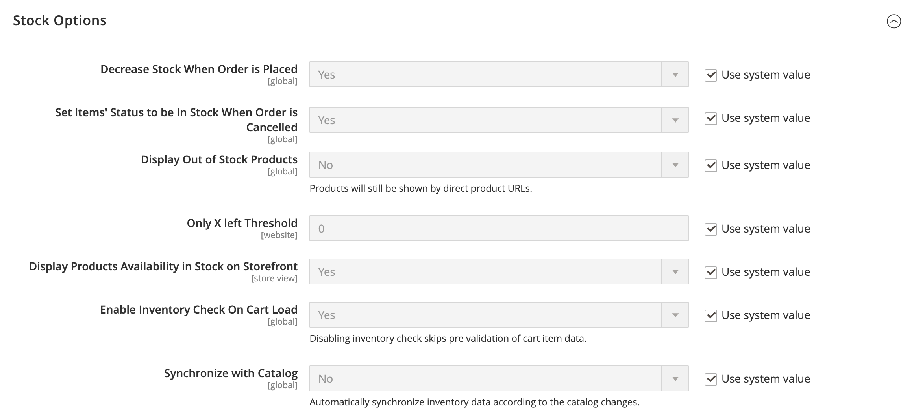
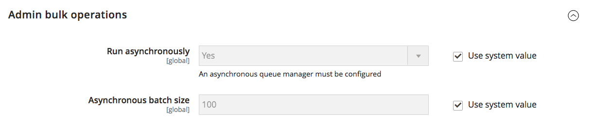
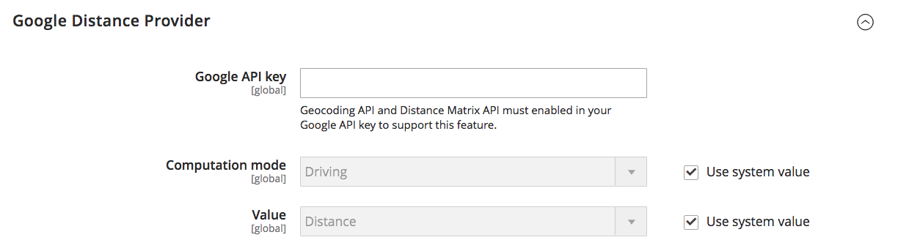

# [!UICONTROL Catalog] > [!UICONTROL Inventory]

{{config}}

>[!NOTE]
>
>[!DNL Inventory Management] pour Adobe Commerce et Magento Open Source vous offre les outils nécessaires à la gestion de votre inventaire de produits. Les commerçants disposant d’un magasin unique pour plusieurs entrepôts, magasins, lieux de retrait, chargeurs, etc. peuvent utiliser ces fonctionnalités pour gérer les quantités pour les ventes et gérer les expéditions pour terminer les commandes. Pour plus d’informations sur ces fonctionnalités et sur leur utilisation pour gérer les stocks à plusieurs emplacements, consultez le guide d’utilisation de [_[!DNL Inventory Management]’application _](https://experienceleague.adobe.com/docs/commerce-admin/inventory/introduction.html).

## [!UICONTROL Stock Options]

<!-- zoom -->

<!-- [Stock Options](https://experienceleague.adobe.com/en/docs/commerce-admin/inventory/configuration/global-options) -->

| Champ | [Portée](../../getting-started/websites-stores-views.md#scope-settings) | Description |
|--- |--- |--- |
| [!UICONTROL Decrease Stock When Order is Placed] | Global | S&#39;il est défini sur `Yes`, diminue la quantité en stock lorsque la commande est passée. Lorsque l’option _Gérer les stocks_ est activée, des réservations sont saisies pour les produits et les quantités commandés. Options : `Yes` / `No` |
| [!UICONTROL Set Items' Status to be in Stock When Order is Cancelled] | Affichage de la boutique | Si la valeur est `Yes`, renvoie l&#39;article en stock lorsque la commande est annulée. Lorsque _Gérer les stocks_ est activé, la réservation est effacée pour les produits et les quantités annulés. Options : `Yes` / `No` |
| [!UICONTROL Display Out of Stock Products] | Global | Si cette valeur est définie sur `Yes`, affiche les produits en rupture de stock. Si les alertes de produit sont également activées, les clients peuvent s’inscrire pour être avertis lorsque le produit sera disponible. Options : `Yes` / `No` |
| [!UICONTROL Only X left Threshold] | Site internet | Définit le seuil du message `Only x left`. Par exemple, s’il est défini sur 3, le message s’affiche lorsqu’il y a trois articles ou moins en stock. Le message n’apparaît pas si la valeur est définie sur `0`. |
| [!UICONTROL Display products availability in Stock on Storefront] | Affichage de la boutique | S’il est défini sur `Yes`, affiche un message de `In Stock` ou de `Out of Stock` sur la page du produit. Options : `Yes` / `No` |
| [!UICONTROL Enable Inventory Check On Cart Load] | Global | Détermine si une vérification d’inventaire est effectuée lors du chargement d’un produit dans le panier. La désactivation de cette vérification de l’inventaire peut améliorer les performances des étapes de passage en caisse, en particulier lorsque le panier contient de nombreux articles. Cependant, si vous ignorez la pré-validation, les clients peuvent voir des erreurs _rupture de stock_ plus tard dans le processus de passage en caisse. Options : `Yes` / `No` |
| [!UICONTROL Synchronize with Catalog] | Global | Lorsque ce paramètre est défini sur `Yes`, les données de stock sont ajustées en fonction des modifications du catalogue (telles que les suppressions de produits, les modifications de SKU de produit et les modifications de type de produit) et assurent la cohérence entre le stock et le catalogue. Options : `Yes` / `No` |

{style="table-layout:auto"}

## [!UICONTROL Product Stock Options]

<!-- zoom -->

<!-- [Product Stock Options](https://experienceleague.adobe.com/en/docs/commerce-admin/inventory/configuration/global-options) -->

| Champ | [Portée](../../getting-started/websites-stores-views.md#scope-settings) | Description |
|--- |--- |----------------------------------------------------------------------------------------------------------------------------------------------------------------------------------------------------------------------------------------------------------------------------------------------------------------------------------------------------------------------------------------------------------------------------------------------------------------------------------------------------------------------------------------------------------------------------------------------------------------------------------------------------------------------------------------------------------------------------------------------------------------------------------|
| [!UICONTROL Manage Stock] | Global | Détermine si vous utilisez le contrôle de stock complet pour gérer les articles de votre catalogue. Options :  **Oui** - Active le contrôle de stock complet pour suivre le nombre d&#39;articles actuellement en stock.  **Non** - Ne suit pas le nombre d’articles actuellement en stock. |
| [!UICONTROL Backorders] | Global | Détermine comment votre boutique gère les commandes en souffrance. Une commande en souffrance ne modifie pas son statut de traitement. Les fonds sont toujours autorisés ou saisis immédiatement lorsque la commande est passée, que le produit soit en stock ou non. Lorsque le produit est disponible, il est expédié. Options :  **Pas de reliquats** - N’accepte pas les reliquats lorsque le produit est en rupture de stock.  **Autoriser quantité inférieure à 0** - Accepte les reliquats lorsque la quantité est inférieure à zéro.  **Autoriser quantité inférieure à 0 et informer le client** - Accepte les commandes en souffrance lorsque la quantité est inférieure à zéro, mais informe les clients que des commandes peuvent toujours être passées. |
| [!UICONTROL Use deferred Stock update] | Global |  (Adobe Commerce uniquement) Détermine s’il faut différer la mise à jour des stocks si les reliquats sont autorisés (l’option _Reliquats_ est définie sur toute autre valeur que la valeur par défaut `No backorders`). Elle fonctionne pour un seul produit ou pour l’ensemble d’un site web et utilise le mécanisme _File d’attente des tâches_ pour permettre aux indicateurs de quantité en stock de se mettre à jour de manière asynchrone une fois les commandes passées. Cette option fonctionne également avec [placement asynchrone des commandes](https://experienceleague.adobe.com/docs/commerce-operations/performance-best-practices/high-throughput-order-processing.html#asynchronous-order-placement) en combinaison avec [Inventory management](../../inventory-management/introduction.md). |
| Quantité maximale autorisée dans le panier | Global | Détermine le nombre maximal de produits pouvant être achetés dans une seule commande. Par défaut, la quantité maximale est définie sur 10 000. |
| [!UICONTROL Out-of-Stock Threshold] | Global | Détermine le niveau de stock auquel un produit est considéré comme en rupture de stock. Options :  **Montant positif** - Lorsque l&#39;option _Reliquats_ est désactivée, saisissez un montant positif. Lorsque les reliquats sont activés, ce montant est ignoré.  **Zéro** - Lorsque l’option _Commandes en souffrance_ est activée, la saisie de `0` permet de créer un nombre infini de commandes en souffrance.  **Montant négatif** - Lorsque l&#39;option _Reliquats_ est activée, nous vous recommandons de saisir un montant négatif. Le montant est ajouté à la quantité vendable. Par exemple, saisissez -50 pour autoriser les commandes jusqu&#39;à ce montant. |
| [!UICONTROL Minimum Qty Allowed in Shopping Cart] | Global | Détermine le montant minimum d&#39;un article disponible à l&#39;achat selon le groupe de clients. Par défaut, la quantité minimale est définie sur 1. Cliquez sur **[!UICONTROL Add Minimum Qty]** pour saisir une valeur différente pour un groupe de clients spécifique. |
| [!UICONTROL Notify for Quantity Below] | Global | Détermine le niveau de stock auquel la notification indiquant que le stock est tombé en dessous du seuil est envoyée. |
| [!UICONTROL Enable Qty Increments] | Global | Détermine si les articles peuvent être vendus par incréments de quantité. Options : `Yes` / `No` |
| [!UICONTROL Qty Increments] | Global | Définit le nombre de produits qui constituent une augmentation de quantité. |
| [!UICONTROL Automatically Return Credit Memo Item to Stock] | Global | Détermine si les articles inclus dans les avoirs sont automatiquement retournés en stock. Options : `Yes` / `No` |

{style="table-layout:auto"}

## [!UICONTROL Admin Bulk Operations]

<!-- zoom -->

<!-- [Admin Bulk Operations](https://experienceleague.adobe.com/en/docs/commerce-admin/inventory/configuration/global-options) -->

>[!NOTE]
>
>Pour configurer et prendre en charge les **gestionnaires de files d’attente asynchrones**, vous devez utiliser la ligne de commande . Cela peut nécessiter l’aide d’un développeur. Voir [Démarrer les consommateurs de files d’attente de messages](https://experienceleague.adobe.com/docs/commerce-operations/configuration-guide/cli/start-message-queues.html) dans le _Guide de configuration_.

| Champ | [Portée](../../getting-started/websites-stores-views.md#scope-settings) | Description |
|--- |--- |--- |
| [!UICONTROL Run asynchronously] | Global | Détermine si vous exécutez des opérations en bloc de manière asynchrone pour des actions de produits en masse, notamment [en bloc](../../inventory-management/bulk-assignment.md) affecter des sources, annuler l&#39;affectation de sources et [transférer le stock vers la source](../../inventory-management/inventory-transfer.md). Il collecte les actions en masse jusqu’à la _[!UICONTROL Asynchronous batch size]_, puis exécute ces actions. Cette fonctionnalité est désactivée par défaut. Nous vous recommandons de vérifier vos performances avec des actions en masse avant l’activation. Options : **`Yes`**- exécute toutes les opérations en bloc pour le [!DNL Inventory Management] de manière asynchrone. Pour l’activer, vous devez configurer un gestionnaire de file d’attente asynchrone. **`No`**- Valeur par défaut. N’exécute pas les opérations en bloc de manière asynchrone. |
| [!UICONTROL Asynchronous batch size] | Global | Définissez **[!UICONTROL Run asynchronously]** sur `Yes` pour saisir une valeur pour _[!UICONTROL Asynchronous batch size]_champ.  La taille de lot par défaut est de 100. Lorsque les processus en masse atteignent cette quantité, ils sont exécutés. |

{style="table-layout:auto"}

## [!UICONTROL Inventory Indexer Settings]

| Champ | [Portée](../../getting-started/websites-stores-views.md#scope-settings) | Description |
|--- |--- |--- |
| [!UICONTROL Stock/Source reindex strategy] | Global | Détermine la stratégie utilisée pour la réindexation des stocks/sources. Options : `Synchronous` / `Asynchronous` (un gestionnaire de file d’attente asynchrone doit être configuré pour le mode asynchrone) |

{style="table-layout:auto"}

>[!NOTE]
>
> En raison des dépendances des mises à jour d’inventaire pour les activités liées aux commandes, l’indexeur d’inventaire est également déclenché lors de l’enregistrement du produit, quel que soit le paramètre `Synchronous` ou `Asynchronous`.

## [!UICONTROL Distance Provider for Distance Based SSA]

<!-- zoom -->

<!-- [Distance Providers for Distance Based SSA](https://experienceleague.adobe.com/en/docs/commerce-admin/inventory/configuration/distance-priority-algorithm) -->

| Champ | [Portée](../../getting-started/websites-stores-views.md#scope-settings) | Description |
|--- |--- |--- |
| [!UICONTROL Provider] | Global | Détermine le fournisseur à utiliser pour l&#39;algorithme de sélection de Source de priorité à distance. Cette fonctionnalité est activée par défaut. Options :  **`Google MAP`**- Utilise les services Google pour calculer la distance et le temps entre l&#39;adresse de destination d&#39;expédition et les emplacements sources (adresse et coordonnées GPS). Cette option nécessite une clé API Google et peut entraîner des frais via Google. **`Offline Calculation`** - Calcule la distance à l’aide d’une base de données incorporée afin de déterminer la source la plus proche de l’adresse de destination d’expédition. Pour utiliser cette option, vous aurez peut-être besoin de l’aide des développeurs pour télécharger initialement le contenu de l’emplacement de la base de données pour tous les pays vers lesquels vous l’envoyez à l’aide d’une ligne de commande. |

{style="table-layout:auto"}

## [!UICONTROL Google Distance Provider]

<!-- zoom -->

<!-- [Google Distance Provider](https://experienceleague.adobe.com/en/docs/commerce-admin/inventory/configuration/distance-priority-algorithm) -->

| Champ | [Portée](../../getting-started/websites-stores-views.md#scope-settings) | Description |
|--- |--- |--- |
| [!UICONTROL Google API key] | Global | Saisissez la clé API Google pour le fournisseur de carte Google. La clé provient de l’[!DNL Google Maps Platform] et doit avoir les [!DNL Geocoding API] et [!DNL Distance Matrix API] activés. Pour plus d’informations, consultez [Configuration de l’algorithme de priorité de distance](../../inventory-management/distance-priority-algorithm.md#configure-the-distance-priority-algorithm) dans le _Guide d’Inventory management_. |
| [!UICONTROL Computation mode] | Global | Détermine les directions et les chemins d&#39;accès pour calculer la distance à partir de l&#39;adresse d&#39;expédition et de toutes les sources affectées au stock. Par défaut, les calculs utilisent le mode Conduite. Options :  **`Driving`**- Paramètre par défaut, demande des directions de conduite standard en utilisant le réseau routier. **`Walking`** - Demande d&#39;itinéraires en empruntant des sentiers piétonniers et des trottoirs (le cas échéant).  **`Bicycling`**- Demande des itinéraires cyclables en utilisant les pistes cyclables et les rues préférées (actuellement disponibles uniquement aux États-Unis et dans certaines villes canadiennes). |
| [!UICONTROL Value] | Global | Indique ce qu&#39;il faut calculer et renvoyer pour la distance et l&#39;heure des emplacements source à l&#39;adresse de destination d&#39;expédition. L’algorithme de priorité de distance recommande la source ayant la distance ou le temps le plus court vers l’adresse de destination d’expédition, ce qui permet de livrer les envois plus rapidement et éventuellement à moindre coût. Options :  **`Distance`**- Renvoie la distance entre les points en mesures (kilomètres et mètres) ou impériale (milles et pieds). **`Time to Destination`** - Renvoie le temps nécessaire pour voyager des emplacements source à l’adresse d’expédition en heures et minutes. |

{style="table-layout:auto"}
