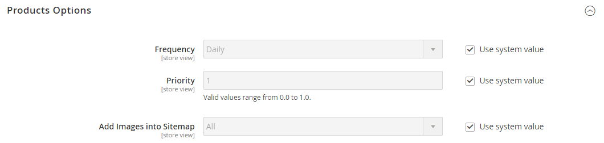

# [!UICONTROL Catalog] > [!UICONTROL XML Sitemap]

{{config}}

## [!UICONTROL Categories Options]

<!-- zoom -->

<!-- [Categories Options](https://experienceleague.adobe.com/en/docs/commerce-admin/marketing/seo/sitemap-xml) -->

| Champ | [Portée](../../getting-started/websites-stores-views.md#scope-settings) | Description |
|--- |--- |--- |
| [!UICONTROL Frequency] | Affichage de la boutique | Détermine la fréquence de mise à jour des catégories de plan de site. Options : `Always` / `Hourly` / `Daily` / `Weekly` / `Monthly` / `Yearly` / `Never` |
| [!UICONTROL Priority] | Affichage de la boutique | Valeur comprise entre `0.0` et `1.0` qui détermine la priorité des mises à jour du plan de site des catégories par rapport aux autres contenus. Zéro (`0.0`) a la priorité la plus faible. |

{style="table-layout:auto"}

## [!UICONTROL Products Options]

<!-- zoom -->

<!-- [Products Options](https://experienceleague.adobe.com/en/docs/commerce-admin/marketing/seo/sitemap-xml) -->

| Champ | [Portée](../../getting-started/websites-stores-views.md#scope-settings) | Description |
|--- |--- |--- |
| [!UICONTROL Frequency] | Affichage de la boutique | Détermine la fréquence de mise à jour des produits du plan de site. Options : `Always` / `Hourly` / `Daily` / `Weekly` / `Monthly` / `Yearly` / `Never` |
| [!UICONTROL Priority] | Affichage de la boutique | Valeur comprise entre `0.0` et `1.0` qui détermine la priorité des mises à jour du plan du site du produit par rapport aux autres contenus. Zéro (`0.0`) a la priorité la plus faible. |
| [!UICONTROL Add Images into Sitemap] | Affichage de la boutique | Détermine la mesure dans laquelle les images sont incluses dans le plan du site. Options : `None` / `Base Only` / `All` |

{style="table-layout:auto"}

## [!UICONTROL CMS Pages Options]

<!-- zoom -->

<!-- [CMS Pages Options](https://experienceleague.adobe.com/en/docs/commerce-admin/marketing/seo/sitemap-xml) -->

| Champ | [Portée](../../getting-started/websites-stores-views.md#scope-settings) | Description |
|--- |--- |--- |
| [!UICONTROL Frequency] | Affichage de la boutique | Détermine la fréquence de mise à jour des pages CMS du plan du site. Options : `Always` / `Hourly` / `Daily` / `Weekly` / `Monthly` / `Yearly` / `Never` |
| [!UICONTROL Priority] | Affichage de la boutique | Valeur comprise entre `0.0` et `1.0` qui détermine la priorité des mises à jour du plan de site de la page CMS par rapport aux autres contenus. Zéro (`0.0`) a la priorité la plus faible. |

{style="table-layout:auto"}

## [!UICONTROL Store Url Options]

| Champ | [Portée](../../getting-started/websites-stores-views.md#scope-settings) | Description |
|--- |--- |--- |
| [!UICONTROL Frequency] | Affichage de la boutique | Détermine la fréquence de mise à jour des URL des magasins. Options : `Always` / `Hourly` / `Daily` / `Weekly` / `Monthly` / `Yearly` / `Never` |
| [!UICONTROL Priority] | Affichage de la boutique | Valeur comprise entre `0.0` et `1.0` qui détermine la priorité des mises à jour des URL de boutique par rapport à d’autres contenus. Zéro (`0.0`) a la priorité la plus faible. |

{style="table-layout:auto"}

## [!UICONTROL Generation Settings]

<!-- zoom -->

<!-- [Generation Settings](https://experienceleague.adobe.com/en/docs/commerce-admin/marketing/seo/sitemap-xml) -->

| Champ | [Portée](../../getting-started/websites-stores-views.md#scope-settings) | Description |
|--- |--- |--- |
| [!UICONTROL Enabled] | Affichage de la boutique | Détermine si un plan de site XML est disponible pour le magasin. Options : `Yes` / `No` |
| [!UICONTROL Generation Method] | Affichage de la boutique | Détermine comment le plan de site XML est généré. `Standard` utilise le processus de génération synchrone traditionnel et traite toutes les données en mémoire, tandis que `Batch` utilise un mode batch asynchrone optimisé en mémoire pour une plus grande flexibilité et évolutivité. Cette option est disponible à partir de la version 2.4.9. Options : `Standard` / `Batch` |
| [!UICONTROL Start Time] | Affichage de la boutique | Indique l’heure, la minute et la seconde de la journée où le plan de site est mis à jour. |
| [!UICONTROL Frequency] | Affichage de la boutique | Détermine la fréquence de mise à jour du plan du site. Options : `Daily` / `Weekly` / `Monthly` |
| [!UICONTROL Error Email Recipient] | Affichage de la boutique | Adresse e-mail de la personne qui reçoit la notification en cas d’erreur lors du processus de mise à jour du plan de site. Pour plusieurs adresses, séparez-les par une virgule. |
| [!UICONTROL Error Email Sender] | Site internet | Identifie le contact du magasin qui apparaît comme l’expéditeur de la notification d’erreur. Options : `General Contact` / `Sales Representative` / `Customer Support` / `Custom Email 1` / `Custom Email 2` |
| [!UICONTROL Error Email Template] | Site internet | Identifie le modèle d’e-mail utilisé pour la notification d’erreur. Modèle par défaut : `Sitemap generate Warnings` |

{style="table-layout:auto"}

## [!UICONTROL Sitemap File Limits]

<!-- zoom -->

<!-- [Sitemap File Limits](https://experienceleague.adobe.com/en/docs/commerce-admin/marketing/seo/sitemap-xml) -->

| Champ | [Portée](../../getting-started/websites-stores-views.md#scope-settings) | Description |
|--- |--- |--- |
| [!UICONTROL Maximum No of URLs Per File] | Affichage de la boutique | Détermine le nombre maximal d’URL qui peuvent être incluses dans un seul plan de site. |
| [!UICONTROL Maximum File Size] | Affichage de la boutique | Détermine la taille maximale du plan de site généré, en octets. |

{style="table-layout:auto"}

## [!UICONTROL Search Engine Submission Settings]

<!-- zoom -->

<!-- [Search Engine Submission Settings](https://experienceleague.adobe.com/en/docs/commerce-admin/marketing/seo/sitemap-xml) -->

| Champ | [Portée](../../getting-started/websites-stores-views.md#scope-settings) | Description |
|--- |--- |--- |
| [!UICONTROL Enable Submission to Robots.txt] | Affichage de la boutique | Permet l&#39;envoi de directives pour le fichier robots.txt. Options : `Yes` / `No` |

{style="table-layout:auto"}
