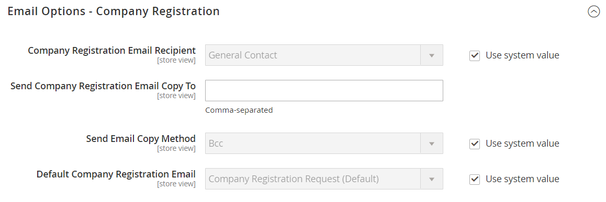

# [!UICONTROL Customers] > [!UICONTROL Company Configuration]

{{b2b-feature}}

{{config}}

>[!TIP]
>
>Avec l’installation et l’activation d’Adobe Commerce B2B, l’expérience d’achat peut être personnalisée avec des fonctionnalités spécifiques à l’entreprise. Adobe Commerce B2B est une solution intégrée qui prend en charge les modèles B2B et B2C. Pour plus d’informations sur les fonctionnalités B2B, consultez le [Guide de l’utilisateur d’Adobe Commerce B2B](https://experienceleague.adobe.com/docs/commerce-admin/b2b/introduction.html?lang=fr).

>[!NOTE]
>
>L’accès à ces options de configuration pour les fonctionnalités B2B est contrôlé par les [ressources de rôle](../../systems/permissions-user-roles.md#role-resources). Ces ressources de rôle doivent être définies pour le rôle utilisateur attribué à l’utilisateur administrateur.

Pour plus d’informations sur la configuration de ces paramètres, voir [Activation des fonctionnalités B2B de base](../../b2b/enable-basic-features.md) dans le _Guide de l’utilisateur d’Adobe Commerce B2B_.

## [!UICONTROL General]

<!-- zoom -->

| Champ | [Portée](../../getting-started/websites-stores-views.md#scope-settings) | Description |
|--- |--- |--- |
| [!UICONTROL Allow Company Registration from the Storefront] | Site Web | Détermine si les visiteurs de votre magasin ont le choix de [enregistrer](../../customers/customer-sign-in.md) pour un compte de société ou un compte individuel. Options : `Yes` / `No` |

{style="table-layout:auto"}

## [!UICONTROL Email Options - Company Registration]

<!-- zoom -->

| Champ | [Portée](../../getting-started/websites-stores-views.md#scope-settings) | Description |
|--- |--- |--- |
| [!UICONTROL Company Registration Email Recipient] | Affichage en magasin | Contact de magasin qui est averti lorsqu’une demande d’enregistrement d’entreprise est envoyée depuis le storefront. Options : `General Contact` / `Sales Representative` / `Customer Support` / `Custom Email 1` / `Custom Email 2` |
| [!UICONTROL Send Company Registration Email Copy To] | Affichage en magasin | Adresse électronique de chaque personne devant recevoir une copie de la notification d’enregistrement. Séparez plusieurs adresses électroniques par une virgule. |
| [!UICONTROL Send Email Copy Method] | Affichage en magasin | Méthode d’e-mail utilisée pour envoyer la copie de l’e-mail d’enregistrement. Options : `Bcc` / `Separate Email` |
| [!UICONTROL Default Company Registration Email] | Affichage en magasin | Modèle de courrier électronique utilisé par défaut pour la notification d’enregistrement de la société. Modèle par défaut : `Company Registration Request` |

{style="table-layout:auto"}

## [!UICONTROL Customer-Related Emails]

<!-- zoom -->

| Champ | [Portée](../../getting-started/websites-stores-views.md#scope-settings) | Description |
|--- |--- |--- |
| [!UICONTROL Default 'Sales Rep Assigned' Email] | Affichage en magasin | Modèle de courrier électronique utilisé par défaut lorsqu’un représentant commercial est affecté à un compte d’entreprise. Cet email est envoyé au représentant commercial et à l’administrateur de la société. Modèle par défaut : `Sales Representative Assigned to Company` |
| [!UICONTROL Default 'Assign Company to Customer' Email] | Affichage en magasin | Modèle de courrier électronique utilisé par défaut lorsqu’un compte client individuel est affecté à un compte de société. Cet email est envoyé au client uniquement. Modèle par défaut : `Assign Company to Customer` |
| [!UICONTROL Default 'Assign Company Admin' Email] | Affichage en magasin | Modèle de courrier électronique utilisé lorsqu’un administrateur de société est affecté à une société. Cet email est envoyé au représentant commercial et à l’administrateur de la société. Modèle par défaut : `Assign Company Admin` |
| [!UICONTROL Default 'Company Admin Inactive' Email] | Affichage en magasin | Le modèle d’email utilisé par défaut lorsque le statut de la personne qui sert en tant qu’administrateur de la société est défini sur &quot;Inactif&quot;. Le système envoie une notification par courrier électronique de la modification aux nouveaux administrateurs et aux anciens administrateurs de l’entreprise. Modèle par défaut : `Company Admin Set Inactive` |
| [!UICONTROL Default 'Company Admin Changed to Member' Email] | Affichage en magasin | Modèle de courrier électronique utilisé par défaut lorsque l’ancien administrateur de la société devient membre de la société. Le courrier électronique est envoyé uniquement au membre de la société. Modèle par défaut : `Company Admin Changed to Member` |
| [!UICONTROL Default 'Customer Status Active' Email] | Affichage en magasin | Modèle de courrier électronique utilisé par défaut lorsque le statut d’un client devient actif. Cet email est envoyé au client uniquement. Modèle par défaut : `Customer Status Active` |
| [!UICONTROL Default 'Customer Status Inactive' Email] | Affichage en magasin | Modèle de courrier électronique utilisé par défaut lorsque l’état d’un client devient inactif. Cet email est envoyé au client uniquement. Modèle par défaut : `Customer Status Inactive` |

{style="table-layout:auto"}

## [!UICONTROL Company Status Change]

<!-- zoom -->

| Champ | [Portée](../../getting-started/websites-stores-views.md#scope-settings) | Description |
|--- |--- |--- |
| [!UICONTROL Company Status Change Email Recipient] | Affichage en magasin | Contact de magasin qui est informé chaque fois que l’état d’une entreprise change. Options : `General Contact` / `Sales Representative` / `Customer Support` / `Custom Email 1` / `Custom Email 2` |
| [!UICONTROL Send Company Status Change Email Copy To] | Affichage en magasin | Adresse électronique de chaque personne devant recevoir une copie de la notification de changement de statut de l’entreprise. Séparez plusieurs adresses électroniques par une virgule. |
| [!UICONTROL Send Email Copy Method] | Affichage en magasin | Méthode de courrier électronique utilisée pour envoyer la copie de la notification de changement d’état. Options : `Bcc` / `Separate Email` |
| [!UICONTROL Default "Company Status Change to Active 1' Email] | Affichage en magasin | Le modèle de courrier électronique utilisé lorsque l’état d’une entreprise passe de _Autorisation en attente_ à _Actif_. Modèle par défaut : `Company Status Active 1` |
| [!UICONTROL Default 'Company Status Change to Active 2' Email] | Affichage en magasin | Le modèle de courrier électronique utilisé par défaut lorsque l’état d’une société passe de _Rejected_ ou _Blocked_ à _Active_. Modèle par défaut : `Company Status Active 2` |
| [!UICONTROL Default 'Company Status Change to Rejected' Email] | Affichage en magasin | Le modèle de courrier électronique utilisé par défaut lorsque l’état d’une entreprise passe à _Refusé_. Modèle par défaut : `Company Status Rejected` |
| [!UICONTROL Default 'Company Status Change to Blocked' Email] | Affichage en magasin | Le modèle de courrier électronique utilisé par défaut lorsque l’état d’une entreprise passe à _Blocked_. Modèle par défaut : `Company Status Blocked` |
| [!UICONTROL Default 'Company Status Change to Pending Approval' Email] | Affichage en magasin | Le modèle de courrier électronique utilisé par défaut lorsque le statut d’une entreprise passe à _Autorisation en attente_. Modèle par défaut : `Company Status Pending Approval` |

{style="table-layout:auto"}

## [!UICONTROL Company Credit]

<!-- zoom -->

| Champ | [Portée](../../getting-started/websites-stores-views.md#scope-settings) | Description |
|--- |--- |--- |
| [!UICONTROL Company Credit Change Email Sender] | Affichage en magasin | Le contact du magasin qui est averti lorsqu’il y a une modification du crédit d’une entreprise. Options : `General Contact` / `Sales Representative` / `Customer Support` / `Custom Email 1` / `Custom Email 2` |
| [!UICONTROL Send Company Credit Change Email Copy To] | Affichage en magasin | Adresse électronique de chaque personne qui doit recevoir une copie de la notification de changement de crédit de la société. Séparez plusieurs adresses électroniques par une virgule. |
| [!UICONTROL Send Email Copy Method] | Affichage en magasin | Méthode de courrier électronique utilisée pour envoyer la copie de la notification de changement de crédit. Options : `Bcc` / `Separate Email` |
| [!UICONTROL Allocated Email Template] | Affichage en magasin | Modèle de courrier électronique utilisé par défaut lors de l’allocation du crédit de l’entreprise. Cet email est envoyé à l’administrateur de la société. Modèle par défaut : `Credit Limit Allocated` |
| [!UICONTROL Updated Email Template] | Affichage en magasin | Modèle d’email utilisé par défaut lors de la mise à jour de la limite de crédit d’une société. Cet email est envoyé à l’administrateur de la société. Modèle par défaut : `Credit Limit Updated` |
| [!UICONTROL Reimbursed Email Template] | Affichage en magasin | Le modèle d’email utilisé par défaut lorsqu’un [remboursement](../../b2b/credit-company.md#apply-a-payment-to-a-company-account) est porté au crédit de l’entreprise. Cet email est envoyé à l’administrateur de la société. Modèle par défaut : `Credit Reimbursed` |
| [!UICONTROL Refunded Email Template] | Affichage en magasin | Le modèle d’email utilisé par défaut lorsqu’un montant issu d’une commande est remboursé au crédit de la société. Cet email est envoyé à l’administrateur de la société. Modèle par défaut : `Order Refunded to Company Credit` |
| [!UICONTROL Reverted Email Template] | Affichage en magasin | Modèle de courrier électronique utilisé par défaut lorsqu’une commande est restaurée au crédit de l’entreprise. Cet email est envoyé à l’administrateur de la société. Modèle par défaut : `Order Reverted to Company Credit` |

{style="table-layout:auto"}
