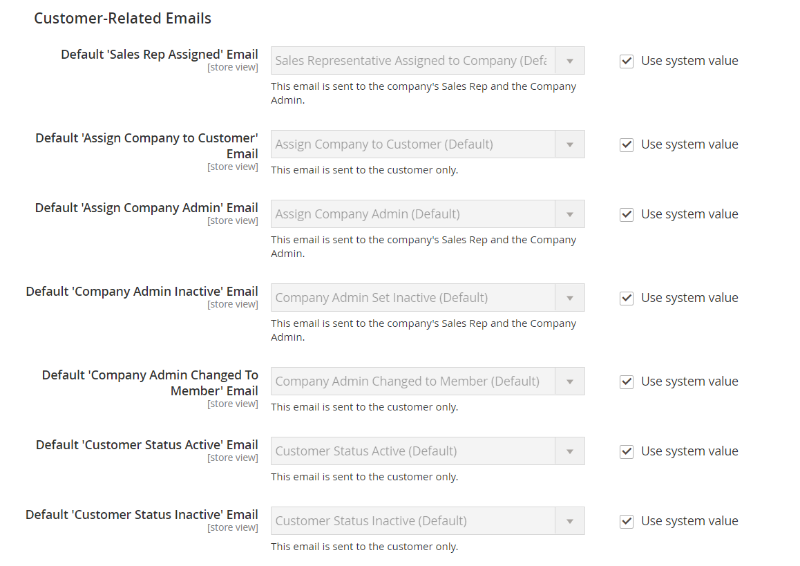
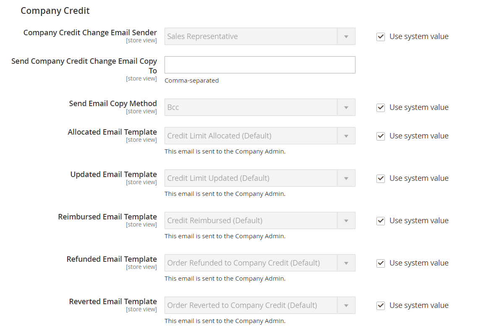

# [!UICONTROL Customers] > [!UICONTROL Company Configuration]

{{b2b-feature}}

{{config}}

>[!TIP]
>
>Avec l’installation et l’activation d’Adobe Commerce B2B, l’expérience d’achat peut être personnalisée avec des fonctionnalités spécifiques à l’entreprise. Adobe Commerce B2B est une solution intégrée qui prend en charge les modèles B2B et B2C. Pour plus d’informations sur les fonctionnalités B2B, consultez le [Guide de l’utilisateur Adobe Commerce B2B](https://experienceleague.adobe.com/docs/commerce-admin/b2b/introduction.html?lang=fr).

>[!NOTE]
>
>L’accès à ces options de configuration pour les fonctionnalités B2B est contrôlé par les [ressources de rôle](../../systems/permissions-user-roles.md#role-resources). Ces ressources de rôle doivent être définies pour le rôle d’utilisateur affecté à l’utilisateur administrateur.

Pour plus d’informations sur la configuration de ces paramètres, voir [Activation des fonctionnalités B2B de base](../../b2b/enable-basic-features.md) dans le _Guide d’utilisation B2B d’Adobe Commerce_.

## [!UICONTROL General]

<!-- zoom -->

| Champ | [Portée](../../getting-started/websites-stores-views.md#scope-settings) | Description |
|--- |--- |--- |
| [!UICONTROL Allow Company Registration from the Storefront] | Site internet | Détermine si les visiteurs de votre boutique ont le choix de s’[enregistrer](../../customers/customer-sign-in.md) pour un compte d’entreprise ou un compte individuel. Options : `Yes` / `No` |

{style="table-layout:auto"}

## [!UICONTROL Email Options - Company Registration]

<!-- zoom -->

| Champ | [Portée](../../getting-started/websites-stores-views.md#scope-settings) | Description |
|--- |--- |--- |
| [!UICONTROL Company Registration Email Recipient] | Affichage de la boutique | Contact du magasin qui est averti lorsqu’une demande d’enregistrement d’entreprise est envoyée depuis le storefront. Options : `General Contact` / `Sales Representative` / `Customer Support` / `Custom Email 1` / `Custom Email 2` |
| [!UICONTROL Send Company Registration Email Copy To] | Affichage de la boutique | Adresse e-mail de chaque personne devant recevoir une copie de la notification d’enregistrement. Séparez plusieurs adresses e-mail par une virgule. |
| [!UICONTROL Send Email Copy Method] | Affichage de la boutique | Méthode utilisée pour envoyer la copie de l’e-mail d’enregistrement. Options : `Bcc` / `Separate Email` |
| [!UICONTROL Default Company Registration Email] | Affichage de la boutique | Modèle d’e-mail utilisé par défaut pour la notification d’enregistrement de la société. Modèle par défaut : `Company Registration Request` |

{style="table-layout:auto"}

## [!UICONTROL Customer-Related Emails]

<!-- zoom -->

| Champ | [Portée](../../getting-started/websites-stores-views.md#scope-settings) | Description |
|--- |--- |--- |
| [!UICONTROL Default 'Sales Rep Assigned' Email] | Affichage de la boutique | Modèle d’e-mail utilisé par défaut lorsqu’un commercial est affecté à un compte d’entreprise. Cet e-mail est envoyé au représentant commercial et à l’administrateur de la société. Modèle par défaut : `Sales Representative Assigned to Company` |
| [!UICONTROL Default 'Assign Company to Customer' Email] | Affichage de la boutique | Modèle d’e-mail utilisé par défaut lorsqu’un compte client individuel est affecté à un compte d’entreprise. Cet e-mail est envoyé au client uniquement. Modèle par défaut : `Assign Company to Customer` |
| [!UICONTROL Default 'Assign Company Admin' Email] | Affichage de la boutique | Modèle d’e-mail utilisé lorsqu’un administrateur d’entreprise est affecté à une entreprise. Cet e-mail est envoyé au représentant commercial et à l’administrateur de la société. Modèle par défaut : `Assign Company Admin` |
| [!UICONTROL Default 'Company Admin Inactive' Email] | Affichage de la boutique | Modèle d’e-mail utilisé par défaut lorsque le statut de la personne qui agit en tant qu’administrateur de l’entreprise est remplacé par « Inactif ». Le système envoie une notification par e-mail de la modification aux nouveaux et anciens administrateurs de l’entreprise. Modèle par défaut : `Company Admin Set Inactive` |
| [!UICONTROL Default 'Company Admin Changed to Member' Email] | Affichage de la boutique | Modèle d’e-mail utilisé par défaut lorsque l’ancien administrateur de la société devient membre de la société. L’e-mail est envoyé au membre de la société uniquement. Modèle par défaut : `Company Admin Changed to Member` |
| [!UICONTROL Default 'Customer Status Active' Email] | Affichage de la boutique | Modèle d’e-mail utilisé par défaut lorsque le statut d’un client ou d’une cliente devient actif. Cet e-mail est envoyé au client uniquement. Modèle par défaut : `Customer Status Active` |
| [!UICONTROL Default 'Customer Status Inactive' Email] | Affichage de la boutique | Modèle d’e-mail utilisé par défaut lorsque le statut d’un client ou d’une cliente devient inactif. Cet e-mail est envoyé au client uniquement. Modèle par défaut : `Customer Status Inactive` |

{style="table-layout:auto"}

## [!UICONTROL Company Status Change]

<!-- zoom -->

| Champ | [Portée](../../getting-started/websites-stores-views.md#scope-settings) | Description |
|--- |--- |--- |
| [!UICONTROL Company Status Change Email Recipient] | Affichage de la boutique | Contact de magasin qui est averti lorsque le statut d’une société change. Options : `General Contact` / `Sales Representative` / `Customer Support` / `Custom Email 1` / `Custom Email 2` |
| [!UICONTROL Send Company Status Change Email Copy To] | Affichage de la boutique | Adresse e-mail de chaque personne devant recevoir une copie de la notification de changement de statut de la société. Séparez plusieurs adresses e-mail par une virgule. |
| [!UICONTROL Send Email Copy Method] | Affichage de la boutique | Méthode utilisée par e-mail pour envoyer la copie de la notification de changement de statut. Options : `Bcc` / `Separate Email` |
| [!UICONTROL Default "Company Status Change to Active 1' Email] | Affichage de la boutique | Modèle d’e-mail utilisé lorsque le statut d’une entreprise passe de _En attente d’approbation_ à _Actif_. Modèle par défaut : `Company Status Active 1` |
| [!UICONTROL Default 'Company Status Change to Active 2' Email] | Affichage de la boutique | Modèle d’e-mail utilisé par défaut lorsque le statut d’une entreprise passe de _Refusé_ ou _Bloqué_ à _Actif_. Modèle par défaut : `Company Status Active 2` |
| [!UICONTROL Default 'Company Status Change to Rejected' Email] | Affichage de la boutique | Modèle d’e-mail utilisé par défaut lorsque le statut d’une entreprise passe à _Refusé_. Modèle par défaut : `Company Status Rejected` |
| [!UICONTROL Default 'Company Status Change to Blocked' Email] | Affichage de la boutique | Modèle d’e-mail utilisé par défaut lorsque le statut d’une entreprise passe à _Bloqué_. Modèle par défaut : `Company Status Blocked` |
| [!UICONTROL Default 'Company Status Change to Pending Approval' Email] | Affichage de la boutique | Modèle d’e-mail utilisé par défaut lorsque le statut d’une entreprise passe à _Approbation en attente_. Modèle par défaut : `Company Status Pending Approval` |

{style="table-layout:auto"}

## [!UICONTROL Company Credit]

<!-- zoom -->

| Champ | [Portée](../../getting-started/websites-stores-views.md#scope-settings) | Description |
|--- |--- |--- |
| [!UICONTROL Company Credit Change Email Sender] | Affichage de la boutique | Contact du magasin qui est averti en cas de modification du crédit d’une société. Options : `General Contact` / `Sales Representative` / `Customer Support` / `Custom Email 1` / `Custom Email 2` |
| [!UICONTROL Send Company Credit Change Email Copy To] | Affichage de la boutique | Adresse e-mail de chaque personne devant recevoir une copie de la notification de modification du crédit de la société. Séparez plusieurs adresses e-mail par une virgule. |
| [!UICONTROL Send Email Copy Method] | Affichage de la boutique | Méthode d’e-mail utilisée pour envoyer la copie de la notification de modification de crédit. Options : `Bcc` / `Separate Email` |
| [!UICONTROL Allocated Email Template] | Affichage de la boutique | Modèle d’e-mail utilisé par défaut lors de l’affectation du crédit d’entreprise. Cet e-mail est envoyé à l’administrateur de la société. Modèle par défaut : `Credit Limit Allocated` |
| [!UICONTROL Updated Email Template] | Affichage de la boutique | Modèle d’e-mail utilisé par défaut lorsque la limite de crédit d’une entreprise est mise à jour. Cet e-mail est envoyé à l’administrateur de la société. Modèle par défaut : `Credit Limit Updated` |
| [!UICONTROL Reimbursed Email Template] | Affichage de la boutique | Modèle d’e-mail utilisé par défaut lorsqu’un [remboursement](../../b2b/credit-company.md#apply-a-payment-to-a-company-account) est effectué au crédit de l’entreprise. Cet e-mail est envoyé à l’administrateur de la société. Modèle par défaut : `Credit Reimbursed` |
| [!UICONTROL Refunded Email Template] | Affichage de la boutique | Modèle d’e-mail utilisé par défaut lorsqu’un montant provenant d’une commande est remboursé au crédit de la société. Cet e-mail est envoyé à l’administrateur de la société. Modèle par défaut : `Order Refunded to Company Credit` |
| [!UICONTROL Reverted Email Template] | Affichage de la boutique | Modèle d’e-mail utilisé par défaut lorsqu’une commande est rétablie en crédit d’entreprise. Cet e-mail est envoyé à l’administrateur de la société. Modèle par défaut : `Order Reverted to Company Credit` |

{style="table-layout:auto"}
