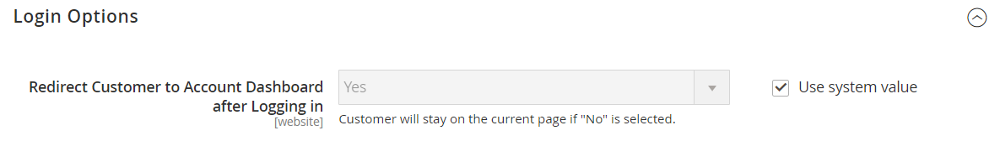

# [!UICONTROL Customers]  > [!UICONTROL Customer Configuration]

{{config}}

## [!UICONTROL Account Sharing Options]

<!-- zoom -->

<!-- [Account Sharing Options](https://docs.magento.com/user-guide/customers/account-scope.html) -->

| Champ | [Portée](../../getting-started/websites-stores-views.md#scope-settings) | Description |
|--- |--- |--- |
| [!UICONTROL Share Customer Accounts] | Global | Détermine la portée des comptes clients dans la hiérarchie du magasin. Options :  **`Global`**- Les informations de compte client sont partagées avec chaque site web et magasin de l’installation Commerce. **`Per Website`** - Les informations sur le compte client sont limitées au site web sur lequel le compte a été créé. |

{style="table-layout:auto"}

## [!UICONTROL Online Customers Options]

<!-- zoom -->

<!-- [Online Customers Options](https://docs.magento.com/user-guide/customers/now-online.html) -->

| Champ | [Portée](../../getting-started/websites-stores-views.md#scope-settings) | Description |
|--- |--- |--- |
| [!UICONTROL Online Minutes Interval] | Global | Détermine la durée pendant laquelle l’activité en ligne d’un client est accessible à partir de l’administrateur. Laissez vide pour un intervalle par défaut de 15 minutes. |
| [!UICONTROL Customer Data Lifetime] | Global | Détermine le nombre de minutes avant l&#39;expiration des données non enregistrées saisies par le client. Par défaut, les données non enregistrées expirent au bout de 60 minutes. |

{style="table-layout:auto"}

## [!UICONTROL Create New Account Options]

<!-- zoom -->

<!-- zoom -->

<!-- [Create New Account Options (VAT Fields)](https://docs.magento.com/user-guide/customers/customer-account-configuration.html) -->

| Champ | [Portée](../../getting-started/websites-stores-views.md#scope-settings) | Description |
|--- |--- |--- |
| [!UICONTROL Enable Automatic Assignment to Customer Group] | Affichage de la boutique | Détermine si les clients sont automatiquement affectés au groupe de clients par défaut. Pour afficher le numéro de TVA dans le magasin, définissez Afficher le numéro de TVA dans le storefront, sélectionnez `Yes`. Options :  **`Yes`**- Le système ne valide pas automatiquement les ID TVA client et ne modifie pas les groupes de clients. **`No`** - Le comportement du système est normal et le groupe de clients par défaut peut être défini dans le champ Groupe par défaut. |
| [!UICONTROL Default Group] | Affichage de la boutique | Identifie le groupe de clients initial affecté lors de la création d’un compte. |
| [!UICONTROL Default Value for Disable Automatic Group Changes Based on VAT ID] | Global | (Disponible uniquement si l’étendue de la configuration actuelle est définie sur `Default Group`.) Choisissez si le changement automatique de groupe de clients basé sur l&#39;ID TVA est activé ou désactivé par défaut. Le paramètre peut être remplacé au niveau du produit. Le paramètre influence le comportement du système dans les situations suivantes :   - Identifiant TVA de l&#39;adresse par défaut du client ou de l&#39;ensemble des modifications d&#39;adresse par défaut.   - La modification du groupe de clients a été émulée pendant le passage en caisse pour un client enregistré qui n’avait pas d’adresse enregistrée précédemment ou pour un client enregistré pendant le passage en caisse.  Si la modification automatique de groupe est activée, alors dans le premier cas, le groupe de clients change automatiquement, et dans le second cas, le groupe de clients temporairement émulé est affecté au client. Si la modification automatique de groupe est désactivée, le groupe de clients affecté ne change jamais, sauf si un administrateur le modifie manuellement. |
| [!UICONTROL Show VAT Number on Storefront] | Site internet | Détermine si le numéro de TVA est visible pour les clients du magasin. Options : `Yes` / `No`   Affecte uniquement les comptes clients non B2B standard. Les comptes société possèdent leur propre champ de numéro de TVA distinct. |
| [!UICONTROL Default Email Domain] | Affichage de la boutique | Identifie le domaine d’e-mail par défaut du magasin. Par exemple : `mystore.com` |
| [!UICONTROL Default Welcome Email] | Affichage de la boutique | Identifie le modèle d’e-mail utilisé par défaut _Bienvenue_ e-mail. |
| [!UICONTROL Default Welcome Email Without Password] | Affichage de la boutique | Autre modèle d’e-mail de bienvenue utilisé pour les nouveaux comptes client créés par l’administrateur qui n’ont pas encore de mot de passe attribué. |
| [!UICONTROL Email Sender] | Affichage de la boutique | Identifie le contact du magasin qui apparaît comme l’expéditeur de l’e-mail de bienvenue. |
| [!UICONTROL Require Emails Confirmation] | Site internet | Détermine si une demande de création de compte nécessite une confirmation de la part du client. Options : `Yes` / `No`.    _**Remarque :**_ À partir de la version 2.4.7, les clients doivent saisir à nouveau leur adresse e-mail et leur mot de passe pour se connecter à leur compte après confirmation par e-mail, quel que soit le navigateur. |
| [!UICONTROL Confirmation Link Email] | Affichage de la boutique | Identifie le modèle d’e-mail utilisé pour l’e-mail de confirmation. Modèle par défaut : `New account confirmation key` |
| [!UICONTROL Welcome Email] | Affichage de la boutique | Identifie le modèle d’e-mail utilisé pour le message de bienvenue envoyé une fois le compte confirmé. |
| [!UICONTROL Generate Human-Friendly Customer ID] | Global | Détermine si le champ utilisé pour saisir et stocker le numéro de TVA est visible depuis le storefront. Options : `Yes` / `No` |

{style="table-layout:auto"}

## [!UICONTROL Password Options]

<!-- zoom -->

<!-- [Password Options](https://docs.magento.com/user-guide/customers/password-options.html) -->

| Champ | [Portée](../../getting-started/websites-stores-views.md#scope-settings) | Description |
|--- |--- |--- |
| [!UICONTROL Password Reset Protection Type] | Affichage de la boutique | Détermine la méthode utilisée pour réinitialiser un mot de passe de compte client. Options :  **`By IP and Email`**- Le mot de passe peut être réinitialisé en ligne après réception d’une réponse d’une notification de réinitialisation envoyée à l’adresse e-mail associée au compte administrateur. **`By IP`** - Le mot de passe peut être réinitialisé en ligne.  **`By Email`**- Le mot de passe peut être réinitialisé en répondant à une notification envoyée par e-mail à l’adresse e-mail associée au compte administrateur. **`None`** - Seul l&#39;administrateur du magasin peut réinitialiser le mot de passe. |
| [!UICONTROL Max Number of Password Reset Requests] | Affichage de la boutique | Limite le nombre de demandes de réinitialisation de mot de passe par heure. Pour un nombre illimité de requêtes, saisissez zéro (0). |
| [!UICONTROL Min Time Between Password Reset Requests] | Affichage de la boutique | Détermine le nombre de minutes entre les demandes de réinitialisation de mot de passe. Pour qu&#39;il n&#39;y ait aucun délai entre les demandes, entrez zéro (0). |
| [!UICONTROL Forgot Email Template] | Affichage de la boutique | Identifie le modèle d’e-mail utilisé lorsque les clients oublient leurs mots de passe. Modèle par défaut : `Forgot Password` |
| [!UICONTROL Remind Email Template] | Affichage de la boutique | Identifie le modèle d’e-mail utilisé lorsque les clients reçoivent un rappel ou un conseil de mot de passe. Modèle par défaut : `Remind Password` |
| [!UICONTROL Reset Password Template] | Affichage de la boutique | Détermine le modèle d’e-mail utilisé lorsque les clients réinitialisent leurs mots de passe. |
| [!UICONTROL Password Template Email Sender] | Affichage de la boutique | Détermine le contact du magasin qui apparaît comme l&#39;expéditeur des e-mails liés au mot de passe. |
| [!UICONTROL Recovery Link Expiration Period (hours)] | Global | Indique le nombre d’heures avant l’expiration d’un lien de récupération de mot de passe. |
| [!UICONTROL Enable Autocomplete on login/forgot password forms] | Site internet | Détermine si la saisie automatique est activée sur les formulaires de mot de passe de connexion/oublié. Options : `Yes` / `No` |
| [!UICONTROL Number of Required Character Classes] | Global | Détermine le nombre de classes de caractères différentes (minuscules, majuscules, chiffres et caractères spéciaux) qui doivent être incluses dans un mot de passe. |
| [!UICONTROL Maximum Login Failures to Lockout Account] | Global | Détermine le nombre de tentatives de connexion ayant échoué jusqu&#39;à ce que le compte client soit verrouillé. Pour un nombre illimité de tentatives, saisissez zéro (`0`). |
| [!UICONTROL Minimum Password Length] | Global | Détermine le nombre minimum de caractères autorisés dans un mot de passe. Le nombre doit être supérieur à zéro (`0`). |
| [!UICONTROL Lockout Time (minutes)] | Global | Détermine le nombre de minutes pendant lesquelles un compte client est verrouillé après un trop grand nombre d&#39;échecs de tentatives de connexion. |

{style="table-layout:auto"}

## [!UICONTROL Account Information Options]

<!-- zoom -->

| Champ | [Portée](../../getting-started/websites-stores-views.md#scope-settings) | Description |
|--- |--- |--- |
| [!UICONTROL Change Email Template] | Affichage de la boutique | Identifie le modèle d’e-mail par défaut utilisé lorsqu’un client modifie son adresse e-mail. |
| [!UICONTROL Change Email and Password Template] | Affichage de la boutique | Identifie le modèle d’e-mail par défaut utilisé lorsqu’un client ou une cliente modifie son adresse e-mail et son mot de passe. |

{style="table-layout:auto"}

## [!UICONTROL Name and Address Options]

### Options du Magento Open Source

{{ce-feature}}

<!-- zoom -->

<!-- [Name and Address Options - Open Source](https://docs.magento.com/user-guide/customers/name-address-options.html) -->

| Champ | [Portée](../../getting-started/websites-stores-views.md#scope-settings) | Description |
|--- |--- |--- |
| [!UICONTROL Number of Lines in a Street Address] | Site internet | Détermine le nombre de lignes de l&#39;adresse postale. L’adresse postale se compose de : `1` vers `4` lignes. Si le champ est vide, adresse postale par défaut de trois (`3`) est utilisée. |
| [!UICONTROL Show Prefix] | Site internet | Détermine si le nom du client comprend un préfixe au début, tel que les options M. et Mme : `No` / `Optional` / `Required` |
| [!UICONTROL Prefix Dropdown Options] | Site internet | Définit la liste des options de préfixe. Séparez les valeurs par un point-virgule. Placez un point-virgule avant la première valeur pour afficher une valeur vide en haut de la liste. |
| [!UICONTROL Show Middle Name (initial)] | Site internet | Détermine si l’initiale du deuxième prénom est incluse dans le nom du client. S’il est utilisé, l’initial du deuxième préfixe est un champ facultatif. Options : `Yes` / `No` |
| [!UICONTROL Show Suffix] | Site internet | Détermine si le nom du client comprend un suffixe à la fin, tel que Jr., Sr. et III. Options : `No` / `Optional` / `Required` |
| [!UICONTROL Suffix Dropdown Options] | Site internet | Définit la liste des options de suffixe. Séparez les valeurs par un point-virgule. Placez un point-virgule avant la première valeur pour afficher une valeur vide en haut de la liste. |
| [!UICONTROL Show Date of Birth] | Site internet | Détermine si la date de naissance du client est incluse dans le formulaire Nom et adresse. Options : `No` / `Optional` / `Required`    **_Important :_**Dans le respect des bonnes pratiques actuelles en matière de sécurité et de confidentialité, gardez à l&#39;esprit les risques juridiques et de sécurité potentiels associés au stockage de la date de naissance complète du client (mois, jour, année) avec d&#39;autres identifiants personnels. Il est recommandé de limiter le stockage des dates de naissance complètes des clientes et clients et de suggérer d’utiliser leur année de naissance comme alternative. |
| [!UICONTROL Show Tax/VAT Number] | Site internet | Détermine si la taxe ou [Numéro de TVA](../../stores-purchase/vat.md) est inclus dans le formulaire de nom et d’adresse. Options : `No` / `Optional` / `Required` |
| [!UICONTROL Show Gender] | Site internet | Détermine si le genre est inclus dans le formulaire de nom et d&#39;adresse. Options : `No` / `Optional` / `Required` |
| [!UICONTROL Show Telephone] | Site internet | Détermine si le numéro de téléphone du client est inclus dans le formulaire de nom et d&#39;adresse. Options : `No` / `Optional` / `Required` |
| [!UICONTROL Show Company] | Site internet | Détermine si la société du client est incluse dans le formulaire Nom et adresse. Options : `No` / `Optional` / `Required` |
| [!UICONTROL Show Fax] | Site internet | Détermine si le numéro de télécopie du client est inclus dans le formulaire Nom et adresse. Options : `No` / `Optional` / `Required` |

{style="table-layout:auto"}

### Options d’Adobe Commerce

{{ee-feature}}

<!-- zoom -->

<!-- [Name and Address Options - Commerce](https://docs.magento.com/user-guide/customers/name-address-options.html) -->

| Champ | [Portée](../../getting-started/websites-stores-views.md#scope-settings) | Description |
|--- |--- |--- |
| [!UICONTROL Prefix Dropdown Options] | Site internet | Définit la liste des options de préfixe. Séparez les valeurs par un point-virgule. Placez un point-virgule avant la première valeur pour afficher une valeur vide en haut de la liste. |
| [!UICONTROL Suffix Dropdown Options] | Site internet | Définit la liste des options de suffixe. Séparez les valeurs par un point-virgule. Placez un point-virgule avant la première valeur pour afficher une valeur vide en haut de la liste. |
| [!UICONTROL Show Telephone] | Site internet | Détermine si le numéro de téléphone du client est inclus dans le formulaire de nom et d&#39;adresse. Options : `No` / `Optional` / `Required` |
| [!UICONTROL Show Company] | Site internet | Détermine si la société du client est incluse dans le formulaire Nom et adresse. Options : `No` / `Optional` / `Required` |
| [!UICONTROL Show Fax] | Site internet | Détermine si le numéro de télécopie du client est inclus dans le formulaire Nom et adresse. Options : `No` / `Optional` / `Required` |

{style="table-layout:auto"}

## [!UICONTROL Store Credit Options]

{{ee-feature}}

<!-- zoom -->

<!-- [Store Credit Options](https://docs.magento.com/user-guide/customers/credit-configure.html) -->

| Champ | [Portée](../../getting-started/websites-stores-views.md#scope-settings) | Description |
|--- |--- |--- |
| [!UICONTROL Enable Store Credit Functionality] | Global | Détermine si le crédit de magasin est activé. Sa désactivation supprime le crédit de la boutique des comptes clients et de la page Admin Gérer les clients . Options : `Yes` / `No`. |
| [!UICONTROL Show Store Credit History to Customers] | Site internet | Détermine si l&#39;historique des soldes est visible dans les comptes clients. Options : `Yes` / `No`. |
| [!UICONTROL Refund Store Credit Automatically] | Global | Détermine si le remboursement du magasin est émis automatiquement. Options : `Yes` / `No` |
| [!UICONTROL Store Credit Update Email Sender] | Affichage de la boutique | Détermine l&#39;identité du magasin qui apparaît comme l&#39;expéditeur des notifications de mise à jour de crédit envoyées aux clients. |
| [!UICONTROL Store Credit Update Email Template] | Affichage de la boutique | Détermine le modèle d&#39;e-mail utilisé pour les mises à jour de crédit. |

{style="table-layout:auto"}

## [!UICONTROL Login Options]

<!-- zoom -->

<!-- [Login Options](https://docs.magento.com/user-guide/customers/login-landing-page.html) -->

| Champ | [Portée](../../getting-started/websites-stores-views.md#scope-settings) | Description |
|--- |--- |--- |
| [!UICONTROL Redirect Customer to Account Dashboard after Logging in] | Site internet | Détermine ce qui se passe une fois que les clients se connectent à leurs comptes. Pour rediriger les clients vers le tableau de bord de leur compte, sélectionnez `Yes`. Options :  **`Yes`**- Le tableau de bord du compte s’affiche lorsque les clients se connectent à leur compte. **`No`** - Les clients peuvent continuer à acheter après s’être connectés à leur compte. |

{style="table-layout:auto"}

## [!UICONTROL Address Templates]

<!-- zoom -->

<!-- [Address Templates](https://docs.magento.com/user-guide/customers/address-templates.html) -->

| Modèle | [Portée](../../getting-started/websites-stores-views.md#scope-settings) | Description |
|--- |--- |--- |
| [!UICONTROL Text] | Affichage de la boutique | Le modèle est utilisé pour toutes les adresses imprimées. |
| [!UICONTROL Text One Line] | Affichage de la boutique | Ce modèle définit l’ordre des entités d’adresse dans la liste des carnets d’adresses du panier du client. Progression pendant le passage en caisse. |
| [!UICONTROL HTML] | Affichage de la boutique | Ce modèle définit l’ordre des champs d’adresse situés sous le _Adresses des clients_ dans le Panneau d’administration ([!UICONTROL Customers] > [!UICONTROL Manage Customers]). Cela concerne également les utilisateurs de _Add New Address_ page lorsqu’un client crée une adresse de facturation ou d’expédition sur sa page de compte. |
| [!UICONTROL PDF] | Affichage de la boutique | Le modèle définit l&#39;affichage des adresses de facturation et d&#39;expédition dans les factures imprimées, les livraisons et les avoirs. |

{style="table-layout:auto"}

## [!UICONTROL Customer Segments]

{{ee-feature}}

<!-- zoom -->

<!-- [Customer Segments](https://docs.magento.com/user-guide/marketing/customer-segments.html) -->

| Modèle | [Portée](../../getting-started/websites-stores-views.md#scope-settings) | Description |
|--- |--- |--- |
| [!UICONTROL Enable Customer Segment Functionality] | Global | Détermine si les segments de clients peuvent être utilisés pour créer des promotions ciblées. Options : `Yes` / `No` |
| [!UICONTROL Real-time Check if Customer is Matched by Segment] | Global | Détermine si les segments de clientèle sont validés en temps réel. Options :  **[!UICONTROL Yes]**- Les segments de clients sont validés en temps réel (valeur par défaut). **[!UICONTROL No]** - Les segments clients sont validés par une requête SQL à condition combinée unique. Cela améliore les performances de validation des segments s’il y a de nombreux segments de clients dans le système. Cependant, la validation ne fonctionne pas avec une base de données fractionnée ou en l’absence de clients enregistrés. |

{style="table-layout:auto"}

## [!UICONTROL CAPTCHA]

<!-- zoom -->

<!-- [CAPTCHA](https://docs.magento.com/user-guide/stores/security-captcha.html) -->

| Champ | [Portée](../../getting-started/websites-stores-views.md#scope-settings) | Description |
|--- |--- |--- |
| [!UICONTROL Enable CAPTCHA on Storefront] | Site internet | Active CAPTCHA dans les magasins associés au site Web Commerce. Options : `Yes` / `No` |
| [!UICONTROL Font] | Site internet | Détermine la police utilisée pour afficher le CAPTCHA. Pour ajouter votre propre police, placez le fichier de police dans le même répertoire que votre installation Commerce et ajoutez la déclaration à la `config.xml` fichier à `app/code/Magento/Captcha/etc`. |
| [!UICONTROL Forms] | Site internet | Détermine les formulaires dans lesquels CAPTCHA est utilisé. Options :  `Applying Coupon Code`  `Checkout/Placing Order` `Create user`  `Login`  `Forgot password`  `Contact Us`  `Change password`  `Share Wishlist Form`  `Send to Friend Form`  `Payflow Pro` (voir [correctif de sécurité](https://experienceleague.adobe.com/docs/commerce-knowledge-base/kb/troubleshooting/payments/paypal-payflow-pro-active-carding-activity.html))  `Add Gift Card Code`    `Create company`     _**Remarque :**_ Les formulaires Créer un utilisateur, Mot de passe oublié et Workflow Pro sont toujours activés lorsqu’ils sont sélectionnés. |
| [!UICONTROL Displaying Mode] | Site internet | Détermine le moment où le CAPTCHA s’affiche. Options :  **`Always`**- CAPTCHA est toujours nécessaire pour se connecter. **`After number of attempts to login`** - Cette option s’applique uniquement au formulaire de connexion administrateur. Lorsqu’elle est sélectionnée, la _[!UICONTROL Number of Unsuccessful Attempts to Login]_le champ s’affiche. Saisissez le nombre de tentatives de connexion que vous souhaitez autoriser. Une valeur de `0` (zéro) est similaire au paramètre . [!UICONTROL Displaying Mode] vers `Always`. _**Remarque :**_Pour suivre le nombre de tentatives de connexion infructueuses, chaque tentative de connexion sous une adresse e-mail et à partir d’une adresse IP est comptabilisée. Le nombre maximal de tentatives de connexion autorisées à partir de la même adresse IP est de 1 000. Cette limitation s’applique uniquement lorsque le CAPTCHA est activé. |
| [!UICONTROL Number of Unsuccessful Attempts to Login] | Site internet | Indique le nombre de fois qu’un client ou une cliente peut essayer de se connecter avant que le compte ne soit verrouillé. |
| [!UICONTROL CAPTCHA Timeout (minutes)] | Site internet | Détermine la durée de vie du CAPTCHA actuel. Lorsque le CAPTCHA expire, l’utilisateur ou l’utilisatrice doit recharger la page. |
| [!UICONTROL Number of Symbols] | Site internet | Détermine le nombre de symboles qui apparaissent dans le CAPTCHA, avec un maximum de 8. Vous pouvez également spécifier une plage, par exemple, 5-8. |
| [!UICONTROL Symbols Used in CAPTCHA] | Site internet | Détermine les lettres (a-z et A-Z) et les chiffres (0-9) qui apparaissent dans le CAPTCHA. Symboles difficiles à distinguer des autres symboles, tels que `i`, `l`, ou `1`, ne sont pas inclus dans l’ensemble par défaut de symboles CAPTCHA. |
| [!UICONTROL Case Sensitive] | Site internet | Détermine si les caractères CAPTCHA respectent la casse. Options : `Yes` / `No` |

{style="table-layout:auto"}
