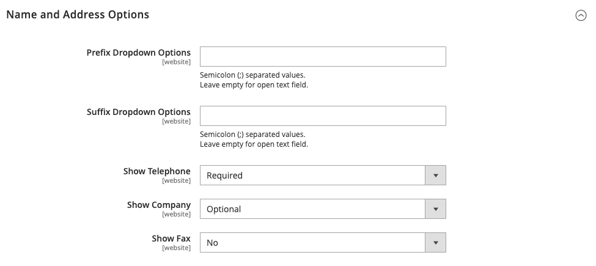

# [!UICONTROL Customers]  > [!UICONTROL Customer Configuration]

{{config}}

## [!UICONTROL Account Sharing Options]

<!-- zoom -->

<!-- [Account Sharing Options](https://docs.magento.com/user-guide/customers/account-scope.html) -->

| Champ | [Portée](../../getting-started/websites-stores-views.md#scope-settings) | Description |
|--- |--- |--- |
| [!UICONTROL Share Customer Accounts] | Global | Détermine la portée des comptes clients dans la hiérarchie de magasin. Options :  **`Global`**- Les informations du compte client sont partagées avec chaque site web et magasin dans l’installation de Commerce. **`Per Website`** - Les informations du compte client sont limitées au site web sur lequel le compte a été créé. |

{:style=&quot;table-layout:auto&quot;}

## [!UICONTROL Online Customers Options]

<!-- zoom -->

<!-- [Online Customers Options](https://docs.magento.com/user-guide/customers/now-online.html) -->

| Champ | [Portée](../../getting-started/websites-stores-views.md#scope-settings) | Description |
|--- |--- |--- |
| [!UICONTROL Online Minutes Interval] | Global | Détermine la durée pendant laquelle l’activité en ligne d’un client est accessible auprès de l’administrateur. Laissez vide pour un intervalle par défaut de 15 minutes. |
| [!UICONTROL Customer Data Lifetime] | Global | Détermine le nombre de minutes avant l’expiration des données non enregistrées saisies par le client. Par défaut, les données non enregistrées expirent après 60 minutes. |

{:style=&quot;table-layout:auto&quot;}

## [!UICONTROL Create New Account Options]

{{beta-updates}}

<!-- zoom -->

<!-- zoom -->

<!-- [Create New Account Options (VAT Fields)](https://docs.magento.com/user-guide/customers/customer-account-configuration.html) -->

| Champ | [Portée](../../getting-started/websites-stores-views.md#scope-settings) | Description |
|--- |--- |--- |
| [!UICONTROL Enable Automatic Assignment to Customer Group] | Affichage en magasin | Détermine si les clients sont automatiquement affectés au groupe de clients par défaut. Pour afficher le numéro de TVA dans le magasin, définissez Afficher le numéro de TVA dans le storefront, sélectionnez `Yes`. Options :  **`Yes`**- Le système ne valide pas automatiquement les identifiants de TVA client et ne modifie pas les groupes de clients. **`No`** - Le comportement du système est normal et le groupe de clients par défaut peut être défini dans le champ Groupe par défaut . |
| [!UICONTROL Default Group] | Affichage en magasin | Identifie le groupe de clients initial affecté lors de la création d’un compte. |
| [!UICONTROL Default Value for Disable Automatic Group Changes Based on VAT ID] | Global | (Disponible uniquement si l’étendue de configuration actuelle est définie sur `Default Group`.) Indiquez si le changement automatique du groupe de clients basé sur l&#39;identifiant de la TVA est activé ou désactivé par défaut. Le paramètre peut être remplacé au niveau du produit. Le paramètre influence le comportement du système dans les situations suivantes :   - L’identifiant de la TVA de l’adresse par défaut du client ou de l’adresse par défaut complète change.   - Le changement de groupe de clients a été émulé au cours du passage en caisse pour un client enregistré qui n’avait pas d’adresse précédemment enregistrée ou pour un client qui s’est enregistré pendant le passage en caisse.  Si le changement automatique de groupe est activé, dans le premier cas, le groupe de clients change automatiquement, et dans le second cas, le groupe de clients temporairement émulé est affecté au client. Si la modification automatique du groupe est désactivée, le groupe de clients affecté ne change jamais, à moins qu’un administrateur ne la modifie manuellement. |
| [!UICONTROL Show VAT Number on Storefront] | Site Web | Détermine si le numéro de TVA est visible pour les clients du magasin. Options : `Yes` / `No`   Affecte uniquement les comptes clients standard autres que B2B. Les comptes d’entreprise ont leur propre champ de numéro de TVA distinct. |
| [!UICONTROL Default Email Domain] | Affichage en magasin | Identifie le domaine de messagerie par défaut du magasin. Par exemple: `mystore.com` |
| [!UICONTROL Default Welcome Email] | Affichage en magasin | Identifie le modèle d’email utilisé pour la valeur par défaut. _Bienvenue_ e-mail. |
| [!UICONTROL Default Welcome Email Without Password] | Affichage en magasin | Un autre modèle d’e-mail de bienvenue qui est utilisé pour les nouveaux comptes clients créés par l’administrateur et pour lesquels aucun mot de passe n’a encore été attribué. |
| [!UICONTROL Email Sender] | Affichage en magasin | Identifie le contact du magasin qui apparaît comme expéditeur de l’e-mail de bienvenue. |
| [!UICONTROL Require Emails Confirmation] | Site Web | Détermine si une demande de création de compte nécessite une confirmation de la part du client. Options : `Yes` / `No` |
| [!UICONTROL Confirmation Link Email] | Affichage en magasin | Identifie le modèle d’email utilisé pour l’email de confirmation. Modèle par défaut : `New account confirmation key` |
| [!UICONTROL Welcome Email] | Affichage en magasin | Identifie le modèle de courrier électronique utilisé pour le message de bienvenue envoyé une fois le compte confirmé. |
| [!UICONTROL Generate Human-Friendly Customer ID] | Global | Détermine si le champ utilisé pour saisir et stocker le numéro d’ID de TVA est visible depuis le storefront. Options : `Yes` / `No` |

{:style=&quot;table-layout:auto&quot;}

## [!UICONTROL Password Options]

<!-- zoom -->

<!-- [Password Options](https://docs.magento.com/user-guide/customers/password-options.html) -->

| Champ | [Portée](../../getting-started/websites-stores-views.md#scope-settings) | Description |
|--- |--- |--- |
| [!UICONTROL Password Reset Protection Type] | Affichage en magasin | Détermine la méthode utilisée pour réinitialiser le mot de passe d’un compte client. Options :  **`By IP and Email`**- Le mot de passe peut être réinitialisé en ligne après réception d’une réponse à partir d’une notification de réinitialisation envoyée à l’adresse électronique associée au compte administrateur. **`By IP`** - Le mot de passe peut être réinitialisé en ligne.  **`By Email`**- Le mot de passe peut être réinitialisé en répondant à une notification électronique envoyée à l’adresse électronique associée au compte administrateur. **`None`** - Le mot de passe ne peut être réinitialisé que par l’administrateur du magasin. |
| [!UICONTROL Max Number of Password Reset Requests] | Affichage en magasin | Limite le nombre de demandes de réinitialisation de mot de passe par heure. Pour les requêtes illimitées, saisissez zéro (0). |
| [!UICONTROL Min Time Between Password Reset Requests] | Affichage en magasin | Détermine le nombre de minutes entre les demandes de réinitialisation de mot de passe. Pour éviter tout délai entre les requêtes, saisissez zéro (0). |
| [!UICONTROL Forgot Email Template] | Affichage en magasin | Identifie le modèle d’email utilisé lorsque les clients oublient leurs mots de passe. Modèle par défaut : `Forgot Password` |
| [!UICONTROL Remind Email Template] | Affichage en magasin | Identifie le modèle d’email utilisé lorsque les clients reçoivent un rappel de mot de passe ou une astuce. Modèle par défaut : `Remind Password` |
| [!UICONTROL Reset Password Template] | Affichage en magasin | Détermine le modèle de courrier électronique utilisé lorsque les clients réinitialisent leurs mots de passe. |
| [!UICONTROL Password Template Email Sender] | Affichage en magasin | Détermine le contact de magasin qui apparaît comme l’expéditeur des emails liés au mot de passe. |
| [!UICONTROL Recovery Link Expiration Period (hours)] | Global | Indique le nombre d’heures avant l’expiration d’un lien de récupération de mot de passe. |
| [!UICONTROL Enable Autocomplete on login/forgot password forms] | Site Web | Détermine si la saisie automatique est activée dans les formulaires de connexion/mot de passe oublié. Options : `Yes` / `No` |
| [!UICONTROL Number of Required Character Classes] | Global | Détermine le nombre de différentes classes de caractères (minuscules, majuscules, chiffres et caractères spéciaux) qui doivent être incluses dans un mot de passe. |
| [!UICONTROL Maximum Login Failures to Lockout Account] | Global | Détermine le nombre de tentatives de connexion ayant échoué jusqu’à ce que le compte client soit verrouillé. Pour les tentatives illimitées, saisissez zéro (`0`). |
| [!UICONTROL Minimum Password Length] | Global | Détermine le nombre minimum de caractères autorisés dans un mot de passe. Le nombre doit être supérieur à zéro (`0`). |
| [!UICONTROL Lockout Time (minutes)] | Global | Détermine le nombre de minutes pendant lesquelles un compte client est verrouillé après l’échec de trop de tentatives de connexion. |

{:style=&quot;table-layout:auto&quot;}

## [!UICONTROL Account Information Options]

<!-- zoom -->

| Champ | [Portée](../../getting-started/websites-stores-views.md#scope-settings) | Description |
|--- |--- |--- |
| [!UICONTROL Change Email Template] | Affichage en magasin | Identifie le modèle de courrier électronique par défaut utilisé lorsqu’un client modifie son adresse électronique. |
| [!UICONTROL Change Email and Password Template] | Affichage en magasin | Identifie le modèle de courrier électronique par défaut utilisé lorsqu’un client modifie son adresse électronique et son mot de passe. |

{:style=&quot;table-layout:auto&quot;}

## [!UICONTROL Name and Address Options]

### Options de Magento Open Source

{{ce-feature}}

<!-- zoom -->

<!-- [Name and Address Options - Open Source](https://docs.magento.com/user-guide/customers/name-address-options.html) -->

| Champ | [Portée](../../getting-started/websites-stores-views.md#scope-settings) | Description |
|--- |--- |--- |
| [!UICONTROL Number of Lines in a Street Address] | Site Web | Détermine le nombre de lignes dans l’adresse de la rue. L&#39;adresse de la rue est de `1` to `4` lignes. Si le champ est vide, l’adresse de la rue par défaut est de trois (`3`) est utilisée. |
| [!UICONTROL Show Prefix] | Site Web | Détermine si le nom du client inclut un préfixe au début, tel que M. et Mme Options : `No` / `Optional` / `Required` |
| [!UICONTROL Prefix Dropdown Options] | Site Web | Définit la liste des options de préfixe. Séparez les valeurs par un point-virgule. Placez un point-virgule avant la première valeur pour afficher une valeur vide en haut de la liste. |
| [!UICONTROL Show Middle Name (initial)] | Site Web | Détermine si l’initial du milieu est inclus dans le nom du client. En cas d’utilisation, le milieu initial est un champ facultatif. Options : `Yes` / `No` |
| [!UICONTROL Show Suffix] | Site Web | Détermine si le nom du client inclut un suffixe à la fin, tel que Jr., Sr. et III. Options : `No` / `Optional` / `Required` |
| [!UICONTROL Suffix Dropdown Options] | Site Web | Définit la liste des options de suffixe. Séparez les valeurs par un point-virgule. Placez un point-virgule avant la première valeur pour afficher une valeur vide en haut de la liste. |
| [!UICONTROL Show Date of Birth] | Site Web | Détermine si la date de naissance du client est incluse dans le formulaire de nom et d’adresse. Options : `No` / `Optional` / `Required`    **_Important :_**Conformément aux bonnes pratiques actuelles en matière de sécurité et de confidentialité, gardez à l’esprit tout risque juridique et de sécurité potentiel associé au stockage de la date de naissance complète des clients (mois, jour, année) avec d’autres identifiants personnels. Il est recommandé de limiter le stockage des dates de naissance complètes des clients et de suggérer d’utiliser l’année de naissance du client comme alternative. |
| [!UICONTROL Show Tax/VAT Number] | Site Web | Détermine si la taxe ou [Numéro de TVA](../../stores-purchase/vat.md) est inclus dans le formulaire de nom et d’adresse. Options : `No` / `Optional` / `Required` |
| [!UICONTROL Show Gender] | Site Web | Détermine si le genre est inclus dans le formulaire de nom et d’adresse. Options : `No` / `Optional` / `Required` |
| [!UICONTROL Show Telephone] | Site Web | Détermine si le numéro de téléphone du client est inclus dans le formulaire de nom et d’adresse. Options : `No` / `Optional` / `Required` |
| [!UICONTROL Show Company] | Site Web | Détermine si la société du client est incluse dans le formulaire de nom et d’adresse. Options : `No` / `Optional` / `Required` |
| [!UICONTROL Show Fax] | Site Web | Détermine si le numéro de fax du client est inclus dans le formulaire de nom et d’adresse. Options : `No` / `Optional` / `Required` |

{:style=&quot;table-layout:auto&quot;}

### Options Adobe Commerce

{{ee-feature}}

<!-- zoom -->

<!-- [Name and Address Options - Commerce](https://docs.magento.com/user-guide/customers/name-address-options.html) -->

| Champ | [Portée](../../getting-started/websites-stores-views.md#scope-settings) | Description |
|--- |--- |--- |
| [!UICONTROL Prefix Dropdown Options] | Site Web | Définit la liste des options de préfixe. Séparez les valeurs par un point-virgule. Placez un point-virgule avant la première valeur pour afficher une valeur vide en haut de la liste. |
| [!UICONTROL Suffix Dropdown Options] | Site Web | Définit la liste des options de suffixe. Séparez les valeurs par un point-virgule. Placez un point-virgule avant la première valeur pour afficher une valeur vide en haut de la liste. |
| [!UICONTROL Show Telephone] | Site Web | Détermine si le numéro de téléphone du client est inclus dans le formulaire de nom et d’adresse. Options : `No` / `Optional` / `Required` |
| [!UICONTROL Show Company] | Site Web | Détermine si la société du client est incluse dans le formulaire de nom et d’adresse. Options : `No` / `Optional` / `Required` |
| [!UICONTROL Show Fax] | Site Web | Détermine si le numéro de fax du client est inclus dans le formulaire de nom et d’adresse. Options : `No` / `Optional` / `Required` |

{:style=&quot;table-layout:auto&quot;}

## [!UICONTROL Store Credit Options]

{{ee-feature}}

<!-- zoom -->

<!-- [Store Credit Options](https://docs.magento.com/user-guide/customers/credit-configure.html) -->

| Champ | [Portée](../../getting-started/websites-stores-views.md#scope-settings) | Description |
|--- |--- |--- |
| [!UICONTROL Enable Store Credit Functionality] | Global | Détermine si le crédit de magasin est activé. La désactivation supprime le crédit de magasin des comptes clients et de la page Admin Gérer les clients . Options : `Yes` / `No`. |
| [!UICONTROL Show Store Credit History to Customers] | Site Web | Détermine si l’historique de la balance est visible dans les comptes clients. Options : `Yes` / `No`. |
| [!UICONTROL Refund Store Credit Automatically] | Global | Détermine si le remboursement de la boutique est effectué automatiquement. Options : `Yes` / `No` |
| [!UICONTROL Store Credit Update Email Sender] | Affichage en magasin | Détermine l’identité du magasin qui apparaît comme l’expéditeur des notifications de mise à jour de crédit envoyé aux clients. |
| [!UICONTROL Store Credit Update Email Template] | Affichage en magasin | Détermine le modèle de courrier électronique utilisé pour les mises à jour de crédit. |

{:style=&quot;table-layout:auto&quot;}

## [!UICONTROL Login Options]

<!-- zoom -->

<!-- [Login Options](https://docs.magento.com/user-guide/customers/login-landing-page.html) -->

| Champ | [Portée](../../getting-started/websites-stores-views.md#scope-settings) | Description |
|--- |--- |--- |
| [!UICONTROL Redirect Customer to Account Dashboard after Logging in] | Site Web | Détermine ce qui se passe une fois les clients connectés à leurs comptes. Pour rediriger les clients vers le tableau de bord de leur compte, sélectionnez `Yes`. Options :  **`Yes`**- Le tableau de bord du compte s’affiche lorsque les clients se connectent à leurs comptes. **`No`** - Les clients peuvent continuer à effectuer des achats après s’être connectés à leurs comptes. |

{:style=&quot;table-layout:auto&quot;}

## [!UICONTROL Address Templates]

<!-- zoom -->

<!-- [Address Templates](https://docs.magento.com/user-guide/customers/address-templates.html) -->

| Modèle | [Portée](../../getting-started/websites-stores-views.md#scope-settings) | Description |
|--- |--- |--- |
| [!UICONTROL Text] | Affichage en magasin | Le modèle est utilisé pour toutes les adresses imprimées. |
| [!UICONTROL Text One Line] | Affichage en magasin | Ce modèle définit l’ordre des entités d’adresse dans la liste des carnet d’adresses du panier du client. Progression au passage en caisse. |
| [!UICONTROL HTML] | Affichage en magasin | Ce modèle définit l’ordre des champs d’adresse situés sous le _Adresses client_ dans le panneau d’administration ([!UICONTROL Customers] > [!UICONTROL Manage Customers]). Cela affecte également les _Ajouter une nouvelle adresse_ lorsqu’un client crée une adresse de facturation ou de livraison sur la page de son compte. |
| [!UICONTROL PDF] | Affichage en magasin | Le modèle définit l’affichage des adresses de facturation et de livraison dans les factures imprimées, les envois et les notes de crédit. |

{:style=&quot;table-layout:auto&quot;}

## [!UICONTROL Customer Segments]

{{ee-feature}}

<!-- zoom -->

<!-- [Customer Segments](https://docs.magento.com/user-guide/marketing/customer-segments.html) -->

| Modèle | [Portée](../../getting-started/websites-stores-views.md#scope-settings) | Description |
|--- |--- |--- |
| [!UICONTROL Enable Customer Segment Functionality] | Global | Détermine si les segments de clients peuvent être utilisés pour créer des promotions ciblées. Options : `Yes` / `No` |
| [!UICONTROL Real-time Check if Customer is Matched by Segment] | Global | Détermine si les segments client sont validés en temps réel. Options :  **[!UICONTROL Yes]**- Les segments client sont validés en temps réel (valeur par défaut). **[!UICONTROL No]** - Les segments client sont validés par une seule requête SQL de condition combinée. Cela améliore les performances de la validation des segments si le système comporte de nombreux segments de clients. Cependant, la validation ne fonctionne pas avec une base de données partagée ou lorsqu’il n’y a aucun client enregistré. |

{:style=&quot;table-layout:auto&quot;}

## [!UICONTROL CAPTCHA]

<!-- zoom -->

<!-- [CAPTCHA](https://docs.magento.com/user-guide/stores/security-captcha.html) -->

| Champ | [Portée](../../getting-started/websites-stores-views.md#scope-settings) | Description |
|--- |--- |--- |
| [!UICONTROL Enable CAPTCHA on Storefront] | Site Web | Active CAPTCHA dans les magasins associés au site web de Commerce. Options : `Yes` / `No` |
| [!UICONTROL Font] | Site Web | Détermine la police utilisée pour afficher le CAPTCHA. Pour ajouter votre propre police, placez le fichier de police dans le même répertoire que votre installation Commerce et ajoutez la déclaration au `config.xml` fichier à l’emplacement `app/code/Magento/Captcha/etc`. |
| [!UICONTROL Forms] | Site Web | Détermine les formulaires dans lesquels CAPTCHA est utilisé. Options :  `Applying Coupon Code`  `Checkout/Placing Order` `Create user`  `Login`  `Forgot password`  `Contact Us`  `Change password`  `Share Wishlist Form`  `Send to Friend Form`  `Payflow Pro` (voir [correctif de sécurité](https://experienceleague.adobe.com/docs/commerce-knowledge-base/kb/troubleshooting/payments/paypal-payflow-pro-active-carding-activity.html))  `Add Gift Card Code`    `Create company`     _**Remarque :**_ Les formulaires Créer un utilisateur, Mot de passe oublié et Payflow Pro sont toujours activés lorsqu’ils sont sélectionnés. |
| [!UICONTROL Displaying Mode] | Site Web | Détermine le moment où le CAPTCHA apparaît. Options :  **`Always`**- CAPTCHA est toujours nécessaire pour se connecter. **`After number of attempts to login`** - Cette option s’applique uniquement au formulaire de connexion de l’administrateur. Lorsque cette option est sélectionnée, la variable _[!UICONTROL Number of Unsuccessful Attempts to Login]_s’affiche. Saisissez le nombre de tentatives de connexion que vous souhaitez autoriser. Une valeur de `0` (zéro) est similaire au paramètre [!UICONTROL Displaying Mode] to `Always`. _**Remarque :**_Pour suivre le nombre de tentatives de connexion infructueuses, chaque tentative de connexion sous une adresse électronique et depuis une adresse IP est comptabilisée. Le nombre maximal de tentatives de connexion autorisées à partir d’une même adresse IP est de 1 000. Cette limitation s’applique uniquement lorsque CAPTCHA est activé. |
| [!UICONTROL Number of Unsuccessful Attempts to Login] | Site Web | Indique le nombre de tentatives de connexion d’un client avant le verrouillage du compte. |
| [!UICONTROL CAPTCHA Timeout (minutes)] | Site Web | Détermine la durée de vie du CAPTCHA actuel. Lorsque le CAPTCHA expire, l’utilisateur doit recharger la page. |
| [!UICONTROL Number of Symbols] | Site Web | Détermine le nombre de symboles qui apparaissent dans le CAPTCHA, avec un maximum de 8. Vous pouvez également spécifier une plage, par exemple 5-8. |
| [!UICONTROL Symbols Used in CAPTCHA] | Site Web | Détermine les lettres (a-z et A-Z) et les nombres (0-9) qui apparaissent dans le CAPTCHA. Symboles difficiles à distinguer des autres symboles, tels que `i`, `l`, ou `1`, ne sont pas inclus dans l’ensemble par défaut des symboles CAPTCHA. |
| [!UICONTROL Case Sensitive] | Site Web | Détermine si les caractères CAPTCHA sont sensibles à la casse. Options : `Yes` / `No` |

{:style=&quot;table-layout:auto&quot;}
