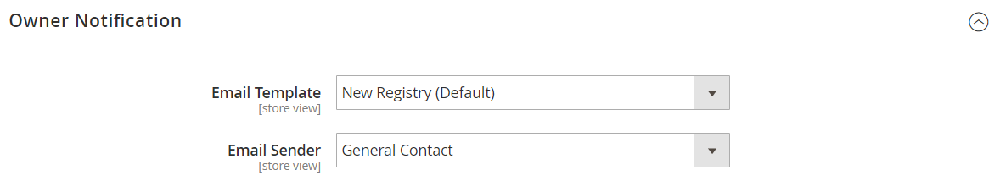

# [!UICONTROL Customers] > [!UICONTROL Gift Registry]

{{ee-feature}}

{{config}}

Pour plus d’informations sur l’utilisation de ces paramètres pour activer les registres de cadeaux pour les clients de votre boutique, voir [Configuration des registres de cadeaux](../../merchandising-promotions/gift-registry-configure.md). Pour plus d’informations sur l’inclusion de la recherche de registre des cadeaux sur le storefront, voir [Ajout de la recherche de registre des cadeaux](../../merchandising-promotions/gift-registry-search.md).

## [!UICONTROL General Options]

<!-- zoom -->

<!-- [General Options](https://experienceleague.adobe.com/fr/docs/commerce-admin/marketing/merchandising/gift-registry/gift-registry-configure) -->

| Champ | [Portée](../../getting-started/websites-stores-views.md#scope-settings) | Description |
|--- |--- |--- |
| [!UICONTROL Enable Gift Registry] | Affichage en magasin | Détermine si des registres de cadeaux sont disponibles. Options :  **`Yes`**- Active les registres de cadeaux pour la vue de magasin sélectionnée. L’onglet Registre des cadeaux s’affiche dans le tableau de bord du compte des clients enregistrés. **`No`** - Les registres de cadeaux ne sont pas disponibles pour la vue de magasin. |
| [!UICONTROL Maximum Registrants] | Affichage en magasin | Définit le nombre de personnes qu’un client peut ajouter à un registre des cadeaux. Le client partage le registre des cadeaux avec chaque inscrit. Dans le storefront, le bouton _Ajouter un abonné_ est disponible pour les clients jusqu’à ce que le nombre maximum soit atteint. |

{style="table-layout:auto"}

## [!UICONTROL Owner Notification]

<!-- zoom -->

<!-- [Owner Notification](https://experienceleague.adobe.com/fr/docs/commerce-admin/marketing/merchandising/gift-registry/gift-registry-configure) -->

| Champ | [Portée](../../getting-started/websites-stores-views.md#scope-settings) | Description |
|--- |--- |--- |
| [!UICONTROL Email Template] | Affichage en magasin | Détermine le modèle utilisé pour l’e-mail de notification au propriétaire envoyé lors de la création d’un registre des cadeaux. Modèle par défaut : notification du propriétaire du registre des cadeaux |
| [!UICONTROL Email Sender] | Affichage en magasin | Identifie le [contact de magasin](../../getting-started/store-details.md#store-email-addresses) qui apparaît comme expéditeur de l’e-mail de notification du propriétaire du registre des cadeaux. Valeur par défaut : `General Contact` |

{style="table-layout:auto"}

## Partage du registre des cadeaux

<!-- zoom -->

<!-- Gift Registry Sharing](https://experienceleague.adobe.com/fr/docs/commerce-admin/marketing/merchandising/gift-registry/gift-registry-configure) -->

| Champ | [Portée](../../getting-started/websites-stores-views.md#scope-settings) | Description |
|--- |--- |--- |
| [!UICONTROL Email Template] | Affichage en magasin | Détermine le modèle utilisé pour l’e-mail de partage du registre des cadeaux envoyé lors de la création d’un registre des cadeaux. Lorsque le propriétaire clique sur _Partager le registre des cadeaux_, l’e-mail est envoyé à chaque destinataire. Modèle par défaut : `Gift Registry Sharing` |
| [!UICONTROL Email Sender] | Affichage en magasin | Identifie le [contact de magasin](../../getting-started/store-details.md#store-email-addresses) qui apparaît comme expéditeur de l’e-mail de partage du registre des cadeaux. Valeur par défaut : `General Contact` |
| [!UICONTROL Maximum Sent Emails Threshold] | Affichage en magasin | Nombre maximum de messages de notification par e-mail de partage du registre des cadeaux pouvant être envoyés simultanément. |

{style="table-layout:auto"}

## [!UICONTROL Gift Registry Update]

<!-- zoom -->

<!-- [Gift Registry Update](https://experienceleague.adobe.com/fr/docs/commerce-admin/marketing/merchandising/gift-registry/gift-registry-configure) -->

| Champ | [Portée](../../getting-started/websites-stores-views.md#scope-settings) | Description |
|--- |--- |--- |
| [!UICONTROL Email Template] | Affichage en magasin | Détermine le modèle utilisé pour le courrier électronique de mise à jour du registre des cadeaux envoyé au propriétaire du registre des cadeaux lorsqu’un achat est effectué à partir du registre des cadeaux. La mise à jour contient des informations sur l’article et la quantité achetés, mais ne contient pas le nom de la personne qui a passé la commande. Modèle par défaut : `Gift Registry Update` |
| [!UICONTROL Email Sender] | Affichage en magasin | Identifie le [contact de magasin](../../getting-started/store-details.md#store-email-addresses) qui apparaît comme expéditeur du courrier électronique de mise à jour du registre des cadeaux. Valeur par défaut : `General Contact` |

{style="table-layout:auto"}
