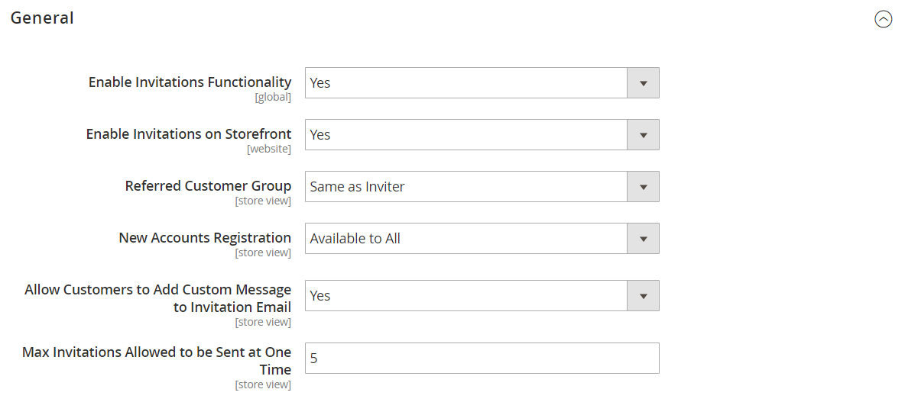

# [!UICONTROL Customers] > [!UICONTROL Invitations]

{{ee-feature}}

{{config}}

## [!UICONTROL General]

<!-- zoom -->

<!-- [General](https://docs.magento.com/user-guide/marketing/invitations-configure.html) -->

| Champ | [Portée](../../getting-started/websites-stores-views.md#scope-settings) | Description |
|--- |--- |--- |
| [!UICONTROL Enable Invitations Functionality] | Global | Détermine si le module Invitations est activé. Options : `Yes` / `No` |
| [!UICONTROL Enable Invitations on Frontend] | Site Web | Détermine si les invitations peuvent être gérées à partir du storefront. Options : `Yes` / `No` |
| [!UICONTROL Referred Customer Group] | Affichage en magasin | Détermine le groupe de clients de l’invité. Options :  **`Same as Inviter`**- Les invités sont automatiquement affectés au même groupe de clients que les clients qui les ont invités. **`Default Customer Group from Configuration`** - Les invités ont automatiquement le [groupe de clients](../../customers/customer-groups.md) par défaut. |
| [!UICONTROL New Accounts Registration] | Affichage en magasin | Détermine la manière dont les invités peuvent créer un compte. Options :  **`By Invitation Only`**- Les invités doivent suivre le lien contenu dans le courrier électronique d’invitation pour créer un compte. **`Available to All`** - Les invités peuvent utiliser le formulaire d’enregistrement de compte disponible dans le magasin. |
| [!UICONTROL Allow Customers to Add Custom Message to Invitation Email] | Affichage en magasin | Détermine s’il existe un champ dans le formulaire d’invitation dans lequel l’invité peut ajouter un message personnalisé envoyé à l’invité par courrier électronique. Cela n’a aucune incidence sur la capacité de l’administrateur à ajouter un message à une invitation. Options : `Yes` / `No`. |
| [!UICONTROL Max Invitations Allowed to be Sent at One Time] | Affichage en magasin | Détermine le nombre maximal d’invitations que l’invité peut envoyer à la fois. Une invitation différente est envoyée à chaque adresse électronique que l’invité inclut dans le formulaire. Cela permet de protéger les ressources du serveur en empêchant l’envoi simultané d’un grand nombre d’invitations et réduit le risque d’envoi d’invitations en tant que spam. |

{style="table-layout:auto"}

## [!UICONTROL Email]

<!-- zoom -->

<!-- [Email](https://docs.magento.com/user-guide/marketing/invitations-configure.html) -->

| Champ | [Portée](../../getting-started/websites-stores-views.md#scope-settings) | Description |
|--- |--- |--- |
| [!UICONTROL Customer Invitation Email Sender] | Affichage en magasin | Détermine l’expéditeur de l’email que les invités reçoivent lorsqu’un email d’invitation est envoyé. Valeur par défaut : `General Contact` |
| [!UICONTROL Customer Invitation Email Template] | Affichage en magasin | Détermine le modèle de courrier électronique que les invités reçoivent lorsqu’un courrier électronique d’invitation est envoyé. Modèle par défaut : `Customer Invitation` |

{style="table-layout:auto"}
