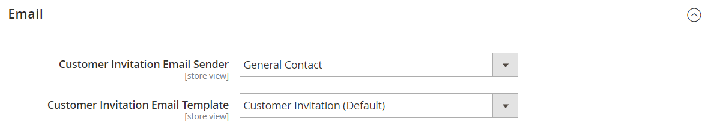

# [!UICONTROL Customers] > [!UICONTROL Invitations]

{{ee-feature}}

{{config}}

## [!UICONTROL General]

<!-- zoom -->

<!-- [General](https://experienceleague.adobe.com/fr/docs/commerce-admin/marketing/promotions/events/invitations#enable-invitations-for-your-store) -->

| Champ | [Portée](../../getting-started/websites-stores-views.md#scope-settings) | Description |
|--- |--- |--- |
| [!UICONTROL Enable Invitations Functionality] | Global | Détermine si le module Invitations est activé. Options : `Yes` / `No` |
| [!UICONTROL Enable Invitations on Frontend] | Site internet | Détermine si les invitations peuvent être gérées à partir du storefront. Options : `Yes` / `No` |
| [!UICONTROL Referred Customer Group] | Affichage de la boutique | Détermine le groupe de clients de l&#39;invité. Options :  **`Same as Inviter`**- Les invités sont automatiquement affectés au même groupe de clients que les clients qui les ont invités. **`Default Customer Group from Configuration`** - Les invités ont automatiquement la valeur par défaut [groupe de clients](../../customers/customer-groups.md). |
| [!UICONTROL New Accounts Registration] | Affichage de la boutique | Détermine comment les invités peuvent créer un compte. Options :  **`By Invitation Only`**- Les invités doivent suivre le lien contenu dans l&#39;e-mail d&#39;invitation pour créer un compte. **`Available to All`** - Les invités peuvent utiliser le formulaire d’enregistrement de compte disponible dans le magasin. |
| [!UICONTROL Allow Customers to Add Custom Message to Invitation Email] | Affichage de la boutique | Détermine s’il existe un champ dans le formulaire d’invitation dans lequel l’invité peut ajouter un message personnalisé qui est envoyé à l’invité par e-mail. Cela n’affecte pas la capacité de l’administrateur ou de l’administratrice d’ajouter un message à une invitation. Options : `Yes` / `No`. |
| [!UICONTROL Max Invitations Allowed to be Sent at One Time] | Affichage de la boutique | Détermine le nombre maximal d&#39;invitations que l&#39;invitant peut envoyer à la fois. Une invitation différente est envoyée à chaque adresse e-mail que l’invitant inclut dans le formulaire. Cela protège les ressources du serveur en empêchant l’envoi simultané d’un grand nombre d’invitations et réduit la probabilité d’envoi d’invitations sous forme de spam. |

{style="table-layout:auto"}

## [!UICONTROL Email]

<!-- zoom -->

<!-- [Email](https://experienceleague.adobe.com/fr/docs/commerce-admin/marketing/promotions/events/invitations#enable-invitations-for-your-store) -->

| Champ | [Portée](../../getting-started/websites-stores-views.md#scope-settings) | Description |
|--- |--- |--- |
| [!UICONTROL Customer Invitation Email Sender] | Affichage de la boutique | Détermine l’expéditeur de l’e-mail que les invités reçoivent lorsqu’un e-mail d’invitation est envoyé. Valeur par défaut : `General Contact` |
| [!UICONTROL Customer Invitation Email Template] | Affichage de la boutique | Détermine le modèle de l’e-mail que les invités reçoivent lorsqu’un e-mail d’invitation est envoyé. Modèle par défaut : `Customer Invitation` |

{style="table-layout:auto"}
