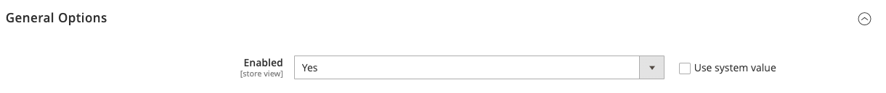

# [!UICONTROL Customers] > [!UICONTROL Newsletter]

{{config}}

>[!NOTE]
>
>La newsletter fait partie des instruments marketing qui permettent d’envoyer aux clients des informations, des remises et d’autres emails marketing. Les clients enregistrés peuvent gérer leur abonnement depuis leur [tableau de bord du compte](../../customers/account-dashboard-my-account.md).

## [!UICONTROL General Options]

<!-- zoom -->

| Champ | [Portée](../../getting-started/websites-stores-views.md#scope-settings) | Description |
|--- |--- |--- |
| [!UICONTROL Enabled] | Affichage en magasin | Détermine si les newsletters sont activées pour la portée de la vue de magasin. Options : `Yes` / `No` |

{:style=&quot;table-layout:auto&quot;}

## [!UICONTROL Subscription Options]

<!-- zoom -->

<!-- [Subscription Options](https://docs.magento.com/user-guide/marketing/newsletter-configuration.html) -->

| Champ | [Portée](../../getting-started/websites-stores-views.md#scope-settings) | Description |
|--- |--- |--- |
| [!UICONTROL Allow Guest Subscription] | Affichage en magasin | Détermine si les invités non enregistrés peuvent s’abonner à une newsletter. Options : `Yes` / `No` |
| [!UICONTROL Need to Confirm] | Affichage en magasin | Détermine si les demandes d’abonnement doivent être confirmées. Cette méthode de double opt-in est une mesure de validation qui empêche les personnes de s’abonner sans leur consentement. Options : `Yes` / `No` |
| [!UICONTROL Confirmation Email Sender] | Affichage en magasin | Identifie le contact du magasin qui apparaît comme l’expéditeur de l’email envoyé pour confirmer une demande d’abonnement. |
| [!UICONTROL Confirmation Email Template] | Affichage en magasin | Détermine le modèle de courrier électronique utilisé pour la notification envoyée pour confirmer une demande d’abonnement à une newsletter. Modèle par défaut : `Newsletter subscription confirmation` |
| Success Email Sender | Affichage en magasin | Identifie le contact de magasin qui apparaît comme l’expéditeur de l’email envoyé aux personnes qui se sont abonnées avec succès à une newsletter. |
| [!UICONTROL Success Email Template] | Affichage en magasin | Détermine le modèle de courrier électronique utilisé pour la notification envoyée aux personnes qui se sont abonnées avec succès à une newsletter. Modèle par défaut : `Newsletter subscription success` |
| [!UICONTROL Unsubscription Email Sender] | Affichage en magasin | Identifie le contact de magasin qui apparaît comme l’expéditeur de l’email envoyé à ceux qui demandent de mettre fin à l’abonnement à leur newsletter. |
| [!UICONTROL Unsubscription Email Template] | Affichage en magasin | Détermine le modèle d’email utilisé pour la notification envoyée à ceux qui demandent de mettre fin à l’abonnement à leur newsletter. Modèle par défaut : `Newsletter unsubscription success` |

{:style=&quot;table-layout:auto&quot;}
