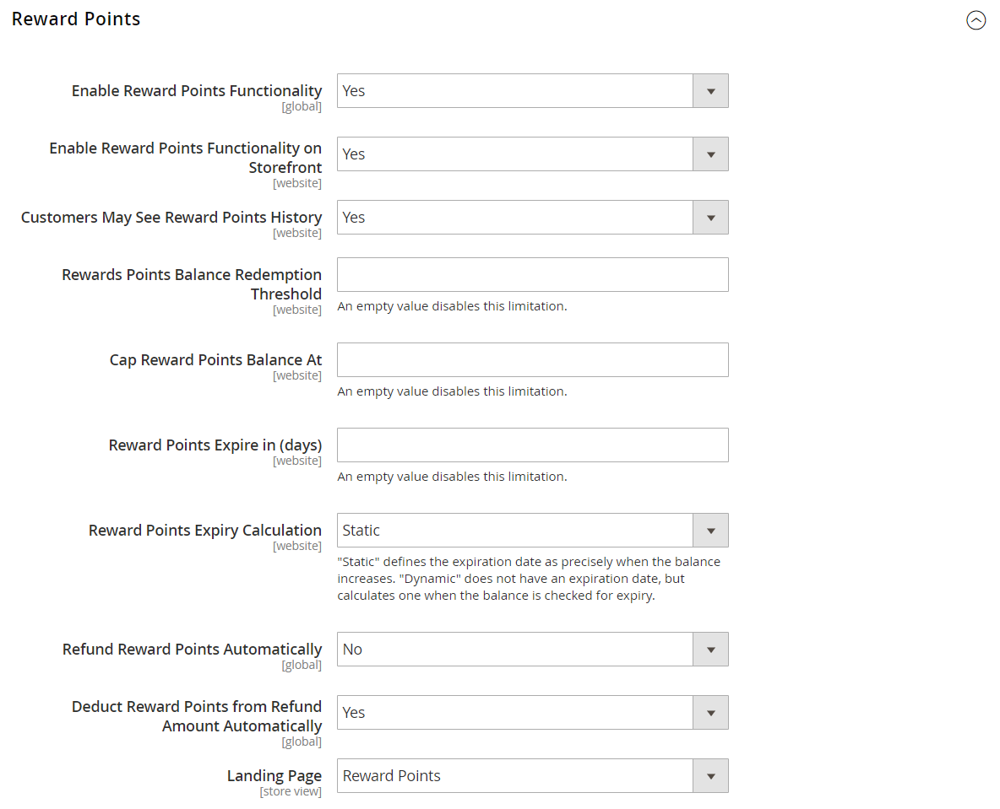

# [!UICONTROL Customers] > [!UICONTROL Reward Points]

{{ee-feature}}

{{config}}

>[!NOTE]
>
>La configuration [Taux d’Exchange de récompense](../../merchandising-promotions/reward-exchange-rates.md) est requise pour le rachat de points de récompense par les clients et les administrateurs lors du passage en caisse.

## [!UICONTROL Reward Points]

<!-- zoom -->

<!-- [Reward Points](https://docs.magento.com/user-guide/marketing/reward-point-configure.html) -->

| Champ | [Portée](../../getting-started/websites-stores-views.md#scope-settings) | Description |
|--- |--- |----------------------------------------------------------------------------------------------------------------------------------------------------------------------------------------------------------------------------------------------------------------------------------------------------------------------------------------------------------------------------------------------------------------------------------------------------------------------------------------------------------------------------------------------------------------------|
| [!UICONTROL Enable Reward Points Functionality] | Global | Active ou désactive les points de récompense. Options : `Yes` / `No`. |
| [!UICONTROL Enable Reward Points Functionality on Storefront] | Site Web | Lorsqu’ils sont activés, les clients peuvent gagner des points par le biais de leurs activités et les échanger lors du passage en caisse. Si cette option est désactivée, seuls les utilisateurs administrateurs peuvent attribuer et échanger des points pour le compte des clients. Options : `Yes` / `No`. |
| [!UICONTROL Customers May See Reward Points History] | Site Web | Lorsqu’ils sont activés, les clients peuvent consulter un historique détaillé de chaque cumul, rédemption et expiration des points de récompense dans le tableau de bord de leur compte. Options : `Yes` / `No` |
| [!UICONTROL Reward Points Balance Redemption Threshold] | Site Web | Nécessite que les clients atteignent un solde de points minimal avant de pouvoir les échanger contre des commandes. Laissez le champ vide au minimum. |
| [!UICONTROL Cap Reward Points Balance At] | Site Web | Empêche les clients d’accumuler plus de points que ce solde maximum. Laissez vide, sans limite. |
| [!UICONTROL Reward Points Expire in (days)] | Site Web | Indique la durée de vie des points de récompense en jours. Chaque lot de points gagné au cours d’activités distinctes a une durée de vie distincte. Chaque lot de l’historique des points récompensés indique le nombre de jours restants avant l’expiration des points. L’historique peut être consulté à partir du tableau de bord du compte du client, s’il est activé, et à partir de l’administrateur. Laissez vide pour aucune expiration. |
| [!UICONTROL Reward Points Expiry Calculation] | Site Web | Détermine la méthode utilisée pour déterminer le délai d’expiration des points de récompense. Options :  **`Static`**- Détermine la durée de vie restante des points de récompense en fonction du nombre de jours définis dans la configuration. Si la limite d’expiration dans la configuration change, la date d’expiration des points existants ne change pas. **`Dynamic`** - Calcule le nombre de jours restants chaque fois que le solde du point de récompense augmente. Si la limite d’expiration dans la configuration change, les calculs d’expiration pour tous les points existants sont mis à jour en conséquence. |
| [!UICONTROL Refund Reward Points Automatically] | Global | Détermine si les points de récompense disponibles sont remboursés automatiquement. Options : `Yes` / `No` |
| [!UICONTROL Deduct Reward Points from Refund Amount Automatically] | Global | Cela détermine si les points de récompense gagnés par les achats sont entièrement ou partiellement annulés au moment du remboursement de la commande, lorsque cette fonction est activée. Seules les récompenses de la commande qui leur a valu sont affectées lorsque cette commande est remboursée. Options : `Yes` / `No`. |
| [!UICONTROL Landing Page] | Affichage en magasin | Indique la page CMS qui explique votre programme de points de récompense. Un lien vers la page de récompenses par défaut s’affiche aux emplacements de votre magasin où des points peuvent être gagnés. |

{style="table-layout:auto"}

## [!UICONTROL Actions for Acquiring Reward Points by Customers]

<!-- zoom -->

<!-- [Actions for Acquiring Reward Points by Customers](https://docs.magento.com/user-guide/marketing/reward-point-configure.html) -->

| Champ | [Portée](../../getting-started/websites-stores-views.md#scope-settings) | Description |
|--- |--- |----------------------------------------------------------------------------------------------------------------------------------------------------------------------------------------------------------------------------------------------------------------------------------------------------------------------------------------------------------------------------------------------------------------------------------------------------------------------------------------------------------------------------------------------------------------------------------------------------|
| [!UICONTROL Purchase] | Site Web | Détermine si des points de récompense sont gagnés pour les achats en fonction des [Taux d&#39;Exchange de récompense](../../merchandising-promotions/reward-exchange-rates.md) configurés. Options : `Yes` / `No` |
| [!UICONTROL Registration] | Site Web | Indique le nombre de points gagnés pour l’ouverture d’un compte client. |
| [!UICONTROL Newsletter Signup] | Site Web | Indique le nombre de points gagnés par les clients enregistrés qui s’abonnent à une newsletter. (Les points ne sont pas disponibles pour les inscriptions des invités.) Si un client se désabonne, puis s’abonne à nouveau, les points ne sont pas gagnés pour le second abonnement. |
| [!UICONTROL Converting Invitation to Customer] | Site Web | Indique le nombre de points gagnés par un client qui envoie une invitation, lorsque le destinataire ouvre alors un compte client. |
| [!UICONTROL Invitation to Customer Conversions Quantity Limit] | Site Web | Limite le nombre de conversions d’invitation pouvant être utilisées pour gagner des points pour le client qui envoie l’invitation. Laissez vide pour aucune limite. |
| [!UICONTROL Converting Invitation to Order] | Site Web | Indique le nombre de points gagnés par un client qui envoie une invitation lorsque le destinataire passe une commande initiale. |
| [!UICONTROL Invitation to Order Conversions Quantity Limit] | Site Web | Limite le nombre de conversions de commande pouvant gagner des points pour la personne qui envoie l’invitation. S’il est vide, il n’y a pas de limite maximale. |
| [!UICONTROL Invitation Conversion to Order Reward] | Site Web | Indique la fréquence à laquelle un client peut gagner des points de récompense lorsqu’il effectue des achats. Options :  **`Each`**- Le client reçoit des points de récompense pour chaque commande facturée passée par l’invité. Les points de récompense sont donnés en fonction des taux d&#39;exchange définis pour la combinaison requise d&#39;un site web et d&#39;un groupe de clients. **`First`** - Le client ne reçoit des points de récompense que pour la première commande facturée passée par les invités. Si plusieurs invités s’enregistrent et passent une commande, seul le montant de la première commande est converti en points de récompense et attribué au client. |
| [!UICONTROL Review Submission] | Site Web | Détermine le nombre de points gagnés par un client qui envoie une révision approuvée pour publication. |
| [!UICONTROL Rewarded Reviews Submission Quantity Limit] | Site Web | Limite le nombre de révisions qui peuvent être utilisées pour gagner des points par client. Laissez vide pour aucune limite. |

{style="table-layout:auto"}

## [!UICONTROL Email Notification Settings]

<!-- zoom -->

<!-- [Email Notification Settings](https://docs.magento.com/user-guide/marketing/reward-point-configure.html) -->

| Champ | [Portée](../../getting-started/websites-stores-views.md#scope-settings) | Description |
|--- |--- |--- |
| [!UICONTROL Email Sender] | Affichage en magasin | Détermine le contact du magasin qui apparaît comme l’expéditeur des emails de mise à jour de la balance et de notification d’expiration. |
| [!UICONTROL Subscribe Customers by Default] | Global | Détermine l’état d’abonnement par défaut des clients pour les emails de mise à jour de balance et de notification d’expiration. |
| [!UICONTROL Balance Update Email] | Affichage en magasin | Détermine le modèle utilisé pour la notification envoyée aux clients chaque fois que leur solde de points est mis à jour. Modèle par défaut : `Reward Points Balance Update` |
| [!UICONTROL Reward Points Expiry Warning Email] | Affichage en magasin | Détermine le modèle de courrier électronique que les clients reçoivent lorsque la limite d’avertissement d’expiration a été atteinte pour un lot de points. Modèle par défaut : `Reward Points Expiry Warning` |
| [!UICONTROL Expiry Warning before (days)] | Global | Indique le nombre de jours avant l’expiration du point pour envoyer la notification. Laissez vide pour n’envoyer aucune notification d’expiration. La notification n’est pas envoyée si le nombre de jours saisi est supérieur à la durée de vie restante des points. |

{style="table-layout:auto"}
