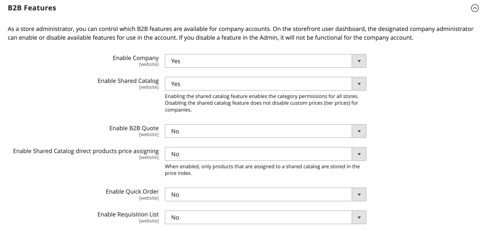
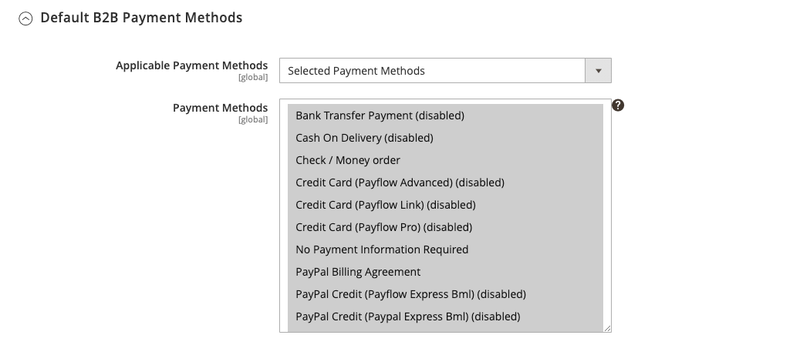
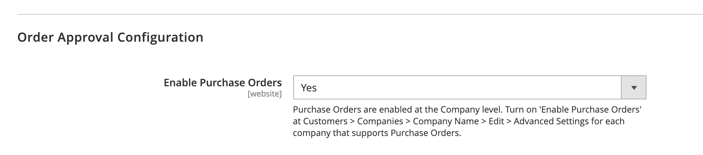

# [!UICONTROL General] > [!UICONTROL B2B Features]

{{b2b-feature}}

{{config}}

>[!TIP]
>
>Avec l’installation et l’activation d’Adobe Commerce B2B, l’expérience d’achat peut être personnalisée avec des fonctionnalités spécifiques à l’entreprise. Adobe Commerce B2B est une solution intégrée qui prend en charge les modèles B2B et B2C. Pour plus d’informations sur les fonctionnalités B2B, consultez le [_Guide de l’utilisateur Adobe Commerce B2B_](https://experienceleague.adobe.com/docs/commerce-admin/b2b/introduction.html?lang=fr).

## [!UICONTROL B2B Features]

<!-- zoom -->

| Champ | [Portée](../../getting-started/websites-stores-views.md#scope-settings) | Description |
|------- |----------------------------------------------------------------------- |------------ |
| [[!UICONTROL Enable Company]](../../b2b/account-companies.md) | Site internet | Lorsque cette option est activée, elle permet aux clients de gérer l’affectation de leur entreprise à partir du tableau de bord de leur compte et active également les fonctionnalités Catalogue partagé et Devis B2B par défaut. Options : `Yes` / `No` |
| [[!UICONTROL Enable Quick Order]](../../b2b/quick-order.md) | Site internet | Lorsqu’elle est activée, permet aux clients et aux invités de passer rapidement des commandes en fonction du SKU ou du nom du produit. Options : `Yes` / `No` |
| [[!UICONTROL Enable Requisition List]](../../b2b/configure-requisition-lists.md) | Site internet | Lorsque cette option est activée, permet aux clients de créer et de gérer des listes de demandes d&#39;approvisionnement à partir du tableau de bord de leur compte. |

{style="table-layout:auto"}

<!-- zoom -->

Lorsque la fonction Société est activée, des champs supplémentaires sont disponibles pour le catalogue partagé et le devis B2B.

| Champ | [Portée](../../getting-started/websites-stores-views.md#scope-settings) | Description |
|------- |----------------------------------------------------------------------- |------------ |
| [[!UICONTROL Enable Shared Catalog]](../../b2b/catalog-shared.md) | Site internet | Lorsque cette option est activée, elle permet de créer des catalogues organisés avec une tarification personnalisée disponible globalement ou limitée à des sociétés spécifiques. Options : `Yes` / `No` |
| [!UICONTROL Enable Shared Catalog direct products price assigning] | Site internet | Lorsque le champ _[!UICONTROL Enable Shared Catalog]_&#x200B;est défini sur `Yes`, cette option est disponible. Lorsque cette option est activée, seuls les produits affectés à un catalogue partagé sont stockés dans l’indice des prix. Les produits qui ne sont pas affectés au catalogue partagé ne sont pas affichés sur le storefront. Options : `Yes` / `No` |
| [[!UICONTROL Enable B2B Quote]](../../b2b/configure-quotes.md) | Site internet | Lorsque cette option est activée, elle permet aux acheteurs de la société de soumettre une demande de devis à partir du panier. Options : `Yes` / `No` |

{style="table-layout:auto"}

### [!UICONTROL Default B2B Payment Methods]

<!-- zoom -->

| Champ | [Portée](../../getting-started/websites-stores-views.md#scope-settings) | Description |
|------- |----------------------------------------------------------------------- |------------ |
| [!UICONTROL Applicable Payment Methods] | Global | Détermine la sélection des modes de paiement disponibles pour les acheteurs B2B. Options : `All Payment Methods` / `Specific Payment Methods` |
| [!UICONTROL Payment Methods] | Global | Spécifie chaque mode de paiement disponible pour les acheteurs B2B. |

{style="table-layout:auto"}

### [!UICONTROL Default B2B Shipping Methods]

<!-- zoom -->

| Champ | [Portée](../../getting-started/websites-stores-views.md#scope-settings) | Description |
|------- |----------------------------------------------------------------------- |------------ |
| [!UICONTROL Applicable Shipping Methods] | Global | Détermine la sélection des méthodes d&#39;expédition disponibles par défaut pour les acheteurs B2B. Options : `All Shipping Methods` / `Specific Shipping Methods` |
| [!UICONTROL Shipping Methods] | Global | Spécifie chaque méthode d&#39;expédition disponible par défaut pour les acheteurs B2B.  **_Remarque:_** vous pouvez également limiter les modes d’expédition pour un [compte de société](../../b2b/account-companies.md) spécifique. |

{style="table-layout:auto"}

## [!UICONTROL Order Approval Configuration]

<!-- zoom -->

| Champ | [Portée](../../getting-started/websites-stores-views.md#scope-settings) | Description |
|------- |----------------------------------------------------------------------- |------------ |
| [[!UICONTROL Enable Purchase Orders]](../../stores-purchase/purchase-order.md) | Site internet | Lorsque cette option est activée, les entreprises peuvent créer des commandes fournisseur. Options : `Yes` / `No` |

{style="table-layout:auto"}

