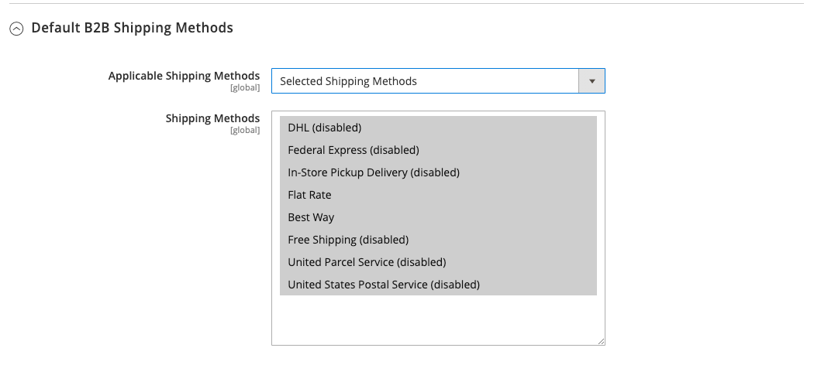

# [!UICONTROL General] > [!UICONTROL B2B Features]

{{b2b-feature}}

{{config}}

>[!TIP]
>
>Avec l’installation et l’activation d’Adobe Commerce B2B, l’expérience d’achat peut être personnalisée avec des fonctionnalités spécifiques à l’entreprise. Adobe Commerce B2B est une solution intégrée qui prend en charge les modèles B2B et B2C. Pour plus d’informations sur les fonctionnalités B2B, consultez le [_Guide de l’utilisateur d’Adobe Commerce B2B_](https://experienceleague.adobe.com/docs/commerce-admin/b2b/introduction.html?lang=fr).

## [!UICONTROL B2B Features]

<!-- zoom -->

| Champ | [Portée](../../getting-started/websites-stores-views.md#scope-settings) | Description |
|------- |----------------------------------------------------------------------- |------------ |
| [[!UICONTROL Enable Company]](../../b2b/account-companies.md) | Site Web | Lorsqu’elle est activée, cette option permet aux clients de gérer l’affectation de leur entreprise à partir du tableau de bord de leur compte et active par défaut les fonctionnalités Catalogue partagé et Devis B2B . Options : `Yes` / `No` |
| [[!UICONTROL Enable Quick Order]](../../b2b/quick-order.md) | Site Web | Lorsqu’elle est activée, cette option permet aux clients et aux invités de passer rapidement des commandes en fonction du SKU ou du nom du produit. Options : `Yes` / `No` |
| [[!UICONTROL Enable Requisition List]](../../b2b/configure-requisition-lists.md) | Site Web | Lorsqu’elle est activée, permet aux clients de créer et de gérer des listes de demandes à partir du tableau de bord de leur compte. |

{style="table-layout:auto"}

<!-- zoom -->

Lorsque la fonction Société est activée, des champs supplémentaires sont disponibles pour le catalogue partagé et les guillemets B2B.

| Champ | [Portée](../../getting-started/websites-stores-views.md#scope-settings) | Description |
|------- |----------------------------------------------------------------------- |------------ |
| [[!UICONTROL Enable Shared Catalog]](../../b2b/catalog-shared.md) | Site Web | Lorsqu’elle est activée, permet de créer des catalogues organisés avec des prix personnalisés disponibles à l’échelle mondiale ou limités à des entreprises spécifiques. Options : `Yes` / `No` |
| [!UICONTROL Enable Shared Catalog direct products price assigning] | Site Web | Lorsque le champ _[!UICONTROL Enable Shared Catalog]_&#x200B;est défini sur `Yes`, cette option est disponible. Lorsque cette option est activée, seuls les produits affectés à un catalogue partagé sont stockés dans l’indice de prix. Les produits qui ne sont pas affectés au catalogue partagé ne s’affichent pas sur le storefront. Options : `Yes` / `No` |
| [[!UICONTROL Enable B2B Quote]](../../b2b/configure-quotes.md) | Site Web | Lorsqu’elle est activée, permet aux acheteurs de l’entreprise d’envoyer une demande de devis depuis le panier. Options : `Yes` / `No` |

{style="table-layout:auto"}

### [!UICONTROL Default B2B Payment Methods]

<!-- zoom -->

| Champ | [Portée](../../getting-started/websites-stores-views.md#scope-settings) | Description |
|------- |----------------------------------------------------------------------- |------------ |
| [!UICONTROL Applicable Payment Methods] | Global | Détermine la sélection des méthodes de paiement disponibles pour les acheteurs B2B. Options : `All Payment Methods` / `Specific Payment Methods` |
| [!UICONTROL Payment Methods] | Global | Spécifie chaque mode de paiement disponible pour les acheteurs B2B. |

{style="table-layout:auto"}

### [!UICONTROL Default B2B Shipping Methods]

<!-- zoom -->

| Champ | [Portée](../../getting-started/websites-stores-views.md#scope-settings) | Description |
|------- |----------------------------------------------------------------------- |------------ |
| [!UICONTROL Applicable Shipping Methods] | Global | Détermine la sélection des méthodes d’expédition disponibles par défaut pour les acheteurs B2B. Options : `All Shipping Methods` / `Specific Shipping Methods` |
| [!UICONTROL Shipping Methods] | Global | Spécifie chaque méthode de livraison disponible par défaut pour les acheteurs B2B.  **_Remarque :_**&#x200B;Vous pouvez également limiter les méthodes de livraison pour un [compte de société](../../b2b/account-companies.md) spécifique. |

{style="table-layout:auto"}

## [!UICONTROL Order Approval Configuration]

<!-- zoom -->

| Champ | [Portée](../../getting-started/websites-stores-views.md#scope-settings) | Description |
|------- |----------------------------------------------------------------------- |------------ |
| [[!UICONTROL Enable Purchase Orders]](../../stores-purchase/purchase-order.md) | Site Web | Lorsqu’elle est activée, permet aux entreprises de créer des commandes d’achat. Options : `Yes` / `No` |

{style="table-layout:auto"}

