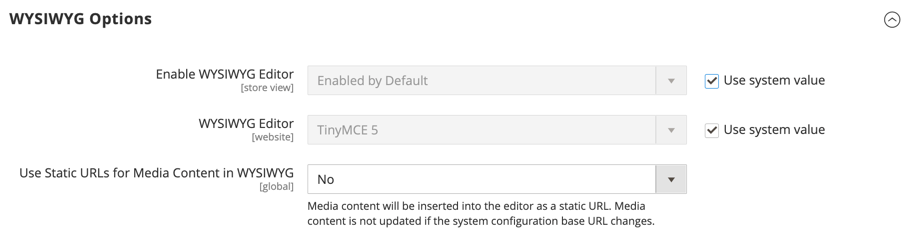

# [!UICONTROL General] > [!UICONTROL Content Management]

{{config}}

## [!UICONTROL WYSIWYG Options]

<!-- zoom -->

<!-- [WYSIWYG Options](https://experienceleague.adobe.com/en/docs/commerce-admin/content-design/wysiwyg/editor) -->

| Champ | [Portée](../../getting-started/websites-stores-views.md#scope-settings) | Description |
|--- |--- |--- |
| [!UICONTROL Enable WYSIWYG Editor] | Affichage en magasin | Détermine si l’éditeur est activé pour le magasin. Options : activé par défaut/désactivé par défaut/désactivé complètement |
| [!UICONTROL WYSIWYG Editor] | Site Web | Détermine la version de l’éditeur TinyMCE utilisé pour l’éditeur WYSIWYG. Options :  **`TinyMCE 5`**- (par défaut) utilise la version 5 de TinyMCE comme éditeur WYSIWYG par défaut.  _ **&#x200B; Remarque : &#x200B;** _Une mise à jour de la bibliothèque TinyMCE 5.10 dans Adobe Commerce et Magento Open Source 2.4.5 résout une vulnérabilité qui permettait l’exécution arbitraire de JavaScript lors de la mise à jour d’une image ou d’un lien à l’aide de certains types d’URL. TinyMCE 3 a été abandonné dans la version 2.4.0 et supprimé dans la version 2.4.3. TinyMCE 4 a été supprimé dans la version 2.4.4. |
| [!UICONTROL Use Static URLs for Media Content in WYSIWYG] | Global | Détermine si des [URL statiques](../../content-design/catalog-urls-dynamic-media.md) sont utilisées pour le contenu multimédia référencé à partir de l’éditeur WYSIWYG. Le paramètre s’applique à tous les emplacements où l’éditeur WYSIWYG est disponible, y compris les produits, les catégories, les pages et les blocs. Options :  **`Yes`**- Utilise des URL statiques pour le contenu multimédia inséré avec l’éditeur WYSIWYG. Les URL statiques sont absolues et coupées si l’ [URL de base](../../stores-purchase/store-urls.md) du magasin change. **`No`** (Par défaut) : utilise des URL dynamiques pour le contenu multimédia inséré avec l’éditeur WYSIWYG, en fonction de la directive `{{media url="..."}}`. Les URL dynamiques sont relatives et ne rompent pas si l’URL de base du magasin change. |

{style="table-layout:auto"}

## [!UICONTROL CMS Page Hierarchy]

{{ee-feature}}

<!-- zoom -->

<!--[CMS Page Hierarchy](https://experienceleague.adobe.com/en/docs/commerce-admin/content-design/elements/pages/page-hierarchy) -->

| Champ | [Portée](../../getting-started/websites-stores-views.md#scope-settings) | Description |
|--- |--- |--- |
| [!UICONTROL Enable Hierarchy Functionality] | Global | Active l’utilisation de la hiérarchie de pages pour vos pages de contenu. Options : `Yes` / `No` |
| [!UICONTROL Enable Hierarchy Metadata] | Global | Permet d’associer des métadonnées à des pages de la hiérarchie. Options : `Yes` / `No` |
| [!UICONTROL Default Layout for Hierarchy Menu] | Global | Détermine le style de menu par défaut. Options : `Content` / `Left Column` / `Right Column` |

{style="table-layout:auto"}

## [!UICONTROL Advanced Content Tools]

<!-- zoom -->

<!-- [Advanced Content Tools](https://experienceleague.adobe.com/en/docs/commerce-admin/page-builder/walkthrough/3-catalog-content) -->

| Champ | [Portée](../../getting-started/websites-stores-views.md#scope-settings) | Description |
|--- |--- |--- |
| [!UICONTROL Enable Page Builder] | Global | Détermine si les outils de contenu avancé [!DNL Page Builder] sont disponibles. Options :  **`Yes`**- L’espace de travail [!DNL Page Builder] apparaît dans la section Contenu des pages, blocs, produits et catégories. **`No`** - Les outils d’édition CMS standard apparaissent dans la section _[!UICONTROL Content]_&#x200B;des pages, blocs, produits et catégories. |
| [!UICONTROL Enable Page Builder Content Preview] | Global | Détermine si les aperçus de contenu [!DNL Page Builder] sont activés pour les produits et les catégories. Options : `Yes` / `No`  **_Remarque :_**&#x200B;Cette valeur est définie sur `Yes` par défaut, mais la désactivation de l’aperçu peut empêcher tout problème de performances résultant du chargement des aperçus dans un formulaire de produit ou de catégorie. |
| [!UICONTROL Google Maps API Key] | Global | La clé d’API [!DNL Google Maps] de votre compte Google. |
| [!UICONTROL Test Key] |  | Valide la clé d’API [!DNL Google Maps]. |
| [!UICONTROL Google Maps Style] | Global | Collez le code JSON de style [!DNL Google Maps] ici pour modifier l’aspect du type de contenu Carte. |
| [!UICONTROL Default Column Grid Size] | Global | Détermine le nombre de colonnes par défaut dans la grille [!DNL Page Builder]. |
| [!UICONTROL Maximum Column Grid Size] | Global | Détermine le nombre maximal de colonnes dans la grille [!DNL Page Builder]. |

{style="table-layout:auto"}

>[!TIP]
>
>Le créateur de pages facilite la création de pages riches en contenu avec des dispositions personnalisées qui améliorent la narration visuelle et fidélisent les clients. Ces fonctionnalités sont conçues pour améliorer la qualité et réduire le temps et les frais liés à la création de pages personnalisées. Pour plus d’informations sur ces fonctionnalités et sur la manière dont vous pouvez les utiliser pour créer du contenu attrayant pour votre boutique Adobe Commerce ou Magento Open Source, consultez le [_Guide de l’utilisateur de Page Builder_](../../page-builder/guide-overview.md).
