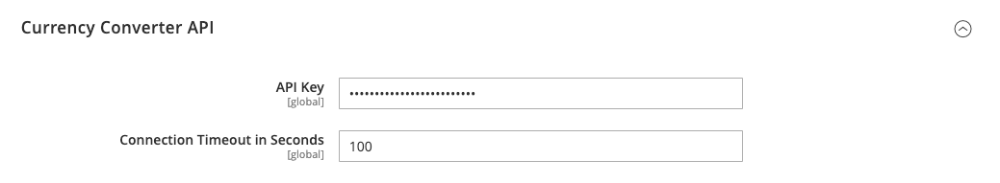
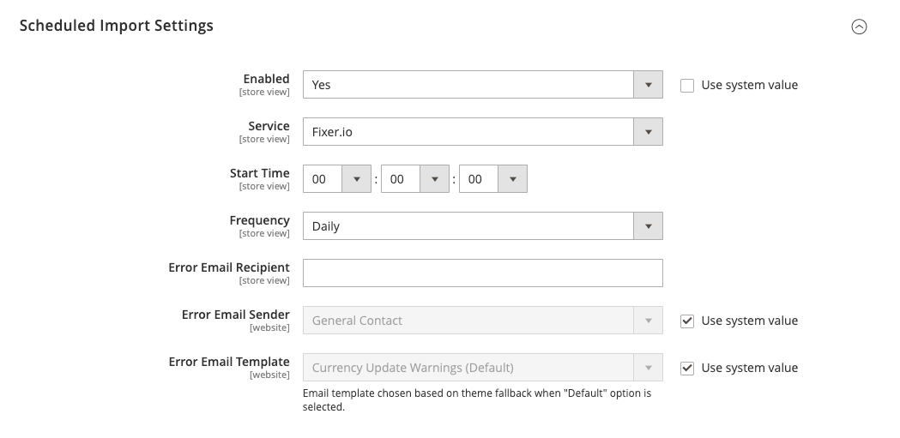

# [!UICONTROL General] > [!UICONTROL Currency Setup]

{{config}}

>[!NOTE]
>
>Voir [Configuration de devise](../../stores-purchase/currency-configuration.md) pour plus d’informations sur ces configurations.

## [!UICONTROL Currency Options]

<!-- zoom -->

| Champ | [Portée](../../getting-started/websites-stores-views.md#scope-settings) | Description |
|--- |--- |--- |
| [!UICONTROL Base Currency] | Site internet | Devise principale utilisée pour tous les paiements en ligne. Pour plusieurs vues de magasin, la portée du prix doit être définie dans la configuration [Catalogue](../catalog/catalog.md). |
| [!UICONTROL Default Display Currency] | Affichage de la boutique | Devise principale utilisée pour afficher les prix. |
| [!UICONTROL Allowed Currencies] | Affichage de la boutique | Devises acceptées par votre boutique pour le paiement. |

{style="table-layout:auto"}

## [!UICONTROL Fixer.io (legacy)]

>[!IMPORTANT]
>
>À compter de la version 2.4.6, le service [[!DNL Fixer.io]](https://fixer.io/) est obsolète et remplacé par le service [[!DNL Fixer API] (APILayer)](https://apilayer.com/marketplace/fixer-api). Il est vivement recommandé d’utiliser un compte APILayer plutôt qu’un compte [!DNL Fixer.io] obsolète.

<!-- zoom -->

| Champ | [Portée](../../getting-started/websites-stores-views.md#scope-settings) | Description |
|--- |--- |--- |
| [!UICONTROL API key] | Global | Clé utilisée pour accéder au service de conversion via votre compte [!DNL fixer.io]. Pour plus d’informations, voir [[!DNL fixer.io]](https://fixer.io/). |
| [!UICONTROL Connection Timeout in Seconds] | Global | Détermine le nombre de secondes d&#39;inactivité avant l&#39;expiration d&#39;une session Fixer.io. Valeur par défaut : `100` |

{style="table-layout:auto"}

## [!UICONTROL Fixer Api (APILayer)]

<!-- zoom -->

| Champ | [Portée](../../getting-started/websites-stores-views.md#scope-settings) | Description |
|--- |--- |--- |
| [!UICONTROL API key] | Global | Clé utilisée pour accéder au service de conversion via votre compte [!DNL APILayer]. Pour plus d’informations, voir [[!DNL APILayer]](https://apilayer.com/). |
| [!UICONTROL Connection Timeout in Seconds] | Global | Détermine le nombre de secondes d’inactivité avant l’expiration d’une session [!DNL APILayer]. La valeur par défaut est `100`. |

{style="table-layout:auto"}

## [!UICONTROL Currency Converter API]

<!-- zoom -->

| Champ | [Portée](../../getting-started/websites-stores-views.md#scope-settings) | Description |
|--- |--- |--- |
| [!UICONTROL API key] | Global | Clé utilisée pour accéder au service de conversion. Pour plus d’informations, voir [[!DNL Currency Convertor]  API ](https://free.currencyconverterapi.com/). |
| [!UICONTROL Connection Timeout in Seconds] | Global | Détermine le nombre de secondes d’inactivité avant l’expiration d’une session [!DNL Currency Converter]. Valeur par défaut : `100` |

{style="table-layout:auto"}

## [!UICONTROL Scheduled Import Settings]

<!-- zoom -->

| Champ | [Portée](../../getting-started/websites-stores-views.md#scope-settings) | Description |
|--- |--- |--- |
| [!UICONTROL Enabled] | Affichage de la boutique | Détermine si l&#39;importation planifiée est activée pour les taux de change. Options : `Yes` / `No` |
| [!UICONTROL Service] | Affichage de la boutique | Spécifie le service qui fournit les données pour l&#39;importation planifiée. La valeur par défaut est `fixer.io` |
| [!UICONTROL Start Time] | Affichage de la boutique | Indique l’heure de début par heure, minute et seconde, sur la base d’une horloge de 24 heures. |
| [!UICONTROL Frequency] | Affichage de la boutique | Détermine la fréquence de l’importation planifiée. Options : `Daily` / `Weekly` / `Monthly` |
| [!UICONTROL Error Email Recipient] | Affichage de la boutique | Identifie l’adresse e-mail de chaque personne qui est avertie par e-mail des erreurs d’importation planifiée. Pour plusieurs destinataires, séparez chaque entrée par une virgule. |
| [!UICONTROL Error Email Sender] | Site internet | Identifie le contact du magasin qui apparaît comme l’expéditeur de la notification d’erreur par e-mail. Expéditeur par défaut : `General Contact` |
| [!UICONTROL Error Email Template] | Site internet | Indique le modèle utilisé comme base de la notification e-mail d’erreur. Modèle par défaut : `Currency Update Warnings` |

{style="table-layout:auto"}
