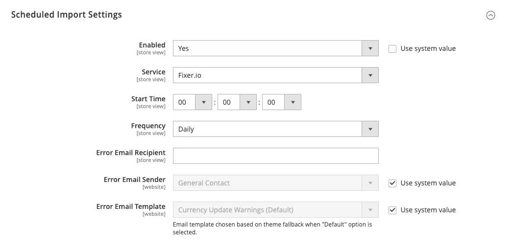

# [!UICONTROL General] > [!UICONTROL Currency Setup]

{{config}}

>[!NOTE]
>
>Voir [Configuration des devises](../../stores-purchase/currency-configuration.md) pour plus d’informations sur ces configurations.

## [!UICONTROL Currency Options]

<!-- zoom -->

| Champ | [Portée](../../getting-started/websites-stores-views.md#scope-settings) | Description |
|--- |--- |--- |
| [!UICONTROL Base Currency] | Site Web | Devise principale utilisée pour toutes les transactions de paiement en ligne. Pour plusieurs vues de magasin, la portée du prix doit être définie dans la variable [Catalogue](../catalog/catalog.md) configuration. |
| [!UICONTROL Default Display Currency] | Affichage en magasin | Devise principale utilisée pour afficher les prix. |
| [!UICONTROL Allowed Currencies] | Affichage en magasin | Les devises acceptées par votre boutique pour paiement. |

{style="table-layout:auto"}

## [!UICONTROL Fixer.io (legacy)]

>[!IMPORTANT]
>
>À compter de la version 2.4.6, la variable [[!DNL Fixer.io]](https://fixer.io/) est obsolète et remplacé par le service [[!DNL Fixer API] (APILayer)](https://apilayer.com/marketplace/fixer-api) service. Il est vivement recommandé d’utiliser un compte APILayer plutôt qu’un compte obsolète. [!DNL Fixer.io] compte .

<!-- zoom -->

| Champ | [Portée](../../getting-started/websites-stores-views.md#scope-settings) | Description |
|--- |--- |--- |
| [!UICONTROL API key] | Global | Clé utilisée pour accéder au service de conversion via votre [!DNL fixer.io] compte . Pour plus d’informations, voir [[!DNL fixer.io]](https://fixer.io/). |
| [!UICONTROL Connection Timeout in Seconds] | Global | Détermine le nombre de secondes d’inactivité avant l’expiration d’une session Fixer.io. Valeur par défaut : `100` |

{style="table-layout:auto"}

## [!UICONTROL Fixer Api (APILayer)]

<!-- zoom -->

| Champ | [Portée](../../getting-started/websites-stores-views.md#scope-settings) | Description |
|--- |--- |--- |
| [!UICONTROL API key] | Global | Clé utilisée pour accéder au service de conversion via votre [!DNL APILayer] compte . Pour plus d’informations, voir [[!DNL APILayer]](https://apilayer.com/). |
| [!UICONTROL Connection Timeout in Seconds] | Global | Détermine le nombre de secondes d’inactivité avant un événement [!DNL APILayer] la session expire. La valeur par défaut est `100`. |

{style="table-layout:auto"}

## [!UICONTROL Currency Converter API]

<!-- zoom -->

| Champ | [Portée](../../getting-started/websites-stores-views.md#scope-settings) | Description |
|--- |--- |--- |
| [!UICONTROL API key] | Global | Clé utilisée pour accéder au service de conversion. Pour plus d’informations, voir [[!DNL Currency Convertor] API](https://free.currencyconverterapi.com/). |
| [!UICONTROL Connection Timeout in Seconds] | Global | Détermine le nombre de secondes d’inactivité avant un événement [!DNL Currency Converter] la session expire. Valeur par défaut :`100` |

{style="table-layout:auto"}

## [!UICONTROL Scheduled Import Settings]

<!-- zoom -->

| Champ | [Portée](../../getting-started/websites-stores-views.md#scope-settings) | Description |
|--- |--- |--- |
| [!UICONTROL Enabled] | Affichage en magasin | Détermine si l’importation planifiée est activée pour les taux de change. Options : `Yes` / `No` |
| [!UICONTROL Service] | Affichage en magasin | Indique le service qui fournit les données pour l’importation planifiée. La valeur par défaut est `fixer.io` |
| [!UICONTROL Start Time] | Affichage en magasin | Indique l’heure de début par heure, minute et seconde, sur la base d’une horloge de 24 heures. |
| [!UICONTROL Frequency] | Affichage en magasin | Détermine la fréquence de l’importation planifiée. Options : `Daily` / `Weekly` / `Monthly` |
| [!UICONTROL Error Email Recipient] | Affichage en magasin | Identifie l’adresse électronique de chaque personne qui est informée par courrier électronique des erreurs d’importation planifiées. Pour plusieurs destinataires, séparez chaque entrée par une virgule. |
| [!UICONTROL Error Email Sender] | Site Web | Identifie le contact du magasin qui apparaît comme l’expéditeur de la notification électronique d’erreur. Expéditeur par défaut : `General Contact` |
| [!UICONTROL Error Email Template] | Site Web | Indique le modèle utilisé comme base de la notification électronique d’erreur. Modèle par défaut : `Currency Update Warnings` |

{style="table-layout:auto"}
