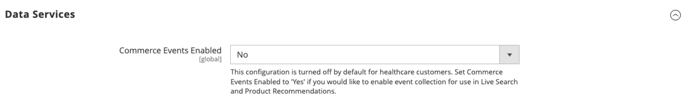

# [!UICONTROL General] > [!UICONTROL General]

{{config}}

## [!UICONTROL Country Options]

Voir [Options du pays](../../getting-started/store-details.md#country-options) pour plus d’informations sur ces champs et options de configuration.

<!-- zoom -->

| Champ | [Portée](../../getting-started/websites-stores-views.md#scope-settings) | Description |
|--- |--- |--- |
| [!UICONTROL Default Country] | Affichage de la boutique | Pays dans lequel se trouve votre magasin. |
| [!UICONTROL Allow Countries] | Site internet | Pays dans lesquels vous acceptez les commandes. |
| [!UICONTROL Zip/Postal Code is Optional for] | Global | Pays pour lesquels l&#39;adresse d&#39;expédition ne doit pas comporter de code postal. |
| [!UICONTROL European Union Countries] | Global | Pays membres de l&#39;Union européenne. |
| [!UICONTROL Top Destinations] | Affichage de la boutique | Pays principaux ciblés pour les ventes. |

{style="table-layout:auto"}

## [!UICONTROL State Options]

Voir [Options d’état](../../getting-started/store-details.md#state-options) pour plus d’informations sur ces champs et options de configuration.

<!-- zoom -->

| Champ | [Portée](../../getting-started/websites-stores-views.md#scope-settings) | Description |
|--- |--- |--- |
| [!UICONTROL State is required for] | Global | Pays (dans lesquels vous exercez des activités commerciales) pour lesquels une région ou un État doit être inclus dans l’adresse postale. |
| [!UICONTROL Allow to Choose State if It is Optional for Country] | Global | Pour les pays où cela n’est pas nécessaire, détermine si le champ _Région/État_ est inclus dans l’adresse postale du client.   **`Yes`**- Inclut le champ _Région/État_ dans l’adresse du client, même si le pays ne l’exige pas. **`No`** - Omet le champ Région/État de l’adresse du client si le pays ne l’exige pas. |

{style="table-layout:auto"}

## [!UICONTROL Locale Options]

Voir [Options de paramètres régionaux](../../getting-started/store-details.md#locale-options) pour plus d’informations sur ces champs et options de configuration.

<!-- zoom -->

| Champ | [Portée](../../getting-started/websites-stores-views.md#scope-settings) | Description |
|--- |--- |--- |
| [!UICONTROL Timezone] | Site internet | Fuseau horaire du marché principal desservi par le site web. Généralement, le fuseau horaire est le même que celui utilisé dans l&#39;emplacement physique de votre entreprise. |
| [!UICONTROL Locale] | Affichage de la boutique | Langue, devise et système de mesure utilisés sur le marché desservi par la vue du magasin. |
| [!UICONTROL Weight Unit] | Affichage de la boutique | Unité de mesure généralement utilisée pour les expéditions à partir du paramètre régional. Options : `lbs` / `kgs` |
| [!UICONTROL First Day of Week] | Affichage de la boutique | Jour considéré comme le premier jour de la semaine sur le marché desservi par la vue du magasin. |
| [!UICONTROL Weekend Days] | Affichage de la boutique | Les jours qui tombent le week-end dans le marché desservi par la vue du magasin. |

{style="table-layout:auto"}

## [!UICONTROL Website Restrictions]

{{ee-feature}}

<!-- zoom -->

Pour plus d’informations sur la modification de ces paramètres, voir [Restrictions d’accès](../../merchandising-promotions/event-configure.md#access-restrictions) dans le _Guide de marchandisage et de promotion_.

| Champ | [Portée](../../getting-started/websites-stores-views.md#scope-settings) | Description |
|--- |--- |--- |
| [!UICONTROL Access Restriction] | Site internet | Détermine si le site web fonctionne en mode restreint.   **`Yes`**- L’accès au site Web est limité de la manière indiquée dans les champs ci-dessous. **`No`** - Les restrictions sont désactivées et les paramètres suivants n’ont aucun effet. |
| [!UICONTROL Restriction Mode] | Site internet | Détermine le type de restriction d’accès qui s’applique au site web.   **`Website Closed`**- Tous les accès au storefront sont limités et les URL de ce dernier sont temporairement redirigées vers la page de destination. Ce paramètre peut s’avérer utile pendant la maintenance du site ou avant le lancement. **`Private Sales: Login Only`** - Seuls les clients enregistrés peuvent se connecter pour accéder au storefront. Toutes les URL de storefront sont temporairement redirigées vers la page de destination ou le formulaire de connexion spécifié. Les utilisateurs ne peuvent pas créer de compte dans ce mode. **`Private Sales: Login and Register`**- Les utilisateurs doivent se connecter pour accéder au storefront. Toutes les URL de storefront sont temporairement redirigées vers le formulaire de connexion jusqu’à ce que l’utilisateur se connecte. Les utilisateurs peuvent créer un compte lorsque le site est en mode . |
| [!UICONTROL Startup Page] | Affichage de la boutique | Lorsque le site web est en mode Ventes privées, ce paramètre détermine la page qui s’affiche jusqu’à ce que le client se connecte.    **`To login form`**- Les utilisateurs sont redirigés vers le formulaire de connexion jusqu’à leur connexion. **`To landing page`** - Les utilisateurs sont redirigés vers la page statique spécifiée ci-dessous jusqu’à ce qu’ils se connectent.   **_Important !_**Veillez à inclure un lien vers la page de connexion de la page de destination spécifiée afin que les clients puissent se connecter pour accéder au site complet. |
| [!UICONTROL Landing Page] | Affichage de la boutique | Détermine la première page qui s&#39;affiche lorsque le site Web est en mode Ventes privées. |
| [!UICONTROL HTTP Response] | Site internet | Détermine la réponse HTTP envoyée lorsque le site Web est fermé et qu&#39;un robot, un robot ou une araignée tente de se connecter.   **`503 Service unavailable`**- La page n’est pas disponible, mais l’indexation ne doit pas mettre à jour l’index. **`200 OK`** - La page de destination est correcte et doit être traitée par l’araignée comme la seule page du site. |
| [!UICONTROL Enable Autocomplete on login/forgot password forms] | Site internet | Détermine si les champs des formulaires _Connexion_ et _Mot de passe oublié_ sont remplis automatiquement à partir des entrées précédentes. Options : `Yes` / `No` |

{style="table-layout:auto"}

## [!UICONTROL Store Information]

<!-- zoom -->

Pour plus d’informations sur la modification de ces paramètres, voir [Informations sur le magasin](../../getting-started/store-details.md) dans le _Guide de prise en main_.

| Champ | [Portée](../../getting-started/websites-stores-views.md#scope-settings) | Description |
|--- |--- |--- |
| [!UICONTROL Store Name] | Affichage de la boutique | Nom du magasin associé à l’affichage du magasin. |
| [!UICONTROL Store Phone Number] | Affichage de la boutique | Le numéro de téléphone principal du magasin (associé à l’affichage du magasin) est ouvert pour les affaires. Par exemple : lundi au vendredi, 9-5, samedi 9-midi (heure du Pacifique) |
| Pays | Site internet | Pays de l’entreprise qui exploite le site web. |
| [!UICONTROL Region/State] | Site internet | Région ou état de l’entreprise qui exploite le site web. |
| [!UICONTROL ZIP/Postal Code] | Site internet | Code postal de l’entreprise qui exploite le site web. |
| [!UICONTROL City] | Site internet | Ville où se trouve l’entreprise qui exploite le site web. |
| [!UICONTROL Street Address] | Site internet | Rue ou adresse postale de l’entreprise qui exploite le site web. |
| [!UICONTROL Street Address Line 2|]Site web | Deuxième ligne de l’adresse professionnelle, si nécessaire. |
| [!UICONTROL VAT Number] | Site internet | Numéro de taxe sur la valeur ajoutée de l’entreprise propriétaire de l’installation Commerce, le cas échéant. |
| [!UICONTROL Validate VAT Number] |  | Vérifie le numéro d&#39;identification TVA. |

{style="table-layout:auto"}

## [!UICONTROL Single-Store Mode]

<!-- zoom -->

Pour plus d’informations sur la modification de ces paramètres, voir [Mode de magasin unique](../../getting-started/websites-stores-views.md#single-store-mode) dans le _Guide de prise en main_.

| Champ | [Portée](../../getting-started/websites-stores-views.md#scope-settings) | Description |
|--- |--- |--- |
| [!UICONTROL Enable Single-Store Mode] | Global | Lorsqu’il est activé pour les installations en magasin unique, masque la zone Portée de la configuration et les libellés de champ associés Options : `Yes` / `No`  **_Remarque :_**le mode Magasin unique est ignoré pour les magasins avec plusieurs vues.  L’activation du mode boutique unique copie toutes les données spécifiques au catalogue et à la boutique de produits de la vue de boutique par défaut vers toute la portée de la vue de boutique. Il ne copie les données de catalogue et de produit que si le magasin ne dispose que d’une seule révision. Si le magasin comporte une boutique désactivée et une boutique activée, il ne copiera pas les données du catalogue et des produits.  L’activation du mode de magasin unique ignore les paramètres de configuration spécifiques au magasin pour les données spécifiques au contenu. Il utilise plutôt les paramètres de configuration définis au niveau global pour assurer la cohérence entre l’interface utilisateur d’administration et le storefront. |

{style="table-layout:auto"}

## [!UICONTROL Data Services]

<!-- zoom -->

| Champ | [Portée](../../getting-started/websites-stores-views.md#scope-settings) | Description |
|--- |--- |--- |
| [!UICONTROL Commerce Events Enabled] | Global | Cette configuration est désactivée par défaut si vous êtes un client du secteur de la santé et que vous avez installé l’extension [Data Services HIPAA](https://experienceleague.adobe.com/en/docs/commerce/data-connection/hipaa-readiness). Par conséquent, les données d’événement de storefront utilisées par Live Search et les recommandations de produits ne sont plus capturées. En effet, les données d’événement de storefront sont générées côté client. Pour continuer à capturer et à envoyer des données d’événement de storefront à utiliser par les services [Live Search](https://experienceleague.adobe.com/en/docs/commerce-merchant-services/live-search/overview) et [Product Recommendations](https://experienceleague.adobe.com/en/docs/commerce-merchant-services/product-recommendations/guide-overview), définissez **Événements Commerce activés** sur `Yes`. |

{style="table-layout:auto"}
