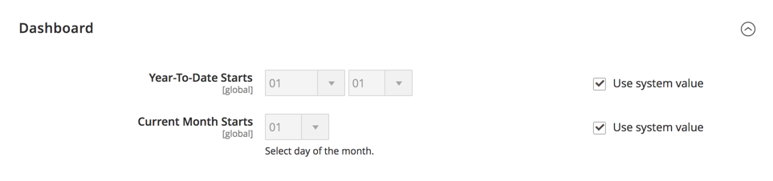

# [!UICONTROL General] > [!UICONTROL Reports]

{{config}}

## [!UICONTROL Dashboard]

<!-- zoom -->

<!-- [Dashboard](https://experienceleague.adobe.com/en/docs/commerce-admin/start/admin/tools/admin-dashboard) -->

| Champ | [Portée](../../getting-started/websites-stores-views.md#scope-settings) | Description |
|--- |--- |--- |
| [!UICONTROL Year-to-Date Starts] | Global | Spécifie le mois et le jour sur lesquels sont basés les calculs de cumul annuel. |
| [!UICONTROL Current Month Starts] | Global | Spécifie le jour du mois utilisé dans les calculs pour marquer le début du mois en cours. |

{style="table-layout:auto"}

## [!UICONTROL General Options]

<!-- zoom -->

>[!NOTE]
>
>Si les fonctions de votre entreprise ne nécessitent pas de création de rapports, nous vous recommandons de désactiver la fonctionnalité de rapports pour améliorer les performances de la boutique. Cependant, certaines fonctionnalités, telles que les segments clients dynamiques, dépendent des données de rapport pour fonctionner correctement.

| Champ | [Portée](../../getting-started/websites-stores-views.md#scope-settings) | Description |
|--- |--- |--- |
| [!UICONTROL Enable Reports] | Global | Active ou désactive les événements de rapport. |
| [!UICONTROL Enable "Product View" Report] | Global | Active ou désactive la collecte de statistiques sur les pages produit consultées. |
| [!UICONTROL Enable "Send Product Link To Friend" Report] | Global | Active ou désactive la collecte de statistiques sur les liens de produits envoyés à des amis. |
| [!UICONTROL Enable "Add Product To Compare List" Report] | Global | Active ou désactive la collecte de statistiques des produits ajoutés à la liste de comparaison. |
| [!UICONTROL Enable "Product Added To Cart" Report] | Global | Active ou désactive la collecte de statistiques sur les produits ajoutés au panier. |
| [!UICONTROL Enable "Product Added To Wishlist" Report] | Global | Active ou désactive la collecte de statistiques sur les produits ajoutés à la liste de souhaits. |
| [!UICONTROL Enable "Share WishList" Report] | Global | Active ou désactive la collecte de statistiques de listes de souhaits partagées. |

{style="table-layout:auto"}
