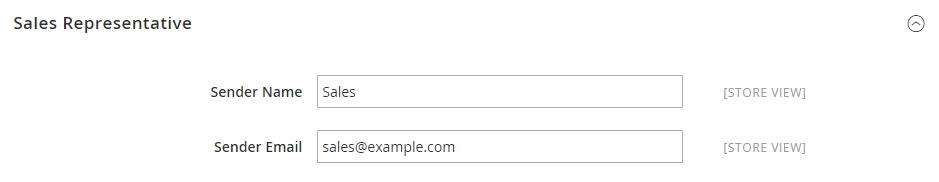

# [!UICONTROL General] > [!UICONTROL Store Email Addresses]

{{config}}

Voir [Stockage des adresses e-mail](../../getting-started/store-details.md#store-email-addresses) pour plus d’informations sur ces champs et options de configuration.

## [!UICONTROL General]

[!BADGE SaaS uniquement]{type=Positive url="https://experienceleague.adobe.com/fr/docs/commerce/user-guides/product-solutions" tooltip="S’applique uniquement aux projets Adobe Commerce as a Cloud Service (infrastructure SaaS gérée par Adobe)."}

<!-- zoom -->

| Champ | [Portée](../../getting-started/websites-stores-views.md#scope-settings) | Description |
|--- |--- |--- |
| [!UICONTROL Storefront Base URL] | Affichage de la boutique | URL de base qui sera utilisée pour créer des liens inclus dans les e-mails destinés aux clients et clientes. L’URL doit se terminer par une barre oblique. Par exemple, `https://www.example.com/`. |

{style="table-layout:auto"}

## [!UICONTROL General Contact]

<!-- zoom -->

| Champ | [Portée](../../getting-started/websites-stores-views.md#scope-settings) | Description |
|--- |--- |--- |
| [!UICONTROL Sender Name] | Affichage de la boutique | Nom qui apparaît comme expéditeur de l’e-mail envoyé par l’identité `General Contact`. |
| [!UICONTROL Sender Email] | Affichage de la boutique | Adresse e-mail associée à l’identité `General Contact`. Sur Adobe Commerce as a Cloud Service, créez un ticket d’assistance pour modifier l’adresse e-mail. |

{style="table-layout:auto"}

## [!UICONTROL Sales Representative]

<!-- zoom -->

| Champ | [Portée](../../getting-started/websites-stores-views.md#scope-settings) | Description |
|--- |--- |--- |
| [!UICONTROL Sender Name] | Affichage de la boutique | Nom qui apparaît comme expéditeur de l’e-mail envoyé par l’identité `Sales Representative`. |
| [!UICONTROL Sender Email] | Affichage de la boutique | Adresse e-mail associée à l’identité `Sales Representative`.  Sur Adobe Commerce as a Cloud Service, créez un ticket d’assistance pour modifier l’adresse e-mail. |

{style="table-layout:auto"}

## [!UICONTROL Customer Support]

<!-- zoom -->

| Champ | [Portée](../../getting-started/websites-stores-views.md#scope-settings) | Description |
|--- |--- |--- |
| [!UICONTROL Sender Name] | Affichage de la boutique | Nom qui apparaît comme expéditeur de l’e-mail envoyé par l’identité `Customer Support`. |
| [!UICONTROL Sender Email] | Affichage de la boutique | Adresse e-mail associée à l’identité `Customer Support`.  Sur Adobe Commerce as a Cloud Service, créez un ticket d’assistance pour modifier l’adresse e-mail. |

{style="table-layout:auto"}

## E-mail personnalisé 1

<!-- zoom -->

| Champ | [Portée](../../getting-started/websites-stores-views.md#scope-settings) | Description |
|--- |--- |--- |
| [!UICONTROL Sender Name] | Affichage de la boutique | Nom qui apparaît comme expéditeur de l’e-mail envoyé par l’identité `Custom 1`. |
| [!UICONTROL Sender Email] | Affichage de la boutique | Adresse e-mail associée à l’identité `Custom 1`.  Sur Adobe Commerce as a Cloud Service, créez un ticket d’assistance pour modifier l’adresse e-mail. |

{style="table-layout:auto"}

## E-mail personnalisé 2

<!-- zoom -->

| Champ | [Portée](../../getting-started/websites-stores-views.md#scope-settings) | Description |
|--- |--- |--- |
| [!UICONTROL Sender Name] | Affichage de la boutique | Nom qui apparaît comme expéditeur de l’e-mail envoyé par l’identité `Custom 2`. |
| [!UICONTROL Sender Email] | Affichage de la boutique | Adresse e-mail associée à l’identité `Custom 2`.  Sur Adobe Commerce as a Cloud Service, créez un ticket d’assistance pour modifier l’adresse e-mail. |

{style="table-layout:auto"}
