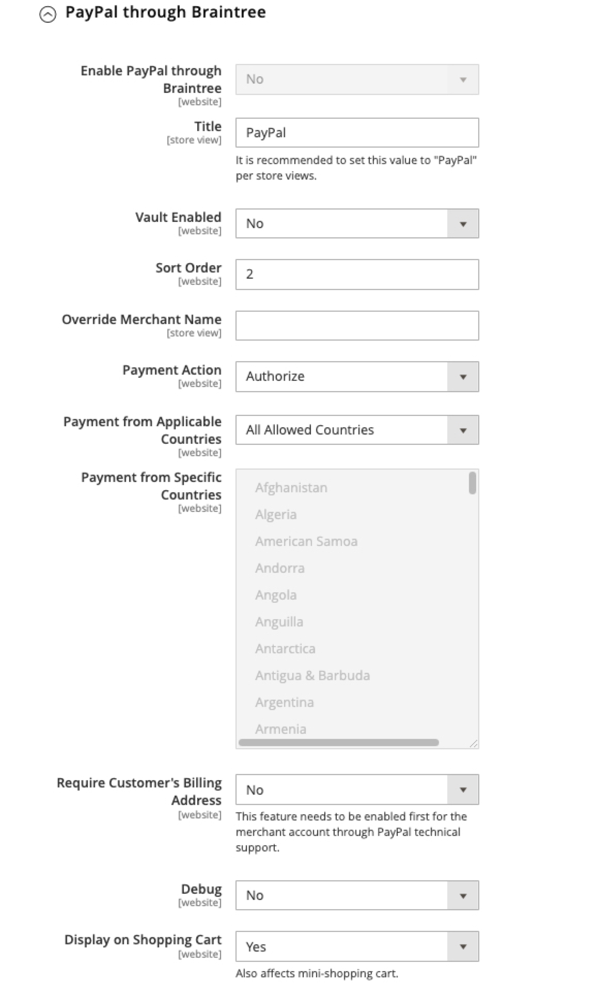

# [!UICONTROL Sales] > [!UICONTROL Payment Methods] > [!UICONTROL Braintree]

>[!IMPORTANT]
>
>**Migration vers Commerce 2.4 :** 
>Pour les versions d’Adobe Commerce et de Magento Open Source antérieures à la version 2.4.0, il était recommandé aux commerçants d’installer et de configurer l’extension officielle d’intégration des paiements de Braintree à partir de la [Commerce Marketplace](https://marketplace.magento.com/catalogsearch/result/?q=braintree) pour remplacer l’intégration principale. Depuis la version 2.4.0, l’extension est désormais incluse dans la version principale.
>  
>Lors de la migration vers Commerce 2.4, les marchands doivent désinstaller l’extension distribuée sur Marketplace (`paypal/module-braintree` ou `gene/module-braintree`) et mettre à jour toutes les personnalisations de code pour utiliser la variable `PayPal_Braintree` espace de noms au lieu de `Magento_Braintree`. Les paramètres de configuration de l’extension groupée pour Commerce et de l’extension distribuée sur le Commerce Marketplace sont conservés. Les paiements placés avec ces versions de l’extension sont capturés, annulés ou remboursés normalement.
>  
>Si vous effectuez une mise à niveau vers Commerce 2.4.0 et que vous n’utilisez pas l’extension de Commerce Marketplace recommandée dans votre version précédente de 2.3.x, la fonctionnalité à plusieurs adresses ne fonctionne pas avec la version 2.4.0 de Braintree. Lorsqu’un acheteur sélectionne _Diffuser à plusieurs adresses_ , le mode de paiement du Braintree n’apparaît pas. L’extension de Commerce Marketplace précédemment recommandée pour la version 2.3.x présente ce problème d’adresse multiple.

{{config}}

{{beta2-updates}}

## [!UICONTROL Basic Braintree Settings]

<!-- zoom -->

| Champ | [Portée](../../getting-started/websites-stores-views.md#scope-settings) | Description |
|--- |--- |--- |
| [!UICONTROL Title] | Affichage en magasin | Valeur par défaut : `Credit Card` (Braintree) |
| [!UICONTROL Environment] | Affichage en magasin | Options : `Sandbox` / `Production` |
| [!UICONTROL Payment Action] | Affichage en magasin | Détermine l’action effectuée par le Braintree lors du traitement d’un paiement. Options :  **`Authorize`**- Les fonds figurant sur la carte de crédit du client sont autorisés, mais pas transférés depuis le compte. Une commande est créée dans votre administrateur de magasin. Vous pourrez ensuite capturer la vente et créer une facture. **`Intent Sale`** (précédemment `Authorize and Capture` dans les versions antérieures) - Les fonds figurant sur la carte de crédit du client sont autorisés et capturés par Braintree, et une commande et une facture sont créées dans votre administrateur de magasin. |
| [!UICONTROL Sandbox Merchant ID] | Affichage en magasin | Il s’agit de l’identifiant unique de votre compte de passerelle sandbox entier. Également appelé _public ID_ ou _identifiant de production_, votre identifiant commercial est différent pour vos passerelles de production et d’environnement de test. Ce champ apparaît lorsque la variable _[!UICONTROL Environment]_est défini sur `Sandbox`. |
| [!UICONTROL Sandbox Public Key] | Affichage en magasin | Il s’agit de votre identifiant public spécifique à l’utilisateur qui limite l’accès aux données chiffrées. Chaque utilisateur associé à votre passerelle de Braintree Sandbox possède sa propre clé publique sandbox. Ce champ apparaît lorsque la variable _[!UICONTROL Environment]_est défini sur `Sandbox`. |
| [!UICONTROL Sandbox Private Key] | Affichage en magasin | Il s’agit de votre identifiant privé spécifique à l’utilisateur qui limite l’accès aux données chiffrées. Chaque utilisateur associé à votre passerelle de Braintree Sandbox possède sa propre clé privée pour l’environnement de test. Ce champ apparaît lorsque la variable _[!UICONTROL Environment]_est défini sur `Sandbox`. |
| [!UICONTROL Merchant ID] | Affichage en magasin | Il s’agit de l’identifiant unique de votre compte de passerelle entier, y compris les plusieurs comptes marchands qui peuvent se trouver dans votre passerelle. Également appelé _public ID_ ou _identifiant de production_, votre identifiant commercial est différent pour vos passerelles de production et d’environnement de test. Ce champ apparaît lorsque la variable _[!UICONTROL Environment]_est défini sur `Production`. |
| [!UICONTROL Public Key] | Affichage en magasin | Il s’agit de votre identifiant public spécifique à l’utilisateur qui limite l’accès aux données chiffrées. Chaque utilisateur associé à votre passerelle de Braintree possède sa propre clé publique. Ce champ apparaît lorsque la variable _[!UICONTROL Environment]_est défini sur `Production`. |
| [!UICONTROL Private Key] | Affichage en magasin | Il s’agit de votre identifiant privé spécifique à l’utilisateur qui limite l’accès aux données chiffrées. Chaque utilisateur associé à votre passerelle de Braintree possède sa propre clé privée. Ce champ apparaît lorsque la variable _[!UICONTROL Environment]_est défini sur `Production`. |
| [!UICONTROL Enable Card Payments] | Site Web | Détermine si le mode de paiement par carte de crédit du Braintree est disponible pour vos clients comme mode de paiement. Options : `Yes` / `No` |
| [!UICONTROL Enable Vault for Card Payments] | Site Web | Lorsqu’elle est activée, cette option permet un stockage sécurisé des informations de paiement des clients, de sorte que les clients n’aient pas à saisir à nouveau leurs informations de carte de crédit pour chaque achat. Options : `Yes` / `No` |
| [!UICONTROL Enable Vault CVV Reverification] | Site Web | Lorsque cette option est activée, la validation est effectuée pour la configuration des règles CVV dans votre compte de Braintree. Options : `Yes` / `No` |

{style="table-layout:auto"}

## [!UICONTROL Advanced Braintree Settings]

{width="550" zoomable="yes"}

| Champ | [Portée](../../getting-started/websites-stores-views.md#scope-settings) | Description |
|--- |--- |--- |
| [!UICONTROL Vault Title] | Site Web | Titre descriptif de votre référence qui identifie le coffre dans lequel les informations de votre carte client sont stockées. |
| [!UICONTROL Merchant Account ID] | Site Web | Identifiant du compte marchand à associer aux transactions Braintree de ce site web. Si rien n’est indiqué, le compte marchand par défaut de votre compte Braintree est utilisé. |
| [!UICONTROL Skip Fraud Checks on Admin Orders] | Site Web | Empêche l’envoi de la transaction pour évaluation dans le cadre de [!DNL Advanced Fraud Tools] vérifie, sur les commandes passées par l’administrateur uniquement lorsqu’il est défini sur `Yes`. Options : `Yes` / `No` |
| [!UICONTROL Bypass Fraud Protection Threshold] | Site Web | `Advanced Fraud Protection` les contrôles sont contournés lorsque la valeur de seuil est atteinte ou dépassée. Si vous laissez ce champ vide, cette option est désactivée. |
| [!UICONTROL Debug] | Site Web | Détermine si les communications entre le système du Braintree et votre magasin sont enregistrées dans un fichier journal. Options : `Yes` / `No` |
| [!UICONTROL CVV Verification] | Site Web | Détermine si les clients sont tenus de fournir le code de sécurité à trois chiffres à partir de l’arrière d’une carte de crédit. Options : `Yes` / `No` |
| [!UICONTROL Send Card Line Items] | Site Web | Envoyez les articles du panier pour tous les modes de paiement. Options : `Yes` / `No` |
| [!UICONTROL Credit Card Types] | Site Web | Indique chaque carte de crédit que vous acceptez comme paiement par le biais de Braintree. Appuyez et maintenez la pression `Ctrl` (ou `Command` sur Mac) pour sélectionner une combinaison de cartes. Options : `American Express` / `Visa` / `MasterCard` / `Discover` / `JCB` / `Diners` / `Maestro International` |
| [!UICONTROL Sort Order] | Site Web | Détermine l’ordre dans lequel Braintree est répertorié avec d’autres méthodes de paiement lors de l’extraction. |

## [!UICONTROL Braintree Webhooks Settings]

<!-- zoom -->

| Champ | [Portée](../../getting-started/websites-stores-views.md#scope-settings) | Description |
|--- |--- |--- |
| [!UICONTROL Enable Webhook] | Site Web | Pour activer la fonctionnalité webhook pour la protection contre la fraude, les paiements ACH et les modes de paiement locaux. Options : `Yes` / `No` |
| [!UICONTROL Fraud Protection URL] | Site Web | Ajoutez cette URL à votre compte de Braintree en tant que [!UICONTROL Webhook Destination URL]. **Cette URL doit être sécurisée et accessible au public.** |
| [!UICONTROL Fraud Protection Approve Order Status] | Site Web | Lorsque la protection anti-fraude est approuvée par Braintree, l’état de la commande sélectionnée est affecté à la commande Commerce. Cet état est utilisé pour mettre à jour l’état de la commande dans laquelle le mode de paiement ACH est utilisé et lorsqu’il passe à `SETTLED` en Braintree. |
| [!UICONTROL Fraud Protection Reject Order Status] | Site Web | Lorsque la protection contre la fraude est rejetée par le Braintree, l’état de la commande sélectionnée est affecté à la commande Commerce. Cet état est utilisé pour mettre à jour l’état de la commande dans laquelle le mode de paiement ACH est utilisé et lorsque `SETTLEMENT` is `DECLINED` en Braintree. |

{style="table-layout:auto"}

## [!UICONTROL Country Specific Settings]

<!-- zoom -->

| Champ | [Portée](../../getting-started/websites-stores-views.md#scope-settings) | Description |
|--- |--- |--- |
| [!UICONTROL Payment from Applicable Countries] | Site Web | Détermine si vous acceptez les paiements traités par le Braintree de tous les pays ou uniquement de certains pays. Options : `All Allowed Countries` / `Specific Countries` |
| [!UICONTROL Payment from Specific Countries] | Site Web | Le cas échéant, identifie les pays spécifiques à partir desquels vous acceptez les paiements traités par le Braintree. |
| [!UICONTROL Country Specific Credit Card Types] | Site Web | Identifie les cartes de crédit acceptées par pays pour les paiements traités par Braintree. Un enregistrement est enregistré pour chaque pays. Options :  **`Country`**- Choisissez le pays. **`Allowed Card Types`** - Sélectionnez chaque carte de crédit acceptée du pays comme paiement par Braintree.  **`Add`**- Ajoutez une ligne afin d’autoriser les cartes de crédit pour un autre pays. **`Action`** - Supprime l’enregistrement des cartes de crédit autorisées pour le pays. |

{style="table-layout:auto"}

## [!UICONTROL ACH through Braintree]

<!-- zoom -->

| Champ | [Portée](../../getting-started/websites-stores-views.md#scope-settings) | Description |
|--- |--- |--- |
| [!UICONTROL Enabled ACH Direct Debit] | Site Web | Détermine si [!DNL ACH Direct Debit] est inclus comme mode de paiement par le biais de Braintree. Options : `Yes` / `No` |
| [!UICONTROL Sort Order] | Site Web | Détermine l’ordre qui [!DNL ACH Direct Debit] est répertorié avec d’autres méthodes de paiement lors du passage en caisse. |

{style="table-layout:auto"}

## [!UICONTROL Apple Pay through Braintree]

<!-- zoom -->

| Champ | [Portée](../../getting-started/websites-stores-views.md#scope-settings) | Description |
|--- |--- |--- |
| [!UICONTROL Enable ApplePay through Braintree] | Site Web | Détermine si le paiement Apple est inclus comme mode de paiement par le biais de Braintree. Options : `Yes` / `No`    Le domaine doit être [vérifié dans Braintree Account first](https://developer.paypal.com/braintree/docs/guides/apple-pay/configuration/javascript/v3). |
| [!UICONTROL Payment Action] | Site Web | Détermine l’action effectuée par le Braintree lors du traitement d’un paiement. Options :  **`Authorize`**- Les fonds figurant sur la carte du client sont autorisés, mais pas transférés depuis le compte du client. Une commande est créée dans votre administrateur de magasin. Vous pourrez ensuite capturer la vente et créer une facture. **`Intent Sale`** - Les fonds figurant sur la carte du client sont autorisés et capturés par le Braintree, et une commande et une facture sont créés dans votre administrateur de magasin. **_Remarque :_** C&#39;était `Authorize and Capture` dans les versions 2.3.x et antérieures. |
| [!UICONTROL Merchant Name] | Affichage en magasin | Libellé affiché pour les clients dans la fenêtre contextuelle ApplePay. |
| [!UICONTROL Sort Order] | Site Web | Détermine la commande pour laquelle le paiement Apple est répertorié avec d’autres méthodes de paiement lors du passage en caisse. |

{style="table-layout:auto"}

## [!UICONTROL Local Payment Methods]

<!-- zoom -->

| Champ | [Portée](../../getting-started/websites-stores-views.md#scope-settings) | Description |
|--- |--- |--- |
| [!UICONTROL Enabled Local Payment Methods] | Site Web | Détermine si le mode de paiement local est inclus comme mode de paiement par le biais de Braintree. Options : `Yes` / `No` |
| [!UICONTROL Title] | Site Web | Libellé qui s’affiche dans la section Mode de paiement du passage en caisse . Valeur par défaut : `Local Payments` |
| [!UICONTROL Allowed Payment Method] | Site Web | Sélectionnez le mode de paiement local à activer. Options : `Bancontact` / `EPS` / `giropay` / `iDeal` / `Klarna Pay Now` / `SOFORT` / `MyBank` / `P24` / `SEPA/ELV Direct Debit` (pas encore pris en charge) |
| [!UICONTROL Sort Order] | Site Web | Détermine la commande selon laquelle le mode de paiement local est répertorié avec d’autres méthodes de paiement lors de l’extraction. |

{style="table-layout:auto"}

>[!NOTE]
>
>L’extension de Braintree groupé ne prend pas en charge tous les modes de paiement locaux répertoriés dans la variable [Documentation destinée aux développeurs Braintree](https://developer.paypal.com/braintree/docs/guides/local-payment-methods/overview). D&#39;autres modes de paiement locaux sont en cours de développement et seront pris en charge dans les prochaines versions.

## [!UICONTROL GooglePay through Braintree]

<!-- zoom -->

| Champ | [Portée](../../getting-started/websites-stores-views.md#scope-settings) | Description |
|--- |--- |--- |
| [!UICONTROL Enabled GooglePay through Braintree] | Site Web | Détermine si [!DNL Google Pay] le paiement est inclus comme mode de paiement par l’intermédiaire de Braintree. Options : `Yes` / `No` |
| [!UICONTROL Payment Action] | Site Web | Détermine l’action effectuée par le Braintree lors du traitement d’un paiement. Options :  **`Authorize`**- Les fonds figurant sur la carte du client sont autorisés, mais pas transférés depuis le compte du client. Une commande est créée dans votre administrateur de magasin. Vous pourrez ensuite capturer la vente et créer une facture. **`Intent Sale`** - Les fonds figurant sur la carte du client sont autorisés et capturés par le Braintree, et une commande et une facture sont créés dans votre administrateur de magasin. **_Remarque :_** C&#39;était `Authorize and Capture` dans les versions 2.3.x et antérieures. |
| [!UICONTROL Button Color] | Site Web | Détermine la couleur de la propriété [!DNL Google Pay] bouton . Options : `White` / `Black` |
| [!UICONTROL Merchant ID] | Affichage en magasin | L’identifiant fourni par Google doit être renseigné ici. |
| [!UICONTROL Accepted Cards] | Site Web | Sélectionnez le type de carte qu’un client peut utiliser pour passer une commande à l’aide de [!DNL Google Pay]. |
| [!UICONTROL Sort Order] | Site Web | Détermine la commande que Google Pay est répertoriée avec d’autres méthodes de paiement lors du passage en caisse. |

{style="table-layout:auto"}

## [!UICONTROL Venmo through Braintree]

<!-- zoom -->

| Champ | [Portée](../../getting-started/websites-stores-views.md#scope-settings) | Description |
|--- |--- |--- |
| [!UICONTROL Enable Venmo through Braintree] | Site Web | Détermine si [!DNL Venmo] est inclus comme mode de paiement par le biais de Braintree. Options : `Yes` / `No` |
| [!UICONTROL Payment Action] | Site Web | Détermine l’action effectuée par le Braintree lors du traitement d’un paiement. Options :  **`Authorize`**- Les fonds figurant sur la carte du client sont autorisés, mais pas transférés depuis le compte du client. Une commande est créée dans votre administrateur de magasin. Vous pourrez ensuite capturer la vente et créer une facture. **`Intent Sale`** - Les fonds figurant sur la carte du client sont autorisés et capturés par le Braintree, et une commande et une facture sont créés dans votre administrateur de magasin. **_Remarque :_** C&#39;était  _Autoriser et capturer_ dans les versions 2.3.x et antérieures. |
| [!UICONTROL Sort Order] | Site Web | Détermine la commande que Venmo est répertorié avec d’autres méthodes de paiement lors du passage en caisse. |

{style="table-layout:auto"}

## [!UICONTROL PayPal through Braintree]

{width="550" zoomable="yes"}

| Champ | [Portée](../../getting-started/websites-stores-views.md#scope-settings) | Description |
|--- |--- |--- |
| [!UICONTROL Enable PayPal through Braintree] | Site Web | Détermine si PayPal est inclus comme mode de paiement par le biais de Braintree. Options : `Yes` / `No` |
| [!UICONTROL Enable PayPal Credit through Braintree] | Site Web | Détermine si le crédit PayPal est inclus comme mode de paiement par le biais de Braintree. Options : `Yes` / `No`. Ce champ est visible lorsque `Enable PayPal through Braintree` est défini sur `Yes` |
| [!UICONTROL Enable PayPal PayLater through Braintree] | Site Web | Détermine si PayPal PayLater est inclus comme mode de paiement par le biais de Braintree. Options : `Yes` / `No`. Ce champ est visible lorsque `Enable PayPal through Braintree` est défini sur `Yes` |
| [!UICONTROL Title] | Affichage en magasin | Libellé qui identifie PayPal par l’intermédiaire du Braintree aux clients lors du passage en caisse. Valeur par défaut : `PayPal` |
| [!UICONTROL Vault Enabled] | Site Web | Lorsqu’elle est activée, permet d’assurer un stockage sécurisé des informations de paiement des clients, de sorte que les clients n’aient pas à entrer à nouveau leurs informations PayPal pour chaque achat. Options : `Yes` / `No` |
| [!UICONTROL Sort Order] | Site Web | Numéro qui détermine l’ordre dans lequel PayPal par l’intermédiaire du Braintree est répertorié avec d’autres méthodes de paiement lors du passage en caisse. |
| [!UICONTROL Override Merchant Name] | Affichage en magasin | Nom alternatif pouvant être utilisé pour identifier le marchand pour chaque vue de magasin. |
| [!UICONTROL Payment Action] | Site Web | Détermine l’action effectuée par PayPal via Braintree lors du traitement d’un paiement. Options :  **`Authorize`**- Les fonds figurant sur la carte du client sont autorisés, mais pas transférés depuis le compte du client. Une commande est créée dans votre administrateur de magasin. Vous pourrez ensuite capturer la vente et créer une facture. **`Authorize and Capture`** - Les fonds figurant sur la carte du client sont autorisés et capturés par PayPal via Braintree, et une commande et une facture sont créées dans votre administrateur de magasin. |
| [!UICONTROL Payment from Applicable Countries] | Site Web | Détermine si vous acceptez des paiements traités par PayPal par l’intermédiaire de Braintree provenant de tous les pays ou uniquement de pays spécifiques. Options : `All Allowed Countries` / `Specific Countries` |
| [!UICONTROL Payment from Specific Countries] | Site Web | Le cas échéant, identifie les pays spécifiques à partir desquels vous acceptez les paiements traités par le Braintree. |
| [!UICONTROL Require Customer's Billing Address] | Site Web | Détermine si l’adresse de facturation du client est requise pour envoyer une commande. Options : `Yes` / `No` |
| [!UICONTROL Debug] | Site Web | Détermine si les communications entre PayPal via le système de Braintree et votre boutique sont enregistrées dans un fichier journal. Options : `Yes` / `No` |
| [!UICONTROL Display on Shopping Cart] | Site Web | Détermine si le bouton PayPal apparaît dans la variable [mini-panier](../../stores-purchase/cart-configuration.md#mini-cart) et sur le [panier](../../stores-purchase/cart.md) page. Options : `Yes` / `No` |

{style="table-layout:auto"}

### [!UICONTROL Styling]

<!-- zoom -->

| Champ | [Portée](../../getting-started/websites-stores-views.md#scope-settings) | Description |
|--- |--- |--- |
| [!UICONTROL Location] | Site Web | Détermine où les boutons et messages PayPal sont rendus sur le storefront. Options : `Mini-Cart and Cart Page` / `Checkout Page` / `Product Page` |

{style="table-layout:auto"}

**[!UICONTROL Mini-Cart and Cart Page]**

L’option et les paramètres de cette section varient en fonction du paramètre défini dans la variable _[!UICONTROL Location]_champ .

| Champ | [Portée](../../getting-started/websites-stores-views.md#scope-settings) | Description |
|--- |--- |--- |
| [!UICONTROL PayPal Button Type] | Site Web | Définit le bouton sur trois types : `PayPal Button` / `PayPal Pay Later Button` / `PayPal Credit Button` |

**[!UICONTROL PayPal Button]**

Les options et paramètres de cette section varient en fonction du type de bouton sélectionné dans la variable _[!UICONTROL PayPal Button Type]_champ .

| Champ | [Portée](../../getting-started/websites-stores-views.md#scope-settings) | Description |
|--- |--- |--- |
| [!UICONTROL Show PayPal Button] | Site Web | Détermine l’emplacement du bouton PayPal sur l’emplacement sélectionné. Options : `Yes` / `No` |
| [!UICONTROL Button Label] | Site Web | Détermine le libellé du bouton PayPal. Options : `Paypal` / `Checkout` / `Buy Now` / `Pay` |
| [!UICONTROL Color] | Site Web | Détermine la couleur du bouton PayPal. Options : `Blue` / `Black` / `Gold` / `Silver` |
| [!UICONTROL Shape] | Site Web | Détermine la forme du bouton PayPal. Options : `Pill` / `Rectangle` |
| [!UICONTROL Size] | Site Web | Détermine la taille du bouton PayPal. Options : `Medium` / `Large` / `Responsive` |

{style="table-layout:auto"}

**[!UICONTROL PayLater Messaging]**

| Champ | [Portée](../../getting-started/websites-stores-views.md#scope-settings) | Description |
|--- |--- |--- |
| [!UICONTROL Show PayLater Messaging] | Site Web | Active la messagerie PayLater à l’emplacement sélectionné. Options : `Yes` / `No`. Lorsqu’il est activé, il affiche la messagerie PayLater pour les offres disponibles ([restrictions](https://developer.paypal.com/docs/checkout/pay-later/us/)). |
| [!UICONTROL Message Layout] | Site Web | Détermine la disposition du message PayLater. Options : `Text` / `Flex` |
| [!UICONTROL Logo] | Site Web | Détermine le type de logo utilisé pour le bouton PayPal. Options : `Inline` / `Primary` / `Alternative` / `None` |
| [!UICONTROL Logo Position] | Site Web | Détermine la position du logo pour le bouton PayPal. Options : `Left` / `Right` / `Top` |
| [!UICONTROL Text Color] | Site Web | Détermine la couleur du texte du bouton PayPal. Options : `Black` / `White` / `Monochrome` / `Grayscale` |

{style="table-layout:auto"}

Lorsque ces options sont définies, vous pouvez voir l’aperçu des boutons PayPal et des messages PayLater. Vous pouvez utiliser des commandes pour appliquer les paramètres ou réinitialiser les valeurs :

| Champ | [Portée](../../getting-started/websites-stores-views.md#scope-settings) | Description |
|--- |--- |--- |
| [!UICONTROL Apply] | Site Web | Stocke les paramètres de style sélectionnés pour les boutons et la messagerie PayLater et les applique à l’emplacement actuel et au type de bouton actuel. |
| [!UICONTROL Apply to All Buttons] | Site Web | Stocke les paramètres de style sélectionnés pour les boutons et les valeurs de messagerie PayLater et les applique à tous les types de boutons et emplacements. |
| [!UICONTROL Reset to Recommended Defaults] | Site Web | Renvoie les paramètres de style aux valeurs par défaut recommandées pour les boutons et la messagerie PayLater et les applique à tous les types et emplacements de boutons. |

{style="table-layout:auto"}

## Paramètres de vérification sécurisée 3d

<!-- zoom -->

| Champ | [Portée](../../getting-started/websites-stores-views.md#scope-settings) | Description |
|--- |--- |--- |
| [!UICONTROL 3D Secure Verification] | Site Web | Détermine si une transaction doit réussir un processus de vérification supplémentaire lorsque le client est inscrit dans un programme tel que _Vérifié par VISA_. Options : `Yes` / `No` |
| [!UICONTROL Always request 3DS] | Site Web | Envoyez toujours une requête sécurisée 3D pour toutes les transactions. Options : `Yes` / `No` |
| [!UICONTROL Threshold Amount] | Site Web | Détermine le montant maximal de commande autorisé pour le traitement sur une seule commande. Braintree refuse l’autorisation si le montant de la commande dépasse ce seuil. |
| [!UICONTROL Verify for Applicable Countries] | Site Web | Détermine les pays dans lesquels le paiement doit être vérifié. Options : `All Allowed Countries` / `Specific Countries` |
| [!UICONTROL Verify for Specific Countries] | Site Web | Le cas échéant, identifie les pays spécifiques à partir desquels le paiement par Braintree doit être vérifié. |

{style="table-layout:auto"}

## [!UICONTROL Dynamic Descriptors]

<!-- zoom -->

| Champ | [Portée](../../getting-started/websites-stores-views.md#scope-settings) | Description |
|--- |--- |--- |
| [!UICONTROL Name] | Affichage en magasin | Le descripteur de nom comporte deux parties, séparées par un astérisque (*). La première partie du descripteur identifie la société ou l’application de données côté serveur et la seconde partie identifie le produit. Par exemple : `company*myproduct`    La longueur des parties Société et Produit du descripteur peut être allouée comme suit, pour une longueur combinée pouvant aller jusqu’à 22 caractères :  **`Option 1`**- La société doit comporter trois caractères ; le produit peut contenir jusqu’à 18 caractères. **`Option 2`** - La société doit comporter sept caractères ; le produit peut contenir jusqu’à 14 caractères.  **`Option 3`**- La société doit comporter 12 caractères / Le produit peut contenir jusqu’à neuf caractères |
| [!UICONTROL Phone] | Affichage en magasin | Le descripteur de téléphone doit comporter de dix à 14 caractères et ne peut contenir que des nombres, des tirets, des parenthèses et des points. Par exemple: `9999999999` `(999) 999-9999` `999.999.9999` |
| [!UICONTROL URL] | Affichage en magasin | Le descripteur d’URL représente votre nom de domaine et peut contenir jusqu’à 13 caractères. Par exemple: `company.com` |

{style="table-layout:auto"}
