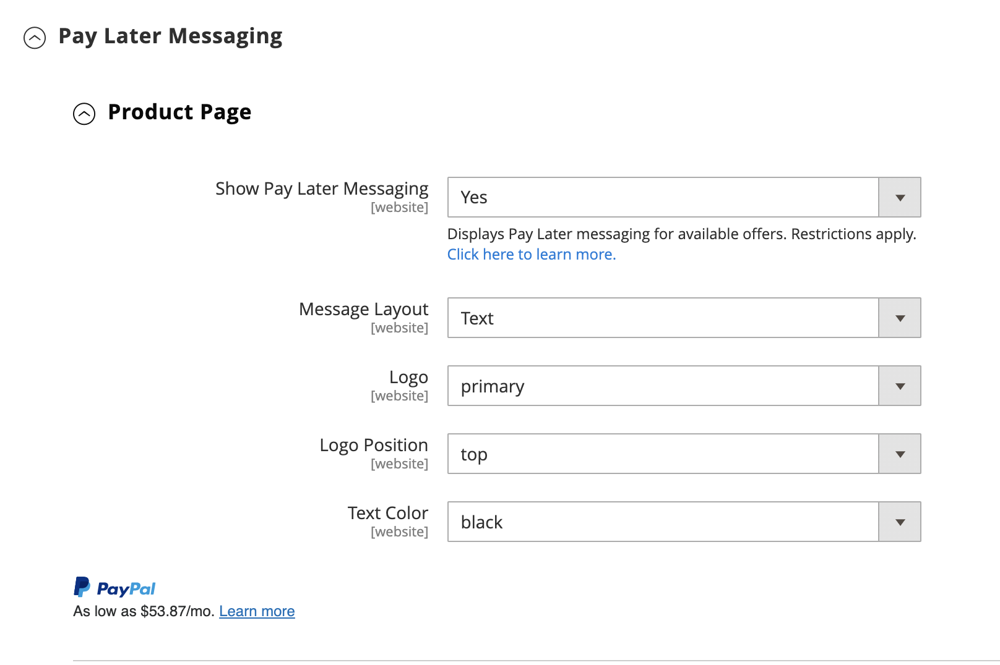

# [!UICONTROL Sales] > [!UICONTROL Payment Methods] > [!UICONTROL Braintree]

>[!IMPORTANT]
>
>**Migration de Commerce 2.4 :** 
>Pour les versions d’Adobe Commerce et de Magento Open Source antérieures à la version 2.4.0, il était recommandé aux commerçants d’installer et de configurer l’extension d’intégration des paiements Braintree officielle à partir de [Commerce Marketplace](https://marketplace.magento.com/catalogsearch/result/?q=braintree) pour remplacer l’intégration principale. Depuis la version 2.4.0, l’extension est désormais incluse dans la version principale.
>  
>Lors de la migration vers Commerce 2.4, les commerçants doivent désinstaller l’extension distribuée sur Marketplace (`paypal/module-braintree` ou `gene/module-braintree`) et mettre à jour toutes les personnalisations de code pour utiliser l’espace de noms `PayPal_Braintree` au lieu de `Magento_Braintree`. Les paramètres de configuration de l’extension groupée pour Commerce et de l’extension distribuée sur Commerce Marketplace sont conservés. Les paiements placés avec ces versions de l’extension sont capturés, annulés ou remboursés normalement.
>  
>Si vous effectuez une mise à niveau vers Commerce 2.4.0 et n’utilisez pas l’extension Commerce Marketplace recommandée dans votre version 2.3.x précédente, la fonctionnalité multi-adresses ne fonctionne pas avec la version 2.4.0 de Braintree. Lorsqu’un acheteur sélectionne _diffuser à plusieurs adresses_ , le mode de paiement Braintree n’apparaît pas. L’extension Commerce Marketplace précédemment recommandée pour la version 2.3.x présente ce problème d’adresses multiples.

{{config}}

>[!IMPORTANT]
>
>Si vous avez besoin d&#39;aide pour régler des frais imprévus sur votre carte, consultez la page [annuler l&#39;abonnement](https://helpx.adobe.com/manage-account/using/cancel-subscription.html) pour obtenir de l&#39;aide.

## [!UICONTROL Basic Braintree Settings]

<!-- zoom -->

| Champ | [Portée](../../getting-started/websites-stores-views.md#scope-settings) | Description |
|--- |--- |--- |
| [!UICONTROL Title] | Affichage de la boutique | Valeur par défaut : `Credit Card` (Braintree) |
| [!UICONTROL Environment] | Affichage de la boutique | Options : `Sandbox` / `Production` |
| [!UICONTROL Payment Action] | Affichage de la boutique | Détermine l&#39;action entreprise par Braintree lors du traitement d&#39;un paiement. Options :  **`Authorize`**- Les fonds sur la carte de crédit du client sont autorisés, mais pas transférés du compte. Une commande est créée dans l’administration de votre boutique. Vous pouvez ensuite capturer la vente et créer une facture. **`Intent Sale`** (précédemment `Authorize and Capture` dans des versions antérieures) : les fonds figurant sur la carte de crédit du client sont autorisés et saisis par Braintree. Une commande et une facture sont créées dans l’administration de votre boutique. |
| [!UICONTROL Sandbox Merchant ID] | Affichage de la boutique | Il s’agit de l’identifiant unique de l’ensemble de votre compte de passerelle Sandbox. Également appelé _ID public_ ou _ID de production_, votre ID de commerçant est différent pour vos passerelles de production et sandbox. Ce champ s’affiche lorsque le champ _[!UICONTROL Environment]_&#x200B;est défini sur `Sandbox`. |
| [!UICONTROL Sandbox Public Key] | Affichage de la boutique | Il s’agit de votre identifiant public spécifique à l’utilisateur qui limite l’accès aux données chiffrées. Chaque utilisateur associé à votre passerelle Braintree Sandbox dispose de sa propre clé publique Sandbox. Ce champ s’affiche lorsque le champ _[!UICONTROL Environment]_&#x200B;est défini sur `Sandbox`. |
| [!UICONTROL Sandbox Private Key] | Affichage de la boutique | Il s’agit de votre identifiant privé spécifique à l’utilisateur qui limite l’accès aux données chiffrées. Chaque utilisateur associé à votre passerelle Braintree Sandbox dispose de sa propre clé privée pour la sandbox. Ce champ s’affiche lorsque le champ _[!UICONTROL Environment]_&#x200B;est défini sur `Sandbox`. |
| [!UICONTROL Merchant ID] | Affichage de la boutique | Il s’agit de l’identifiant unique de l’ensemble de votre compte de passerelle, y compris les différents comptes commerçants qui peuvent se trouver dans votre passerelle. Également appelé _ID public_ ou _ID de production_, votre ID de commerçant est différent pour vos passerelles de production et sandbox. Ce champ s’affiche lorsque le champ _[!UICONTROL Environment]_&#x200B;est défini sur `Production`. |
| [!UICONTROL Public Key] | Affichage de la boutique | Il s’agit de votre identifiant public spécifique à l’utilisateur qui limite l’accès aux données chiffrées. Chaque utilisateur associé à votre passerelle Braintree dispose de sa propre clé publique. Ce champ s’affiche lorsque le champ _[!UICONTROL Environment]_&#x200B;est défini sur `Production`. |
| [!UICONTROL Private Key] | Affichage de la boutique | Il s’agit de votre identifiant privé spécifique à l’utilisateur qui limite l’accès aux données chiffrées. Chaque utilisateur associé à votre passerelle Braintree dispose de sa propre clé privée. Ce champ s’affiche lorsque le champ _[!UICONTROL Environment]_&#x200B;est défini sur `Production`. |
| [!UICONTROL Enable Card Payments] | Site internet | Détermine si le mode de paiement par carte de crédit Braintree est disponible pour vos clients en tant que mode de paiement. Options : `Yes` / `No` |
| [!UICONTROL Enable Vault for Card Payments] | Site internet | Lorsqu’il est activé, fournit un stockage sécurisé pour les informations de paiement du client, de sorte que les clients n’aient pas à saisir à nouveau leurs informations de carte de crédit pour chaque achat. Options : `Yes` / `No` |
| [!UICONTROL Enable Vault CVV Re-verification] | Site internet | Une fois activée, la validation est effectuée pour la configuration des règles CVV dans votre compte Braintree. Options : `Yes` / `No` |

{style="table-layout:auto"}

## [!UICONTROL Advanced Braintree Settings]

{width="550" zoomable="yes"}

| Champ | [Portée](../../getting-started/websites-stores-views.md#scope-settings) | Description |
|--- |--- |--- |
| [!UICONTROL Vault Title] | Site internet | Titre descriptif pour votre référence qui identifie le coffre dans lequel vos informations de carte client sont stockées. |
| [!UICONTROL Merchant Account ID] | Site internet | Identifiant du compte marchand à associer aux transactions Braintree à partir de ce site web. Si rien n’est indiqué, le compte marchand par défaut de votre compte Braintree est utilisé. |
| [!UICONTROL Enable Checkout Express Payments] | Site internet | Offre une expérience de paiement plus rapide avec les options de paiement express au début du processus de paiement, y compris PayPal, PayLater, Apple Pay et Google Pay. Options : `Yes` / `No` |
| [!UICONTROL Skip Fraud Checks on Admin Orders] | Site internet | Empêche l&#39;envoi de la transaction pour évaluation dans le cadre de contrôles [!DNL Advanced Fraud Tools], sur les commandes passées via l&#39;administrateur uniquement lorsqu&#39;elle est définie sur `Yes`. Options : `Yes` / `No` |
| [!UICONTROL Bypass Fraud Protection Threshold] | Site internet | Les vérifications `Advanced Fraud Protection` sont ignorées lorsque la valeur de seuil est atteinte ou dépassée. Si vous ne renseignez pas ce champ, cette option est désactivée. |
| [!UICONTROL Debug] | Site internet | Détermine si les communications entre le système Braintree et votre magasin sont enregistrées dans un fichier journal. Options : `Yes` / `No` |
| [!UICONTROL CVV Verification] | Site internet | Détermine si les clients doivent fournir le code de sécurité à trois chiffres au dos d’une carte de crédit. Options : `Yes` / `No` |
| [!UICONTROL Send Card Line Items] | Site internet | Envoyer les articles de la ligne de panier pour tous les modes de paiement. Options : `Yes` / `No` |
| [!UICONTROL Credit Card Types] | Site internet | Spécifie chaque carte de crédit que vous acceptez comme paiement via Braintree. Maintenez la touche `Ctrl` enfoncée (ou `Command` sur Mac) pour sélectionner une combinaison de cartes. Options : `American Express` / `Visa` / `MasterCard` / `Discover` / `JCB` / `Diners` / `Maestro International` |
| [!UICONTROL Sort Order] | Site internet | Détermine l’ordre dans lequel Braintree est répertorié avec d’autres modes de paiement lors du passage en caisse. |

## [!UICONTROL Braintree Webhooks Settings]

<!-- zoom -->

| Champ | [Portée](../../getting-started/websites-stores-views.md#scope-settings) | Description |
|--- |--- |--- |
| [!UICONTROL Enable Webhook] | Site internet | Activer la fonctionnalité webhook pour la protection contre la fraude, les paiements ACH, les méthodes de paiement locales et les litiges. Options : `Yes` / `No` |
| [!UICONTROL Fraud Protection URL] | Site internet | Ajoutez cette URL à votre compte Braintree en tant que [!UICONTROL Webhook Destination URL]. **Cette URL doit être sécurisée et accessible au public.** |
| [!UICONTROL Fraud Protection Approve Order Status] | Site internet | Lorsque la protection contre la fraude est approuvée par Braintree, le statut de la commande sélectionnée est attribué à la commande Commerce. Ce statut est utilisé pour mettre à jour le statut de la commande dans laquelle le mode de paiement ACH est utilisé et lorsqu&#39;elle passe à `SETTLED` dans Braintree. |
| [!UICONTROL Fraud Protection Reject Order Status] | Site internet | Lorsque la protection contre la fraude est rejetée par Braintree, le statut de la commande sélectionnée est attribué à la commande Commerce. Ce statut est utilisé pour mettre à jour le statut de la commande où le mode de paiement ACH est utilisé et quand `SETTLEMENT` est `DECLINED` dans Braintree. |

{style="table-layout:auto"}

## [!UICONTROL Country Specific Settings]

<!-- zoom -->

| Champ | [Portée](../../getting-started/websites-stores-views.md#scope-settings) | Description |
|--- |--- |--- |
| [!UICONTROL Payment from Applicable Countries] | Site internet | Détermine si vous acceptez des paiements traités par Braintree depuis tous les pays ou uniquement des pays spécifiques. Options : `All Allowed Countries` / `Specific Countries` |
| [!UICONTROL Payment from Specific Countries] | Site internet | Le cas échéant, indique les pays spécifiques à partir desquels vous acceptez les paiements traités par Braintree. |
| [!UICONTROL Country Specific Credit Card Types] | Site internet | Indique les cartes de crédit acceptées par pays pour les paiements traités par Braintree. Un enregistrement est enregistré pour chaque pays. Options :  **`Country`**- Choisissez le pays. **`Allowed Card Types`** - Sélectionnez chaque carte de crédit acceptée depuis le pays pour le paiement via Braintree.  **`Add`**- Ajoutez une ligne pour autoriser les cartes de crédit pour un autre pays. **`Action`** - Supprime l&#39;enregistrement des cartes de crédit autorisées pour le pays. |

{style="table-layout:auto"}

## [!UICONTROL ACH through Braintree]

<!-- zoom -->

| Champ | [Portée](../../getting-started/websites-stores-views.md#scope-settings) | Description |
|--- |--- |--- |
| [!UICONTROL Enabled ACH Direct Debit] | Site internet | Détermine si [!DNL ACH Direct Debit] est inclus comme mode de paiement via Braintree. Options : `Yes` / `No` |
| [!UICONTROL Enable Vault for ACH Direct Debit] | Site internet | Les clients peuvent mettre en chambre forte ou stocker leur méthode de paiement ACH Direct Debit à usage unique pour une utilisation ultérieure. Une fois les détails de paiement enregistrés, le client peut utiliser la méthode de paiement ACH Direct Debit sans saisir à nouveau les données ni authentifier à nouveau ses informations de paiement. Options : `Yes` / `No` |
| [!UICONTROL Sort Order] | Site internet | Détermine l&#39;ordre dans lequel [!DNL ACH Direct Debit] est répertorié avec d&#39;autres modes de paiement lors du passage en caisse. |

{style="table-layout:auto"}

## [!UICONTROL Apple Pay through Braintree]

<!-- zoom -->

| Champ | [Portée](../../getting-started/websites-stores-views.md#scope-settings) | Description |
|--- |--- |--- |
| [!UICONTROL Enable ApplePay through Braintree] | Site internet | Détermine si Apple Pay est inclus comme mode de paiement via Braintree. Options : `Yes` / `No`    Le domaine doit d’abord être [vérifié dans le compte Braintree](https://developer.paypal.com/braintree/docs/guides/apple-pay/configuration/javascript/v3). |
| [!UICONTROL Enable Vault for ApplePay] | Site internet | Les clients peuvent mettre en coffre/stocker leur mode de paiement Apple Pay pour une utilisation ultérieure. Une fois les informations de paiement enregistrées, le client peut utiliser Apple Pay sans saisir à nouveau les données ni authentifier à nouveau les informations de paiement. Options : `Yes` / `No` |
| [!UICONTROL Payment Action] | Site internet | Détermine l&#39;action entreprise par Braintree lors du traitement d&#39;un paiement. Options :  **`Authorize`**- Les fonds figurant sur la carte du client sont autorisés, mais ne sont pas transférés à partir du compte du client. Une commande est créée dans l’administration de votre boutique. Vous pouvez ensuite capturer la vente et créer une facture. **`Intent Sale`** - Les fonds figurant sur la carte du client sont autorisés et saisis par Braintree. Une commande et une facture sont créées dans votre administrateur de boutique. **_Remarque :_** cela a été `Authorize and Capture` dans la version 2.3.x et les versions antérieures. |
| [!UICONTROL Merchant Name] | Affichage de la boutique | Libellé affiché pour les clients dans la fenêtre contextuelle ApplePay. |
| [!UICONTROL Sort Order] | Site internet | Détermine l’ordre dans lequel Apple Pay est répertorié avec d’autres modes de paiement lors du passage en caisse. |

{style="table-layout:auto"}

## [!UICONTROL Local Payment Methods]

<!-- zoom -->

| Champ | [Portée](../../getting-started/websites-stores-views.md#scope-settings) | Description |
|--- |--- |--- |
| [!UICONTROL Enabled Local Payment Methods] | Site internet | Détermine si le mode de paiement local est inclus comme mode de paiement via Braintree. Options : `Yes` / `No` |
| [!UICONTROL Title] | Site internet | Libellé qui apparaît dans la section Mode de paiement de la commande. Valeur par défaut: `Local Payments` |
| [!UICONTROL Fallback Button Text] | Site internet | Entrez le texte à utiliser pour le bouton qui apparaît sur la page de Braintree de secours qui ramène les clients sur le site Web. Valeur par défaut: `Complete Checkout` |
| [!UICONTROL Redirect on Fail] | Site internet | Spécifie l’URL où les clients doivent être redirigés lorsque les transactions de mode de paiement local sont annulées, échouent ou rencontrent des erreurs. Il doit s’agir de la page de paiement du passage en caisse (par exemple, `https://www.domain.com/checkout#payment`). |
| [!UICONTROL Allowed Payment Method] | Site internet | Sélectionnez le mode de paiement local à activer. Options : `Bancontact` / `EPS` / `iDeal` / `MyBank` / `P24` / `SEPA/ELV Direct Debit` |
| [!UICONTROL Sort Order] | Site internet | Détermine l&#39;ordre dans lequel le mode de paiement local est répertorié avec d&#39;autres modes de paiement lors du passage en caisse. |

{style="table-layout:auto"}

>[!NOTE]
>
>L’extension Braintree groupée ne prend pas en charge tous les modes de paiement locaux répertoriés dans la [documentation du développeur Braintree](https://developer.paypal.com/braintree/docs/guides/local-payment-methods/overview). D’autres méthodes de paiement locales sont en cours de développement et seront prises en charge dans les prochaines versions.

## [!UICONTROL GooglePay through Braintree]

<!-- zoom -->

| Champ | [Portée](../../getting-started/websites-stores-views.md#scope-settings) | Description |
|--- |--- |--- |
| [!UICONTROL Enabled GooglePay through Braintree] | Site internet | Détermine si [!DNL Google Pay] paiement est inclus comme mode de paiement via Braintree. Options : `Yes` / `No` |
| [!UICONTROL Enable Vault for GooglePay] | Site internet | Les clients peuvent mettre en coffre/stocker leur mode de paiement Google Pay pour une utilisation ultérieure. Une fois les informations de paiement enregistrées, le client peut utiliser Google Pay sans saisir à nouveau les données ni authentifier à nouveau les informations de paiement. Options : `Yes` / `No` |
| [!UICONTROL Payment Action] | Site internet | Détermine l&#39;action entreprise par Braintree lors du traitement d&#39;un paiement. Options :  **`Authorize`**- Les fonds figurant sur la carte du client sont autorisés, mais ne sont pas transférés à partir du compte du client. Une commande est créée dans l’administration de votre boutique. Vous pouvez ensuite capturer la vente et créer une facture. **`Intent Sale`** - Les fonds figurant sur la carte du client sont autorisés et saisis par Braintree. Une commande et une facture sont créées dans votre administrateur de boutique. **_Remarque :_** cela a été `Authorize and Capture` dans la version 2.3.x et les versions antérieures. |
| [!UICONTROL Button Color] | Site internet | Détermine la couleur du bouton [!DNL Google Pay]. Options : `White` / `Black` |
| [!UICONTROL Merchant ID] | Affichage de la boutique | L’identifiant fourni par Google doit être saisi ici. |
| [!UICONTROL Accepted Cards] | Site internet | Sélectionnez le type de cartes qu’un client peut utiliser pour passer une commande à l’aide de [!DNL Google Pay]. |
| [!UICONTROL Sort Order] | Site internet | Détermine l&#39;ordre dans lequel Google Pay est répertorié avec d&#39;autres modes de paiement lors de la passage en caisse. |

{style="table-layout:auto"}

## [!UICONTROL Venmo through Braintree]

<!-- zoom -->

| Champ | [Portée](../../getting-started/websites-stores-views.md#scope-settings) | Description |
|--- |--- |--- |
| [!UICONTROL Enable Venmo through Braintree] | Site internet | Détermine si [!DNL Venmo] est inclus comme mode de paiement via Braintree. Options : `Yes` / `No` |
| [!UICONTROL Enable Vault for Venmo] | Site internet | Les clients peuvent mettre en coffre/stocker leur mode de paiement Venmo pour une utilisation ultérieure. Une fois les détails de paiement enregistrés, le client peut utiliser la méthode de paiement Venmo sans saisir à nouveau les données ni authentifier à nouveau ses informations de paiement. Options : `Yes` / `No` |
| [!UICONTROL Payment Action] | Site internet | Détermine l&#39;action entreprise par Braintree lors du traitement d&#39;un paiement. Options :  **`Authorize`**- Les fonds figurant sur la carte du client sont autorisés, mais ne sont pas transférés à partir du compte du client. Une commande est créée dans l’administration de votre boutique. Vous pouvez ensuite capturer la vente et créer une facture. **`Intent Sale`** - Les fonds figurant sur la carte du client sont autorisés et saisis par Braintree. Une commande et une facture sont créées dans votre administrateur de boutique. **_Remarque :_** il s’agissait de _Autoriser et capturer_ dans la version 2.3.x et les versions antérieures. |
| [!UICONTROL Sort Order] | Site internet | Détermine l&#39;ordre dans lequel Venmo est listé avec d&#39;autres modes de paiement lors de la commande. |

{style="table-layout:auto"}

## [!UICONTROL PayPal through Braintree]

{width="550" zoomable="yes"}
{width="550" zoomable="yes"}

| Champ | [Portée](../../getting-started/websites-stores-views.md#scope-settings) | Description |
|--- |--- |--- |
| [!UICONTROL Enable PayPal through Braintree] | Site internet | Détermine si PayPal est inclus comme mode de paiement via Braintree. Options : `Yes` / `No` |
| [!UICONTROL Enable PayPal Credit through Braintree] | Site internet | Détermine si le crédit PayPal est inclus comme mode de paiement via Braintree. Options : `Yes` / `No`. Ce champ devient visible lorsque `Enable PayPal through Braintree` est défini sur `Yes` |
| [!UICONTROL Enable PayPal PayLater through Braintree] | Site internet | Détermine si PayPal PayLater est inclus comme mode de paiement via Braintree. Options : `Yes` / `No`. Ce champ est visible lorsque est définie sur `Enable PayPal through Braintree` `Yes` |
| [!UICONTROL Title] | Vue du magasin | Libellé qui identifie les PayPal via Braintree aux clients lors du passage en caisse. Valeur par défaut: `PayPal` |
| [!UICONTROL Vault Enabled] | Site internet | Lorsqu&#39;il est activé, fournit un stockage sécurisé pour les informations de paiement du client, afin que les clients n&#39;aient pas à saisir à nouveau leurs informations PayPal pour chaque achat. Options : `Yes` / `No` |
| [!UICONTROL Send Cart Line Items for PayPal] | Site internet | Envoyez les articles de ligne (articles de commande) à PayPal avec les cartes-cadeaux, l&#39;emballage-cadeau pour les articles, l&#39;emballage-cadeau pour la commande, le crédit de magasin, l&#39;expédition et la taxe en tant qu&#39;articles de ligne. Options : `Yes` / `No` |
| [!UICONTROL Sort Order] | Site internet | Un numéro qui détermine l&#39;ordre dans lequel PayPal via Braintree est répertorié avec d&#39;autres modes de paiement lors du passage en caisse. |
| [!UICONTROL Override Merchant Name] | Affichage de la boutique | Autre nom pouvant être utilisé pour identifier le commerçant pour chaque vue de magasin. |
| [!UICONTROL Payment Action] | Site internet | Détermine l&#39;action entreprise par PayPal via Braintree lorsqu&#39;un paiement est traité. Options :  **`Authorize`**- Les fonds figurant sur la carte du client sont autorisés, mais ne sont pas transférés à partir du compte du client. Une commande est créée dans l’administration de votre boutique. Vous pouvez ensuite capturer la vente et créer une facture. **`Authorize and Capture`** - Les fonds figurant sur la carte du client sont autorisés et saisis par PayPal via Braintree, et une commande et une facture sont créées dans votre administrateur de boutique. |
| [!UICONTROL Payment from Applicable Countries] | Site internet | Détermine si vous acceptez les paiements traités par PayPal via Braintree depuis tous les pays ou uniquement des pays spécifiques. Options : `All Allowed Countries` / `Specific Countries` |
| [!UICONTROL Payment from Specific Countries] | Site internet | Le cas échéant, indique les pays spécifiques à partir desquels vous acceptez les paiements traités par Braintree. |
| [!UICONTROL Require Customer's Billing Address] | Site internet | Détermine si l&#39;adresse de facturation du client est requise pour envoyer une commande. Options : `Yes` / `No` |
| [!UICONTROL Skip Order Review Step] | Site internet | Détermine si les clients doivent être redirigés vers la page de révision avant d&#39;effectuer le paiement. Options : `Yes` / `No` |
| [!UICONTROL Debug] | Site internet | Détermine si les communications entre PayPal via le système Braintree et votre boutique sont enregistrées dans un fichier journal. Options : `Yes` / `No` |
| [!UICONTROL Display on Shopping Cart] | Site internet | Détermine si le bouton PayPal apparaît dans le [mini panier](../../stores-purchase/cart-configuration.md#mini-cart) et sur la page [panier](../../stores-purchase/cart.md). Options : `Yes` / `No` |
| [!UICONTROL Send Package Tracking] | Site internet | Les informations de suivi des packages seront envoyées à PayPal pour les transactions/commandes PayPal uniquement. Vous devez activer le champ de configuration [!UICONTROL Send Cart Line Items for PayPal] pour que la fonction [!UICONTROL Package Tracking] fonctionne correctement. Options : `Yes` / `No` |
| [!UICONTROL Use PayPal's "Notify Payer" functionality] | Site internet | Une fois que ce paramètre est défini sur Oui, l&#39;acheteur ou le payeur sera averti par PayPal des mises à jour du suivi des colis. Options : `Yes` / `No` |

{style="table-layout:auto"}

>[!NOTE]
>
>**[!DNL PayPal Credit]** ou **[!DNL PayPal PayLater]** peuvent être activés. Les deux méthodes ne peuvent pas être activées simultanément.

### [!UICONTROL Styling]

<!-- zoom -->

| Champ | [Portée](../../getting-started/websites-stores-views.md#scope-settings) | Description |
|--- |--- |--- |
| [!UICONTROL Location] | Site internet | Détermine où les boutons et messages PayPal sont rendus sur le storefront. Options : `Mini-Cart and Cart Page` / `Checkout Page` / `Product Page` |

{style="table-layout:auto"}

**[!UICONTROL Mini-Cart and Cart Page]**

L’option et les paramètres de cette section varient en fonction du paramètre du champ _[!UICONTROL Location]_.

| Champ | [Portée](../../getting-started/websites-stores-views.md#scope-settings) | Description |
|--- |--- |--- |
| [!UICONTROL PayPal Button Type] | Site internet | Définit le bouton sur l’un des trois types : `PayPal Button` / `PayPal Pay Later Button` / `PayPal Credit Button` |

**[!UICONTROL PayPal Button]**

Les options et paramètres de cette section varient en fonction du type de bouton sélectionné dans le champ _[!UICONTROL PayPal Button Type]_.

| Champ | [Portée](../../getting-started/websites-stores-views.md#scope-settings) | Description |
|--- |--- |--- |
| [!UICONTROL Show PayPal Button] | Site internet | Détermine l&#39;emplacement du bouton PayPal sur l&#39;emplacement sélectionné. Options : `Yes` / `No` |
| [!UICONTROL Button Label] | Site internet | Détermine le libellé du bouton PayPal. Options : `Paypal` / `Checkout` / `Buy Now` / `Pay` |
| [!UICONTROL Color] | Site internet | Détermine la couleur du bouton PayPal. Options : `Blue` / `Black` / / `Gold` `Silver` |
| [!UICONTROL Shape] | Site internet | Détermine la forme du bouton PayPal. Options : `Pill` / `Rectangle` |
| [!UICONTROL Size(Deprecated)] | Site internet | Détermine la taille du bouton PayPal. Options : `Medium` / `Large` / `Responsive` |

{style="table-layout:auto"}

>[!NOTE]
>
>Le champ de configuration **[!DNL Size(Deprecated)]** est obsolète et n&#39;est pas utilisé pour appliquer un style aux boutons PayPal.

Lorsque ces options sont définies, vous pouvez voir l&#39;aperçu des boutons PayPal et des messages PayLater. Vous pouvez utiliser certaines commandes pour appliquer les paramètres ou réinitialiser les valeurs :

| Champ | [Portée](../../getting-started/websites-stores-views.md#scope-settings) | Description |
|--- |--- |--- |
| [!UICONTROL Apply] | Site internet | Stocke les paramètres de style sélectionnés pour les boutons et les messages PayLater et les applique à l’emplacement et au type de bouton actuels. |
| [!UICONTROL Apply to All Buttons] | Site internet | Stocke les paramètres de style sélectionnés pour les boutons et les valeurs de message PayLater et les applique à tous les types de boutons et emplacements. |
| [!UICONTROL Reset to Recommended Defaults] | Site internet | Renvoie les paramètres de style aux valeurs par défaut recommandées pour les boutons et la messagerie PayLater et les applique à tous les types de boutons et emplacements. |

{style="table-layout:auto"}

## [!UICONTROL Pay Later Messaging]

**[!UICONTROL Product Page]**

<!-- zoom -->

| Champ | [Portée](../../getting-started/websites-stores-views.md#scope-settings) | Description |
|--- |--- |------------------------------------------------------------------------------------------------------------------------------------------------------------------------------------------------------------------------------------------|
| [!UICONTROL Show PayLater Messaging] | Site internet | Active la messagerie PayLater à l&#39;emplacement sélectionné. Options : `Yes` / `No`. Affiche le message Payer plus tard pour les offres disponibles. Des restrictions s’appliquent. [Pour en savoir plus, cliquez ici.](https://developer.paypal.com/studio/checkout/pay-later/us) |
| [!UICONTROL Message Layout] | Site internet | Détermine la disposition du message PayLater. Options : `Text` / `Flex` |
| [!UICONTROL Logo] | Site internet | Détermine le type de logo utilisé pour le message Payer plus tard. Options : `Inline` / `Primary` / `Alternative` / `None` |
| [!UICONTROL Logo Position] | Site internet | Détermine la position du logo pour le message Payer plus tard. Options : `Left` / `Right` / `Top` |
| [!UICONTROL Text Color] | Site internet | Détermine la couleur du texte du message Payer plus tard. Options : `Black` / `White` / `Monochrome` / `Grayscale` |

{style="table-layout:auto"}

**[!UICONTROL Cart]**

<!-- zoom -->

| Champ | [Portée](../../getting-started/websites-stores-views.md#scope-settings) | Description |
|--- |--- |------------------------------------------------------------------------------------------------------------------------------------------------------------------------------------------------------------------------------------------|
| [!UICONTROL Show PayLater Messaging] | Site internet | Active la messagerie PayLater à l&#39;emplacement sélectionné. Options : `Yes` / `No`. Affiche le message Payer plus tard pour les offres disponibles. Des restrictions s’appliquent. [Pour en savoir plus, cliquez ici.](https://developer.paypal.com/studio/checkout/pay-later/us) |
| [!UICONTROL Message Layout] | Site internet | Détermine la disposition du message PayLater. Options : `Text` / `Flex` |
| [!UICONTROL Logo] | Site internet | Détermine le type de logo utilisé pour le message Payer plus tard. Options : `Inline` / `Primary` / `Alternative` / `None` |
| [!UICONTROL Logo Position] | Site internet | Détermine la position du logo pour le message Payer plus tard. Options : `Left` / `Right` / `Top` |
| [!UICONTROL Text Color] | Site internet | Détermine la couleur du texte du message Payer plus tard. Options : `Black` / `White` / `Monochrome` / `Grayscale` |

{style="table-layout:auto"}

**[!UICONTROL Checkout]**

<!-- zoom -->

| Champ | [Portée](../../getting-started/websites-stores-views.md#scope-settings) | Description |
|--------------------------------------|--- |-------------------------------------------------------------------------------------------------------------------------------------------------------------------------------------------------------------------------------------------|
| [!UICONTROL Show PayLater Messaging] | Site internet | Active la messagerie PayLater à l&#39;emplacement sélectionné. Options : `Yes` / `No`. Affiche le message Payer plus tard pour les offres disponibles. Des restrictions s’appliquent. [Cliquez ici pour en savoir plus.](https://developer.paypal.com/studio/checkout/pay-later/us) |
| [!UICONTROL Text Align] | Site internet | Détermine la disposition du message PayLater. Options : `Left` / `Center` / `Right` |
| [!UICONTROL Text Color] | Site internet | Détermine la couleur du texte du message Payer plus tard. Options : `Black` / `White` |

{style="table-layout:auto"}

## Paramètres de vérification sécurisée 3D

<!-- zoom -->

| Champ | [Portée](../../getting-started/websites-stores-views.md#scope-settings) | Description |
|--- |--- |--- |
| [!UICONTROL 3D Secure Verification] | Site internet | Détermine si une transaction doit passer un processus de vérification supplémentaire lorsque le client est inscrit à un programme tel que _Vérifié par VISA_. Options : `Yes` / `No` |
| [!UICONTROL Always request 3DS] | Site internet | Contestez toujours la requête 3D Secure pour toutes les transactions. Options : `Yes` / `No` |
| [!UICONTROL Threshold Amount] | Site internet | Détermine le montant maximal de commande autorisé pour le traitement sur une seule commande. Braintree refuse l&#39;autorisation si le montant de la commande dépasse ce montant seuil. |
| [!UICONTROL Verify for Applicable Countries] | Site internet | Détermine les pays où le paiement doit être vérifié. Options : `All Allowed Countries` / `Specific Countries` |
| [!UICONTROL Verify for Specific Countries] | Site internet | Le cas échéant, indique les pays spécifiques à partir desquels le paiement par Braintree doit être vérifié. |

{style="table-layout:auto"}

## [!UICONTROL Dynamic Descriptors]

<!-- zoom -->

| Champ | [Portée](../../getting-started/websites-stores-views.md#scope-settings) | Description |
|--- |--- |--- |
| [!UICONTROL Name] | Affichage de la boutique | Le descripteur Nom comporte deux parties, séparées par un astérisque (*). La première partie du descripteur identifie la société ou l&#39;administrateur de base de données et la seconde partie identifie le produit. Par exemple : `company*myproduct`   La longueur des parties Société et Produit du descripteur peut être attribuée comme suit, pour une longueur combinée maximale de 22 caractères :  **`Option 1`**- La société doit comporter trois caractères / Le produit peut comporter jusqu’à 18 caractères **`Option 2`** - La société doit comporter sept caractères / Le produit peut comporter jusqu’à 14 caractères  **`Option 3`**- La société doit comporter 12 caractères / Le produit peut comporter jusqu’à neuf caractères |
| [!UICONTROL Phone] | Affichage de la boutique | Le descripteur Téléphone doit comporter entre 10 et 14 caractères et ne peut contenir que des chiffres, des tirets, des parenthèses et des points. Par exemple : `9999999999` `(999) 999-9999` `999.999.9999` |
| [!UICONTROL URL] | Affichage de la boutique | Le descripteur d’URL représente votre nom de domaine et peut comporter jusqu’à 13 caractères. Par exemple : `company.com` |

{style="table-layout:auto"}
