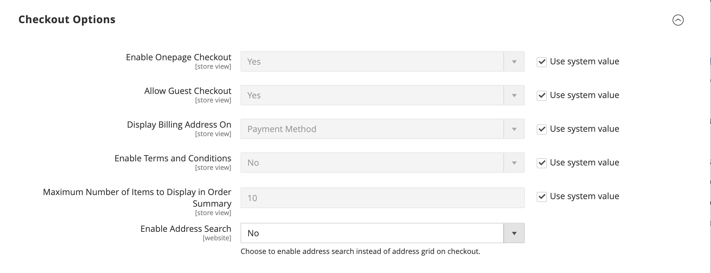
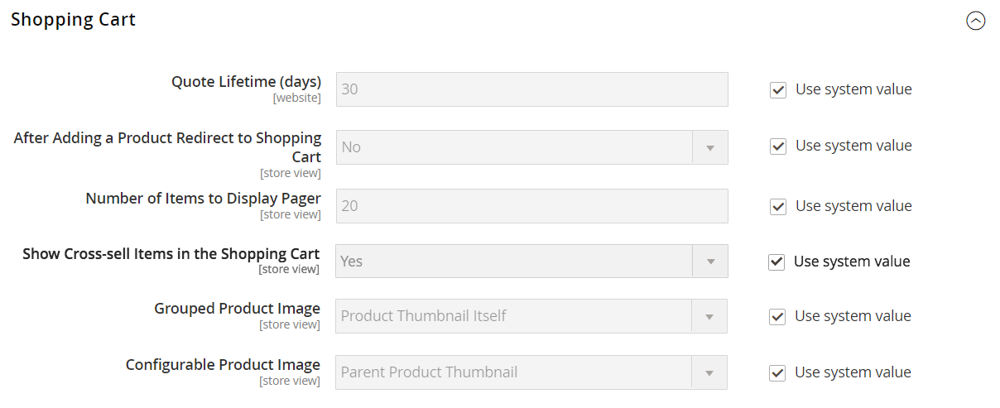
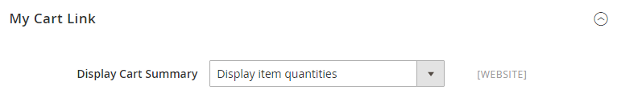

# [!UICONTROL Sales] > [!UICONTROL Checkout]

{{config}}

## [!UICONTROL Checkout Options]

<!-- zoom -->

<!--[Checkout Options](https://experienceleague.adobe.com/fr/docs/commerce-admin/stores-sales/point-of-purchase/checkout/checkout-process#checkout-options) -->

| Champ | [Portée](../../getting-started/websites-stores-views.md#scope-settings) | Description |
|------------------------------------------------------------------|--- |----------------------------------------------------------------------------------------------------------------------------------------------------------------------------------------------------------------------------------------------------------------------------------------------------------------------------------------------------------------------------------------------------------------------------------------------------------------------|
| [!UICONTROL Enable Guest Checkout Login] | Affichage en magasin | Activez ce paramètre pour permettre aux utilisateurs non authentifiés (storefront et API) d’interroger si une adresse électronique est déjà associée à un compte client. Vous pouvez l’utiliser pour améliorer le processus de passage en caisse des invités en affichant une invite de connexion si l’adresse électronique saisie est déjà enregistrée sur un compte client, mais au prix de l’exposition des informations à des utilisateurs non authentifiés.  Options : `Yes` / `No` |
| [!UICONTROL Enable Onepage Checkout] | Affichage en magasin | Détermine si le format de passage en caisse par défaut est [Une page](../../stores-purchase/checkout-process.md#checkout-options). Options : `Yes` / `No` |
| [!UICONTROL Allow Guest Checkout] | Affichage en magasin | Détermine si les invités peuvent effectuer un [passage en caisse sans s’enregistrer](../../stores-purchase/checkout-guest.md) pour un compte auprès de votre boutique. Options : `Yes` / `No` |
| [!UICONTROL Enable Terms and Conditions] | Affichage en magasin | Détermine si les clients doivent accepter les [Conditions d’utilisation](../../stores-purchase/terms-and-conditions.md) de la vente avant d’effectuer un achat. Options : `Yes` / `No` |
| [!UICONTROL Display Billing Address On] | Affichage en magasin | Détermine l’emplacement de l’adresse de facturation lors de l’extraction. Options : `Payment Method` / `Payment Page` |
| [!UICONTROL Maximum Number of Items to Display in Order Summary] | Affichage en magasin | Détermine le nombre maximal d’éléments qui peuvent apparaître dans le _résumé de la commande_ lors de l’extraction. La valeur par défaut est `10`. |
| [!UICONTROL Enable Address Search] | Site Web |  (Adobe Commerce uniquement) Détermine si les clients peuvent utiliser la fonctionnalité [recherche d’adresses](../../stores-purchase/checkout-address-search.md) pour les étapes d’expédition et de vérification et de paiement. Lorsque cette option est activée, utilisez Limite de nombre d’adresses client pour définir le nombre d’adresses enregistrées requises pour activer cette fonctionnalité lors de l’extraction. Options : `Yes` / `No` |
| Limite du nombre d’adresses client | Site Web |  (Adobe Commerce uniquement) Lorsque la recherche d’adresses est activée, détermine le nombre d’adresses enregistrées requises pour activer cette fonctionnalité lors du passage en caisse. Lorsque le nombre d’adresses enregistrées du client correspond ou dépasse ce nombre, seule l’adresse par défaut est rendue sur les étapes _Expédition_ et _Révision et paiement_. Le client peut utiliser une fonction de recherche pour modifier l’adresse sélectionnée. La valeur par défaut est `10`. |

{style="table-layout:auto"}

## [!UICONTROL Shopping Cart]

<!-- zoom -->

<!--[Shopping Cart](https://experienceleague.adobe.com/fr/docs/commerce-admin/stores-sales/point-of-purchase/cart/cart-configuration) -->

| Champ | [Portée](../../getting-started/websites-stores-views.md#scope-settings) | Description |
|--- |--- |--- |
| [!UICONTROL Quote Lifetime (days)] | Site Web | Détermine la durée de vie [d’un prix entre guillemets](../../stores-purchase/cart-configuration.md#quote-lifetime), en jours. |
| [!UICONTROL After Adding a Product Redirect to Shopping Cart] | Affichage en magasin | Détermine si la page [&#x200B; panier apparaît](../../stores-purchase/cart-configuration.md#redirect-to-cart) immédiatement après l’ajout d’un produit au panier. Options : `Yes` / `No` |
| [!UICONTROL Number of Items to Display Pager] | Affichage en magasin | Détermine le nombre d’articles dans le panier avant le déclenchement du pager. Valeur par défaut : `20` |
| [!UICONTROL Show Cross-sell Items in the Shopping Cart] | Affichage en magasin | Indique si des [articles de ventes croisées](../../catalog/related-products-up-sells-cross-sells.md#cross-sells) sont affichés dans le panier, ce qui offre des options de vente supplémentaires aux clients. Options : `Yes` (par défaut) / `No` |
| [!UICONTROL Grouped Product Image] | Affichage en magasin | Détermine l’image [miniature](../../stores-purchase/cart-configuration.md#cart-thumbnails) qui apparaît pour un [produit groupé](../../catalog/product-create-grouped.md) dans le panier. Options : `Product Thumbnail Itself` / `Parent Product Thumbnail` |
| [!UICONTROL Configurable Product Image] | Affichage en magasin | Détermine l’image [miniature](../../stores-purchase/cart-configuration.md#cart-thumbnails) qui apparaît pour un produit configurable dans le panier. Options : `Product Thumbnail Itself` / `Parent Product Thumbnail` |
| [!UICONTROL Preview Quote Lifetime (minutes)] | Affichage en magasin | Détermine l’âge maximal du guillemet en minutes lors de la prévisualisation à partir du panier. |
| [!UICONTROL Enable Clear Shopping Cart] | Site Web | Détermine si le panier affiche l’option permettant aux utilisateurs d’effacer le contenu du panier en une seule action. Options : `Yes` / `No` |

{style="table-layout:auto"}

## [!UICONTROL My Cart Link]

<!-- zoom -->

<!-- [*My Cart Link*](https://experienceleague.adobe.com/fr/docs/commerce-admin/stores-sales/point-of-purchase/cart/cart-configuration#mini-cart) -->

| Champ | [Portée](../../getting-started/websites-stores-views.md#scope-settings) | Description |
|--- |--- |--- |
| [!UICONTROL Display Cart Summary] | Site Web | Détermine la valeur qui apparaît entre parenthèses après le lien Mon panier. Options : `Display number of items in cart` / `Display item quantities` |

{style="table-layout:auto"}

## Mini panier

<!-- zoom -->

<!-- [*Mini Cart*](https://experienceleague.adobe.com/fr/docs/commerce-admin/stores-sales/point-of-purchase/cart/cart-configuration#mini-cart) -->

| Champ | [Portée](../../getting-started/websites-stores-views.md#scope-settings) | Description |
|--- |--- |--- |
| [!UICONTROL Display Mini Cart] | Affichage en magasin | Détermine si le mini panier s’affiche sur les pages de magasin lorsque l’utilisateur clique sur l’icône de panier dans l’en-tête. L&#39;affichage du mini panier dépend du thème. Options : `Yes` / `No` |
| [!UICONTROL Number of Items to Display Scrollbar] | Affichage en magasin | Détermine le nombre d’éléments pouvant apparaître dans le mini panier avant le déclenchement de la barre de défilement. Valeur par défaut : `5` |
| [!UICONTROL Maximum Number of Items to Display] | Affichage en magasin | Détermine le nombre maximal d’éléments pouvant apparaître dans le mini panier. Valeur par défaut : `10` |

{style="table-layout:auto"}

## [!UICONTROL Payment Failed Emails]

<!-- zoom -->

<!-- [*Payment Failed Emails*](https://experienceleague.adobe.com/fr/docs/commerce-admin/stores-sales/point-of-purchase/checkout/checkout-payment-failed-emails) -->

| Champ | [Portée](../../getting-started/websites-stores-views.md#scope-settings) | Description |
|--- |--- |--- |
| [!UICONTROL Payment Failed Email Receiver] | Affichage en magasin | Identifie le contact du magasin qui reçoit les courriers électroniques en échec du paiement. Destinataire par défaut : `General Contact` |
| [!UICONTROL Payment Failed Email Sender] | Affichage en magasin | Identifie le contact du magasin qui apparaît comme le message Expéditeur du paiement des emails en échec. Expéditeur par défaut : `General Contact` |
| [!UICONTROL Payment Failed Template] | Affichage en magasin | Identifie le modèle utilisé pour les courriers électroniques en échec du paiement. Modèle par défaut : `Payment Failed` |
| [!UICONTROL Send Payment Failed Copy To] | Affichage en magasin | Fournit l’adresse électronique de tous les destinataires pour recevoir une copie d’un courrier électronique en échec du paiement. Séparez plusieurs adresses par une virgule. |
| [!UICONTROL Send Payment Failed Copy Method] | Affichage en magasin | Indique la méthode de courrier électronique utilisée pour envoyer la copie. Options :  **`Bcc`**- Envoie une copie de politesse pour aveugles en incluant le destinataire dans l’en-tête du même email qui est envoyé au client. Le destinataire Cci n&#39;est pas visible par le client. **`Separate Email`** - Envoie la copie en tant qu’email distinct. |

{style="table-layout:auto"}
