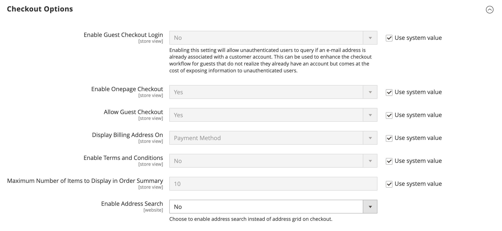

# [!UICONTROL Sales] > [!UICONTROL Checkout]

{{config}}

## [!UICONTROL Checkout Options]

>[!NOTE]
>
>[!BADGE 2.4.6-p1]{type=Informative tooltip="Mises à jour dans 2.4.6-p1"}[!BADGE 2.4.7-beta1]{type=Informative tooltip="Mises à jour dans la version 2.4.7-bêta1"}[2.4.7-beta2](https://experienceleague.adobe.com/docs/commerce-operations/release/notes/adobe-commerce/2-4-7.html) et [2.4.6-p3](https://experienceleague.adobe.com/docs/commerce-operations/release/notes/security-patches/2-4-6-p1.html) versions qui apportent des améliorations de sécurité à la fonctionnalité décrite. Si vous utilisez l’une de ces versions ou celles-ci, consultez les notes de mise à jour.

<!-- zoom -->

<!--[Checkout Options](https://docs.magento.com/user-guide/sales/checkout-options.html) -->

| Champ | [Portée](../../getting-started/websites-stores-views.md#scope-settings) | Description |
|--- |--- |--- |
| [!UICONTROL Enable Onepage Checkout] | Affichage en magasin | Détermine si [Passage en caisse d’une page](../../stores-purchase/checkout-process.md#checkout-options) est le format de passage en caisse par défaut. Options : `Yes` / `No` |
| [!UICONTROL Allow Guest Checkout] | Affichage en magasin | Détermine si les invités peuvent passer [passage en caisse sans enregistrement](../../stores-purchase/checkout-guest.md) pour un compte avec votre boutique. Options : `Yes` / `No` |
| [!UICONTROL Enable Terms and Conditions] | Affichage en magasin | Détermine si les clients doivent accepter le [Termes et conditions](../../stores-purchase/terms-and-conditions.md) de la vente avant d’effectuer un achat. Options : `Yes` / `No` |
| [!UICONTROL Display Billing Address On] | Affichage en magasin | Détermine l’emplacement de l’adresse de facturation lors de l’extraction. Options : `Payment Method` / `Payment Page` |
| [!UICONTROL Maximum Number of Items to Display in Order Summary] | Affichage en magasin | Détermine le nombre maximal d’éléments qui peuvent apparaître dans la variable _Synthèse des commandes_ pendant le passage en caisse. La valeur par défaut est `10`. |
| [!UICONTROL Enable Address Search] | Site Web |  (Adobe Commerce uniquement) Détermine si les clients peuvent utiliser [recherche d&#39;adresses](../../stores-purchase/checkout-address-search.md) fonctionnalités pour les étapes d’expédition et de vérification et de paiement. Lorsque cette option est activée, utilisez Limite de nombre d’adresses client pour définir le nombre d’adresses enregistrées requises pour activer cette fonctionnalité lors de l’extraction. Options : `Yes` / `No` |
| Limite du nombre d’adresses client | Site Web |  (Adobe Commerce uniquement) Lorsque la recherche d’adresses est activée, détermine le nombre d’adresses enregistrées requises pour activer cette fonctionnalité lors du passage en caisse. Lorsque le nombre d’adresses enregistrées du client correspond ou dépasse ce nombre, seule l’adresse par défaut est rendue sur la variable _Expédition_ et _Révision et paiements_ étapes. Le client peut utiliser une fonction de recherche pour modifier l’adresse sélectionnée. La valeur par défaut est `10`. |

{style="table-layout:auto"}

## [!UICONTROL Shopping Cart]

<!-- zoom -->

<!--[Shopping Cart](https://docs.magento.com/user-guide/sales/cart-configuration.html) -->

| Champ | [Portée](../../getting-started/websites-stores-views.md#scope-settings) | Description |
|--- |--- |--- |
| [!UICONTROL Quote Lifetime (days)] | Site Web | Détermine la variable [durée de vie d’un prix coté](../../stores-purchase/cart-configuration.md#quote-lifetime), en jours. |
| [!UICONTROL After Adding a Product Redirect to Shopping Cart] | Affichage en magasin | Détermine si la variable [la page du panier s’affiche](../../stores-purchase/cart-configuration.md#redirect-to-cart) immédiatement après l’ajout d’un produit au panier. Options : `Yes` / `No` |
| [!UICONTROL Number of Items to Display Pager] | Affichage en magasin | Détermine le nombre d’articles dans le panier avant le déclenchement du pager. Valeur par défaut : `20` |
| [!UICONTROL Show Cross-sell Items in the Shopping Cart] | Affichage en magasin | Indique si [vente croisée d’articles](../../catalog/related-products-up-sells-cross-sells.md#cross-sells) s’affichent dans le panier, ce qui vous permet de bénéficier d’options de vente supplémentaires. Options : `Yes` (par défaut) / `No` |
| [!UICONTROL Grouped Product Image] | Affichage en magasin | Détermine la variable [thumbnail](../../stores-purchase/cart-configuration.md#cart-thumbnails) image qui apparaît pour un [produit groupé](../../catalog/product-create-grouped.md) dans le panier. Options : `Product Thumbnail Itself` / `Parent Product Thumbnail` |
| [!UICONTROL Configurable Product Image] | Affichage en magasin | Détermine la variable [thumbnail](../../stores-purchase/cart-configuration.md#cart-thumbnails) image qui s’affiche pour un produit configurable dans le panier. Options : `Product Thumbnail Itself` / `Parent Product Thumbnail` |
| [!UICONTROL Preview Quote Lifetime (minutes)] | Affichage en magasin | Détermine l’âge maximal du guillemet en minutes lors de la prévisualisation à partir du panier. |
| [!UICONTROL Enable Clear Shopping Cart] | Site Web | Détermine si le panier affiche l’option permettant aux utilisateurs d’effacer le contenu du panier en une seule action. Options : `Yes` / `No` |

{style="table-layout:auto"}

## [!UICONTROL My Cart Link]

<!-- zoom -->

<!-- [*My Cart Link*](https://docs.magento.com/user-guide/sales/mini-cart.html) -->

| Champ | [Portée](../../getting-started/websites-stores-views.md#scope-settings) | Description |
|--- |--- |--- |
| [!UICONTROL Display Cart Summary] | Site Web | Détermine la valeur qui apparaît entre parenthèses après le lien Mon panier. Options : `Display number of items in cart` / `Display item quantities` |

{style="table-layout:auto"}

## Mini panier

<!-- zoom -->

<!-- [*Mini Cart*](https://docs.magento.com/user-guide/sales/mini-cart.html) -->

| Champ | [Portée](../../getting-started/websites-stores-views.md#scope-settings) | Description |
|--- |--- |--- |
| [!UICONTROL Display Mini Cart] | Affichage en magasin | Détermine si le mini panier s’affiche sur les pages de magasin lorsque l’utilisateur clique sur l’icône de panier dans l’en-tête. L&#39;affichage du mini panier dépend du thème. Options : `Yes` / `No` |
| [!UICONTROL Number of Items to Display Scrollbar] | Affichage en magasin | Détermine le nombre d’éléments pouvant apparaître dans le mini panier avant le déclenchement de la barre de défilement. Valeur par défaut : `5` |
| [!UICONTROL Maximum Number of Items to Display] | Affichage en magasin | Détermine le nombre maximal d’éléments pouvant apparaître dans le mini panier. Valeur par défaut : `10` |

{style="table-layout:auto"}

## [!UICONTROL Payment Failed Emails]

<!-- zoom -->

<!-- [*Payment Failed Emails*](https://docs.magento.com/user-guide/sales/checkout-payment-failed-emails.html) -->

| Champ | [Portée](../../getting-started/websites-stores-views.md#scope-settings) | Description |
|--- |--- |--- |
| [!UICONTROL Payment Failed Email Receiver] | Affichage en magasin | Identifie le contact du magasin qui reçoit les courriers électroniques en échec du paiement. Destinataire par défaut : `General Contact` |
| [!UICONTROL Payment Failed Email Sender] | Affichage en magasin | Identifie le contact du magasin qui apparaît comme le message Expéditeur du paiement des emails en échec. Expéditeur par défaut : `General Contact` |
| [!UICONTROL Payment Failed Template] | Affichage en magasin | Identifie le modèle utilisé pour les courriers électroniques en échec du paiement. Modèle par défaut : `Payment Failed` |
| [!UICONTROL Send Payment Failed Copy To] | Affichage en magasin | Fournit l’adresse électronique de tous les destinataires pour recevoir une copie d’un courrier électronique en échec du paiement. Séparez plusieurs adresses par une virgule. |
| [!UICONTROL Send Payment Failed Copy Method] | Affichage en magasin | Indique la méthode de courrier électronique utilisée pour envoyer la copie. Options :  **`Bcc`**- Envoie une copie de courtoisie aveugle en incluant le destinataire dans l’en-tête du même email qui est envoyé au client. Le destinataire Cci n&#39;est pas visible par le client. **`Separate Email`** - Envoie la copie en tant que courrier électronique distinct. |

{style="table-layout:auto"}
