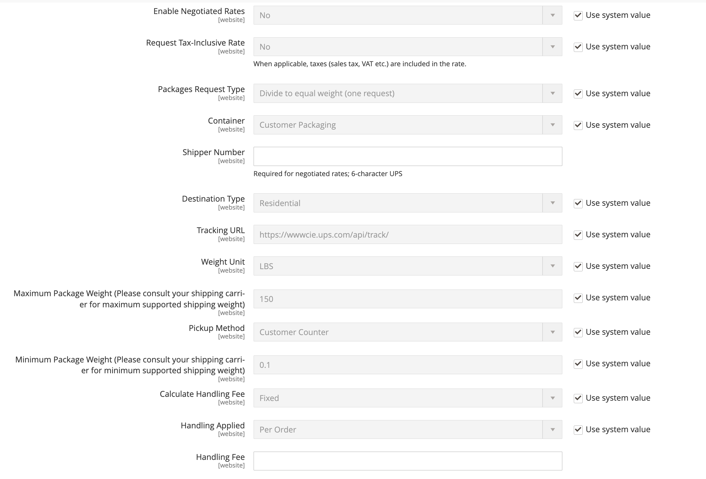

# [!UICONTROL Sales] > [!UICONTROL Delivery Methods]

{{config}}

## [!UICONTROL Basic Delivery Methods]

### [!UICONTROL Flat Rate]

<!-- zoom -->

<!-- [Flat Rate](https://experienceleague.adobe.com/en/docs/commerce-admin/stores-sales/delivery/basic-methods/shipping-flat-rate) -->

| Champ | [Portée](../../getting-started/websites-stores-views.md#scope-settings) | Description |
|--- |--- |--- |
| [!UICONTROL Enabled] | Site internet | Lorsque cette option est activée, le taux forfaitaire apparaît en tant qu&#39;option dans la section _Estimer l&#39;expédition et les taxes_ du panier, ainsi que dans la section _Expédition_ lors du passage en caisse. Options : `Yes` / `No` |
| [!UICONTROL Title] | Affichage de la boutique | Nom utilisé pour ce mode d’expédition lors du passage en caisse. |
| [!UICONTROL Method Name] | Affichage de la boutique | Nom qui décrit la méthode de calcul utilisée pour produire une estimation d’expédition. Le nom de la méthode s’affiche en regard du taux estimé calculé dans le panier. La valeur par défaut est `Fixed`. |
| [!UICONTROL Type] | Site internet | Décrit le type de calcul utilisé pour déterminer le taux forfaitaire. Options :  **`None`**- Aucun calcul n’est utilisé. Définit le taux forfaitaire sur zéro, ce qui équivaut à la livraison gratuite. **`Per Order`** - Facture un taux forfaitaire unique pour la commande entière.  **`Per Item`**- Facture un taux forfaitaire distinct pour chaque article du panier. Le taux est multiplié par le nombre d’articles du panier, même si la quantité totale comprend une combinaison de différents articles. |
| [!UICONTROL Price] | Site internet | Prix que vous facturez au client pour les frais d&#39;expédition forfaitaires. |
| [!UICONTROL Calculate Handling Fee] | Site internet | Détermine le mode de calcul des frais de gestion, le cas échéant. Options : `Fixed` / `Percent` |
| [!UICONTROL Handling Fee] | Site internet | Saisissez le montant à facturer pour les frais de manutention, en fonction de la méthode que vous avez choisie pour calculer le montant. Par exemple, si les frais sont basés sur des frais fixes, entrez le montant sous forme de décimale, par exemple 4,90. Toutefois, si les frais de gestion sont basés sur un pourcentage de la commande, saisissez le montant sous forme de pourcentage. Par exemple, si vous facturez six pour cent de la commande, saisissez la valeur `.06`. |
| [!UICONTROL Displayed Error Message] | Affichage de la boutique | Message qui s’affiche si un client ou une cliente choisit le taux forfaitaire, mais que la méthode n’est pas disponible pour une raison quelconque. |
| [!UICONTROL Ship to Applicable Countries] | Site internet | Indique les pays dans lesquels vous proposez une livraison à taux forfaitaire. Options :  **`All Allowed Countries`**- Les clients de n’importe quel pays spécifié dans la configuration de la boutique peuvent utiliser l’expédition à taux forfaitaire. **`Specific Countries`** - Les clients de pays spécifiques uniquement peuvent utiliser la livraison à taux forfaitaire. |
| [!UICONTROL Ship to Specific Countries] | Site internet | Indique chaque pays où les clients peuvent utiliser la livraison à taux forfaitaire. |
| [!UICONTROL Show Method if Not Applicable] | Site internet | Détermine si le taux forfaitaire apparaît comme une option lors du passage en caisse si la méthode ne s&#39;applique pas à l&#39;achat. Options : `Yes` / `No` |
| [!UICONTROL Sort Order] | Site internet | Nombre qui détermine l’ordre dans lequel le taux forfaitaire apparaît lorsqu’il est répertorié avec d’autres méthodes de diffusion lors du passage en caisse. |

{style="table-layout:auto"}

### [!UICONTROL Free Shipping]

<!-- zoom -->

<!-- [Free Shipping](https://experienceleague.adobe.com/en/docs/commerce-admin/stores-sales/delivery/basic-methods/shipping-free) -->

| Champ | [Portée](../../getting-started/websites-stores-views.md#scope-settings) | Description |
|--- |--- |--- |
| [!UICONTROL Enabled] | Site internet | Lorsqu’elle est activée, la livraison gratuite apparaît comme une option dans la section Expédition lors du passage en caisse. Options : `Yes` / `No` |
| [!UICONTROL Title] | Affichage de la boutique | Nom utilisé pour ce mode d’expédition lors du passage en caisse. |
| Nom de la méthode | Affichage de la boutique | Nom qui décrit la méthode de calcul utilisée pour produire une estimation d’expédition. Le nom de la méthode s’affiche en regard du taux estimé calculé dans le panier. La valeur par défaut est `Free`. |
| Montant minimal de la commande | Site internet | Achat minimum requis pour appliquer la livraison gratuite à une commande. |
| Inclure la taxe au montant | Site internet | Détermine si la taxe est incluse dans le calcul du montant minimum de la commande. Options :  **Oui** - La TVA est incluse dans le calcul du montant minimum de la commande (sous-total + TVA - remise). **Non** - La taxe n&#39;est pas incluse dans le calcul du montant minimum de la commande (Sous-total - Remise). |
| Message d’erreur affiché | Affichage de la boutique | Message qui s’affiche si un client choisit la livraison gratuite, mais que la méthode n’est pas disponible pour une raison quelconque. |
| Expédier vers les pays applicables | Site internet | Indique les pays où vous proposez la livraison gratuite. Options :  **Tous les pays autorisés** - Les clients de n’importe quel pays spécifié dans la configuration de la boutique peuvent utiliser la livraison gratuite.  **Pays spécifiques** - Les clients de pays spécifiques seulement peuvent utiliser la livraison gratuite. |
| Expédier vers des pays spécifiques | Site internet | Indique chaque pays où les clients peuvent utiliser la livraison gratuite. |
| Afficher la méthode si non applicable | Site internet | Détermine si la livraison gratuite apparaît comme une option lors du passage en caisse si la méthode ne s&#39;applique pas à l&#39;achat. Options : `Yes` / `No` |
| [!UICONTROL Sort Order] | Site internet | Nombre qui détermine la commande pour laquelle l&#39;expédition gratuite apparaît lorsqu&#39;elle est mise en vente avec d&#39;autres méthodes de livraison lors du passage en caisse. |

{style="table-layout:auto"}

### [!UICONTROL Table Rates]

<!-- zoom -->

<!-- [Table Rates](https://experienceleague.adobe.com/en/docs/commerce-admin/stores-sales/delivery/basic-methods/shipping-table-rate) -->

| Champ | [Portée](../../getting-started/websites-stores-views.md#scope-settings) | Description |
|--- |--- |--- |
| [!UICONTROL Enabled] | Site internet | Lorsqu’elle est activée, la table des taux s’affiche en tant qu’option dans la section Estimer les frais d’expédition et de taxe du panier, ainsi que dans la section Expédition lors du passage en caisse. Options : `Yes` / `No` |
| [!UICONTROL Title] | Affichage de la boutique | Nom utilisé pour ce mode d’expédition lors du passage en caisse. |
| Nom de la méthode | Affichage de la boutique | Nom qui décrit la méthode de calcul utilisée pour produire une estimation d’expédition. Le nom de la méthode s’affiche en regard du taux estimé calculé dans le panier. La valeur par défaut est `Table Rate`. |
| [!UICONTROL Condition] | Site internet | Détermine la condition sur laquelle est basé le calcul. Le format du fichier CSV chargé est spécifique à chaque condition. Options : `Weight vs. Destination` / `Price vs. Destination` / `# of Items vs. Destination` |
| [!UICONTROL Include Virtual Products in Price Calculation] | Site internet | Détermine si les produits virtuels, qui ne nécessitent pas d&#39;expédition, sont inclus dans le calcul des prix du taux de la table. |
| [!UICONTROL Calculate Handling Fee] | Site internet | Détermine le mode de calcul des frais de gestion, le cas échéant. Options : `Fixed` / `Percent` |
| [!UICONTROL Handling Fee] | Site internet | Montant des frais qui s’ajoutent aux frais d’expédition pour couvrir les frais de manutention de l’expédition. Saisissez la valeur sous la forme d’une décimale. Par exemple, si la redevance est basée sur un pourcentage, entrez 0,06 au lieu de 6 %. Pour un montant fixe, saisissez `6.00`. |
| [!UICONTROL Displayed Error Message] | Affichage de la boutique | Message qui s’affiche si un client choisit les taux de la table, mais que la méthode n’est pas disponible pour une raison quelconque. |
| [!UICONTROL Ship to Applicable Countries] | Site internet | Indique les pays où vous proposez l&#39;expédition à tarif fixe. Options :  **`All Allowed Countries`**- Les clients de n&#39;importe quel pays spécifié dans la configuration de la boutique peuvent utiliser l&#39;expédition à tarif fixe. **`Specific Countries`** - Les clients provenant de pays spécifiques seulement peuvent utiliser l&#39;expédition à tarif fixe. |
| [!UICONTROL Ship to Specific Countries] | Site internet | Indique chaque pays où les clients peuvent utiliser l&#39;expédition à tarif fixe. |
| [!UICONTROL Show Method if Not Applicable] | Site internet | Détermine si les taux du tableau s’affichent en tant qu’option lors du passage en caisse si la méthode ne s’applique pas à l’achat. Options : `Yes` / `No` |
| [!UICONTROL Sort Order] | Site internet | Nombre qui détermine l’ordre dans lequel les taux du tableau s’affichent lorsqu’ils sont répertoriés avec d’autres méthodes de diffusion lors du passage en caisse. |

{style="table-layout:auto"}

### [!UICONTROL In-Store Delivery]

<!-- zoom -->

<!-- [In-Store Delivery](https://experienceleague.adobe.com/en/docs/commerce-admin/stores-sales/delivery/basic-methods/shipping-in-store-delivery) -->

| Champ | [Portée](../../getting-started/websites-stores-views.md#scope-settings) | Description |
|--- |--- |--- |
| [!UICONTROL Enabled] | Site internet | Lorsqu’elle est activée, la livraison en magasin peut apparaître sous forme d’option dans la section _Estimer l’expédition et les taxes_ du panier, ainsi que dans la section _Expédition_ lors du passage en caisse. Options : `Yes` / `No` |
| [!UICONTROL Method Name] | Affichage de la boutique | Nom qui identifie la fonction de retrait en magasin comme méthode d’expédition. Cette valeur est affichée sous la forme du libellé d&#39;un onglet en haut de la page Passage en caisse et dans le tableau des modes d&#39;expédition disponibles au bas de la même page. La valeur par défaut est `In-store Delivery`. |
| [!UICONTROL Title] | Affichage de la boutique | Nom utilisé pour ce mode d’expédition lors du passage en caisse. |
| [!UICONTROL Price] | Site internet | Prix que vous facturez au client pour une cueillette en magasin. |
| [!UICONTROL Search Radius] | Site internet | Rayon, en km, à utiliser lors de la recherche d&#39;emplacements de retrait. |
| [!UICONTROL Displayed Error Message] | Affichage de la boutique | Message qui s’affiche lorsqu’un client sélectionne un retrait en magasin, mais que la méthode de diffusion n’est pas disponible. |

{style="table-layout:auto"}

## [!UICONTROL Carriers]

### [!UICONTROL UPS]

{{ups-api}}

<!-- zoom -->

<!-- zoom -->

<!-- [UPS REST Account Settings]https://experienceleague.adobe.com/en/docs/commerce-admin/stores-sales/delivery/shipping-carriers/ups) -->

| Champ | [Portée](../../getting-started/websites-stores-views.md#scope-settings) | Description |
|--- |--- |--- |
| [!UICONTROL Enabled for Checkout] | Site internet | Détermine si UPS est disponible pour les clients en tant que méthode d&#39;expédition lors du passage en caisse. Options : `Yes` / `No` |
| [!UICONTROL Enabled for RMA] | Site internet | Détermine si UPS est disponible pour les clients en tant que méthode d&#39;expédition pour une RMA. Options : `Yes` / `No` |
| _[!UICONTROL UPS Account Settings]_ |  |  |
| [!UICONTROL Live Account] | Affichage de la boutique | Spécifie que le compte United Parcel Service est actif. Options : `Yes` / `No` |
| [!UICONTROL Title] | Affichage de la boutique | Nom utilisé pour ce mode d’expédition lors du passage en caisse. |
| _[!UICONTROL UPS REST Account Settings]_ |  |  |
| [!UICONTROL Gateway URL] | Site internet | Pour le service REST UPS, affiche les URL suivantes requises pour transmettre des données JSON : URL de passerelle, URL de tracking, URL d’expédition. Utilisez des points d’entrée Sandbox ou Production conformément au paramètre Compte dynamique . |
| [!UICONTROL Mode] | Site internet | Détermine le mode de transmission utilisé pour les données envoyées au système UPS. Options :  **`Development`**- UPS ne vérifie pas que les données reçues du serveur Commerce sont envoyées via SSL. **`Live`** - UPS vérifie que les données reçues du serveur Commerce sont envoyées via une couche de socket sécurisée (SSL). |
| Identifiant utilisateur | Site internet | Identifiant client de votre compte d&#39;expéditeur UPS. |
| [!UICONTROL Origin of the Shipment] | Site internet | (UPS REST uniquement) Pays ou région d’origine de l’expédition du produit. |
| [!UICONTROL Password] | Affichage de la boutique | Votre secret client du compte expéditeur UPS. |

{style="table-layout:auto"}

<!-- zoom -->

<!-- [UPS Package Information]https://experienceleague.adobe.com/en/docs/commerce-admin/stores-sales/delivery/shipping-carriers/ups) -->

| Champ | [Portée](../../getting-started/websites-stores-views.md#scope-settings) | Description |
|--- |--- |--- |
| _[!UICONTROL UPS Negotiated Rate Settings]_ |  |  |
| [!UICONTROL Enable Negotiated Rates] | Site internet | (UPS REST uniquement) Active/désactive des tarifs spéciaux, conformément à votre accord avec UPS. Options : `Yes` / `No` |
| [!UICONTROL Packages Request Type] | Site internet | Détermine la façon dont le poids est calculé pour les expéditions comportant plusieurs colis. Options : `Divide to equal weight (one request)` / `Use origin weight (multiple requests)` |
| [!UICONTROL Shipper Number] | Site internet | (UPS REST uniquement) Le numéro d&#39;expéditeur UPS de six caractères est requis pour faire référence aux taux négociés. |
| [!UICONTROL Container] | Site internet | Définit le type de conteneur utilisé pour conditionner les expéditions. Options : `Customer Packaging` / `UPS Letter Envelope` / `Customer Packaging` / `UPS Letter Envelope` / `UPS Tube` / `UPS Express Box` / `UPS Worldwide 25 kilo` / `UPS Worldwide 10 kilo` |
| [!UICONTROL Weight Unit] | Site internet | Définit l’unité de mesure par défaut pour le poids du produit dans votre magasin. Voir [Poids dimensionnel](../../stores-purchase/carriers.md#dimensional-weight) pour plus d’informations. |
| [!UICONTROL Tracking URL] | Site internet | (UPS REST uniquement) URL UPS utilisée pour effectuer le suivi des packages. Utilisez des `https://onlinetools.ups.com/api/track` pour la production OU des `https://wwwcie.ups.com/api/track` pour la configuration des sandbox. |
| [!UICONTROL Destination Type] | Site internet | Définit le type de destination d&#39;expédition par défaut. Options : `Business` / `Residential` |
| [!UICONTROL Maximum Package Weight] | Site internet | Définit le poids maximal qu&#39;un package peut atteindre, tel que spécifié par UPS. Si les produits commandés dépassent le poids maximum du colis, cette option d&#39;expédition n&#39;est pas disponible. Selon [UPS.com](https://www.ups.com/us/en/global.page), les colis ne doivent pas dépasser 150 lb (70 kg) Vérifiez auprès de votre transporteur le poids maximal. |
| [!UICONTROL Pickup Method] | Site internet | Définit la méthode de prélèvement de l&#39;onduleur. Options : `Regular Daily Pickup` / `On Call Air` / `One Time Pickup` / `Letter Center` / `Customer Counter` |
| [!UICONTROL Minimum Package Weight] | Site internet | Définit le poids minimum qu&#39;un package peut avoir comme spécifié par UPS. Si le poids des produits commandés est inférieur au poids minimum du colis, cette option d&#39;expédition n&#39;est pas disponible. Pour vérifier le poids minimum, vérifiez auprès de votre transporteur. |
| [!UICONTROL Calculate Handling Fee] | Site internet | Définit la méthode de calcul des frais de manutention pour l&#39;expédition au tarif du tableau. Options :  **`Fixed`**- Les frais de gestion sont un taux fixe. **`Percent`** - Les frais de gestion sont appliqués en tant que pourcentage du montant de la commande. |
| [!UICONTROL Handling Applied] | Site internet | Indique si des frais de gestion sont appliqués à chaque commande ou à chaque package d&#39;une commande. |
| [!UICONTROL Handling Fee] | Site internet | Définit la gestion incluse avec le prix de livraison. Les frais de gestion peuvent être définis sous la forme d’un montant fixe ou d’un pourcentage.   **_Note:_** si vous tapez un montant en pourcentage, utilisez le format décimal `0.25` pour 25 %. |

{style="table-layout:auto"}

<!-- zoom -->

<!-- [UPS Allowed Methods]https://experienceleague.adobe.com/en/docs/commerce-admin/stores-sales/delivery/shipping-carriers/ups) -->

| Champ | [Portée](../../getting-started/websites-stores-views.md#scope-settings) | Description |
|--- |--- |--- |
| _[!UICONTROL UPS allowed methods]_ |  |  |
| [!UICONTROL Allowed Methods] | Site internet | Spécifie les méthodes autorisées d&#39;expédition UPS qui sont proposées aux clients. Les frais d&#39;expédition sont calculés en fonction du mode d&#39;expédition sélectionné. |
| [!UICONTROL Free Method] | Site internet | Identifie la méthode utilisée pour la méthode d&#39;expédition gratuite via UPS. Pour désactiver la livraison gratuite, choisissez « Aucun ».   **_Remarque:_** cette méthode est similaire à la [Livraison gratuite](../../stores-purchase/shipping-free.md) de base, mais elle apparaît comme une option de livraison UPS lors du passage en caisse. |
| [!UICONTROL Free Shipping Amount Threshold] | Site internet | Détermine si la livraison gratuite est appliquée lorsque le montant de la commande atteint le seuil de livraison gratuite. Options : `Enable` / `Disable` |
| [!UICONTROL Free Shipping Amount Threshold] | Site internet | Définit le montant total minimum qu’une commande doit atteindre pour pouvoir bénéficier de la livraison gratuite. |
| [!UICONTROL Displayed Error Message] | Affichage de la boutique | Message d&#39;erreur affiché lorsque ce mode d&#39;expédition n&#39;est pas disponible pour une raison quelconque. |

{style="table-layout:auto"}

<!-- zoom -->

<!-- [UPS Applicable Countries and Other Settings]https://experienceleague.adobe.com/en/docs/commerce-admin/stores-sales/delivery/shipping-carriers/ups) -->

| Champ | [Portée](../../getting-started/websites-stores-views.md#scope-settings) | Description |
|--- |--- |--- |
| _[!UICONTROL UPS Applicable countries and other Settings]_ |  |  |
| [!UICONTROL Ship to Applicable Countries] | Site internet | Spécifie le pays dans lequel les clients sont autorisés à utiliser ce mode d&#39;expédition. Options :  **`All Allowed Countries`**- Les clients de tous les [pays](../../getting-started/store-details.md#country-options) spécifiés dans la configuration de votre boutique peuvent utiliser cette méthode d’expédition. **`Specific Countries`** - Après avoir choisi cette option, la liste des [!UICONTROL Ship to Specific Countries] s’affiche. Sélectionnez dans la liste chaque pays où ce mode d&#39;expédition peut être utilisé. |
| [!UICONTROL Show Method if Not Applicable] | Site internet | Détermine si UPS apparaît toujours comme option d&#39;expédition lors du passage en caisse. Options :  **`Yes`**- UPS apparaît toujours comme option d&#39;expédition lors du passage en caisse, même s&#39;il ne s&#39;applique pas à la commande. **`No`** - UPS apparaît comme option d&#39;expédition lors du passage en caisse uniquement s&#39;il s&#39;applique à la commande. (Par exemple, si le poids de la commande dépasse le poids maximal.) |
| [!UICONTROL Debug] | Site internet | Indique si les transmissions de données entre votre magasin et l’onduleur sont consignées dans le système à des fins de débogage. À moins qu’il n’y ait un problème qui doive être suivi et consigné, cette option doit être définie sur `No`. |
| [!UICONTROL Sort Order] | Site internet | Nombre qui détermine l’ordre dans lequel UPS apparaît lorsqu’il est répertorié avec d’autres méthodes de diffusion lors du passage en caisse. Saisissez `0` pour le haut de la liste. |

{style="table-layout:auto"}

### [!UICONTROL USPS]

| Champ | [Portée](../../getting-started/websites-stores-views.md#scope-settings) | Description |
|--- |--- |--- |
| Activé pour le passage en caisse | Site internet | Détermine si USPS est disponible pour les clients en tant que méthode d&#39;expédition lors du passage en caisse. Options : `Yes` / `No` |
| _[!UICONTROL USPS Account Settings]_ |  |  |
| [!UICONTROL Gateway URL] | Site internet | URL utilisée pour se connecter au système USPS afin de récupérer dynamiquement les frais d’expédition. |
| [!UICONTROL Secure Gateway URL] | Site internet | URL sécurisée utilisée pour se connecter au système USPS via une couche de socket sécurisée (SSL) afin de récupérer de manière dynamique les tarifs d’expédition. |
| [!UICONTROL Title] | Affichage de la boutique | Titre de cette option d’expédition tel qu’il apparaît dans le passage en caisse du panier. |
| [!UICONTROL User ID] | Site internet | Identifiant utilisateur de votre compte d&#39;expéditeur USPS. |
| [!UICONTROL Password] | Site internet | Votre mot de passe de compte d&#39;expéditeur USPS. |
| [!UICONTROL Mode] | Site internet | Détermine le mode de transmission utilisé pour les données envoyées au système USPS. Les options sont les suivantes :  **`Development`**- USPS ne vérifie pas que les données reçues du serveur Commerce sont envoyées via SSL. **`Live`** - USPS vérifie que les données reçues du serveur Commerce sont envoyées via une couche de socket sécurisée (SSL). |

{style="table-layout:auto"}

Les champs suivants ne sont disponibles que si vous avez appliqué le correctif de qualité [ Migration de l’API REST USPS ](https://experienceleague.adobe.com/en/docs/commerce-operations/tools/quality-patches-tool/patches-available-in-qpt/v1-1-70/ac-15210). Ce correctif permet la prise en charge des API USPS, une plateforme REST qui remplace les API Web Tools. Pour plus d’informations, consultez [Obsolescence de l’API des outils web USPS](../../stores-purchase/carriers.md).

| Champ | [Portée](../../getting-started/websites-stores-views.md#scope-settings) | Description |
|--- |--- |--- |
| [!UICONTROL USPS Type] | Site internet | Choisissez **API Rest USPS** ou **API Web Tools USPS** en fonction de celle que vous allez utiliser. |
| [!UICONTROL Consumer Key] | Site internet | Identifiant client de votre compte d’expéditeur USPS pour l’API REST. |
| [!UICONTROL Consumer Secret] | Site internet | Votre clé secrète client de compte expéditeur USPS pour l’API REST. |
| [!UICONTROL Account Type] | Site internet | Type de compte de paiement USPS. Options : `"EPS"` (Enterprise Payment System) ou `"PERMIT"` (Permit Imprint) pour l’API REST.   **_Note:_** ce champ est facultatif ; cependant, il est obligatoire pour activer la création d&#39;étiquettes d&#39;expédition. |
| [!UICONTROL Pricing Options] | Site internet | Options de tarification USPS : **Vente au détail** ou **Commerciale**. A un impact sur les frais d&#39;expédition appliqués. La valeur par défaut est **commerciale** pour l’API REST. |
| [!UICONTROL Account Number] | Site internet | Votre USPS **numéro de compte**, utilisé pour le paiement de l’API REST.    **_Note:_** ce champ est facultatif ; cependant, il est obligatoire pour activer la création d&#39;étiquettes d&#39;expédition. |
| [!UICONTROL Customer Registration Identifier(CRID)] | Site internet | Un numéro d’identification d’enregistrement client (CRID) est un code numérique généré par USPS qui identifie de manière unique une entreprise sur un emplacement pour l’API REST.    **_Note:_** ce champ est facultatif ; cependant, il est obligatoire pour activer la création d&#39;étiquettes d&#39;expédition. |
| [!UICONTROL Mailer Identifier(MID)] | Site internet | Le MID (Mailer Identifier) est un champ du code-barres Intelligent Mail utilisé pour identifier les expéditeurs. Les MID sont affectés par l&#39;USPS à un propriétaire de messagerie, un agent de messagerie ou un autre fournisseur de services qui les demande pour l&#39;API REST.    **_Note:_** ce champ est facultatif ; cependant, il est obligatoire pour activer la création d&#39;étiquettes d&#39;expédition. |
| [!UICONTROL Manifest MID] | Site internet | Identifiant de messagerie unique désigné pour le manifeste de l’API REST.    **_Note:_** ce champ est facultatif ; cependant, il est obligatoire pour activer la création d&#39;étiquettes d&#39;expédition. Pour Magento 2.4.7-p8 avec le correctif [AC-15210](https://experienceleague.adobe.com/en/docs/commerce-operations/tools/quality-patches-tool/patches-available-in-qpt/v1-1-70/ac-15210) appliqué, [!UICONTROL Manifest MID] est un champ obligatoire. |
| [!UICONTROL AES/ITN] | Site internet | USPS AES - Automated Export System / ITN - Numéro de transaction interne pour l&#39;API REST.   **_Remarque:_** ce champ est généralement facultatif, mais il est obligatoire pour activer la création d&#39;étiquettes d&#39;expédition si : <ul><li>Chaque type de marchandises dans l&#39;expédition (tel que défini par les codes d&#39;exportation de l&#39;annexe B à <a href="https://www.census.gov/foreign-trade/schedules/b" target="_blank">www.census.gov/foreign-trade/schedules/b</a>) est évalué à 2 500 $ ou moins et ne nécessite pas de licence d&#39;exportation ; ou</li><li>L&#39;expédition, quelle que soit sa valeur, est envoyée au Canada et ne nécessite pas de licence d&#39;exportation.</li></ul> |

{style="table-layout:auto"}

<!-- zoom -->

<!-- [USPS Packaging Settings](https://experienceleague.adobe.com/en/docs/commerce-admin/stores-sales/delivery/shipping-carriers/usps) -->

| Champ | [Portée](../../getting-started/websites-stores-views.md#scope-settings) | Description |
|--- |--- |--- |
| _[!UICONTROL USPS packaging Settings]_ |  |  |
| [!UICONTROL Packages Request Type] | Site internet | Détermine la façon dont le poids est calculé pour les expéditions comportant plusieurs colis. Options : `Divide to equal weight (one request)` / `Use origin weight (multiple requests)` |
| [!UICONTROL Container] | Site internet | Définit le type de conteneur utilisé pour conditionner les expéditions. Options : `Variable` / `Flat Rate Box` / `Flat Rate Envelope` / `Rectangular` / Non rectangulaire |
| [!UICONTROL Size] | Site internet | Définit l&#39;option Taille sur la taille standard du colis d&#39;expédition. Cette option affecte le calcul des frais d&#39;expédition. Options : `Regular` / `Large` / `Oversize` |
| [!UICONTROL Machinable] | Site internet | Indique si le package peut être traité par la machine. Cette option affecte le calcul des frais d&#39;expédition. |
| [!UICONTROL Maximum Package Weight] | Site internet | Définit le poids maximum qu&#39;un package peut avoir comme spécifié par USPS. Si les produits commandés dépassent le poids maximum du colis, cette option d&#39;expédition n&#39;est pas disponible. |

{style="table-layout:auto"}

<!-- zoom -->

<!-- [USPS Handling Fee Settings](https://experienceleague.adobe.com/en/docs/commerce-admin/stores-sales/delivery/shipping-carriers/usps) -->

| Champ | [Portée](../../getting-started/websites-stores-views.md#scope-settings) | Description |
|--- |--- |--- |
| _[!UICONTROL USPS Handling Fee settings]_ |  |  |
| [!UICONTROL Calculate Handling Fee] | Site internet | Définit la méthode de calcul des frais de manutention pour l&#39;expédition au tarif du tableau. Options :  **`Fixed`**- Les frais de gestion sont un taux fixe. **`Percent`** - Les frais de gestion sont appliqués en tant que pourcentage du montant de la commande. |
| [!UICONTROL Handling Applied] | Site internet | Indique si des frais de gestion sont appliqués à chaque commande ou à chaque package d&#39;une commande. |
| [!UICONTROL Handling Fee] | Site internet | Définit la gestion incluse avec le prix de livraison. Les frais de gestion peuvent être définis sous la forme d’un montant fixe ou d’un pourcentage.   **_Note:_** lors de la saisie d&#39;un montant en pourcentage, utilisez le format décimal `0.25` pour 25 %. |

{style="table-layout:auto"}

<!-- zoom -->

<!-- [USPS Allowed Methods](https://experienceleague.adobe.com/en/docs/commerce-admin/stores-sales/delivery/shipping-carriers/usps) -->

| Champ | [Portée](../../getting-started/websites-stores-views.md#scope-settings) | Description |
|--- |--- |--- |
| _[!UICONTROL USPS Allowed Methods]_ |  |  |
| [!UICONTROL Allowed Methods] | Site internet | Spécifie les méthodes autorisées d&#39;expédition USPS proposées aux clients. Les frais d&#39;expédition sont calculés en fonction du mode d&#39;expédition sélectionné. |
| [!UICONTROL Free Method] | Site internet | Définit la méthode d&#39;expédition gratuite via USPS ou peut être désactivée en sélectionnant `None`.   **_Remarque:_** cette méthode d&#39;expédition est similaire à la méthode d&#39;expédition gratuite de votre magasin, mais elle est répertoriée comme une option d&#39;expédition USPS et identifiée comme expédition USPS. |
| [!UICONTROL Minimum Order Amount for Free Shipping] | Site internet | Définit le montant de commande minimal qui doit être atteint pour bénéficier de la livraison gratuite. |
| [!UICONTROL Displayed Error Message] | Affichage de la boutique | Message d&#39;erreur qui s&#39;affiche lorsque USPS n&#39;est pas disponible pour une raison quelconque. |

{style="table-layout:auto"}

<!-- zoom -->

<!-- [USPS Applicable Countries](https://experienceleague.adobe.com/en/docs/commerce-admin/stores-sales/delivery/shipping-carriers/usps) -->

| Champ | [Portée](../../getting-started/websites-stores-views.md#scope-settings) | Description |
|--- |--- |--- |
| _[!UICONTROL USPS Applicable Countries]_ |  |  |
| [!UICONTROL Ship to Applicable Countries] | Site internet | Spécifie les pays où les commandes peuvent être expédiées. Options :  **`All Allowed Countries`**- Les clients de tous les [pays](../../getting-started/store-details.md#country-options) spécifiés dans la configuration de votre boutique peuvent utiliser cette méthode d’expédition. **`Specific Countries`** - Après avoir choisi cette option, la liste des [!UICONTROL Ship to Specific Countries] s’affiche. Sélectionnez dans la liste chaque pays où ce mode d&#39;expédition peut être utilisé. |
| [!UICONTROL Show Method if Not Applicable] | Site internet | Contrôle l&#39;affichage de l&#39;expédition USPS pendant le passage en caisse. Options :  **`Yes`**- USPS apparaît toujours comme option d&#39;expédition lors du passage en caisse, même s&#39;il ne s&#39;applique pas à la commande. **`No`** - USPS apparaît comme option d&#39;expédition lors du passage en caisse uniquement s&#39;il s&#39;applique à la commande (c&#39;est-à-dire que le poids de la commande dépasse le poids maximal). |
| [!UICONTROL Debug] | Site internet | Détermine si un journal des transmissions de données entre votre magasin et USPS est conservé par le système à des fins de débogage. À moins qu’il n’y ait un problème qui doive être suivi et consigné, cette option doit être définie sur `No`. |
| [!UICONTROL Sort Order] | Site internet | Nombre qui détermine l&#39;ordre dans lequel le USPS apparaît lorsqu&#39;il est répertorié avec d&#39;autres méthodes de diffusion lors du passage en caisse. Saisissez `0` pour le haut de la liste. |

{style="table-layout:auto"}

### [!UICONTROL FedEx]

<!-- [FedEx Account Settings](https://experienceleague.adobe.com/en/docs/commerce-admin/stores-sales/delivery/shipping-carriers/fedex) -->

#### Paramètres du compte FedEx

{width="600" zoomable="yes"}

| Champ | [Portée](../../getting-started/websites-stores-views.md#scope-settings) | Description |
|-------|------ |-----------------------------------------------------------------------------|
| [!UICONTROL Enabled for Checkout] | Site internet | Détermine si FedEx est disponible pour les clients en tant que méthode d&#39;expédition lors du passage en caisse. Options : `Yes` / `No` |
| [!UICONTROL Title] | Affichage de la boutique | Titre de cette option d’expédition tel qu’il apparaît dans le passage en caisse du panier. |
| [!UICONTROL Account ID] | Site internet | Identifiant de votre compte FedEx. |
| [!UICONTROL Api Key] | Site internet | Votre clé API de compte FedEx. |
| [!UICONTROL Secret Key] | Site internet | Votre clé secrète API de compte FedEx. |
| [!UICONTROL Sandbox Mode] | Site internet | Pour exécuter des transactions FedEx dans un environnement de test, définissez le Mode Sandbox sur `Yes`. Options : `Yes` / `No`. |
| [!UICONTROL Web-Services URL] | Site internet | L’URL requise dépend du paramètre Mode Sandbox . Options :  **`Production`**- URL d’accès aux services web FedEx lorsque le magasin est actif. **`Sandbox`** - URL d’accès à l’environnement de test pour les services web FedEx. |

{style="table-layout:auto"}

#### Paramètres des packages FedEx

{width="600" zoomable="yes"}

| Champ | [Portée](../../getting-started/websites-stores-views.md#scope-settings) | Description |
|--- |--- |--- |
| [!UICONTROL Pickup Type] | Site internet | Dans la liste, sélectionnez la méthode de retrait :  **`DropOff at Fedex Location`**- (Par défaut) Indique que vous déposez les envois à votre station FedEx locale. **`Contact Fedex to Schedule`** - Indique que vous contactez FedEx pour demander un retrait.  **`Use Scheduled Pickup`**- Indique que l&#39;expédition est récupérée dans le cadre d&#39;un ramassage régulier prévu. **`On Call`** - Indique que la collecte est programmée en appelant FedEx.  **`Package Return Program`**- Indique que l&#39;expédition est récupérée par le Programme de retour des colis au sol de FedEx. **`Regular Stop`** - Indique que l&#39;expédition est récupérée selon le calendrier de récupération standard.  **`Tag`**- Indique que le retrait de l&#39;expédition est spécifique à une demande de retrait de la balise Express ou de la balise Ground Call. Ceci s&#39;applique uniquement pour une étiquette d&#39;expédition de retour. |
| [!UICONTROL Packages Request Type] | Site internet | Détermine la façon dont le poids est calculé pour les expéditions comportant plusieurs colis. Options : `Divide to equal weight (one request)` / `Use origin weight (multiple requests)` |
| [!UICONTROL Packaging] | Site internet | Dans la liste, sélectionnez le type de conteneur que vous utilisez généralement pour emballer les produits commandés dans votre magasin. |
| [!UICONTROL Weight Unit] | Site internet | Unité utilisée pour le poids du package. Options : `Pounds` (par défaut) / `Kilograms` |
| [!UICONTROL Maximum Package Weight] | Site internet | La valeur par défaut pour FedEx est de 150 livres. Consultez votre transporteur pour connaître le poids maximal pris en charge. L&#39;utilisation de la valeur par défaut est recommandée, sauf si vous avez des arrangements spéciaux avec FedEx. |

{style="table-layout:auto"}

#### Paramètres des frais de gestion FedEx

{width="600" zoomable="yes"}

| Champ | [Portée](../../getting-started/websites-stores-views.md#scope-settings) | Description |
|--- |--- |--- |
| [!UICONTROL Calculate Handling Fee] | Site internet | Détermine la méthode utilisée pour calculer les frais de manutention. Options : `Fixed Fee` / `Percentage`   **_Note:_** Les frais de manutention sont facultatifs et apparaissent comme des frais supplémentaires qui sont ajoutés aux frais d&#39;expédition FedEx. |
| [!UICONTROL Handling Applied] | Site internet | Détermine comment les frais de gestion sont appliqués. Options : `Per Order` / `Per Package` |
| [!UICONTROL Handling Fee] | Site internet | Spécifie le montant facturé en tant que frais de manutention, en fonction de la méthode utilisée pour calculer le montant. Si les frais sont basés sur des frais fixes, entrez le montant sous forme de décimale, par exemple `4.90`. Si les frais de gestion sont basés sur un pourcentage de la commande, saisissez le montant sous forme de pourcentage. Par exemple, pour facturer six pour cent de la commande, saisissez la valeur `.06`. |

{style="table-layout:auto"}

#### Méthodes de diffusion FedEx

{width="600" zoomable="yes"}

| Champ | [Portée](../../getting-started/websites-stores-views.md#scope-settings) | Description |
|--- |--- |--- |
| [!UICONTROL Residential Delivery] | Site internet | Choisissez l’une des options suivantes, selon que vous vendez des diffusions B2C (Business-to-Consumer) ou B2B (Business-to-Business) :  **`Yes`**- Pour les diffusions B2C **`No`** - Pour les diffusions B2B |
| [!UICONTROL Allowed Methods] | Site internet | Dans la liste, sélectionnez les modes d’expédition que vous prenez en charge. Les méthodes dépendent de votre compte FedEx, de la fréquence et de la taille de vos envois, et si vous autorisez les envois internationaux. En tant que marchand, vous pourriez décider de n&#39;offrir que le transport terrestre. |
| [!UICONTROL Hub ID] | Site internet | Identifiant fourni par FedEx et utilisé avec la méthode [!DNL Smart Post]. |
| [!UICONTROL Free Method] | Site internet | Dans la liste, sélectionnez la méthode d&#39;expédition que vous préférez utiliser pour les offres d&#39;expédition gratuite.   **_Note:_** Cette méthode d&#39;expédition est similaire à la méthode d&#39;expédition gratuite habituelle, mais elle est répertoriée dans les options d&#39;expédition FedEx et est identifiée comme expédition FedEx. |
| [!UICONTROL Free Shipping Amount Threshold] | Site internet | Détermine si un montant de commande minimum est requis pour une livraison gratuite. Options :  **`Enable`**- Permet l&#39;expédition gratuite de FedEx pour les commandes qui respectent le montant minimum. **`Disable`** - Désactive l&#39;expédition FedEx gratuite avec commande minimale. |
| [!UICONTROL Free Shipping Amount Threshold] | Site internet | Spécifie le montant de commande minimum requis pour une livraison gratuite. |
| [!UICONTROL Displayed Error Message] | Affichage de la boutique | Message qui s’affiche lorsque FedEx n’est pas disponible pour une raison quelconque. Vous pouvez utiliser le message par défaut ou en saisir un autre. |

{style="table-layout:auto"}

#### Paramètres par pays applicables à FedEx

{width="600" zoomable="yes"}

| Champ | [Portée](../../getting-started/websites-stores-views.md#scope-settings) | Description |
|--- |--- |--- |
| [!UICONTROL Ship to Applicable Countries] | Site internet | Indique les pays où vos clients peuvent expédier par FedEx. Options :  **`All Allowed Countries`**- Les clients de tous les [pays](../../getting-started/store-details.md#country-options) spécifiés dans la configuration de votre boutique peuvent utiliser cette méthode d’expédition. **`Specific Countries`** - Après avoir choisi cette option, la liste des [!UICONTROL Ship to Specific Countries] s’affiche. Sélectionnez dans la liste chaque pays où ce mode d&#39;expédition peut être utilisé. |
| [!UICONTROL Ship to Specific Countries] | Site internet | Indique les pays spécifiques où vos clients peuvent expédier par FedEx. |
| [!UICONTROL Debug] | Site internet | Détermine si un journal des transmissions de données entre votre magasin et FedEx est conservé par le système à des fins de débogage. À moins qu’il n’y ait un problème qui doive être suivi et consigné, cette option doit être définie sur `No`. |
| [!UICONTROL Show Method if Not Applicable] | Site internet | Détermine le moment où FedEx apparaît comme méthode d&#39;expédition lors du passage en caisse. Options :  **`Yes`**- L&#39;option d&#39;expédition FedEx est affichée dans la liste des méthodes de livraison, que la commande soit admissible ou non pour l&#39;utiliser. **`No`** - L&#39;option d&#39;expédition FedEx ne s&#39;affiche pas dans la liste des modes de livraison si elle ne s&#39;applique pas à la commande (par exemple, si le poids de la commande dépasse le poids maximum). |
| [!UICONTROL Sort Order] | Site internet | Nombre qui détermine l&#39;ordre dans lequel FedEx apparaît lorsqu&#39;il est répertorié avec d&#39;autres méthodes de livraison lors du passage en caisse. Saisissez `0` pour le haut de la liste. |

{style="table-layout:auto"}

### [!UICONTROL DHL]

<!-- zoom -->

<!-- [DHL Account Settings](https://experienceleague.adobe.com/en/docs/commerce-admin/stores-sales/delivery/shipping-carriers/dhl) -->

| Champ | [Portée](../../getting-started/websites-stores-views.md#scope-settings) | Description |
|--- |--- |--- |
| _[!UICONTROL DHL Account Settings]_ |  |  |
| [!UICONTROL Enabled for Checkout] | Site internet | Détermine si DHL est disponible pour les clients en tant que méthode d&#39;expédition lors du passage en caisse. Options : `Yes` / `No` |
| [!UICONTROL Title] | Affichage de la boutique | Titre de ce mode d’expédition tel qu’il apparaît lors du passage en caisse. |
| [!UICONTROL Gateway URL] | Site internet | En règle générale, vous pouvez accepter l’URL de passerelle par défaut. Cependant, si DHL vous a fourni une autre URL, saisissez la valeur dans ce champ. |
| [!UICONTROL Access ID] | Site internet | Identifiant d&#39;accès à votre compte expéditeur DHL. |
| [!UICONTROL Password] | Site internet | Votre mot de passe de compte d&#39;expéditeur DHL. |
| [!UICONTROL Account Number] | Site internet | Votre numéro de compte expéditeur DHL. |

{style="table-layout:auto"}

<!-- zoom -->

<!-- [DHL Package Settings](https://experienceleague.adobe.com/en/docs/commerce-admin/stores-sales/delivery/shipping-carriers/dhl) -->

| Champ | [Portée](../../getting-started/websites-stores-views.md#scope-settings) | Description |
|--- |--- |--- |
| _[!UICONTROL DHL Package Settings]_ |  |  |
| [!UICONTROL Calculate Handling Fee] | Site internet | Les frais de manutention sont facultatifs et apparaissent comme des frais supplémentaires ajoutés aux frais d&#39;expédition DHL. Dans la liste, sélectionnez la méthode à utiliser pour calculer les frais de manutention. Options : Frais fixes / Pourcentage. |
| [!UICONTROL Handling Applied] | Site internet | Dans la liste, sélectionnez la manière dont vous souhaitez que les frais de gestion soient appliqués. Options : `Per Order` / `Per Package` |
| Frais de gestion | Site internet | Saisissez le montant à facturer pour les frais de manutention, en fonction de la méthode que vous avez choisie pour calculer le montant. Par exemple, si les frais sont basés sur des frais fixes, saisissez le montant sous la forme d’une décimale, comme `4.90`. Toutefois, si les frais de gestion sont basés sur un pourcentage de la commande, saisissez le montant sous forme de pourcentage. Par exemple, si vous facturez six pour cent de la commande, saisissez la valeur `.06`. |
| [!UICONTROL Divide Order Weight] | Affichage de la boutique | Détermine si le poids d&#39;une commande de plus de 70 kg peut être divisé en unités plus petites pour garantir des frais d&#39;expédition précis. Options : `Yes` / `No` |
| [!UICONTROL Weight Unit] | Affichage de la boutique | Détermine l&#39;unité de mesure du poids utilisée dans les calculs d&#39;expédition. Options : `Pounds` / `Kilograms` |
| [!UICONTROL Size] | Affichage de la boutique | Détermine la taille du package. Options :  **`Regular`**- Les colis expédiés sont conformes aux méthodes d&#39;emballage standard de DHL. Dans la liste [!UICONTROL Allowed Methods], sélectionnez chaque méthode d&#39;emballage utilisée pour expédier les produits de votre magasin. **`Specific`** - Si les colis expédiés ont des dimensions personnalisées, effectuez les opérations suivantes : [!UICONTROL Height (cm)] / [!UICONTROL Depth (cm)] / [!UICONTROL Width (cm)] |

{style="table-layout:auto"}

<!-- zoom -->

<!-- DHL Allowed Methods](https://experienceleague.adobe.com/en/docs/commerce-admin/stores-sales/delivery/shipping-carriers/dhl) -->

| Champ | [Portée](../../getting-started/websites-stores-views.md#scope-settings) | Description |
|--- |--- |--- |
| _[!UICONTROL DHL allowed methods]_ |  |  |
| [!UICONTROL Allowed Methods] | Site internet | Dans la liste, sélectionnez chaque mode d&#39;expédition pris en charge. |
| [!UICONTROL Ready Time] | Site internet | Indique le moment où le colis sera prêt pour le retrait (en heures) après la soumission d&#39;une commande. |
| [!UICONTROL Displayed Error Message] | Affichage de la boutique | Ce message s’affiche lorsque DHL n’est plus disponible, quelle qu’en soit la raison. Vous pouvez utiliser le message par défaut ou saisir un message personnalisé. |
| [!UICONTROL Free Method] |  | Cette méthode d&#39;expédition est similaire à la méthode d&#39;expédition gratuite habituelle, mais elle est répertoriée dans les options d&#39;expédition DHL et est identifiée comme expédition DHL. Dans la liste, sélectionnez la méthode d&#39;expédition que vous préférez utiliser pour les offres d&#39;expédition gratuite. |
| [!UICONTROL Free Shipping with Minimum Order Amount] | Site internet | Définissez l’une des options suivantes :  **`Enable`**- Pour autoriser l’expédition DHL gratuite pour les commandes qui respectent le montant minimum. **`Disable`** - Pour ne pas offrir la livraison gratuite DHL avec la commande minimum. |
| [!UICONTROL Minimum Order Amount for Free Shipping] | Site internet | Si vous activez [!UICONTROL Free Shipping with Minimum Order], saisissez la valeur du montant minimum de commande dans le champ. |

{style="table-layout:auto"}

<!-- zoom -->

<!-- [DHL Applicable Countries](https://experienceleague.adobe.com/en/docs/commerce-admin/stores-sales/delivery/shipping-carriers/dhl) -->

| Champ | [Portée](../../getting-started/websites-stores-views.md#scope-settings) | Description |
|--- |--- |--- |
| _[!UICONTROL DHL applicable countries]_ |  |  |
| [!UICONTROL Ship to Applicable Countries] | Site internet | Spécifie le pays dans lequel les clients sont autorisés à utiliser ce mode d&#39;expédition. Options :  **Tous les pays autorisés** - Tous les pays autorisés sont applicables à l’utilisation de la méthode d’expédition gratuite. Les pays autorisés sont spécifiés dans la page de configuration [!UICONTROL General].  **Pays spécifiques** - Limite cette option d&#39;expédition aux pays spécifiés dans la liste Expédier vers des pays spécifiques. |
| [!UICONTROL Ship to Specific Countries] | Site internet | Spécifie les pays où les expéditions DHL peuvent être envoyées. Cette liste de pays sélectionnés est utilisée si `Specific Countries` est sélectionné dans l’option [!UICONTROL Ship to Applicable Countries]. |
| [!UICONTROL Show Method if Not Applicable] | Site internet | Détermine quand DHL apparaît comme méthode d&#39;expédition lors du passage en caisse. Options :  **`Yes`**- DHL apparaît toujours comme option d&#39;expédition lors du passage en caisse, même si elle ne s&#39;applique pas à la commande. **`No`** - DHL apparaît comme option d&#39;expédition lors du passage en caisse seulement si applicable à la commande (c&#39;est-à-dire, le poids de la commande dépasse le poids maximal). |
| [!UICONTROL Debug] | Site internet | Crée un fichier journal contenant les informations relatives aux erreurs. |
| [!UICONTROL Sort Order] | Site internet | Nombre qui détermine l’ordre dans lequel DHL apparaît lorsqu’il est répertorié avec d’autres méthodes de diffusion lors du passage en caisse. Pour le placer en haut de la liste, saisissez `0`. |

{style="table-layout:auto"}
