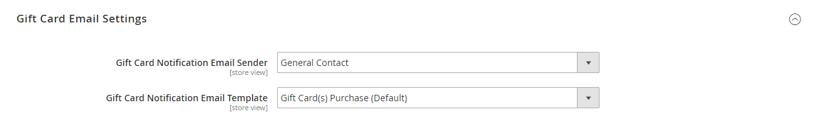
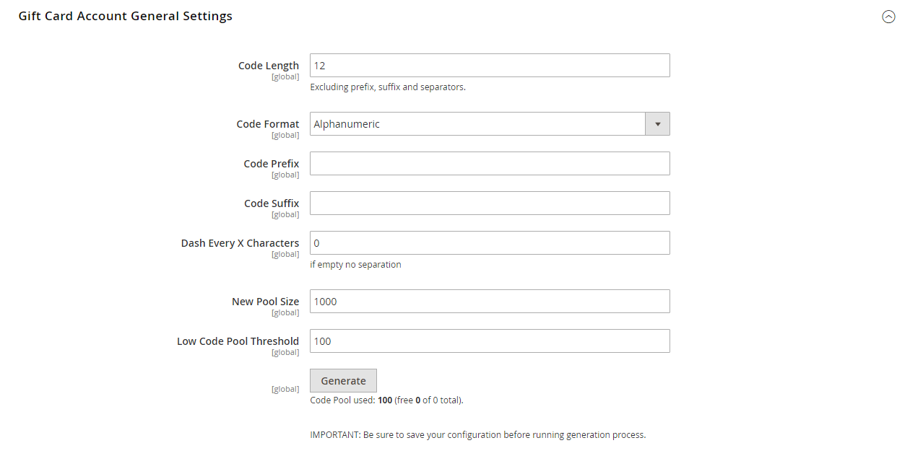

# [!UICONTROL Sales] > [!UICONTROL Gift Cards]

{{ee-feature}}

{{config}}

## [!UICONTROL Gift Card Email Settings]

<!-- zoom -->

<!-- [Gift Card Email Settings](https://experienceleague.adobe.com/en/docs/commerce-admin/stores-sales/point-of-purchase/gift-cards/product-gift-card-accounts#configure-gift-card-accounts) -->

| Champ | [Portée](../../getting-started/websites-stores-views.md#scope-settings) | Description |
|--- |--- |--- |
| [!UICONTROL Gift Card Notification Email Sender] | Affichage de la boutique | Identifie le [&#x200B; contact de la boutique &#x200B;](../../getting-started/store-details.md#store-email-addresses) qui s’affiche comme expéditeur de l’e-mail de notification de carte cadeau. Valeur par défaut : `General Contact` |
| [!UICONTROL Gift Card Notification Email Template] | Affichage de la boutique | Détermine le [modèle](../../systems/email-templates.md) utilisé pour l’e-mail de notification de carte cadeau. |

{style="table-layout:auto"}

## [!UICONTROL Gift Card General Settings]

<!-- zoom -->

<!-- [Gift Card General Settings](https://experienceleague.adobe.com/en/docs/commerce-admin/stores-sales/point-of-purchase/gift-cards/product-gift-card-accounts#configure-gift-card-accounts) -->

| Champ | [Portée](../../getting-started/websites-stores-views.md#scope-settings) | Description |
|--- |--- |--- |
| [!UICONTROL Redeemable] | Global | Détermine si le détenteur de la carte cadeau peut utiliser sa valeur contre de l&#39;argent. Options : `Yes` / `No`. |
| [!UICONTROL Lifetime (days)] | Global | Détermine le nombre de jours de validité de la carte. Si rien n’est indiqué, la carte n’expire pas.   **_Important:_** à certains endroits, il est illégal de définir des données d’expiration sur les cartes-cadeaux. Vérifiez vos lois locales avant de fixer une durée de vie pour vos cartes-cadeaux. |
| [!UICONTROL Allow Gift Message] | Affichage de la boutique | Détermine si l’option permettant d’inclure un message cadeau est disponible pour les clients qui achètent une carte cadeau. Options : `Yes` / `No`. |
| [!UICONTROL Gift Message Maximum Length] | Affichage de la boutique | Détermine le nombre maximal de caractères autorisés dans un message de carte cadeau. Valeur par défaut : 255 |
| [!UICONTROL Generate Gift Card Account when Order Item is] | Global | Détermine si un compte de carte cadeau est généré lorsqu’un client passe une commande ou lorsque la commande est facturée. Options : `Ordered` / `Invoiced` |

{style="table-layout:auto"}

## [!UICONTROL Email Sent from Gift Card Account Management]

<!-- zoom -->

<!-- [Email Sent from Gift Card Account Management](https://experienceleague.adobe.com/en/docs/commerce-admin/stores-sales/point-of-purchase/gift-cards/product-gift-card-accounts#configure-gift-card-accounts) -->

| Champ | [Portée](../../getting-started/websites-stores-views.md#scope-settings) | Description |
|--- |--- |--- |
| [!UICONTROL Gift Card Email Sender] | Affichage de la boutique | Identifie le [&#x200B; contact de la boutique &#x200B;](../../getting-started/store-details.md#store-email-addresses) qui s’affiche comme expéditeur de l’e-mail de carte cadeau. Valeur par défaut : `General Contact` |
| [!UICONTROL Gift Card Template] | Affichage de la boutique | Détermine le [modèle](../../systems/email-templates.md) utilisé pour l’e-mail de carte cadeau. |

{style="table-layout:auto"}

## [!UICONTROL Gift Card Account General Settings]

<!-- zoom -->

<!-- [Gift Card Account General Settings](https://experienceleague.adobe.com/en/docs/commerce-admin/stores-sales/point-of-purchase/gift-cards/product-gift-card-accounts#configure-gift-card-accounts) -->

| Champ | [Portée](../../getting-started/websites-stores-views.md#scope-settings) | Description |
|--- |--- |--- |
| [!UICONTROL Code Length] | Global | Détermine la longueur du code de carte cadeau. |
| [!UICONTROL Code Format] | Global | Détermine le format du code de carte cadeau. Options : `Alphanumeric` / `Numeric` |
| [!UICONTROL Code Prefix] | Global | Définit tout préfixe ajouté au début du code. |
| [!UICONTROL Code Suffix] | Global | Définit tout suffixe ajouté à la fin du code. |
| [!UICONTROL Dash Every X Characters] | Global | Si vous souhaitez inclure des tirets dans le code, détermine le nombre de caractères entre chaque tiret. |
| [!UICONTROL New Pool Size] | Global | Détermine la taille du nouveau pool de code à générer. |
| [!UICONTROL Low Code Pool Threshold] | Global | Détermine le nombre d&#39;enregistrements dans le pool de code qui déclenche une alerte indiquant que le pool doit être réapprovisionné. |
| [!UICONTROL Generate] | Global | Cliquez pour générer la liste des codes de carte cadeau. |

{style="table-layout:auto"}
