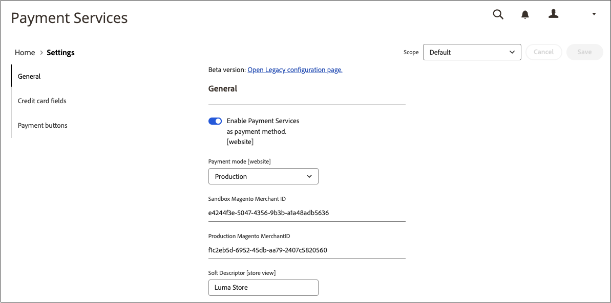

# [!UICONTROL Sales] > [!UICONTROL Payment Methods] > [!UICONTROL Payment Services]

Payment Services offre une solution clé en main en libre-service, notamment des tests de sandbox et une configuration simple, pour offrir un traitement des paiements robuste et sécurisé. Pour en savoir plus, consultez le [_Guide de l’utilisateur des services de paiement_](https://experienceleague.adobe.com/docs/commerce/payment-services/guide-overview.html).

Pour accéder aux paramètres de configuration des services de paiement, dans la barre latérale _Admin_, accédez à **[!UICONTROL Sales]** > **[!UICONTROL Payment Services]** et cliquez sur **[!UICONTROL Settings]**.

{width="400"}

>[!NOTE]
>
>Pour utiliser la configuration héritée au lieu de [Paramètres](https://experienceleague.adobe.com/docs/commerce/payment-services/configure/settings.html), voir [Configuration héritée](https://experienceleague.adobe.com/docs/commerce/payment-services/configure/configure-admin.html).

## [!UICONTROL General]

{width="600" zoomable="yes"}

| Champ | [Portée](../../getting-started/websites-stores-views.md#scope-settings) | Description |
|---|---|---|
| [!UICONTROL Enable] | site internet | Activez ou désactivez [!DNL Payment Services] pour votre site web. Options : [!UICONTROL Yes] / [!UICONTROL No] |
| [!UICONTROL Payment mode] | vue magasin | Définissez la méthode, ou l’environnement, de votre magasin. Options : [!UICONTROL Sandbox] / [!UICONTROL Production] |
| [!UICONTROL Sandbox Merchant ID] | vue magasin | Votre ID de marchand de sandbox, qui est généré automatiquement lors de l’intégration au sandbox. |
| [!UICONTROL Production Merchant ID] | vue magasin | Votre ID de commerçant de production, qui est généré automatiquement lors de l’intégration au sandbox. |
| [!UICONTROL Soft Descriptor] | affichage du site web ou de la boutique | Ajoutez un descripteur à vos sites web et affichages de boutique qui fournit des informations sur les transactions des clients et délimite les marques, les boutiques ou les lignes de produits. Le bouton (bascule) [!UICONTROL Use website] applique tout descripteur logiciel ajouté au niveau du site web. Le bouton (bascule) [!UICONTROL Use default] applique tout descripteur logiciel ajouté par défaut. |

{style="table-layout:auto"}

## [!UICONTROL Credit card fields]

{width="600" zoomable="yes"}

| Champ | [Portée](../../getting-started/websites-stores-views.md#scope-settings) | Description |
|---|---|---|
| [!UICONTROL Title] | vue magasin | Ajoutez le texte à afficher comme titre pour cette option de paiement dans la vue Mode de paiement lors du passage en caisse. |
| [!UICONTROL Payment Action] | site internet | [action de paiement](payment-methods.md#payment-actions) pour le mode de paiement spécifié. Options : [!UICONTROL Authorize] / [!UICONTROL Authorize and Capture] |
| [!UICONTROL 3DS Secure authentication] | site internet | Activez ou désactivez l’authentification sécurisée [3DS](https://experienceleague.adobe.com/docs/commerce/payment-services/security-compliance/security.html#3ds). Options : [!UICONTROL Always] / [!UICONTROL When Required] / [!UICONTROL Off] |
| [!UICONTROL Show on checkout page] | site internet | Activez ou désactivez les champs de carte de crédit à afficher sur la page de passage en caisse. Options : [!UICONTROL Yes] / [!UICONTROL No] |
| [!UICONTROL Vault enabled] | vue magasin | Activez ou désactivez [chambre forte de carte de crédit](https://experienceleague.adobe.com/docs/commerce/payment-services/payments-checkout/vaulting.html). Options : [!UICONTROL Yes] / [!UICONTROL No] |
| [!UICONTROL Show vaulted payment methods in Admin] | vue magasin | Activez ou désactivez la possibilité d’exécuter des commandes pour les clients dans l’Administration [à l’aide d’un mode de paiement en chambre forte](https://experienceleague.adobe.com/docs/commerce/payment-services/payments-checkout/vaulting.html). Options : [!UICONTROL Yes] / [!UICONTROL No] |
| [!UICONTROL Debug Mode] | site internet | Activez ou désactivez le mode de débogage. Options : [!UICONTROL Yes] / [!UICONTROL No] |

{style="table-layout:auto"}

## [!UICONTROL Payment buttons]

{width="600" zoomable="yes"}

| Champ | [Portée](../../getting-started/websites-stores-views.md#scope-settings) | Description |
|---|---|---|
| [!UICONTROL Title] | vue magasin | Ajoutez le texte à afficher comme titre pour cette option de paiement dans la vue Mode de paiement lors du passage en caisse. |
| [!UICONTROL Payment Action] | site internet | [action de paiement](payment-methods.md#payment-actions){target="_blank"} pour le mode de paiement spécifié. Options : [!UICONTROL Authorize] / [!UICONTROL Authorize and Capture] |
| [!UICONTROL Show PayPal buttons on checkout page] | vue magasin | Activez ou désactivez [!DNL PayPal Smart Buttons] sur la page de passage en caisse. Options : [!UICONTROL &#x200B; Yes] / [!UICONTROL No] |
| [!UICONTROL Show PayPal buttons on product detail page] | vue magasin | Activez ou désactivez [!DNL PayPal Smart Buttons] dans la page des détails du produit. Options : [!UICONTROL &#x200B; Yes] / [!UICONTROL No] |
| [!UICONTROL Show PayPal buttons in mini-cart preview] | vue magasin | Activez ou désactivez l’[!DNL PayPal Smart Buttons] dans l’aperçu du mini-panier. Options : [!UICONTROL Yes] / [!UICONTROL No] |
| [!UICONTROL Show PayPal buttons on cart page] | vue magasin | Activez ou désactivez l’[!DNL PayPal Smart Buttons] sur la page du panier. Options : [!UICONTROL Yes] / [!UICONTROL No] |
| [!UICONTROL Show PayPal Pay Later button] | vue magasin | Activez ou désactivez l&#39;apparence de l&#39;option de paiement différé lorsque des boutons de paiement sont affichés. Options : [!UICONTROL Yes] / [!UICONTROL No] |
| [!UICONTROL Show PayPal Pay Later Message] | site internet | Activez ou désactivez le message Payer plus tard dans le panier, la page produit, le mini-panier et pendant le flux de passage en caisse. Options : [!UICONTROL Yes] / [!UICONTROL No] |
| [!UICONTROL Show Venmo button] | vue magasin | Activez ou désactivez l&#39;option de paiement Venmo où les boutons de paiement sont affichés. Options : [!UICONTROL Yes] / [!UICONTROL No] |
| [!UICONTROL Show Apple Pay button] | vue magasin | Activez ou désactivez l’option de paiement Apple Pay dans laquelle les boutons de paiement sont affichés. Options : [!UICONTROL Yes] / [!UICONTROL No] |
| [!UICONTROL Show PayPal Credit and Debit card button] | vue magasin | Activez ou désactivez l’option de paiement par carte de crédit et de débit où s’affichent les boutons de paiement. Options : [!UICONTROL Yes] / [!UICONTROL No] |
| [!UICONTROL Debug Mode] | site internet | Activez ou désactivez le mode de débogage. Options : [!UICONTROL Yes] / [!UICONTROL No] |

{style="table-layout:auto"}

## [!UICONTROL PayPal Smart Button Styling]

{width="600" zoomable="yes"}

| Champ | [Portée](../../getting-started/websites-stores-views.md#scope-settings) | Description |
|--- |--- |--- |
| [!UICONTROL Layout] | Affichage de la boutique | Définissez le style de disposition des boutons de paiement. Options : [!UICONTROL Vertical] / [!UICONTROL Horizontal] |
| [!UICONTROL Tagline] | Affichage de la boutique | Activez/désactivez le slogan. Options : [!UICONTROL Yes] / [!UICONTROL No] |
| [!UICONTROL Color] | Affichage de la boutique | Définissez la couleur des boutons de paiement. Options : [!UICONTROL Blue] / [!UICONTROL Gold] / [!UICONTROL Silver] / [!UICONTROL White] / [!UICONTROL Black] |
| [!UICONTROL Shape] | Affichage de la boutique | Définissez la forme des boutons de paiement. Options : [!UICONTROL Rectangular] / [!UICONTROL Pill] |
| [!UICONTROL Responsive Button Height] | Affichage de la boutique | Définit si les boutons de paiement utilisent une hauteur par défaut. Options : [!UICONTROL Yes] / [!UICONTROL No] |
| [!UICONTROL Height] | Affichage de la boutique | Définissez la hauteur des boutons de paiement. Valeur par défaut : aucune |
| [!UICONTROL Label] | Affichage de la boutique | Définissez le libellé qui s’affiche dans les boutons de paiement. Options : [!UICONTROL PayPal] / [!UICONTROL Checkout] / [!UICONTROL Buynow] / [!UICONTROL Pay] / [!UICONTROL Installment] |

{style="table-layout:auto"}
