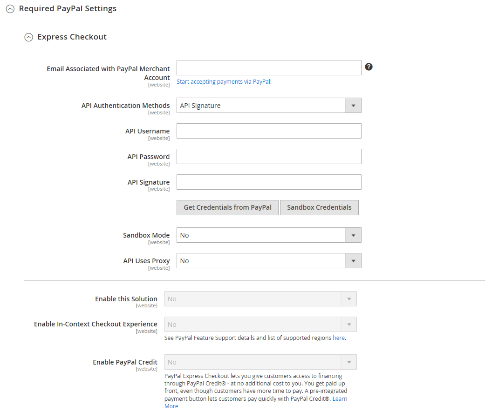
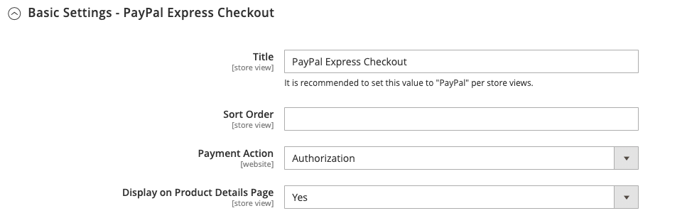
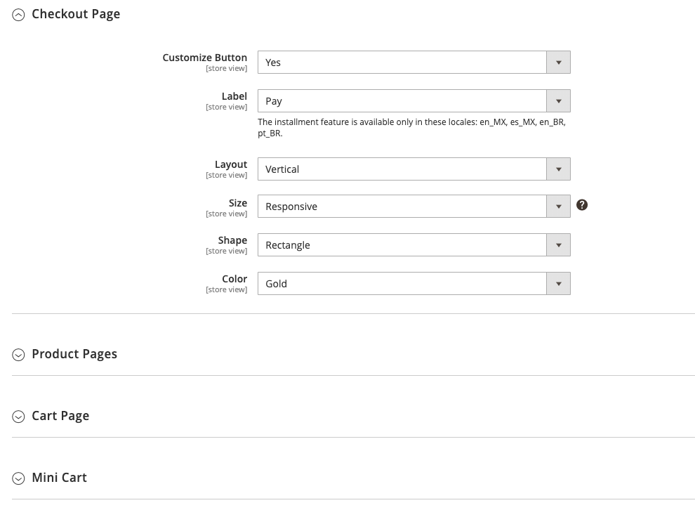
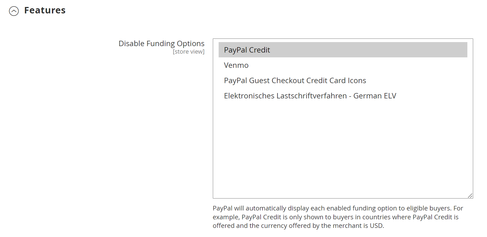

# [!UICONTROL Sales] > [!UICONTROL Payment Methods] > [!UICONTROL PayPal Express Checkout]

>[!IMPORTANT]
>
>**Conditions requises pour PSD2 :**  
>À compter du 14 septembre 2019, les banques européennes pourraient refuser les paiements qui ne répondent pas aux exigences de [PSD2](../../getting-started/compliance-payment-services-directive.md). Aucune action n&#39;est nécessaire pour que PayPal Express Checkout soit conforme à PSD2, car toutes les exigences sont gérées par PayPal.

{{config}}

## [!UICONTROL Required PayPal Settings]

<!-- zoom -->

<!-- [PayPal Express Checkout Required Settings](../../stores-purchase/paypal-express-checkout.html) -->

| Champ | [Portée](../../getting-started/websites-stores-views.md#scope-settings) | Description |
|--- |--- |--- |
| [!UICONTROL Enable this Solution] | Site internet | Active [!DNL PayPal Express Checkout] en tant que mode de paiement disponible pour vos clients. Options : `Yes` / `No` |
| [!UICONTROL Enable In-Context Checkout Experience] | Site internet | Active PayPal In-Context Checkout simplifié comme mode de paiement disponible pour vos clients. Options : `Yes` / `No` |
| [!UICONTROL Enable PayPal Credit] | Site internet | Active le crédit PayPal pour permettre aux clients d&#39;acheter maintenant, mais de payer plus tard. On est payé d&#39;avance, mais les clients ont plus de temps pour payer. Options : `Yes` / `No` |

{style="table-layout:auto"}

### [!UICONTROL Express Checkout]

| Champ | [Portée](../../getting-started/websites-stores-views.md#scope-settings) | Description |
|--- |--- |--- |
| [!UICONTROL Email Associated with PayPal Merchant Account] | Site internet | Spécifie l&#39;adresse e-mail que vous avez spécifiée lors de la création de votre compte marchand PayPal. L’adresse e-mail est sensible à la casse et doit correspondre exactement à votre adresse e-mail dans le système PayPal. |
| [!UICONTROL API Authentication Methods] | Site internet | Détermine la méthode utilisée pour l’authentification API. Options :  **`API Signature`**- affiche le champ _[!UICONTROL API Signature]_dans le formulaire. **`API Certificate`**: affiche le champ_[!UICONTROL API Certificate]_ dans le formulaire. |
| [!UICONTROL API Username] | Site internet | Nom d’utilisateur de l’API associé à votre compte marchand PayPal. |
| [!UICONTROL API Password] | Site internet | Mot de passe API associé à votre compte marchand PayPal. |
| [!UICONTROL API Signature] | Site internet | La signature d&#39;API associée à votre compte marchand PayPal. |
| [!UICONTROL API Certificate] | Site internet | Parcourez l’arborescence pour télécharger votre certificat API. |
| [!UICONTROL Get Credentials from PayPal] |  | Récupère vos informations d&#39;identification API à partir de PayPal. |
| [!UICONTROL Sandbox Credentials] |  | Récupère vos informations d&#39;identification de sandbox à partir de PayPal. |
| [!UICONTROL Sandbox Mode] | Site internet | Pour exécuter PayPal Express Checkout dans un environnement de test, saisissez vos informations d’identification d’API Sandbox, puis définissez ce paramètre sur `Yes`. Options : `Yes` / `No` |
| [!UICONTROL API Uses Proxy] | Site internet | Si votre système utilise un serveur proxy pour établir la connexion entre Commerce et le système PayPal, définissez ce paramètre sur `Yes`. Options : `Yes` / `No` |
| [!UICONTROL Proxy Host] | Site internet | Si l’API utilise proxy, cela spécifie l’adresse IP de l’hôte proxy. |
| [!UICONTROL Proxy Port] | Site internet | Si l’API utilise proxy, cela spécifie le port utilisé par l’hôte proxy. |

{style="table-layout:auto"}

### [!UICONTROL Advertise PayPal Credit]

<!-- zoom -->

| Champ | [Portée](../../getting-started/websites-stores-views.md#scope-settings) | Description |
|--- |--- |--- |
| [!UICONTROL Publisher ID] | Site internet | ID d&#39;éditeur associé à votre compte de crédit PayPal. |
| [!UICONTROL Get Publisher ID from PayPal] |  | Récupère votre ID d&#39;éditeur à partir de PayPal. |
| [!UICONTROL Home Page] | Site internet | Détermine la position et la taille de la bannière [!DNL PayPal Credit] sur la page d’accueil. Options :  **Affichage** - Affiche une bannière [!DNL PayPal Credit] sur la page d’accueil de votre boutique. Options : `Yes` / `No`  **Position** - Détermine la position de la bannière [!DNL PayPal Credit] sur la page d’accueil. Options : En-tête (centre) / Barre latérale (droite)  **Taille** - Détermine la taille de la bannière [!DNL PayPal Credit] sur la page d’accueil. Options : `190 x 100` / `234 x 60` / `300 x 50` / `468 x 60` / `728 x 90` /` 800 x 66` |
| [!UICONTROL Catalog Category Page] | Site internet | Détermine la position et la taille de la bannière de [!DNL PayPal Credit] sur les pages de catégorie. Options : (identique à [!UICONTROL Home Page]) |
| [!UICONTROL Catalog Product Page] | Site internet | Détermine la position et la taille de la bannière de [!DNL PayPal Credit] sur les pages de produits. Options : (identique à [!UICONTROL Home Page]) |
| [!UICONTROL Checkout Cart Page] | Site internet | Détermine la position et la taille de la bannière [!DNL PayPal Credit] sur la page du panier. Options : (identique à [!UICONTROL Home Page]) |

{style="table-layout:auto"}

## [!UICONTROL Basic Settings]

<!-- zoom -->

| Champ | [Portée](../../getting-started/websites-stores-views.md#scope-settings) | Description |
|--- |--- |--- |
| [!UICONTROL Title] | Affichage de la boutique | Un nom qui identifie le mode de paiement de PayPal Express Checkout lors du passage en caisse. |
| [!UICONTROL Sort Order] | Affichage de la boutique | Nombre qui détermine la commande pour laquelle PayPal Express Checkout apparaît lorsqu&#39;il est répertorié avec d&#39;autres modes de paiement lors du passage en caisse. Saisissez `0` pour le haut de la liste. |
| [!UICONTROL Payment Action] | Site internet | Détermine l&#39;action entreprise par PayPal lorsqu&#39;il reçoit une commande. Options :  **`Authorization`**- Valide l’achat, mais bloque les fonds. Le montant n&#39;est pas retiré tant qu&#39;il n&#39;a pas été « capturé » par le commerçant. **`Sale`** - Le montant de l&#39;achat est autorisé et immédiatement retiré du compte du client.  **`Order`**- Représente un accord avec PayPal qui permet au marchand de capturer un ou plusieurs montants jusqu&#39;au total commandé à partir du compte acheteur du client, dans un délai défini. Cela peut prendre jusqu’à 29 jours. Une ou plusieurs factures doivent être générées à partir de l’administrateur Commerce pour récupérer les fonds. |
| [!UICONTROL Display on Product Details Page] | Affichage de la boutique | Détermine si le bouton « Passer en caisse avec PayPal » s&#39;affiche sur les pages de produits. Les options incluent : `Yes` / `No` |

{style="table-layout:auto"}

## [!UICONTROL Advanced Settings]

<!-- zoom -->

| Champ | [Portée](../../getting-started/websites-stores-views.md#scope-settings) | Description |
|--- |--- |--- |
| [!UICONTROL Display on Shopping Cart] | Affichage de la boutique | Détermine si PayPal Express Checkout apparaît comme option de paiement dans le panier. Options : `Yes` (PayPal recommandé) / `No` |
| [!UICONTROL Payment Action Applicable From] | Site internet | Détermine la plage de la sélection de pays applicable. Options : `All Allowed Countries` / `Specific Countries` |
| [!UICONTROL Countries Payment Applicable From] | Site internet | Identifie chaque pays d&#39;où le paiement est accepté. Seuls les clients disposant d&#39;une adresse de facturation dans un pays sélectionné peuvent effectuer des achats avec ce mode de paiement. |
| [!UICONTROL Debug Mode] | Site internet | Enregistre les messages envoyés entre votre magasin et le système de paiement dans un fichier journal. Options : `Yes` / `No`   **_Note:_** Le fichier journal est stocké sur le serveur et n’est accessible que par les développeurs. Conformément aux normes PCI Data Security, les informations de carte de crédit ne sont pas enregistrées dans le fichier journal. |
| [!UICONTROL Enable SSL Verification] | Site internet | Permet de vérifier le certificat de sécurité de l&#39;hôte. Options : `Yes` / `No` |
| [!UICONTROL Transfer Cart Line Items] | Site internet | Affiche un résumé complet des articles de la ligne du panier du client sur le site PayPal. Options : `Yes` / `No` |
| [!UICONTROL Transfer Shipping Options] | Site internet | Inclut jusqu&#39;à dix options de livraison sur le site PayPal. Options : `Yes` / `No` |
| [!UICONTROL Shortcut Buttons Flavor] | Affichage de la boutique | Détermine le type d&#39;image utilisé pour le bouton d&#39;acceptation PayPal. Options :  **`Dynamic`**- (Recommandé) Affiche une image qui peut être modifiée dynamiquement à partir du serveur PayPal. **`Static`** - Affiche une image statique qui ne peut pas être modifiée dynamiquement. |
| [!UICONTROL Enable PayPal Guest Checkout] | Site internet | Permet aux clients qui n&#39;ont pas de compte PayPal d&#39;effectuer des achats avec PayPal Express Checkout. Options : `Yes` / `No` |
| [!UICONTROL Require Customer's Billing Address] | Site internet | Détermine si l’adresse de facturation du client est requise. Options : `Yes` / `No` / `For Virtual Quotes Only` |
| [!UICONTROL Billing Agreement Signup] | Site internet | Détermine si les clients peuvent conclure un [accord de facturation](../../stores-purchase/paypal-billing-agreements.md) avec votre boutique. Options :  **`Auto`**- Le client peut signer un contrat de facturation lors du passage en caisse express. **`Ask Customer`** - Il est demandé aux clients s&#39;ils souhaitent s&#39;inscrire à un accord de facturation.  **`Never`**- Les clients n’ont pas la possibilité de s’inscrire à un accord de facturation. |
| [!UICONTROL Skip Order Review Step] | Site internet | Détermine si les clients peuvent terminer la transaction à partir du site PayPal ou s&#39;ils doivent retourner dans votre magasin et terminer l&#39;étape de révision de la commande avant d&#39;envoyer la commande. Options : `Yes` / `No` |

{style="table-layout:auto"}

### [!UICONTROL Billing Agreement Settings]

<!-- zoom -->

| Champ | [Portée](../../getting-started/websites-stores-views.md#scope-settings) | Description |
|--- |--- |--- |
| [!UICONTROL Enabled] | Site internet | Lorsqu’ils sont activés, les contrats de facturation apparaissent aux clients comme une option de paiement lors du passage en caisse. Options : `Yes` / `No` |
| [!UICONTROL Title] | Affichage de la boutique | Libellé de l’option de contrat de facturation PayPal qui apparaît comme option de paiement lors du passage en caisse. |
| [!UICONTROL Sort Order] | Affichage de la boutique | Détermine l&#39;ordre dans lequel les accords de facturation sont répertoriés avec d&#39;autres modes de paiement lors du passage en caisse. |
| [!UICONTROL Payment Action] | Site internet | Détermine comment PayPal gère la transaction : Options :  **Autorisation** - Valide l&#39;achat, mais bloque les fonds. Le montant n&#39;est pas retiré tant qu&#39;il n&#39;a pas été « capturé » par le commerçant.  **Vente** - Le montant de l&#39;achat est autorisé et immédiatement retiré du compte du client. |
| [!UICONTROL Payment Applicable From] | Site internet | Détermine la plage de la sélection de pays applicable. Options : Tous Les Pays Autorisés / Pays Spécifiques |
| [!UICONTROL Countries Payment Applicable From] | Site internet | Identifie chaque pays d&#39;où le paiement est accepté. Seuls les clients disposant d&#39;une adresse de facturation dans un pays sélectionné peuvent effectuer des achats avec ce mode de paiement. |
| [!UICONTROL Debug Mode] | Site internet | Enregistre la communication avec le système de paiement dans un fichier journal. Options : `Yes` / `No`   **_Note:_** Le fichier journal est stocké sur le serveur et n’est accessible que par les développeurs. Conformément aux normes PCI Data Security, les informations de carte de crédit ne sont pas enregistrées dans le fichier journal. |
| [!UICONTROL Enable SSL Verification] | Site internet | Active une étape de vérification vers qui garantit que la transaction a lieu sur un canal SSL chiffré. Options : `Yes` / `No` |
| [!UICONTROL Transfer Cart Line Items] | Site internet | Lorsque cette option est activée, affiche un résumé des articles du panier sur votre page de paiements PayPal. Options : `Yes` / `No` |
| [!UICONTROL Allow in Billing Agreement Wizard] | Site internet | Lorsque cette option est activée, les clients peuvent lancer un accord de facturation à partir du tableau de bord de leur compte client. |

{style="table-layout:auto"}

### [!UICONTROL Settlement Report Settings]

<!-- zoom -->

| Champ | [Portée](../../getting-started/websites-stores-views.md#scope-settings) | Description |
|--- |--- |--- |
| **[!UICONTROL SFTP Credentials]** |  |  |
| [!UICONTROL Login] | Site internet | Nom d&#39;utilisateur requis pour se connecter au serveur FTP sécurisé de PayPal. |
| [!UICONTROL Password] | Site internet | Mot de passe requis pour se connecter au serveur FTP sécurisé de PayPal. |
| [!UICONTROL Sandbox Mode] | Site internet | Lorsqu’il est activé, exécute les rapports dans un environnement de test avant la mise en production dans l’environnement de production. Options : `Yes` / `No` |
| [!UICONTROL Custom Endpoint Hostname or IP-Address] | Site internet | URL de gestion des rapports de règlement. Valeur par défaut : `reports.paypal.com` |
| [!UICONTROL Custom Path] | Site internet | Chemin d’accès où les rapports de règlement sont enregistrés sur votre serveur. Valeur par défaut : `/ppreports/outgoing` |
| **[!UICONTROL Scheduled Fetching]** |  |  |
| [!UICONTROL Enable Automatic Fetching] | Site internet | Lorsqu&#39;elle est activée, récupère automatiquement les rapports de règlement selon le calendrier. Options : `Yes` / `No` |
| [!UICONTROL Schedule] | Site internet | Détermine la fréquence de génération des rapports de règlement par PayPal. Options : `Daily` / `Every 3 days` / `Every 7 days` / `Every 10 days` / `Every 14 days` / `Every 30 days` / `Every 40 days` |
| [!UICONTROL Time of Day] | Site internet | Détermine l&#39;heure, la minute et la seconde auxquelles les rapports de règlement sont générés. |

{style="table-layout:auto"}

### [!UICONTROL Frontend Experience Settings]

<!-- zoom -->

| Champ | [Portée](../../getting-started/websites-stores-views.md#scope-settings) | Description |
|--- |--- |--- |
| [!UICONTROL PayPal Product Logo] | Affichage de la boutique | Détermine le logo PayPal qui apparaît dans votre boutique. Il existe quatre styles de base dans deux tailles. Options : `No Logo` / `We prefer PayPal (150 x 60)` / `We prefer PayPal (150 x 40)` / `Now accepting PayPal (150 x 60)` / `Now accepting PayPal (150 x 40)` / `Payments by PayPal (150 x 60)` / `Payments by PayPal (150 x 40)` / `Shop now using (150 x 60)` / `Shop now using (150 x 40)` |
| **[!UICONTROL PayPal Merchant Pages Style]** |  |  |
| [!UICONTROL Page Style] | Affichage de la boutique | Détermine l&#39;apparence de votre page de vendeur PayPal. Valeurs autorisées : **`paypal`** - Utilise le style de page PayPal.  **`primary`**- Utilise le style de page que vous avez identifié comme style « principal » dans le profil de votre compte. **`your_custom_value`** - Utilise un style de page de paiement personnalisé, spécifié dans le profil de votre compte. |
| [!UICONTROL Header Image URL] | Affichage de la boutique | URL de l’image qui s’affiche dans le coin supérieur gauche de la page de passage en caisse. La taille maximale est de 750 x 90 pixels.   **_Note:_** PayPal recommande de stocker l&#39;image sur un serveur sécurisé (https). Dans le cas contraire, le navigateur du client peut signaler que « la page contient des éléments sécurisés et non sécurisés ». |
| [!UICONTROL Header Image Background Color] | Affichage de la boutique | Code [couleur hexadécimale](https://en.wikipedia.org/wiki/Web_colors) de six caractères pour la couleur d’arrière-plan de l’en-tête sur la page de passage en caisse. Vous pouvez saisir le code en majuscules et en minuscules. |
| [!UICONTROL Header Image Border Color] | Affichage de la boutique | Code [couleur hexadécimale](https://en.wikipedia.org/wiki/Web_colors) de six caractères pour la bordure de deux pixels autour de l’en-tête. |
| [!UICONTROL Page Background Color] | Affichage de la boutique | Code [couleur hexadécimale](https://en.wikipedia.org/wiki/Web_colors) de six caractères pour la couleur d’arrière-plan de la page de passage en caisse qui s’affiche derrière l’en-tête et le formulaire de paiement. |

{style="table-layout:auto"}

#### [!UICONTROL Customize Smart Buttons (Basic)]

<!-- zoom -->

| Champ | [Portée](../../getting-started/websites-stores-views.md#scope-settings) | Description |
|--- |--- |--- |
| [!UICONTROL Customize Button] | Affichage de la boutique | Détermine si les boutons intelligents PayPal peuvent être personnalisés pour correspondre à la mise en page et au thème de votre boutique. Vous pouvez appliquer ces modifications indépendamment sur la page Passage en caisse, sur les pages Produit, sur la page Panier et dans le mini panier. |
| [!UICONTROL Label] | Affichage de la boutique | Texte que PayPal affiche sur le bouton de paiement intelligent. Options :  **`Checkout`**(affiche « Paiement PayPal ») **`Pay`** (affiche « Paiement avec PayPal »)  **`Buy Now`**(affiche « Achat immédiat avec PayPal ») **`PayPal`** (affiche « PayPal »)  **`Installment`**(affiche « PayPal ») **`Credit`** (affiche « Crédit PayPal ») |
| [!UICONTROL Layout] | Affichage de la boutique | Détermine s&#39;il faut afficher les boutons intelligents PayPal verticalement ou horizontalement. Options :  **`Vertical`**- L&#39;acheteur doit soit se connecter à PayPal, soit créer un compte PayPal, que l&#39;option « Activer le passage en caisse des invités » soit sélectionnée ou non. **`Horizontal`** - Lorsque « Activer le passage en caisse des invités » est sélectionné, affiche le bouton **`Pay with Debit Card or Credit Card`** sur la fenêtre contextuelle PayPal. Sinon, l&#39;acheteur doit se connecter à PayPal ou créer un compte PayPal. |
| [!UICONTROL Size] | Affichage de la boutique | Définit la taille du bouton de paiement intelligent. Options :  **`Medium`**- 250 pixels par 35 pixels **`Large`** - 350 pixels par 40 pixels  **`Responsive`**- (Par défaut) S’ajuste à la largeur du conteneur. La largeur minimale est de 100 pixels et la largeur maximale est de 500 pixels. La hauteur s’ajuste dynamiquement en fonction de la largeur. |
| [!UICONTROL Shape] | Affichage de la boutique | Définit la forme du bouton de paiement intelligent. Options : `Pill` (par défaut) / `Rectangle` |
| [!UICONTROL Color] | Affichage de la boutique | Définissez la couleur du bouton de paiement intelligent. Options : `Gold` (par défaut) / `Blue` / `Silver` / `Black` |

{style="table-layout:auto"}

#### [!UICONTROL Customize Smart Buttons (Features)]

<!-- zoom -->

| Champ | [Portée](../../getting-started/websites-stores-views.md#scope-settings) | Description |
|--- |--- |--- |
| [!UICONTROL Disable Funding Options] | Affichage de la boutique | Détermine quelles autres options de financement PayPal sont affichées sur la page Passage en caisse. Les options sélectionnées ne s’affichent jamais sur la page Passage en caisse. Les options non sélectionnées s&#39;affichent uniquement si PayPal prend en charge la devise du magasin et le lieu de l&#39;acheteur. Options : `PayPal Credit` / `PayPal Guest Checkout` `Credit Card Icons` / `Elektronisches Lastschriftverfahren - German ELV` |

{style="table-layout:auto"}
