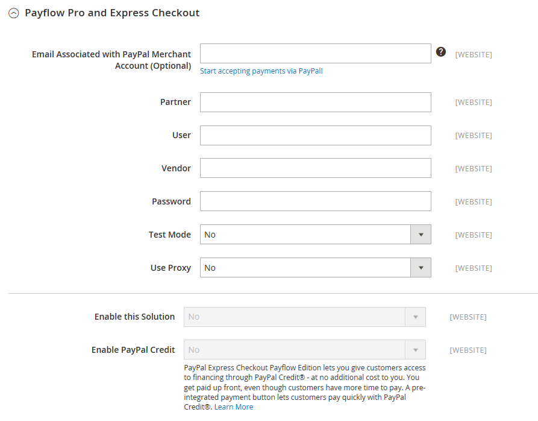

# [!UICONTROL Sales] > [!UICONTROL Payment Methods] >  [!UICONTROL PayPal Payflow Pro]

>[!IMPORTANT]
>
>**Exigences de PSD2 :**  
>À compter du 14 septembre 2019, les banques européennes pourraient refuser les paiements qui ne satisfont pas [PSD2](../../getting-started/compliance-payment-services-directive.md) conditions requises. Pour se conformer au PSD2, [!DNL PayPal Payflow Pro] doit être intégré à [!DNL Cardinal Commerce]. Pour en savoir plus, voir [Sécurisé 3D pour le flux de production](https://developer.paypal.com/api/nvp-soap/payflow/3d-secure-overview/).

{{config}}

## [!UICONTROL Required Settings]

<!-- zoom -->

| Champ | [Portée](../../getting-started/websites-stores-views.md#scope-settings) | Description |
|--- |--- |--- |
| [!UICONTROL Email Associated with PayPal Merchant Account] | Site Web | (Facultatif) Toute adresse électronique associée à votre compte marchand PayPal. Les adresses électroniques sont sensibles à la casse et doivent correspondre exactement aux adresses contenues dans votre compte. |
| [!UICONTROL Partner] | Site Web | Votre identifiant de partenaire PayPal, le cas échéant. |
| [!UICONTROL Vendor] | Site Web | Votre nom d’utilisateur PayPal. |
| Utilisateur | Site Web | L’identifiant d’un autre utilisateur de votre compte PayPal. |
| [!UICONTROL Password] | Site Web | Mot de passe associé à votre compte marchand PayPal. |
| [!UICONTROL Test Mode] | Site Web | Lorsqu’elle est activée, exécute PayPal Payflow Pro dans un environnement de test. Désactivez le mode test lorsque vous êtes prêt à passer en mode de production. Options : `Yes` / `No` |
| [!UICONTROL Use Proxy] | Site Web | Un proxy peut être utilisé pour rediriger le trafic lorsque le pare-feu du serveur empêche l’accès direct au serveur PayPal. Le cas échéant, identifie le serveur proxy utilisé pour établir la connexion au serveur PayPal. Options : `Yes` / `No`   Si cette option est activée, définissez les options de proxy :  **`Proxy Host`**- Adresse IP de l’hôte proxy. **`Proxy Port`** - Numéro du port du proxy. |
| [!UICONTROL Enable this Solution] | Site Web | Détermine si PayPal Payflow Pro est disponible pour vos clients en tant que mode de paiement. |
| [!UICONTROL Enable PayPal Credit] | Site Web | Détermine si le crédit PayPal est disponible pour vos clients comme option de paiement. |

{style="table-layout:auto"}

## [!UICONTROL Advertise PayPal Credit]

<!-- zoom -->

| Champ | [Portée](../../getting-started/websites-stores-views.md#scope-settings) | Description |
|--- |--- |--- |
| [!UICONTROL Publisher ID] | Site Web | Identifiant de l’éditeur associé à votre compte de crédit PayPal. |
| [!UICONTROL Get Publisher ID from PayPal] |  | Récupère votre identifiant d’éditeur auprès de PayPal. |
| [!UICONTROL Home Page] | Site Web | Détermine la position et la taille de la variable [!DNL PayPal Credit] bannière sur la page d’accueil. Options :  **`Display`**- Détermine si une[!DNL PayPal Credit] la bannière s’affiche sur la page d’accueil de votre magasin. Options : `Yes` / `No` **`Position`** - Détermine la position de la variable [!DNL PayPal Credit] bannière sur la page d’accueil. Options : en-tête (centre) / Barre latérale (droite)  **`Size`**- Détermine la taille de la variable [!DNL PayPal Credit] bannière sur la page d’accueil. Options : `190 x 100` / `234 x 60` / `300 x 50` / `468 x 60` / `728 x 90` /` 800 x 66` |
| [!UICONTROL Catalog Category Page] | Site Web | Détermine la position et la taille de la variable [!DNL PayPal Credit] bannière sur les pages de catégorie. Options : (identique à pour [!UICONTROL Home Page]) |
| [!UICONTROL Catalog Product Page] | Site Web | Détermine la position et la taille de la variable [!DNL PayPal Credit] bannière sur les pages de produits. Options : (identique à pour [!UICONTROL Home Page]) |
| [!UICONTROL Checkout Cart Page] | Site Web | Détermine la position et la taille de la variable [!DNL PayPal Credit] bannière sur la page du panier. Options : (identique à pour [!UICONTROL Home Page]) |

{style="table-layout:auto"}

## [!UICONTROL Basic Settings - PayPal Payflow Pro]

<!-- zoom -->

| Champ | [Portée](../../getting-started/websites-stores-views.md#scope-settings) | Description |
|--- |--- |--- |
| [!UICONTROL Title] | Affichage en magasin | Nom qui identifie PayPal Payflow Pro comme mode de paiement lors du passage en caisse. |
| [!UICONTROL Sort Order] | Affichage en magasin | Numéro qui détermine l’ordre dans lequel PayPal Payflow Pro apparaît lorsqu’il est répertorié avec d’autres méthodes de paiement lors du passage en caisse. |
| [!UICONTROL Payment Action] | Site Web | Détermine l’action effectuée par PayPal lors de l’envoi d’une commande. Options :  **`Authorization`**- Valide l’achat, mais met un frein aux fonds. Le montant n’est pas retiré tant qu’il n’a pas été &quot;capturé&quot; par le marchand. **`Sale`** - Le montant de l’achat est autorisé et immédiatement retiré du compte du client. |
| **[!UICONTROL Credit Card Settings]** |  |  |
| [!UICONTROL Allowed Credit Cart Types] | Site Web | Détermine les cartes de crédit disponibles pour les clients lors du passage en caisse. Sélectionnez chaque carte prise en charge. Options : `American Express` (nécessite un accord supplémentaire) / `Visa` / `MasterCard` / `Discover` / `JCB` |

{style="table-layout:auto"}

## [!UICONTROL Advanced Settings]

<!-- zoom -->

| Champ | [Portée](../../getting-started/websites-stores-views.md#scope-settings) | Description |
|--- |--- |--- |
| Afficher sur le panier | Affichage en magasin | Détermine si le paiement express PayPal apparaît comme option de paiement dans le panier. Options : Oui (recommandé) / Non |
| [!UICONTROL Payment Action Applicable From] | Site Web | Détermine la plage de la sélection de pays applicable. Options : tous les pays autorisés/pays spécifiques |
| [!UICONTROL Countries Payment Applicable From] | Site Web | Identifie chaque pays à partir duquel le paiement est accepté. Seuls les clients ayant une adresse de facturation dans un pays sélectionné peuvent effectuer des achats avec ce mode de paiement. |
| [!UICONTROL Debug Mode] | Site Web | Enregistre les messages envoyés entre votre boutique et le système de paiement PayPal dans un fichier journal. Options : `Yes` / `No`   **_Remarque :_**Le fichier journal est stocké sur le serveur et accessible uniquement aux développeurs. Conformément aux normes de sécurité des données PCI, les informations de carte de crédit ne sont pas enregistrées dans le fichier journal. |
| [!UICONTROL Enable SSL Verification] | Site Web | Active la vérification du certificat de sécurité hôte. Options : `Yes` / `No` |
| [!UICONTROL Transfer Cart Line Items] | Site Web | Affiche un résumé complet des éléments de ligne du panier du client sur le site PayPal. Options : `Yes` / `No` |
| [!UICONTROL Skip Order Review Step] | Site Web | Détermine si les clients peuvent effectuer la transaction à partir du site PayPal ou s’ils doivent retourner dans votre boutique et terminer l’étape de vérification de la commande avant d’envoyer la commande. Options : `Yes` / `No` |

{style="table-layout:auto"}
