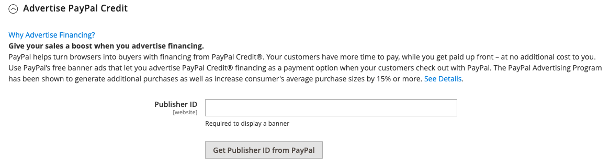
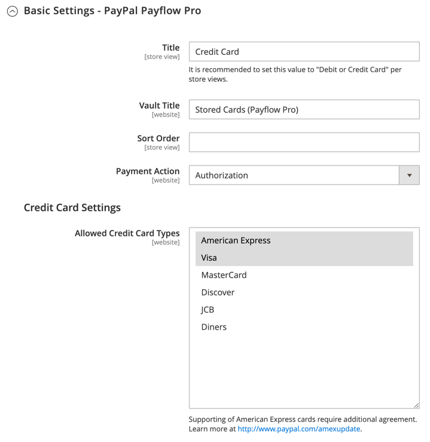
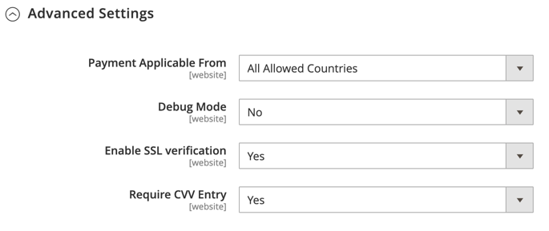

# [!UICONTROL Sales] > [!UICONTROL Payment Methods] >  [!UICONTROL PayPal Payflow Pro]

>[!IMPORTANT]
>
>**Conditions requises pour PSD2 :**  
>À compter du 14 septembre 2019, les banques européennes pourraient refuser les paiements qui ne répondent pas aux exigences de [PSD2](../../getting-started/compliance-payment-services-directive.md). Pour se conformer à PSD2, [!DNL PayPal Payflow Pro] doit être intégré à [!DNL Cardinal Commerce]. Pour en savoir plus, consultez la section [3-D Secure for Payflow](https://developer.paypal.com/api/nvp-soap/payflow/3d-secure-overview/).

{{config}}

## [!UICONTROL Required Settings]

<!-- zoom -->

| Champ | [Portée](../../getting-started/websites-stores-views.md#scope-settings) | Description |
|--- |--- |--- |
| [!UICONTROL Email Associated with PayPal Merchant Account] | Site internet | (Facultatif) Toute adresse e-mail associée à votre compte marchand PayPal. Les adresses e-mail sont sensibles à la casse et doivent correspondre exactement aux adresses qui se trouvent dans votre compte. |
| [!UICONTROL Partner] | Site internet | Votre identifiant de partenaire PayPal, le cas échéant. |
| [!UICONTROL Vendor] | Site internet | Votre nom d&#39;utilisateur PayPal. |
| Utilisateur | Site internet | Identifiant d&#39;un autre utilisateur sur votre compte PayPal. |
| [!UICONTROL Password] | Site internet | Mot de passe associé à votre compte marchand PayPal. |
| [!UICONTROL Test Mode] | Site internet | Lorsqu&#39;elle est activée, exécute PayPal Payflow Pro dans un environnement de test. Désactivez le mode test lorsque vous êtes prêt à activer le mode production. Options : `Yes` / `No` |
| [!UICONTROL Use Proxy] | Site internet | Un proxy peut être utilisé pour rediriger le trafic lorsque le pare-feu du serveur empêche l’accès direct au serveur PayPal. Le cas échéant, identifie le serveur proxy utilisé pour établir la connexion au serveur PayPal. Options : `Yes` / `No`   Si cette option est activée, définissez les options de proxy :  **`Proxy Host`**- Adresse IP de l’hôte proxy. **`Proxy Port`** - Numéro du port du proxy. |
| [!UICONTROL Enable this Solution] | Site internet | Détermine si PayPal Payflow Pro est disponible pour vos clients comme mode de paiement. |
| [!UICONTROL Enable PayPal Credit] | Site internet | Détermine si le crédit PayPal est disponible pour vos clients en tant qu&#39;option de paiement. |

{style="table-layout:auto"}

## [!UICONTROL Advertise PayPal Credit]

<!-- zoom -->

| Champ | [Portée](../../getting-started/websites-stores-views.md#scope-settings) | Description |
|--- |--- |--- |
| [!UICONTROL Publisher ID] | Site internet | ID d&#39;éditeur associé à votre compte de crédit PayPal. |
| [!UICONTROL Get Publisher ID from PayPal] |  | Récupère votre ID d&#39;éditeur à partir de PayPal. |
| [!UICONTROL Home Page] | Site internet | Détermine la position et la taille de la bannière [!DNL PayPal Credit] sur la page d’accueil. Options :  **`Display`**- Détermine si une bannière [!DNL PayPal Credit] s’affiche sur la page d’accueil de votre boutique. Options : `Yes` / `No` **`Position`** - Détermine la position de la bannière [!DNL PayPal Credit] sur la page d’accueil. Options : En-tête (centre) / Barre latérale (droite)  **`Size`**- Détermine la taille de la bannière [!DNL PayPal Credit] sur la page d’accueil. Options : `190 x 100` / `234 x 60` / `300 x 50` / `468 x 60` / `728 x 90` /` 800 x 66` |
| [!UICONTROL Catalog Category Page] | Site internet | Détermine la position et la taille de la bannière de [!DNL PayPal Credit] sur les pages de catégorie. Options : (identique à [!UICONTROL Home Page]) |
| [!UICONTROL Catalog Product Page] | Site internet | Détermine la position et la taille de la bannière de [!DNL PayPal Credit] sur les pages de produits. Options : (identique à [!UICONTROL Home Page]) |
| [!UICONTROL Checkout Cart Page] | Site internet | Détermine la position et la taille de la bannière [!DNL PayPal Credit] sur la page du panier. Options : (identique à [!UICONTROL Home Page]) |

{style="table-layout:auto"}

## [!UICONTROL Basic Settings - PayPal Payflow Pro]

<!-- zoom -->

| Champ | [Portée](../../getting-started/websites-stores-views.md#scope-settings) | Description |
|--- |--- |--- |
| [!UICONTROL Title] | Affichage de la boutique | Nom qui identifie PayPal Payflow Pro comme mode de paiement lors du passage en caisse. |
| [!UICONTROL Sort Order] | Affichage de la boutique | Nombre qui détermine l&#39;ordre dans lequel PayPal Payflow Pro apparaît lorsqu&#39;il est répertorié avec d&#39;autres modes de paiement lors du passage en caisse. |
| [!UICONTROL Payment Action] | Site internet | Détermine l&#39;action entreprise par PayPal lors de la soumission d&#39;une commande. Options :  **`Authorization`**- Valide l’achat, mais bloque les fonds. Le montant n&#39;est pas retiré tant qu&#39;il n&#39;a pas été « capturé » par le commerçant. **`Sale`** - Le montant de l&#39;achat est autorisé et immédiatement retiré du compte du client. |
| **[!UICONTROL Credit Card Settings]** |  |  |
| [!UICONTROL Allowed Credit Cart Types] | Site internet | Détermine les cartes de crédit disponibles pour les clients lors du passage en caisse. Sélectionnez chaque carte prise en charge. Options : `American Express` (nécessite un accord supplémentaire) / `Visa` / `MasterCard` / `Discover` / `JCB` |

{style="table-layout:auto"}

## [!UICONTROL Advanced Settings]

<!-- zoom -->

| Champ | [Portée](../../getting-started/websites-stores-views.md#scope-settings) | Description |
|--- |--- |--- |
| Afficher sur le panier | Affichage de la boutique | Détermine si PayPal Express Checkout apparaît comme option de paiement dans le panier. Options : Oui (Recommandé) / Non |
| [!UICONTROL Payment Action Applicable From] | Site internet | Détermine la plage de la sélection de pays applicable. Options : Tous Les Pays Autorisés / Pays Spécifiques |
| [!UICONTROL Countries Payment Applicable From] | Site internet | Identifie chaque pays d&#39;où le paiement est accepté. Seuls les clients disposant d&#39;une adresse de facturation dans un pays sélectionné peuvent effectuer des achats avec ce mode de paiement. |
| [!UICONTROL Debug Mode] | Site internet | Enregistre les messages envoyés entre votre boutique et le système de paiement PayPal dans un fichier journal. Options : `Yes` / `No`   **_Note:_** Le fichier journal est stocké sur le serveur et n’est accessible que par les développeurs. Conformément aux normes PCI Data Security, les informations de carte de crédit ne sont pas enregistrées dans le fichier journal. |
| [!UICONTROL Enable SSL Verification] | Site internet | Permet de vérifier le certificat de sécurité de l&#39;hôte. Options : `Yes` / `No` |
| [!UICONTROL Transfer Cart Line Items] | Site internet | Affiche un résumé complet des articles de la ligne du panier du client sur le site PayPal. Options : `Yes` / `No` |
| [!UICONTROL Skip Order Review Step] | Site internet | Détermine si les clients peuvent terminer la transaction à partir du site PayPal ou s&#39;ils doivent retourner dans votre magasin et terminer l&#39;étape de révision de la commande avant d&#39;envoyer la commande. Options : `Yes` / `No` |

{style="table-layout:auto"}
