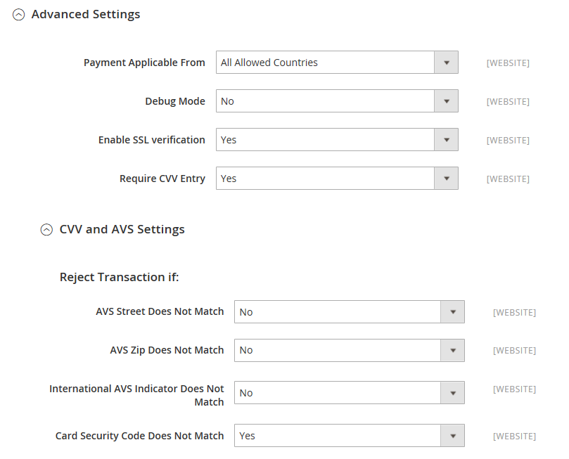

# [!UICONTROL Sales] > [!UICONTROL Payment Methods] > [!UICONTROL PayPal Payments Pro]

>[!IMPORTANT]
>
>**Exigences de PSD2 :**  
>À compter du 14 septembre 2019, les banques européennes pourront refuser les paiements qui ne répondent pas aux exigences de [PSD2](../../getting-started/compliance-payment-services-directive.md). Pour se conformer à PSD2, [!DNL PayPal Payments Pro] doit être intégré à [!DNL Cardinal Commerce]. Pour en savoir plus, voir [3-D Secure for Payflow](https://developer.paypal.com/api/nvp-soap/payflow/3d-secure-overview/).

{{config}}

## [!UICONTROL Required Settings]

<!-- zoom -->

| Champ | [Portée](../../getting-started/websites-stores-views.md#scope-settings) | Description |
|--- |--- |--- |
| [!UICONTROL Email Associated with PayPal Merchant Account] | Site Web | (Facultatif) Toute adresse électronique associée à votre compte marchand PayPal. Les adresses électroniques sont sensibles à la casse et doivent correspondre exactement aux adresses contenues dans votre compte. |
| [!UICONTROL Partner] | Site Web | Votre identifiant de partenaire PayPal, le cas échéant. |
| [!UICONTROL Vendor] | Site Web | Votre nom d’utilisateur PayPal. |
| Utilisateur | Site Web | L’identifiant d’un autre utilisateur de votre compte PayPal. |
| [!UICONTROL Password] | Site Web | Mot de passe associé à votre compte marchand PayPal. |
| [!UICONTROL Test Mode] | Site Web | Lorsqu’elle est activée, exécute PayPal payment Pro dans un environnement de test. Désactivez le mode test lorsque vous êtes prêt à passer en mode de production. Options : `Yes` / `No` |
| [!UICONTROL Use Proxy] | Site Web | Un proxy peut être utilisé pour rediriger le trafic lorsque le pare-feu du serveur empêche l’accès direct au serveur PayPal. Le cas échéant, identifie le serveur proxy utilisé pour établir la connexion au serveur PayPal. Options : `Yes` / `No`   Si cette option est activée, définissez les options :  **Hôte du proxy** - Adresse IP de l’hôte proxy.  **Proxy Port** - Numéro de port du proxy. |
| [!UICONTROL Enable this Solution] | Site Web | Détermine si PayPal payment Pro est disponible pour vos clients en tant que méthode de paiement. |
| [!UICONTROL Enable PayPal Credit] | Site Web | Détermine si le crédit PayPal est disponible pour vos clients comme option de paiement. |

{style="table-layout:auto"}

## [!UICONTROL Advertise PayPal Credit]

<!-- zoom -->

| Champ | [Portée](../../getting-started/websites-stores-views.md#scope-settings) | Description |
|--- |--- |--- |
| [!UICONTROL Publisher ID] | Site Web | Identifiant de l’éditeur associé à votre compte de crédit PayPal. |
| [!UICONTROL Get Publisher ID from PayPal] |  | Récupère votre identifiant d’éditeur auprès de PayPal. |
| [!UICONTROL Home Page] | Site Web | Détermine la position et la taille de la bannière [!DNL PayPal Credit] sur la page d’accueil. Options :  **`Display`**- Détermine si une bannière [!DNL PayPal Credit] s’affiche sur la page d’accueil de votre magasin. Options : `Yes` / `No` **`Position`** - Détermine la position de la bannière [!DNL PayPal Credit] sur la page d’accueil. Options : En-tête (centre) / Barre latérale (droite)  **`Size`**- Détermine la taille de la bannière [!DNL PayPal Credit] sur la page d’accueil. Options : `190 x 100` / `234 x 60` / `300 x 50` / `468 x 60` / `728 x 90` /` 800 x 66` |
| [!UICONTROL Catalog Category Page] | Site Web | Détermine la position et la taille de la bannière [!DNL PayPal Credit] sur les pages de catégorie. Options : (identique à pour [!UICONTROL Home Page]) |
| [!UICONTROL Catalog Product Page] | Site Web | Détermine la position et la taille de la bannière [!DNL PayPal Credit] sur les pages de produits. Options : (identique à pour [!UICONTROL Home Page]) |
| [!UICONTROL Checkout Cart Page] | Site Web | Détermine la position et la taille de la bannière [!DNL PayPal Credit] sur la page du panier. Options : (identique à pour [!UICONTROL Home Page]) |

{style="table-layout:auto"}

## [!UICONTROL Basic Settings - PayPal Payments Pro]

<!-- zoom -->

| Champ | [Portée](../../getting-started/websites-stores-views.md#scope-settings) | Description |
|--- |--- |--- |
| [!UICONTROL Title] | Affichage en magasin | Nom qui identifie PayPal payment Pro comme mode de paiement lors du passage en caisse. |
| [!UICONTROL Sort Order] | Affichage en magasin | Numéro qui détermine l’ordre dans lequel PayPal payment Pro apparaît lorsqu’il est répertorié avec d’autres méthodes de paiement lors du passage en caisse. |
| [!UICONTROL Payment Action] | Site Web | Détermine l’action effectuée par PayPal lors de l’envoi d’une commande. Options :  **`Authorization`**- Approuve l’achat, mais met un frein aux fonds. Le montant n’est pas retiré tant qu’il n’a pas été &quot;capturé&quot; par le marchand. **`Sale`** - Le montant de l’achat est autorisé et immédiatement retiré du compte du client. |
| [!UICONTROL Credit Card Settings] |  |  |
| [!UICONTROL Allowed Credit Cart Types] | Site Web | Détermine les cartes de crédit disponibles pour les clients lors du passage en caisse. Sélectionnez chaque carte prise en charge. Options : `American Express` (nécessite un accord supplémentaire) / `Visa` / `MasterCard` / `Discover` / `JCB` |

{style="table-layout:auto"}

## [!UICONTROL Advanced Settings]

<!-- zoom -->

| Champ | [Portée](../../getting-started/websites-stores-views.md#scope-settings) | Description |
|--- |--- |--- |
| [!UICONTROL Payment Applicable From] | Site Web | Détermine la sélection de pays applicable. Options : `All Allowed Countries` / `Specific Countries` |
| [!UICONTROL Countries Payment Applicable From] | Site Web | Identifie chaque pays à partir duquel le paiement est accepté. Seuls les clients ayant une adresse de facturation dans un pays sélectionné peuvent effectuer des achats avec ce mode de paiement. |
| [!UICONTROL Debug Mode] | Site Web | Enregistre les messages envoyés entre votre boutique et le système de paiement dans un fichier journal. Options : `Yes` / `No`   **_Remarque :_**&#x200B;Le fichier journal est stocké sur le serveur et est accessible uniquement aux développeurs. Conformément aux normes de sécurité des données PCI, les informations de carte de crédit ne sont pas enregistrées dans le fichier journal. |
| [!UICONTROL Enable SSL Verification] | Site Web | Détermine si le canal sécurisé sur l’hôte est vérifié avant la transaction. Options : `Yes` / `No` |
| [!UICONTROL Require CVV Entry] | Site Web | Détermine si les clients sont tenus de saisir le code CVV à partir du verso de leur carte de crédit. Options : `Yes` / `No` |
| **[!UICONTROL CVV and AVS Settings]** |  |  |
| _[!UICONTROL Reject Transaction if:]_ |  |  |
| [!UICONTROL AVS Street Does Not Match] | Site Web | Détermine l’action entreprise si le service de vérification de l’adresse détermine que l’adresse de la rue ne correspond pas aux informations du système. Options : `Yes` / `No` |
| [!UICONTROL AVS Zip Does Not Match] | Site Web | Détermine l’action effectuée si le service de vérification d’adresse détermine que le code postal ne correspond pas aux informations du système. Options : `Yes` / `No` |
| [!UICONTROL International AVS Indicator Does Not Match] | Site Web | Détermine l’action effectuée si le service de vérification de l’adresse détermine que l’indicateur international ne correspond pas aux informations du système. Options : `Yes` / `No` |
| [!UICONTROL Card Security Code Does Not Match] | Site Web | Détermine l’action entreprise si le code de sécurité CVV saisi par le client ne correspond pas aux informations du système. Options : `Yes` / `No` |

{style="table-layout:auto"}

## [!UICONTROL Settlement Report Settings]

<!-- zoom -->

| Champ | [Portée](../../getting-started/websites-stores-views.md#scope-settings) | Description |
|--- |--- |--- |
| [!UICONTROL Login] | Site Web | Votre nom d’utilisateur requis pour se connecter au serveur FTP sécurisé de PayPal. |
| [!UICONTROL Password] | Site Web | Votre mot de passe requis pour se connecter au serveur FTP sécurisé de PayPal. |
| [!UICONTROL Sandbox Mode] | Site Web | Lorsqu’elle est activée, exécute les rapports dans un environnement de test avant la mise en ligne dans l’environnement de production. Options : `Yes` / `No` |
| [!UICONTROL Custom Endpoint Hostname or IP-Address] | Site Web | URL à laquelle les rapports de règlement sont gérés. Valeur par défaut : `reports.paypal.com` |
| [!UICONTROL Custom Path] | Site Web | Chemin d’accès où les rapports de résolution sont enregistrés sur votre serveur. Valeur par défaut : `/ppreports/outgoing` |
| [!UICONTROL Scheduled Fetching] |  |  |
| [!UICONTROL Enable Automatic Fetching] | Site Web | Lorsque cette option est activée, récupère les rapports de règlement automatiquement selon le calendrier. Options : `Yes` / `No` |
| [!UICONTROL Schedule] | Global | Détermine la fréquence de génération des rapports de règlement par PayPal. Options : `Daily` / `Every 3 days` / `Every 7 days` / `Every 10 days` / `Every 14 days` / `Every 30 days` / `Every 40 days` |
| [!UICONTROL Time of Day] | Global | Détermine l’heure, la minute et la seconde pendant lesquelles les rapports de règlement sont générés. |

{style="table-layout:auto"}

## [!UICONTROL Frontend Experience Settings]

<!-- zoom -->

| Champ | [Portée](../../getting-started/websites-stores-views.md#scope-settings) | Description |
|--- |--- |--- |
| [!UICONTROL PayPal Product Logo] | Affichage en magasin | Détermine le logo PayPal qui apparaît dans votre boutique. Il existe quatre styles de base en deux tailles. Options : `No Logo` / `We prefer PayPal (150 x 60)` / `We prefer PayPal (150 x 40)` / `Now accepting PayPal (150 x 60)` / `Now accepting PayPal (150 x 40)` / `Payments by PayPal (150 x 60)` / `Payments by PayPal (150 x 40)` / `Shop now using (150 x 60)` / `Shop now using (150 x 40)` |
| **[!UICONTROL PayPal Merchant Pages Style]** |  |  |
| [!UICONTROL Page Style] | Affichage en magasin | Détermine l’aspect de votre page de commerce PayPal. Valeurs autorisées :  **`paypal`**- Utilise le style de page PayPal. **`primary`** - Utilise le style de page que vous avez identifié comme le style &quot;principal&quot; dans votre profil de compte.  **`your_custom_value`**- Utilise un style de page de paiement personnalisé, qui est spécifié dans votre profil de compte. |
| [!UICONTROL Header Image URL] | Affichage en magasin | URL de l’image qui apparaît dans le coin supérieur gauche de la page de passage en caisse. La taille maximale est de 750 x 90 pixels.   **_Remarque :_**&#x200B;PayPal recommande que l’image soit stockée sur un serveur sécurisé (https). Sinon, le navigateur du client peut avertir que &quot;la page contient des éléments sécurisés et non sécurisés&quot;. |
| [!UICONTROL Header Image Background Color] | Affichage en magasin | Code [hexadécimal ](https://en.wikipedia.org/wiki/Web_colors) à six caractères pour la couleur d’arrière-plan de l’en-tête sur la page de passage en caisse. Vous pouvez saisir le code en majuscules ou en minuscules. |
| [!UICONTROL Header Image Border Color] | Affichage en magasin | Code de couleur hexadécimal à six caractères pour la bordure de 2 pixels autour de l’en-tête. |
| [!UICONTROL Page Background Color] | Affichage en magasin | Code de couleur hexadécimal à six caractères pour la couleur d’arrière-plan de la page de passage en caisse qui apparaît derrière l’en-tête et le formulaire de paiement. |

{style="table-layout:auto"}

## [!UICONTROL Basic Settings - PayPal Express Checkout]

<!-- zoom -->

| Champ | [Portée](../../getting-started/websites-stores-views.md#scope-settings) | Description |
|--- |--- |--- |
| [!UICONTROL Title] | Affichage en magasin | Nom qui identifie le mode de paiement PayPal Express Checkout lors du passage en caisse. |
| [!UICONTROL Sort Order] | Affichage en magasin | Numéro qui détermine l’ordre dans lequel le paiement express PayPal apparaît lorsqu’il est répertorié avec d’autres méthodes de paiement lors du passage en caisse. Saisissez 0 en haut de la liste. |
| [!UICONTROL Payment Action] | Site Web | Détermine l’action effectuée par PayPal lors de la réception d’une commande. Options :  **`Authorization`**- Approuve l’achat, mais met un frein aux fonds. Le montant n’est pas retiré tant qu’il n’a pas été &quot;capturé&quot; par le marchand. **`Sale`** - Le montant de l’achat est autorisé et immédiatement retiré du compte du client.  **`Order`**- Représente un accord avec PayPal qui permet au marchand de capturer un ou plusieurs montants au total commandé du compte acheteur du client, dans une période définie. Cela peut aller jusqu’à 29 jours. Une ou plusieurs factures doivent être générées par l’administrateur Commerce pour capturer les fonds. |
| [!UICONTROL URL Display on Product Details Page] | Affichage en magasin | Détermine si le bouton &quot;Passage en caisse avec PayPal&quot; s’affiche sur les pages du produit. Options : `Yes` / `No` |

{style="table-layout:auto"}

## [!UICONTROL PayPal Express Checkout - Advanced Settings]

<!-- zoom -->

| Champ | [Portée](../../getting-started/websites-stores-views.md#scope-settings) | Description |
|--- |--- |--- |
| [!UICONTROL Display on Shopping Cart] | Affichage en magasin | Détermine si le paiement express PayPal apparaît comme option de paiement dans le panier. Options : `Yes` (PayPal recommande cette option) / `No` |
| [!UICONTROL Payment Action Applicable From] | Site Web | Détermine la plage de la sélection de pays applicable. Options : `All Allowed Countries` / `Specific Countries` |
| [!UICONTROL Countries Payment Applicable From] | Site Web | Identifie chaque pays à partir duquel le paiement est accepté. Seuls les clients ayant une adresse de facturation dans un pays sélectionné peuvent effectuer des achats avec ce mode de paiement. |
| [!UICONTROL Debug Mode] | Site Web | Enregistre les messages envoyés entre votre boutique et le système de paiement PayPal dans un fichier journal. Options : `Yes` / `No`   **_Remarque :_**&#x200B;Le fichier journal est stocké sur le serveur et est accessible uniquement aux développeurs. Conformément aux normes de sécurité des données PCI, les informations de carte de crédit ne sont pas enregistrées dans le fichier journal. |
| [!UICONTROL Enable SSL Verification] | Site Web | Active la vérification du certificat de sécurité hôte. Options : `Yes` / `No` |
| [!UICONTROL Transfer Cart Line Items] | Site Web | Affiche un résumé complet des éléments de ligne du panier du client sur le site PayPal. Options : `Yes` / `No` |
| [!UICONTROL Skip Order Review Step] | Site Web | Détermine si les clients peuvent effectuer la transaction à partir du site PayPal ou s’ils doivent retourner dans votre boutique et terminer l’étape de vérification de la commande avant d’envoyer la commande. Options : `Yes` / `No` |

{style="table-layout:auto"}
