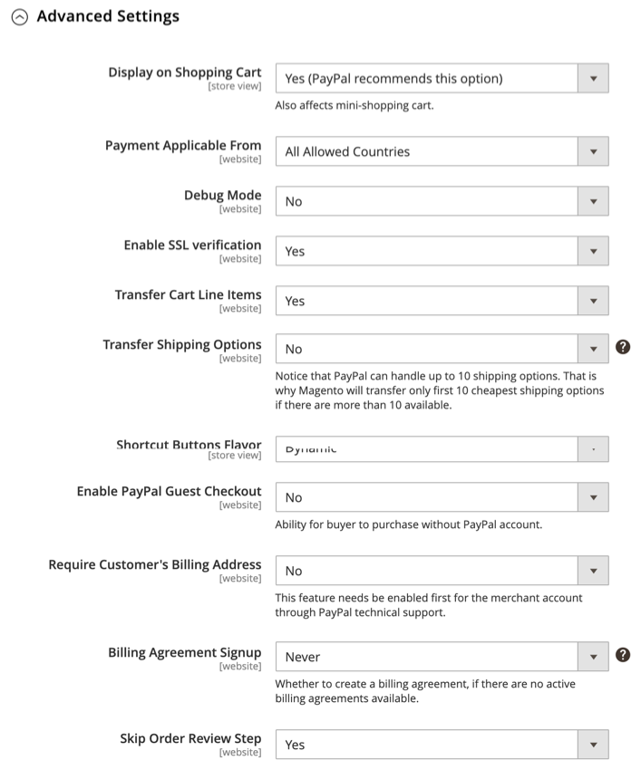

# [!UICONTROL Sales] > [!UICONTROL Payment Methods] > [!UICONTROL PayPal Payments Standard]

>[!IMPORTANT]
>
>**Conditions requises pour PSD2 :** 
>À compter du 14 septembre 2019, les banques européennes pourraient refuser les paiements qui ne répondent pas aux exigences de [PSD2](../../getting-started/compliance-payment-services-directive.md). Aucune action n&#39;est nécessaire pour que les [!DNL PayPal Payments Standard] se conforment à PSD2, car toutes les exigences sont gérées par PayPal.

{{config}}

## [!UICONTROL Required Settings]

<!-- zoom -->

| Champ | [Portée](../../getting-started/websites-stores-views.md#scope-settings) | Description |
|--- |--- |--- |
| [!UICONTROL Email Associated with PayPal Merchant Account] | Site internet | (Facultatif) Toute adresse e-mail associée à votre compte marchand PayPal. Les adresses e-mail sont sensibles à la casse et doivent correspondre exactement aux adresses qui se trouvent dans votre compte. |
| [!UICONTROL Partner] | Site internet | Votre identifiant de partenaire PayPal, le cas échéant. |
| [!UICONTROL Vendor] | Site internet | Votre nom d&#39;utilisateur PayPal. |
| Utilisateur | Site internet | Identifiant d&#39;un autre utilisateur sur votre compte PayPal. |
| [!UICONTROL Password] | Site internet | Mot de passe associé à votre compte marchand PayPal. |
| [!UICONTROL Test Mode] | Site internet | Lorsqu&#39;elle est activée, exécute PayPal Payments Pro dans un environnement de test. Désactivez le mode test lorsque vous êtes prêt à activer le mode production. Options : `Yes` / `No` |
| [!UICONTROL Use Proxy] | Site internet | Un proxy peut être utilisé pour rediriger le trafic lorsque le pare-feu du serveur empêche l’accès direct au serveur PayPal. Le cas échéant, identifie le serveur proxy utilisé pour établir la connexion au serveur PayPal. Options : `Yes` / `No`   Si cette option est activée, définissez les options :  **`Proxy Host`**- Adresse IP de l’hôte proxy. **`Proxy Port`** - Numéro du port du proxy. |
| [!UICONTROL Enable this Solution] | Site internet | Détermine si PayPal Payments Pro est disponible pour vos clients comme mode de paiement. |
| [!UICONTROL Enable PayPal Credit] | Site internet | Détermine si le crédit PayPal est disponible pour vos clients en tant qu&#39;option de paiement. |

{style="table-layout:auto"}

## Annoncer le crédit PayPal

<!-- zoom -->

| Champ | [Portée](../../getting-started/websites-stores-views.md#scope-settings) | Description |
|--- |--- |--- |
| [!UICONTROL Publisher ID] | Site internet | ID d&#39;éditeur associé à votre compte de crédit PayPal. |
| [!UICONTROL Get Publisher ID from PayPal] |  | Récupère votre ID d&#39;éditeur à partir de PayPal. |
| [!UICONTROL Home Page] | Site internet | Détermine la position et la taille de la bannière [!DNL PayPal Credit] sur la page d’accueil. Options :  **`Display`**- Détermine si une bannière [!DNL PayPal Credit] s’affiche sur la page d’accueil de votre boutique. Options : `Yes` / `No` **`Position`** - Détermine la position de la bannière [!DNL PayPal Credit] sur la page d’accueil. Options : `Header (center)` / `Sidebar (right)`  **`Size`**- Détermine la taille de la bannière [!DNL PayPal Credit] sur la page d’accueil. Options : `190 x 100` / `234 x 60` / `300 x 50` / `468 x 60` / `728 x 90` /` 800 x 66` |
| [!UICONTROL Catalog Category Page] | Site internet | Détermine la position et la taille de la bannière de [!DNL PayPal Credit] sur les pages de catégorie. Options : (identique à [!UICONTROL Home Page]) |
| [!UICONTROL Catalog Product Page] | Site internet | Détermine la position et la taille de la bannière de [!DNL PayPal Credit] sur les pages de produits. Options : (identique à [!UICONTROL Home Page]) |
| [!UICONTROL Checkout Cart Page] | Site internet | Détermine la position et la taille de la bannière [!DNL PayPal Credit] sur la page du panier. Options : (identique à [!UICONTROL Home Page]) |

{style="table-layout:auto"}

## [!UICONTROL Basic Settings - PayPal Payments Standard]

<!-- zoom -->

| Champ | [Portée](../../getting-started/websites-stores-views.md#scope-settings) | Description |
|--- |--- |--- |
| [!UICONTROL Title] | Affichage de la boutique | Nom qui identifie PayPal Payments Pro comme mode de paiement lors du passage en caisse. |
| [!UICONTROL Sort Order] | Affichage de la boutique | Nombre qui détermine l&#39;ordre dans lequel PayPal Payments Pro apparaît lorsqu&#39;il est répertorié avec d&#39;autres méthodes de paiement lors de la commande. |
| [!UICONTROL Payment Action] | Site internet | Détermine l&#39;action entreprise par PayPal lors de la soumission d&#39;une commande. Options :  **`Authorization`**- Valide l’achat, mais bloque les fonds. Le montant n&#39;est pas retiré tant qu&#39;il n&#39;a pas été « capturé » par le commerçant. **`Sale`** - Le montant de l&#39;achat est autorisé et immédiatement retiré du compte du client. |
| [!UICONTROL Credit Card Settings] |  |  |
| [!UICONTROL Allowed Credit Cart Types] | Site internet | Détermine les cartes de crédit disponibles pour les clients lors du passage en caisse. Sélectionnez chaque carte prise en charge. Options : `American Express` (nécessite un accord supplémentaire) / `Visa` / `MasterCard` / `Discover` / `JCB` |

{style="table-layout:auto"}

## [!UICONTROL Advanced Settings]

<!-- zoom -->

| Champ | Portée | Description |
|--- |--- |--- |
| [!UICONTROL Display on Shopping Cart] | Affichage de la boutique | Détermine si PayPal Express Checkout apparaît comme option de paiement dans le panier. Options : `Yes` (recommandé) / `No` |
| [!UICONTROL Payment Action Applicable From] | Site internet | Détermine la plage de la sélection de pays applicable. Options : `All Allowed Countries` / `Specific Countries` |
| [!UICONTROL Countries Payment Applicable From] | Site internet | Identifie chaque pays d&#39;où le paiement est accepté. Seuls les clients disposant d&#39;une adresse de facturation dans un pays sélectionné peuvent effectuer des achats avec ce mode de paiement. |
| [!UICONTROL Debug Mode] | Site internet | Enregistre les messages envoyés entre votre boutique et le système de paiement PayPal dans un fichier journal. Options : `Yes` / `No`   **_Note:_** Le fichier journal est stocké sur le serveur et n’est accessible que par les développeurs. Conformément aux normes PCI Data Security, les informations de carte de crédit ne sont pas enregistrées dans le fichier journal. |
| [!UICONTROL Enable SSL Verification] | Site internet | Permet de vérifier le certificat de sécurité de l&#39;hôte. Options : `Yes` / `No` |
| [!UICONTROL Transfer Cart Line Items] | Site internet | Affiche un résumé complet des articles de la ligne du panier du client sur le site PayPal. Options : `Yes` / `No` |
| [!UICONTROL Transfer Shipping Options] | Site internet | Inclut jusqu&#39;à dix options de livraison sur le site PayPal. Options : `Yes` / `No` |
| [!UICONTROL Shortcut Buttons Flavor] | Affichage de la boutique | Détermine le type d&#39;image utilisé pour le bouton d&#39;acceptation PayPal. Options :  **`Dynamic`**- (Recommandé) Affiche une image qui peut être modifiée dynamiquement à partir du serveur PayPal. **`Static`** - Affiche une image statique qui ne peut pas être modifiée dynamiquement. |
| [!UICONTROL Enable PayPal Guest Checkout] | Site internet | Permet aux clients qui n&#39;ont pas de compte PayPal d&#39;effectuer des achats avec PayPal Express Checkout. Options : `Yes` / `No` |
| [!UICONTROL Require Customer's Billing Address] | Site internet | Détermine si l’adresse de facturation du client est requise. Options : `Yes` / `No` / `For Virtual Quotes Only` |
| [!UICONTROL Billing Agreement Signup] | Site internet | Détermine si les clients peuvent conclure un [accord de facturation](../../stores-purchase/paypal-billing-agreements.md) avec votre boutique. Options :  **`Auto`**- Le client peut signer un contrat de facturation lors du passage en caisse express. **`Ask Customer`** - Il est demandé aux clients s&#39;ils souhaitent s&#39;inscrire à un accord de facturation.  **`Never`**- Les clients n’ont pas la possibilité de s’inscrire à un accord de facturation. |
| [!UICONTROL Skip Order Review Step] | Site internet | Détermine si les clients peuvent terminer la transaction à partir du site PayPal ou s&#39;ils doivent retourner dans votre magasin et terminer l&#39;étape de révision de la commande avant d&#39;envoyer la commande. Options : `Yes` / `No` |

{style="table-layout:auto"}

## [!UICONTROL Billing Agreement Setting]

<!-- zoom -->

| Champ | Portée | Description |
|--- |--- |--- |
| [!UICONTROL Enabled] | Site internet | Lorsqu’ils sont activés, les contrats de facturation apparaissent aux clients comme une option de paiement lors du passage en caisse. Options : `Yes` / `No` |
| [!UICONTROL Title] | Affichage de la boutique | Libellé de l’option de contrat de facturation PayPal qui apparaît comme option de paiement lors du passage en caisse. |
| [!UICONTROL Sort Order] | Affichage de la boutique | Détermine l&#39;ordre dans lequel les accords de facturation sont répertoriés avec d&#39;autres modes de paiement lors du passage en caisse. |
| [!UICONTROL Payment Action] | Site internet | Détermine comment PayPal gère la transaction : Options :  **`Authorization`**- Valide l&#39;achat, mais bloque les fonds. Le montant n&#39;est pas retiré tant qu&#39;il n&#39;a pas été « capturé » par le commerçant. **`Sale`** - Le montant de l&#39;achat est autorisé et immédiatement retiré du compte du client. |
| [!UICONTROL Payment Applicable From] | Site internet | Détermine la plage de la sélection de pays applicable. Options : `All Allowed Countries` / `Specific Countries` |
| [!UICONTROL Countries Payment Applicable From] | Site internet | Identifie chaque pays d&#39;où le paiement est accepté. Seuls les clients disposant d&#39;une adresse de facturation dans un pays sélectionné peuvent effectuer des achats avec ce mode de paiement. |
| [!UICONTROL Debug Mode] | Site internet | Enregistre la communication avec le système de paiement dans un fichier journal. Options : `Yes` / `No`   **_Note:_** Le fichier journal est stocké sur le serveur et n’est accessible que par les développeurs. Conformément aux normes PCI Data Security, les informations de carte de crédit ne sont pas enregistrées dans le fichier journal. |
| [!UICONTROL Enable SSL Verification] | Site internet | Active une étape de vérification vers qui garantit que la transaction a lieu sur un canal SSL chiffré. Options : `Yes` / `No` |
| [!UICONTROL Transfer Cart Line Items] | Site internet | Lorsque cette option est activée, affiche un résumé des articles du panier sur votre page de paiements PayPal. Options : `Yes` / `No` |
| [!UICONTROL Allow in Billing Agreement Wizard] | Site internet | Lorsque cette option est activée, les clients peuvent lancer un accord de facturation à partir du tableau de bord de leur compte client. |

{style="table-layout:auto"}

## [!UICONTROL Settlement Report Settings]

<!-- zoom -->

| Champ | [Portée](../../getting-started/websites-stores-views.md#scope-settings) | Description |
|--- |--- |--- |
| [!UICONTROL Login] | Site internet | Nom d&#39;utilisateur requis pour se connecter au serveur FTP sécurisé de PayPal. |
| [!UICONTROL Password] | Site internet | Mot de passe requis pour se connecter au serveur FTP sécurisé de PayPal. |
| [!UICONTROL Sandbox Mode] | Site internet | Lorsqu’il est activé, exécute les rapports dans un environnement de test avant la mise en production dans l’environnement de production. Options : `Yes` / `No` |
| [!UICONTROL Custom Endpoint Hostname or IP-Address] | Site internet | URL de gestion des rapports de règlement. Valeur par défaut : `reports.paypal.com` |
| [!UICONTROL Custom Path] | Site internet | Chemin d’accès où les rapports de règlement sont enregistrés sur votre serveur. Valeur par défaut : `/ppreports/outgoing` |
| [!UICONTROL Scheduled Fetching] |  |  |
| [!UICONTROL Enable Automatic Fetching] | Site internet | Lorsqu&#39;elle est activée, récupère automatiquement les rapports de règlement selon le calendrier. Options : `Yes` / `No` |
| [!UICONTROL Schedule] | Global | Détermine la fréquence de génération des rapports de règlement par PayPal. Options : `Daily` / `Every 3 days` / `Every 7 days` / `Every 10 days` / `Every 14 days` / `Every 30 days` / `Every 40 days` |
| [!UICONTROL Time of Day] | Global | Détermine l&#39;heure, la minute et la seconde auxquelles les rapports de règlement sont générés. |

{style="table-layout:auto"}

## [!UICONTROL Frontend Experience Settings]

<!-- zoom -->

| Champ | [Portée](../../getting-started/websites-stores-views.md#scope-settings) | Description |
|--- |--- |--- |
| [!UICONTROL PayPal Product Logo] | Affichage de la boutique | Détermine le logo PayPal qui apparaît dans votre boutique. Il existe quatre styles de base dans deux tailles. Options : `No Logo` / `We prefer PayPal (150 x 60)` / `We prefer PayPal (150 x 40)` / `Now accepting PayPal (150 x 60)` / `Now accepting PayPal (150 x 40)` / `Payments by PayPal (150 x 60)` / `Payments by PayPal (150 x 40)` / `Shop now using (150 x 60)` / `Shop now using (150 x 40)` |
| [!UICONTROL PayPal Merchant Pages Style] |  |  |
| [!UICONTROL Page Style] | Affichage de la boutique | Détermine l&#39;apparence de votre page de vendeur PayPal. Valeurs autorisées :  **`paypal`**- Utilise le style de page PayPal. **`primary`** - Utilise le style de page que vous avez identifié comme style « principal » dans le profil de votre compte.  **`your_custom_value`**- Utilise un style de page de paiement personnalisé, spécifié dans le profil de votre compte. |
| [!UICONTROL Header Image URL] | Affichage de la boutique | URL de l’image qui s’affiche dans le coin supérieur gauche de la page de passage en caisse. La taille maximale est de 750 x 90 pixels.   **_Note:_** PayPal recommande de stocker l&#39;image sur un serveur sécurisé (https). Dans le cas contraire, le navigateur du client peut signaler que « la page contient des éléments sécurisés et non sécurisés ». |
| [!UICONTROL Header Image Background Color] | Affichage de la boutique | Code [couleur hexadécimale](https://en.wikipedia.org/wiki/Web_colors) de six caractères pour la couleur d’arrière-plan de l’en-tête sur la page de passage en caisse. Vous pouvez saisir le code en majuscules et en minuscules. |
| [!UICONTROL Header Image Border Color] | Affichage de la boutique | Code couleur hexadécimal de six caractères pour la bordure de deux pixels autour de l’en-tête. |
| [!UICONTROL Page Background Color] | Affichage de la boutique | Code couleur hexadécimal de six caractères pour la couleur d’arrière-plan de la page de passage en caisse qui s’affiche derrière l’en-tête et le formulaire de paiement. |

{style="table-layout:auto"}
