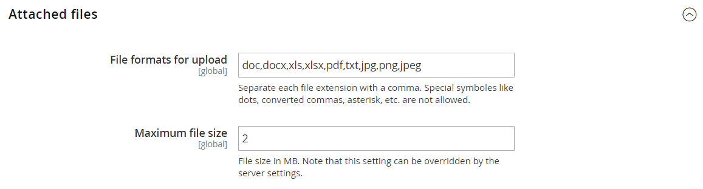

# [!UICONTROL Sales] > [!UICONTROL Quotes]

{{b2b-feature}}

>[!TIP]
>
>Avec l’installation et l’activation d’Adobe Commerce B2B, l’expérience d’achat peut être personnalisée avec des fonctionnalités spécifiques à l’entreprise. Adobe Commerce B2B est une solution intégrée qui prend en charge les modèles B2B et B2C. Pour plus d’informations sur les fonctionnalités B2B, consultez le [Guide de l’utilisateur Adobe Commerce B2B](https://experienceleague.adobe.com/docs/commerce-admin/b2b/introduction.html).

{{config}}

<!-- [Quotes](https://experienceleague.adobe.com/en/docs/commerce-admin/b2b/quotes/quotes) -->

## [!UICONTROL General]

<!-- zoom -->

| Champ | [Portée](../../getting-started/websites-stores-views.md#scope-settings) | Description |
|--- |--- |--- |
| [!UICONTROL Minimum Amount] | Site internet | Montant minimal du sous-total du panier, après toutes les remises, qui est requis avant qu’un client puisse soumettre une demande de devis. Valeur par défaut : `0` |
| [!UICONTROL Minimum Amount Message] | Affichage de la boutique | Message qui apparaît dans le panier lorsqu’un client tente de soumettre une demande de devis, mais que le montant minimum requis n’est pas atteint. |
| [!UICONTROL Default Expiration Period] | Site internet | Détermine la durée de vie par défaut d&#39;un [devis](../../b2b/quote-price-negotiation.md) comme période à partir de la date d&#39;envoi de la demande de devis. Options : `Days` / `Weeks` / `Months` |

{style="table-layout:auto"}

## [!UICONTROL Attached Files]

<!-- zoom -->

| Champ | [Portée](../../getting-started/websites-stores-views.md#scope-settings) | Description |
|--- |--- |--- |
| [!UICONTROL File formats for upload] | Global | Détermine les formats de fichier pouvant être joints à une citation. Valeurs par défaut prises en charge : `doc`, `docx`, `xls`, `xlsx`, `pdf`, `txt`, `jpg`, `png` et `jpeg` |
| [!UICONTROL Maximum file size] | Global | Détermine la taille maximale d&#39;un fichier joint à une citation. Ce paramètre peut être remplacé par la configuration du serveur. |

{style="table-layout:auto"}
