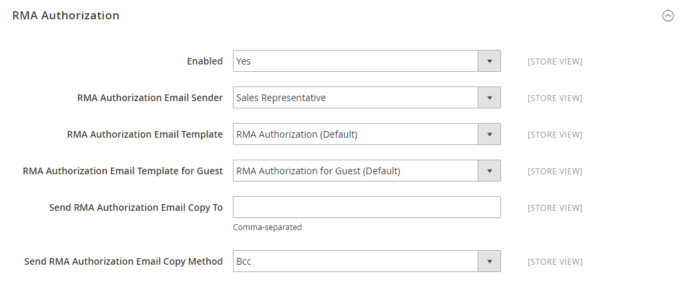

# [!UICONTROL Sales] > [!UICONTROL Sales Emails]

{{config}}

## [!UICONTROL General Settings]

<!-- zoom -->

<!-- [General Settings](https://docs.magento.com/user-guide/system/email-communications.html) -->

| Champ | [Portée](../../getting-started/websites-stores-views.md#scope-settings) | Description |
|--- |--- |--- |
| [!UICONTROL Asynchronous sending] | Global | Détermine si les courriers électroniques de vente sont envoyés de manière asynchrone. Il est recommandé d’activer l’envoi asynchrone. Options :  **`Disable`**- (Par défaut) Les emails de vente sont envoyés lorsqu’ils sont déclenchés par un événement. **`Enable`** - (Recommandé) Les emails de vente sont envoyés à intervalles réguliers et prédéterminés. |

{style="table-layout:auto"}

## [!UICONTROL Order]

<!-- zoom -->

<!-- [Order](https://docs.magento.com/user-guide/sales/orders.html) -->

| Champ | [Portée](../../getting-started/websites-stores-views.md#scope-settings) | Description |
|--- |--- |--- |
| [!UICONTROL Enabled] | Affichage en magasin | Lorsque cette option est activée, envoie un email transactionnel pour chaque commande passée. Options : `Yes` / `No` |
| [!UICONTROL New Order Confirmation Email Sender] | Affichage en magasin | Identifie le contact du magasin qui apparaît comme expéditeur du message. Expéditeur par défaut : `Sales Representative` |
| [!UICONTROL New Order Confirmation Template] | Affichage en magasin | Identifie le modèle envoyé pour confirmer les nouvelles commandes passées par les clients. Modèle par défaut : `New Order` |
| [!UICONTROL New Order Confirmation Template for Guest] | Affichage en magasin | Identifie le modèle envoyé pour confirmer les nouvelles commandes passées par les invités. Modèle par défaut : `New Order for Guest` |
| [!UICONTROL Send Order Email Copy To] | Affichage en magasin | Fournit l’adresse électronique de tous les destinataires pour recevoir une copie d’un courrier électronique de commande. Séparez plusieurs adresses par une virgule. |
| [!UICONTROL Send Order Email Copy Method] | Affichage en magasin | Indique la méthode de courrier électronique utilisée pour envoyer la copie. Les options incluent :  **`Bcc`**- Envoie une copie de courtoisie aveugle en incluant le destinataire dans l’en-tête du même email qui est envoyé au client. Le destinataire Cci n&#39;est pas visible par le client. **`Separate Email`** - Envoie la copie en tant qu’email distinct. |

{style="table-layout:auto"}

## [!UICONTROL Order Comments]

<!-- zoom -->

<!-- [Order Comments](https://docs.magento.com/user-guide/sales/order-processing.html) -->

| Champ | [Portée](../../getting-started/websites-stores-views.md#scope-settings) | Description |
|--- |--- |--- |
| [!UICONTROL Enabled] | Affichage en magasin | Lorsque cette option est activée, envoie un courrier électronique transactionnel pour chaque commentaire de commande. Options : `Yes` / `No` |
| [!UICONTROL Order Comment Email Sender] | Affichage en magasin | Identifie le contact du magasin qui apparaît comme expéditeur du message. Expéditeur par défaut : `Sales Representative` |
| [!UICONTROL Order Comment Email Template] | Affichage en magasin | Identifie le modèle envoyé lorsqu’un commentaire est ajouté à une commande client. Modèle par défaut : `Order Update` |
| [!UICONTROL New Order Confirmation Template for Guest] | Affichage en magasin | Identifie le modèle envoyé lorsqu’un commentaire est ajouté à une commande d’invité. Modèle par défaut : `Order Update for Guest` |
| [!UICONTROL Send Order Email Copy To|Store View] | Fournit l’adresse électronique de tous les utilisateurs pour recevoir une copie d’un e-mail de commentaire de commande. Séparez plusieurs adresses par une virgule. |
| [!UICONTROL Send Order Email Copy Method] | Affichage en magasin | Indique la méthode utilisée pour envoyer la copie. Les options incluent :  **`Bcc`**- Envoie une copie de courtoisie aveugle en incluant le destinataire dans l’en-tête du même email qui est envoyé au client. Le destinataire Cci n&#39;est pas visible par le client. **`Separate Email`** - Envoie la copie en tant qu’email distinct. |

{style="table-layout:auto"}

## [!UICONTROL Invoice]

<!-- zoom -->

<!-- [Invoice](https://docs.magento.com/user-guide/sales/invoices.html) -->

| Champ | [Portée](../../getting-started/websites-stores-views.md#scope-settings) | Description |
|--- |--- |--- |
| [!UICONTROL Enabled] | Affichage en magasin | Lorsque cette option est activée, envoie un email transactionnel pour chaque facture générée. Options : `Yes` / `No` |
| [!UICONTROL Invoice Email Sender] | Affichage en magasin | Identifie le contact du magasin qui apparaît comme expéditeur du message. Expéditeur par défaut : `Sales Representative` |
| [!UICONTROL Invoice Email Template] | Affichage en magasin | Identifie le modèle envoyé lors de la génération d’une facture pour un client. Modèle par défaut : `New Invoice` |
| [!UICONTROL Invoice Email Template for Guest] | Affichage en magasin | Identifie le modèle envoyé lors de la génération d&#39;une facture pour un invité. Modèle par défaut : `New Invoice for Guest` |
| [!UICONTROL Send Invoice Email Copy To] | Affichage en magasin | Fournit l’adresse électronique de tous les destinataires pour recevoir une copie d’un courrier électronique de facture. Séparez plusieurs adresses par une virgule. |
| [!UICONTROL Send Invoice Email Copy Method] | Affichage en magasin | Indique la méthode utilisée pour envoyer la copie. Les options incluent :  **`Bcc`**- Envoie une copie de courtoisie aveugle en incluant le destinataire dans l’en-tête du même email qui est envoyé au client. Le destinataire Cci n&#39;est pas visible par le client. **`Separate Email`** - Envoie la copie en tant qu’email distinct. |

{style="table-layout:auto"}

## [!UICONTROL Invoice Comments]

<!-- zoom -->

<!-- [Invoice Comments](https://docs.magento.com/user-guide/sales/invoice-create.html) -->

| Champ | [Portée](../../getting-started/websites-stores-views.md#scope-settings) | Description |
|--- |--- |--- |
| [!UICONTROL Enabled] | Affichage en magasin | Lorsque cette option est activée, envoie un email transactionnel pour chaque commentaire de facture. Options : `Yes` / `No` |
| [!UICONTROL Invoice Comment Email Sender] | Affichage en magasin | Identifie le contact du magasin qui apparaît comme expéditeur du message. Expéditeur par défaut : `Sales Representative` |
| [!UICONTROL Invoice Comment Email Template] | Affichage en magasin | Identifie le modèle envoyé lorsqu’un commentaire est ajouté à une facture client. Modèle par défaut : `Invoice Update` |
| [!UICONTROL Invoice Comment Email Template for Guest] | Affichage en magasin | Identifie le modèle envoyé lorsqu’un commentaire est ajouté à une facture d’invité. Modèle par défaut : `Invoice Update for Guest` |
| [!UICONTROL Send Invoice Comment Email Copy To] | Affichage en magasin | Fournit l’adresse électronique de tous les utilisateurs pour recevoir une copie d’un e-mail de commentaire de facture. Séparez plusieurs adresses par une virgule. |
| [!UICONTROL Send Invoice Comments Email Copy Method] | Affichage en magasin | Indique la méthode de courrier électronique utilisée pour envoyer la copie. Les options incluent :  **`Bcc`**- Envoie une copie de courtoisie aveugle en incluant le destinataire dans l’en-tête du même email qui est envoyé au client. Le destinataire Cci n&#39;est pas visible par le client. **`Separate Email`** - Envoie la copie en tant qu’email distinct. |

{style="table-layout:auto"}

## [!UICONTROL Shipment]

<!-- zoom -->

<!-- [Shipment](https://docs.magento.com/user-guide/sales/shipments.html) -->

| Champ | [Portée](../../getting-started/websites-stores-views.md#scope-settings) | Description |
|--- |--- |--- |
| [!UICONTROL Enabled] | Affichage en magasin | Lorsque cette option est activée, envoie un email transactionnel pour chaque envoi généré. Options : `Yes` / `No` |
| [!UICONTROL Shipment Email Sender] | Affichage en magasin | Identifie le contact du magasin qui apparaît comme l’expéditeur du message. Expéditeur par défaut : `Sales Representative` |
| [!UICONTROL Shipment Email Template] | Affichage en magasin | Identifie le modèle envoyé lors de la génération d’une livraison pour un client. Modèle par défaut : `New Shipment` |
| [!UICONTROL Shipment Email Template for Guest] | Affichage en magasin | Identifie le modèle envoyé lors de la génération d’une expédition pour un invité. Modèle par défaut : `New Shipment for Guest` |
| [!UICONTROL Send Shipment Email Copy To] | Affichage en magasin | Fournit l’adresse électronique de toute personne qui doit recevoir une copie d’un courrier électronique d’expédition. Séparez plusieurs adresses par une virgule. |
| [!UICONTROL Send Shipment Email Copy Method] | Affichage en magasin | Indique la méthode utilisée pour envoyer la copie. Les options incluent :  **`Bcc`**- Envoie une copie de courtoisie aveugle en incluant le destinataire dans l’en-tête du même email qui est envoyé au client. Le destinataire Cci n&#39;est pas visible par le client. **`Separate Email`** - Envoie la copie en tant qu’email distinct. |

{style="table-layout:auto"}

## [!UICONTROL Shipment Comments]

<!-- zoom -->

<!-- [Shipment Comments](https://docs.magento.com/user-guide/sales/shipments.html) -->

| Champ | [Portée](../../getting-started/websites-stores-views.md#scope-settings) | Description |
|--- |--- |--- |
| [!UICONTROL Enabled] | Affichage en magasin | Lorsque cette option est activée, envoie un e-mail transactionnel pour chaque commentaire d’expédition. Options : `Yes` / `No` |
| [!UICONTROL Shipment Comment Email Sender] | Affichage en magasin | Identifie le contact du magasin qui apparaît comme expéditeur du message. Expéditeur par défaut : `Sales Representative` |
| [!UICONTROL Shipment Comment Email Template] | Affichage en magasin | Identifie le modèle envoyé lorsqu’un commentaire est ajouté à une expédition client. Modèle par défaut : `Shipment Update` |
| [!UICONTROL Shipment Comment Email Template for Guest] | Affichage en magasin | Identifie le modèle envoyé lorsqu’un commentaire est ajouté à une livraison d’invités. Modèle par défaut : `Shipment Update for Guest` |
| [!UICONTROL Send Shipment Comment Email Copy To] | Affichage en magasin | Fournit l’adresse électronique de tous les destinataires pour recevoir une copie d’un e-mail de commentaire d’expédition. Séparez plusieurs adresses par une virgule. |
| [!UICONTROL Send Shipment Comments Email Copy Method] | Affichage en magasin | Indique la méthode de courrier électronique utilisée pour envoyer la copie. Les options incluent :  **`Bcc`**- Envoie une copie de courtoisie aveugle en incluant le destinataire dans l’en-tête du même email qui est envoyé au client. Le destinataire Cci n&#39;est pas visible par le client. **`Separate Email`** - Envoie la copie en tant qu’email distinct. |

{style="table-layout:auto"}

## [!UICONTROL Credit Memo]

<!-- zoom -->

<!-- [Credit Memo](https://docs.magento.com/user-guide/sales/credit-memos.html) -->

| Champ | [Portée](../../getting-started/websites-stores-views.md#scope-settings) | Description |
|--- |--- |--- |
| [!UICONTROL Enabled] | Affichage en magasin | Active l’e-mail transactionnel pour chaque note de crédit générée. Options : `Yes` / `No` |
| [!UICONTROL Credit Memo Email Sender] | Affichage en magasin | Identifie le contact du magasin qui apparaît comme l’expéditeur du message. Expéditeur par défaut : `Sales Representative` |
| [!UICONTROL Credit Memo Email Template] | Affichage en magasin | Identifie le modèle envoyé lors de la génération d’une note de crédit pour un client. Modèle par défaut : `New Credit Memo` |
| [!UICONTROL Credit Memo Email Template for Guest] | Affichage en magasin | Identifie le modèle envoyé lors de la génération d’une note de crédit pour un invité. Modèle par défaut : `New Credit Memo for Guest` |
| [!UICONTROL Send Credit Memo Email Copy To] | Affichage en magasin | Fournit l’adresse électronique de toute personne qui doit recevoir une copie d’un courrier électronique de note de crédit. Séparez plusieurs adresses par une virgule. |
| [!UICONTROL Send Credit Memo Email Copy Method] | Affichage en magasin | Indique la méthode utilisée pour envoyer la copie. Les options incluent :  **`Bcc`**- Envoie une copie de courtoisie aveugle en incluant le destinataire dans l’en-tête du même email qui est envoyé au client. Le destinataire Cci n&#39;est pas visible par le client. **`Separate Email`** - Envoie la copie en tant qu’email distinct. |

{style="table-layout:auto"}

## [!UICONTROL Credit Memo Comments]

<!-- zoom -->

<!-- [Credit Memo Comments](https://docs.magento.com/user-guide/sales/credit-memo-create.html) -->

| Champ | [Portée](../../getting-started/websites-stores-views.md#scope-settings) | Description |
|--- |--- |--- |
| [!UICONTROL Enabled] | Affichage en magasin | Lorsque cette option est activée, envoie un courrier électronique transactionnel pour chaque commentaire de note de crédit. Options : `Yes` / `No` |
| [!UICONTROL Credit Memo Comment Email Sender] | Affichage en magasin | Identifie le contact du magasin qui apparaît comme expéditeur du message. Expéditeur par défaut : `Sales Representative` |
| [!UICONTROL Credit Memo Comment Email Template] | Affichage en magasin | Identifie le modèle envoyé lorsqu’un commentaire est ajouté à une note de crédit client. Modèle par défaut : `Credit Memo Update` |
| [!UICONTROL Credit Memo Comment Email Template for Guest] | Affichage en magasin | Identifie le modèle envoyé lorsqu’un commentaire est ajouté à une note de crédit de l’invité. Modèle par défaut : `Credit Memo Update for Guest` |
| [!UICONTROL Send Credit Memo Comment Email Copy To] | Affichage en magasin | Indique l’adresse électronique de quiconque recevra une copie d’un commentaire de note de crédit. Séparez plusieurs adresses par une virgule. |
| [!UICONTROL Send Credit Memo Comments Email Copy Method] | Affichage en magasin | Indique la méthode de courrier électronique utilisée pour envoyer la copie. Les options incluent :  **`Bcc`**- Envoie une copie de courtoisie aveugle en incluant le destinataire dans l’en-tête du même email qui est envoyé au client. Le destinataire Cci n&#39;est pas visible par le client. **`Separate Email`** - Envoie la copie en tant qu’email distinct. |

{style="table-layout:auto"}

## [!UICONTROL Order Ready For Pickup in Store]

<!-- zoom -->

<!-- [Order Ready For Pickup in Store](https://docs.magento.com/user-guide/shipping/shipping-in-store-delivery.html) -->

| Champ | [Portée](../../getting-started/websites-stores-views.md#scope-settings) | Description |
|--- |--- |--- |
| [!UICONTROL Enabled] | Affichage en magasin | Lorsqu’elle est activée, envoie un email transactionnel lorsqu’une commande est prête pour la récupération en magasin. Options : `Yes` / `No` |
| [!UICONTROL Order Ready For Pickup Email Sender] | Affichage en magasin | Identifie le contact du magasin qui apparaît comme expéditeur du message. Expéditeur par défaut : `General Contact` |
| [!UICONTROL Order Ready For Pickup Email Template] | Affichage en magasin | Identifie le modèle utilisé pour l’e-mail transactionnel pour chaque commande prête à être récupérée en magasin pour un client enregistré. Modèle par défaut : `Order is Ready for Pickup` |
| [!UICONTROL Order Ready For Pickup Email Template for Guest] | Affichage en magasin | Identifie le modèle utilisé pour l’email transactionnel pour chaque commande prête à être récupérée en magasin pour un invité. Modèle par défaut : `Order is Ready for Pickup for Guest` |
| Envoyer la commande prête pour la copie de l’e-mail de la sélection vers | Affichage en magasin | Indique l’adresse électronique de toute personne devant recevoir une copie d’un courrier électronique _Prêt pour la récupération_. Séparez plusieurs adresses par une virgule. |
| [!UICONTROL Send Order Ready For Pickup Email Copy Method] | Affichage en magasin | Indique la méthode de courrier électronique utilisée pour envoyer la copie. Options :  **`Bcc`**- Envoie une copie de politesse pour aveugles en incluant le destinataire dans l’en-tête du même email qui est envoyé au client. Le destinataire Cci n&#39;est pas visible par le client. **`Separate Email`** - Envoie la copie en tant qu’email distinct. |

{style="table-layout:auto"}

## [!UICONTROL Purchase Order Approval]

{{b2b-feature}}

<!-- zoom -->

| Champ | [Portée](../../getting-started/websites-stores-views.md#scope-settings) | Description |
|--- |--- |--- |
| [!UICONTROL Enabled] | Affichage en magasin | Lorsque cette option est activée, envoie des emails pendant le processus de commande. Options : `Yes` / `No` |
| [!UICONTROL Created and requires Approval Purchase Order (to Buyer)] | Affichage en magasin | Envoie une confirmation par courrier électronique au créateur du bon de commande. |
| [!UICONTROL Created and Automatically approved Purchase Order (to Buyer)] | Affichage en magasin | Envoie une confirmation par courrier électronique au créateur du bon de commande. |
| [!UICONTROL Approved Purchase Order (to Buyer)] | Affichage en magasin | Envoie un courrier électronique au créateur lors de l’approbation du bon de commande. |
| [!UICONTROL Rejected Purchase Order (to Buyer)] | Affichage en magasin | Envoie un courrier électronique au créateur lorsque la commande a été rejetée. |
| [!UICONTROL Comment added to Purchase Order] | Affichage en magasin | Envoie un courrier électronique au créateur lorsqu’un commentaire a été ajouté au bon de commande. |
| [!UICONTROL Error creating Order from Purchase Order (to Buyer)] | Affichage en magasin | Avertit le créateur qu’une erreur s’est produite lors de la conversion d’un bon de commande en commande. |
| [!UICONTROL Purchase Order required Approval (to Approver)] | Affichage en magasin | Envoie un courrier électronique pour informer l’approbateur que la commande nécessite son approbation. |

{style="table-layout:auto"}

## [!UICONTROL Quote]

{{b2b-feature}}

<!-- zoom -->

<!-- [Quotes](https://docs.magento.com/user-guide/customers/account-dashboard-quotes.html) -->

| Champ | [Portée](../../getting-started/websites-stores-views.md#scope-settings) | Description |
|--- |--- |--- |
| [!UICONTROL Enabled] | Affichage en magasin | Permet l’envoi de guillemets électroniques à partir de la vue de magasin actuelle. Options : `Yes` / `No` |
| [!UICONTROL Updated Quote Template (to Buyer)] | Affichage en magasin | Détermine le modèle d’email utilisé pour la notification envoyée à l’acheteur lorsqu’un devis mis à jour est disponible. Modèle par défaut : `Updated Quote` |
| [!UICONTROL Declined Quote Template (to Buyer)] | Affichage en magasin | Détermine le modèle d’email utilisé pour la notification envoyée à l’acheteur lorsqu’un devis est refusé. Modèle par défaut : `Declined Quote` |
| [!UICONTROL New Quote Template (to Seller)] | Affichage en magasin | Détermine le modèle de courrier électronique utilisé pour la notification envoyée au vendeur lorsqu’une demande de nouveau devis est reçue. Modèle par défaut : `New Quote` |
| [!UICONTROL Updated Quote Template (to Seller)] | Affichage en magasin | Détermine le modèle d’email utilisé pour la notification envoyée au vendeur lors de la réception d’un devis mis à jour. Modèle par défaut : `Updated Quote` |
| [!UICONTROL Quote Expiration (in 48 hrs)] | Affichage en magasin | Indique le modèle de courrier électronique utilisé pour l’avis d’expiration envoyé 48 heures avant l’expiration du guillemet. Modèle par défaut : `Expiration Warning` |
| [!UICONTROL Quote Expiration (in 24 hrs)] | Affichage en magasin | Indique le modèle de courrier électronique utilisé pour l’avis d’expiration envoyé 24 heures avant l’expiration du guillemet. Modèle par défaut : `Expiration Warning 1` |
| [!UICONTROL Expiration Date Reset] | Affichage en magasin | Indique le modèle de courrier électronique utilisé pour l’avis envoyé lors du changement de la date d’expiration. Modèle par défaut : `Expiration Date Reset` |
| [!UICONTROL Send Quote Email Copy To] | Affichage en magasin | Indique l’adresse électronique de chaque personne devant recevoir une copie de l’e-mail de devis. Séparez plusieurs adresses par une virgule. |
| [!UICONTROL Send Quote Email Copy Method] | Affichage en magasin | Indique la méthode de courrier électronique utilisée pour envoyer la copie. Les options incluent :  **`Bcc`**- Envoie une copie de courtoisie aveugle en incluant le destinataire dans l’en-tête du même email qui est envoyé au client. Le destinataire Cci n&#39;est pas visible par le client. **`Separate Email`** - Envoie la copie en tant qu’email distinct. |

{style="table-layout:auto"}

## [!UICONTROL RMA]

{{ee-feature}}

<!-- zoom -->

<!-- [RMA](https://docs.magento.com/user-guide/sales/returns.html) -->

| Champ | [Portée](../../getting-started/websites-stores-views.md#scope-settings) | Description |
|--- |--- |--- |
| [!UICONTROL Enabled] | Affichage en magasin | Active la notification par courrier électronique pour chaque RMA générée. Options : `Yes` / `No` |
| [!UICONTROL RMA Email Sender] | Affichage en magasin | Identifie le [contact de magasin](../../getting-started/store-details.md#store-email-addresses) qui apparaît comme l’expéditeur du message. Valeur par défaut : `Sales Representative` |
| [!UICONTROL RMA Email Template] | Affichage en magasin | Détermine le [modèle d’email](../../systems/email-templates.md) utilisé pour la notification envoyée lorsqu’une RAM est générée pour un client. Modèle par défaut : `New RMA` |
| [!UICONTROL RMA Email Template for Guest] | Affichage en magasin | Détermine le modèle envoyé lorsqu’une RAM est générée pour un invité. Modèle par défaut : `New RMA for Guest` |
| [!UICONTROL Send RMA Email Copy To] | Affichage en magasin | Fournit l’adresse électronique de toute personne qui doit recevoir une copie d’un courrier électronique RMA. Séparez plusieurs adresses par une virgule. |
| [!UICONTROL Send RMA  Email Copy Method] | Affichage en magasin | Indique la méthode de courrier électronique utilisée pour envoyer la copie. Les options incluent :  **`Bcc`**- Envoie une copie de courtoisie aveugle en incluant le destinataire dans l’en-tête du même email qui est envoyé au client. Le destinataire Cci n&#39;est pas visible par le client. **`Separate Email`** - Envoie la copie en tant qu’email distinct. |

{style="table-layout:auto"}

## [!UICONTROL RMA Authorization]

{{ee-feature}}

<!-- zoom -->

<!-- [RMA Authorization](https://docs.magento.com/user-guide/sales/rma-configure.html) -->

| Champ | [Portée](../../getting-started/websites-stores-views.md#scope-settings) | Description |
|--- |--- |--- |
| [!UICONTROL Enabled] | Affichage en magasin | Lorsque cette option est activée, envoie une notification par courrier électronique pour chaque autorisation RMA. Options : `Yes` / `No` |
| [!UICONTROL RMA Authorization Email Sender] | Affichage en magasin | Identifie le [contact de magasin](../../getting-started/store-details.md#store-email-addresses) qui apparaît comme expéditeur du message. Valeur par défaut : `Sales Representative` |
| [!UICONTROL RMA Authorization Email Template] | Affichage en magasin | Détermine le [modèle d’email](../../systems/email-templates.md) utilisé lors de l’envoi d’une notification d’autorisation RMA. Modèle par défaut : `RMA Authorization` |
| [!UICONTROL RMA Authorization Email Template for Guest] | Affichage en magasin | Détermine le modèle utilisé lors de l’envoi d’une notification d’autorisation RMA à un invité. Modèle par défaut : `RMA Authorization for Guest` |
| [!UICONTROL Send RMA Authorization Email Copy To] | Affichage en magasin | Fournit l’adresse électronique de tous les utilisateurs pour recevoir une copie d’un courrier électronique d’autorisation RMA. Séparez plusieurs adresses par une virgule. |
| [!UICONTROL Send RMA Authorization Email Copy Method] | Affichage en magasin | Indique la méthode de courrier électronique utilisée pour envoyer la copie. Les options incluent :  **`Bcc`**- Envoie une copie de courtoisie aveugle en incluant le destinataire dans l’en-tête du même email qui est envoyé au client. Le destinataire Cci n&#39;est pas visible par le client. **`Separate Email`** - Envoie la copie en tant qu’email distinct. |

{style="table-layout:auto"}

## [!UICONTROL RMA Admin Comments]

{{ee-feature}}

<!-- zoom -->

| Champ | [Portée](../../getting-started/websites-stores-views.md#scope-settings) | Description |
|--- |--- |--- |
| [!UICONTROL Enabled] | Affichage en magasin | Lorsque cette option est activée, envoie une notification par courrier électronique pour chaque commentaire d’administrateur de la gestion des ressources numériques (RMA). Options : `Yes` / `No` |
| [!UICONTROL RMA Comment Email Sender] | Affichage en magasin | Identifie le [contact de magasin](../../getting-started/store-details.md#store-email-addresses) qui apparaît comme expéditeur du message. Valeur par défaut : `Sales Representative` |
| [!UICONTROL RMA Comment Email Template] | Affichage en magasin | Détermine le [modèle d’email](../../systems/email-templates.md) utilisé lorsqu’un administrateur ajoute un commentaire à une RMA pour un client. Modèle par défaut : `RMA Admin Comments` |
| [!UICONTROL RMA Comment Email Template for Guest] | Affichage en magasin | Détermine le modèle utilisé lorsqu’un administrateur ajoute un commentaire à une RMA pour un invité. Modèle par défaut : `RMA Admin Comments for Guest` |
| [!UICONTROL Send RMA Comment Email Copy To] | Affichage en magasin | Fournit l’adresse électronique de toute personne à qui envoyer une copie de la notification. Séparez plusieurs adresses par une virgule. |
| [!UICONTROL Send RMA Comments Email Copy Method] | Affichage en magasin | Indique la méthode de courrier électronique utilisée pour envoyer la copie. Les options incluent :  **`Bcc`**- Envoie une copie de courtoisie aveugle en incluant le destinataire dans l’en-tête du même email qui est envoyé au client. Le destinataire Cci n&#39;est pas visible par le client. **`Separate Email`** - Envoie la copie en tant qu’email distinct. |

{style="table-layout:auto"}

## [!UICONTROL RMA Customer Comments]

{{ee-feature}}

<!-- zoom -->

<!-- [RMA Customer Comments](https://docs.magento.com/user-guide/sales/returns.html) -->

| Champ | [Portée](../../getting-started/websites-stores-views.md#scope-settings) | Description |
|--- |--- |--- |
| [!UICONTROL Enabled] | Affichage en magasin | Lorsque cette option est activée, envoie une notification par e-mail pour chaque commentaire de client RMA. Options : `Yes` / `No` |
| [!UICONTROL RMA Comment Email Sender] | Affichage en magasin | Identifie le [contact de magasin](../../getting-started/store-details.md#store-email-addresses) qui apparaît comme expéditeur du message. Valeur par défaut : `Customer Support` |
| [!UICONTROL RMA Comment Email Recipient] | Affichage en magasin | Identifie le contact du magasin qui est le destinataire de l’e-mail de commentaire du client. Valeur par défaut : `Sales Representative` |
| [!UICONTROL RMA Comment Email Template] | Affichage en magasin | Détermine le [modèle d’email](../../systems/email-templates.md) utilisé lorsqu’un client ajoute un commentaire à une RMA. Modèle par défaut : `RMA Admin Comments` |
| [!UICONTROL Send RMA Comment Email Copy To] | Affichage en magasin | Fournit l’adresse électronique de toute personne à qui envoyer une copie de la notification. Séparez plusieurs adresses par une virgule. |
| [!UICONTROL Send RMA Comments Email Copy Method] | Affichage en magasin | Indique la méthode de courrier électronique utilisée pour envoyer la copie. Les options incluent :  **`Bcc`**- Envoie une copie de courtoisie aveugle en incluant le destinataire dans l’en-tête du même email qui est envoyé au client. Le destinataire Cci n&#39;est pas visible par le client. **`Separate Email`** - Envoie la copie en tant qu’email distinct. |

{style="table-layout:auto"}
