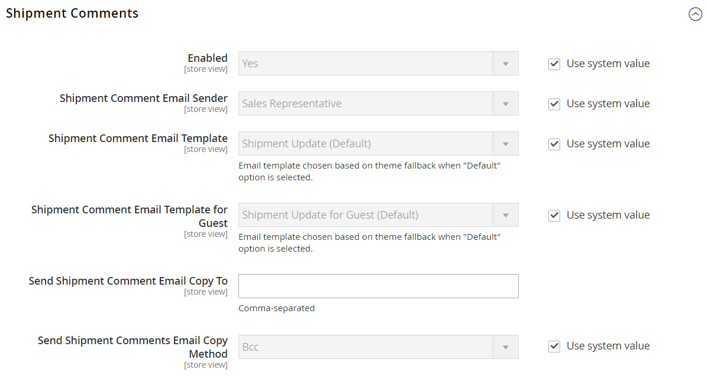

# [!UICONTROL Sales] > [!UICONTROL Sales Emails]

{{config}}

## [!UICONTROL General Settings]

<!-- zoom -->

<!-- [General Settings](https://experienceleague.adobe.com/en/docs/commerce-admin/systems/communications/email-communications) -->

| Champ | [Portée](../../getting-started/websites-stores-views.md#scope-settings) | Description |
|--- |--- |--- |
| [!UICONTROL Asynchronous sending] | Global | Détermine si les e-mails de vente sont envoyés de manière asynchrone. Il est recommandé d’activer l’envoi asynchrone. Options :  **`Disable`**- (par défaut) Les e-mails de ventes sont envoyés lorsqu’ils sont déclenchés par un événement. **`Enable`** - (Recommandé) Les e-mails de vente sont envoyés à intervalles réguliers prédéterminés. |

{style="table-layout:auto"}

## [!UICONTROL Order]

<!-- zoom -->

<!-- [Order](https://experienceleague.adobe.com/en/docs/commerce-admin/stores-sales/order-management/orders/orders) -->

| Champ | [Portée](../../getting-started/websites-stores-views.md#scope-settings) | Description |
|--- |--- |--- |
| [!UICONTROL Enabled] | Affichage de la boutique | Lorsqu’elle est activée, envoie un e-mail transactionnel pour chaque commande passée. Options : `Yes` / `No` |
| [!UICONTROL New Order Confirmation Email Sender] | Affichage de la boutique | Identifie le contact du magasin qui apparaît comme l’expéditeur du message. Expéditeur par défaut : `Sales Representative` |
| [!UICONTROL New Order Confirmation Template] | Affichage de la boutique | Identifie le modèle envoyé pour confirmer les nouvelles commandes passées par les clients. Modèle par défaut : `New Order` |
| [!UICONTROL New Order Confirmation Template for Guest] | Affichage de la boutique | Identifie le modèle envoyé pour confirmer les nouvelles commandes passées par les invités. Modèle par défaut : `New Order for Guest` |
| [!UICONTROL Send Order Email Copy To] | Affichage de la boutique | Fournit l&#39;adresse e-mail de toute personne souhaitant recevoir une copie d&#39;un e-mail de commande. Séparez les adresses multiples par une virgule. |
| [!UICONTROL Send Order Email Copy Method] | Affichage de la boutique | Indique la méthode e-mail utilisée pour envoyer la copie. Les options incluent :  **`Bcc`**- envoie une copie de courtoisie invisible en incluant le destinataire dans l’en-tête du même e-mail envoyé au client ou à la cliente. Le destinataire en Cci n’est pas visible pour le client. **`Separate Email`** - Envoie la copie sous forme d’e-mail distinct. |

{style="table-layout:auto"}

## [!UICONTROL Order Comments]

<!-- zoom -->

<!-- [Order Comments](https://experienceleague.adobe.com/en/docs/commerce-admin/stores-sales/order-management/orders/order-processing#process-an-order) -->

| Champ | [Portée](../../getting-started/websites-stores-views.md#scope-settings) | Description |
|--- |--- |--- |
| [!UICONTROL Enabled] | Affichage de la boutique | Lorsqu’elle est activée, envoie un e-mail transactionnel pour chaque commentaire de commande. Options : `Yes` / `No` |
| [!UICONTROL Order Comment Email Sender] | Affichage de la boutique | Identifie le contact du magasin qui apparaît comme l’expéditeur du message. Expéditeur par défaut : `Sales Representative` |
| [!UICONTROL Order Comment Email Template] | Affichage de la boutique | Identifie le modèle envoyé lorsqu’un commentaire est ajouté à une commande client. Modèle par défaut : `Order Update` |
| [!UICONTROL New Order Confirmation Template for Guest] | Affichage de la boutique | Identifie le modèle envoyé lorsqu’un commentaire est ajouté à une commande d’invité. Modèle par défaut : `Order Update for Guest` |
| [!UICONTROL Send Order Email Copy To|Store View] | Fournit l’adresse e-mail de toute personne souhaitant recevoir une copie d’un e-mail de commentaire de commande. Séparez les adresses multiples par une virgule. |
| [!UICONTROL Send Order Email Copy Method] | Affichage de la boutique | Indique la méthode utilisée pour envoyer la copie. Les options incluent :  **`Bcc`**- envoie une copie de courtoisie invisible en incluant le destinataire dans l’en-tête du même e-mail envoyé au client ou à la cliente. Le destinataire en Cci n’est pas visible pour le client. **`Separate Email`** - Envoie la copie sous forme d’e-mail distinct. |

{style="table-layout:auto"}

## [!UICONTROL Invoice]

<!-- zoom -->

<!-- [Invoice](https://experienceleague.adobe.com/en/docs/commerce-admin/stores-sales/order-management/invoices) -->

| Champ | [Portée](../../getting-started/websites-stores-views.md#scope-settings) | Description |
|--- |--- |--- |
| [!UICONTROL Enabled] | Affichage de la boutique | Lorsque cette option est activée, envoie un e-mail transactionnel pour chaque facture générée. Options : `Yes` / `No` |
| [!UICONTROL Invoice Email Sender] | Affichage de la boutique | Identifie le contact du magasin qui apparaît comme l’expéditeur du message. Expéditeur par défaut : `Sales Representative` |
| [!UICONTROL Invoice Email Template] | Affichage de la boutique | Identifie le modèle envoyé lorsqu&#39;une facture est générée pour un client. Modèle par défaut : `New Invoice` |
| [!UICONTROL Invoice Email Template for Guest] | Affichage de la boutique | Identifie le modèle envoyé lorsqu&#39;une facture est générée pour un invité. Modèle par défaut : `New Invoice for Guest` |
| [!UICONTROL Send Invoice Email Copy To] | Affichage de la boutique | Fournit l’adresse e-mail de toute personne souhaitant recevoir une copie d’un e-mail de facture. Séparez les adresses multiples par une virgule. |
| [!UICONTROL Send Invoice Email Copy Method] | Affichage de la boutique | Indique la méthode utilisée pour envoyer la copie. Les options incluent :  **`Bcc`**- envoie une copie de courtoisie invisible en incluant le destinataire dans l’en-tête du même e-mail envoyé au client ou à la cliente. Le destinataire en Cci n’est pas visible pour le client. **`Separate Email`** - Envoie la copie sous forme d’e-mail distinct. |

{style="table-layout:auto"}

## [!UICONTROL Invoice Comments]

<!-- zoom -->

<!-- [Invoice Comments](https://experienceleague.adobe.com/en/docs/commerce-admin/stores-sales/order-management/invoices#create-an-invoice) -->

| Champ | [Portée](../../getting-started/websites-stores-views.md#scope-settings) | Description |
|--- |--- |--- |
| [!UICONTROL Enabled] | Affichage de la boutique | Lorsque cette option est activée, envoie un e-mail transactionnel pour chaque commentaire de facture. Options : `Yes` / `No` |
| [!UICONTROL Invoice Comment Email Sender] | Affichage de la boutique | Identifie le contact du magasin qui apparaît comme l’expéditeur du message. Expéditeur par défaut : `Sales Representative` |
| [!UICONTROL Invoice Comment Email Template] | Affichage de la boutique | Identifie le modèle envoyé lorsqu&#39;un commentaire est ajouté à une facture client. Modèle par défaut : `Invoice Update` |
| [!UICONTROL Invoice Comment Email Template for Guest] | Affichage de la boutique | Identifie le modèle envoyé lorsqu&#39;un commentaire est ajouté à une facture d&#39;invité. Modèle par défaut : `Invoice Update for Guest` |
| [!UICONTROL Send Invoice Comment Email Copy To] | Affichage de la boutique | Fournit l’adresse e-mail de toute personne souhaitant recevoir une copie d’un e-mail de commentaire de facture. Séparez les adresses multiples par une virgule. |
| [!UICONTROL Send Invoice Comments Email Copy Method] | Affichage de la boutique | Indique la méthode e-mail utilisée pour envoyer la copie. Les options incluent :  **`Bcc`**- envoie une copie de courtoisie invisible en incluant le destinataire dans l’en-tête du même e-mail envoyé au client ou à la cliente. Le destinataire en Cci n’est pas visible pour le client. **`Separate Email`** - Envoie la copie sous forme d’e-mail distinct. |

{style="table-layout:auto"}

## [!UICONTROL Shipment]

<!-- zoom -->

<!-- [Shipment](https://experienceleague.adobe.com/en/docs/commerce-admin/stores-sales/order-management/shipments) -->

| Champ | [Portée](../../getting-started/websites-stores-views.md#scope-settings) | Description |
|--- |--- |--- |
| [!UICONTROL Enabled] | Affichage de la boutique | Lorsque cette option est activée, envoie un e-mail transactionnel pour chaque expédition générée. Options : `Yes` / `No` |
| [!UICONTROL Shipment Email Sender] | Affichage de la boutique | Identifie le contact du magasin qui apparaît comme l’expéditeur du message. Expéditeur par défaut : `Sales Representative` |
| [!UICONTROL Shipment Email Template] | Affichage de la boutique | Identifie le modèle envoyé lorsqu&#39;une expédition est générée pour un client. Modèle par défaut : `New Shipment` |
| [!UICONTROL Shipment Email Template for Guest] | Affichage de la boutique | Identifie le modèle envoyé lorsqu&#39;une expédition est générée pour un invité. Modèle par défaut : `New Shipment for Guest` |
| [!UICONTROL Send Shipment Email Copy To] | Affichage de la boutique | Fournit l&#39;adresse e-mail de toute personne qui devrait recevoir une copie d&#39;un e-mail d&#39;expédition. Séparez les adresses multiples par une virgule. |
| [!UICONTROL Send Shipment Email Copy Method] | Affichage de la boutique | Indique la méthode utilisée pour envoyer la copie. Les options incluent :  **`Bcc`**- envoie une copie de courtoisie invisible en incluant le destinataire dans l’en-tête du même e-mail envoyé au client ou à la cliente. Le destinataire en Cci n’est pas visible pour le client. **`Separate Email`** - Envoie la copie sous forme d’e-mail distinct. |

{style="table-layout:auto"}

## [!UICONTROL Shipment Comments]

<!-- zoom -->

<!-- [Shipment Comments](https://experienceleague.adobe.com/en/docs/commerce-admin/stores-sales/order-management/shipments) -->

| Champ | [Portée](../../getting-started/websites-stores-views.md#scope-settings) | Description |
|--- |--- |--- |
| [!UICONTROL Enabled] | Affichage de la boutique | Lorsqu’elle est activée, envoie un e-mail transactionnel pour chaque commentaire d’expédition. Options : `Yes` / `No` |
| [!UICONTROL Shipment Comment Email Sender] | Affichage de la boutique | Identifie le contact du magasin qui apparaît comme l’expéditeur du message. Expéditeur par défaut : `Sales Representative` |
| [!UICONTROL Shipment Comment Email Template] | Affichage de la boutique | Identifie le modèle envoyé lorsqu&#39;un commentaire est ajouté à une expédition client. Modèle par défaut : `Shipment Update` |
| [!UICONTROL Shipment Comment Email Template for Guest] | Affichage de la boutique | Identifie le modèle envoyé lorsqu’un commentaire est ajouté à une expédition de personne invitée. Modèle par défaut : `Shipment Update for Guest` |
| [!UICONTROL Send Shipment Comment Email Copy To] | Affichage de la boutique | Fournit l’adresse e-mail de toute personne souhaitant recevoir une copie d’un e-mail de commentaire d’expédition. Séparez les adresses multiples par une virgule. |
| [!UICONTROL Send Shipment Comments Email Copy Method] | Affichage de la boutique | Indique la méthode e-mail utilisée pour envoyer la copie. Les options incluent :  **`Bcc`**- envoie une copie de courtoisie invisible en incluant le destinataire dans l’en-tête du même e-mail envoyé au client ou à la cliente. Le destinataire en Cci n’est pas visible pour le client. **`Separate Email`** - Envoie la copie sous forme d’e-mail distinct. |

{style="table-layout:auto"}

## [!UICONTROL Credit Memo]

<!-- zoom -->

<!-- [Credit Memo](https://experienceleague.adobe.com/en/docs/commerce-admin/stores-sales/order-management/credit-memos/credit-memos) -->

| Champ | [Portée](../../getting-started/websites-stores-views.md#scope-settings) | Description |
|--- |--- |--- |
| [!UICONTROL Enabled] | Affichage de la boutique | Active l&#39;email transactionnel pour chaque avoir généré. Options : `Yes` / `No` |
| [!UICONTROL Credit Memo Email Sender] | Affichage de la boutique | Identifie le contact du magasin qui apparaît comme l’expéditeur du message. Expéditeur par défaut : `Sales Representative` |
| [!UICONTROL Credit Memo Email Template] | Affichage de la boutique | Identifie le modèle envoyé lorsqu&#39;un avoir est généré pour un client. Modèle par défaut : `New Credit Memo` |
| [!UICONTROL Credit Memo Email Template for Guest] | Affichage de la boutique | Identifie le modèle envoyé lorsqu&#39;un avoir est généré pour un invité. Modèle par défaut : `New Credit Memo for Guest` |
| [!UICONTROL Send Credit Memo Email Copy To] | Affichage de la boutique | Fournit l&#39;adresse e-mail de toute personne qui doit recevoir une copie d&#39;un e-mail d&#39;avoir. Séparez les adresses multiples par une virgule. |
| [!UICONTROL Send Credit Memo Email Copy Method] | Affichage de la boutique | Indique la méthode utilisée pour envoyer la copie. Les options incluent :  **`Bcc`**- envoie une copie de courtoisie invisible en incluant le destinataire dans l’en-tête du même e-mail envoyé au client ou à la cliente. Le destinataire en Cci n’est pas visible pour le client. **`Separate Email`** - Envoie la copie sous forme d’e-mail distinct. |

{style="table-layout:auto"}

## [!UICONTROL Credit Memo Comments]

<!-- zoom -->

<!-- [Credit Memo Comments](https://experienceleague.adobe.com/en/docs/commerce-admin/stores-sales/order-management/credit-memos/credit-memo-create) -->

| Champ | [Portée](../../getting-started/websites-stores-views.md#scope-settings) | Description |
|--- |--- |--- |
| [!UICONTROL Enabled] | Affichage de la boutique | Lorsqu’elle est activée, envoie un e-mail transactionnel pour chaque commentaire d’avoir. Options : `Yes` / `No` |
| [!UICONTROL Credit Memo Comment Email Sender] | Affichage de la boutique | Identifie le contact du magasin qui apparaît comme l’expéditeur du message. Expéditeur par défaut : `Sales Representative` |
| [!UICONTROL Credit Memo Comment Email Template] | Affichage de la boutique | Identifie le modèle envoyé lorsqu&#39;un commentaire est ajouté à un avoir client. Modèle par défaut : `Credit Memo Update` |
| [!UICONTROL Credit Memo Comment Email Template for Guest] | Affichage de la boutique | Identifie le modèle envoyé lorsqu&#39;un commentaire est ajouté à un avoir invité. Modèle par défaut : `Credit Memo Update for Guest` |
| [!UICONTROL Send Credit Memo Comment Email Copy To] | Affichage de la boutique | Spécifie l&#39;adresse e-mail de toute personne à laquelle envoyer une copie d&#39;un e-mail de commentaire d&#39;avoir. Séparez les adresses multiples par une virgule. |
| [!UICONTROL Send Credit Memo Comments Email Copy Method] | Affichage de la boutique | Indique la méthode e-mail utilisée pour envoyer la copie. Les options incluent :  **`Bcc`**- envoie une copie de courtoisie invisible en incluant le destinataire dans l’en-tête du même e-mail envoyé au client ou à la cliente. Le destinataire en Cci n’est pas visible pour le client. **`Separate Email`** - Envoie la copie sous forme d’e-mail distinct. |

{style="table-layout:auto"}

## [!UICONTROL Order Ready For Pickup in Store]

Cette option nécessite l&#39;activation de [Inventory management](../../inventory-management/guide-overview.md).

<!-- zoom -->

<!-- [Order Ready For Pickup in Store](https://experienceleague.adobe.com/en/docs/commerce-admin/stores-sales/delivery/basic-methods/shipping-in-store-delivery) -->

| Champ | [Portée](../../getting-started/websites-stores-views.md#scope-settings) | Description |
|--- |--- |--- |
| [!UICONTROL Enabled] | Affichage de la boutique | Lorsqu’elle est activée, envoie un e-mail transactionnel lorsqu’une commande est prête pour la cueillette en magasin. Options : `Yes` / `No` |
| [!UICONTROL Order Ready For Pickup Email Sender] | Affichage de la boutique | Identifie le contact du magasin qui apparaît comme l’expéditeur du message. Expéditeur par défaut : `General Contact` |
| [!UICONTROL Order Ready For Pickup Email Template] | Affichage de la boutique | Identifie le modèle utilisé pour l’e-mail transactionnel pour chaque commande prête à être récupérée en magasin pour un client enregistré. Modèle par défaut : `Order is Ready for Pickup` |
| [!UICONTROL Order Ready For Pickup Email Template for Guest] | Affichage de la boutique | Identifie le modèle utilisé pour l’e-mail transactionnel pour chaque commande prête à être récupérée en magasin pour un client invité. Modèle par défaut : `Order is Ready for Pickup for Guest` |
| Envoyer La Commande Prête Pour La Copie De L&#39;E-Mail De Prélèvement À | Affichage de la boutique | Spécifie l&#39;adresse e-mail de toute personne souhaitant recevoir une copie d&#39;un e-mail _Commande prête pour enlèvement_. Séparez les adresses multiples par une virgule. |
| [!UICONTROL Send Order Ready For Pickup Email Copy Method] | Affichage de la boutique | Indique la méthode e-mail utilisée pour envoyer la copie. Options :  **`Bcc`**- envoie une copie de courtoisie invisible en incluant le destinataire dans l’en-tête du même e-mail envoyé au client ou à la cliente. Le destinataire en Cci n’est pas visible pour le client. **`Separate Email`** - Envoie la copie sous forme d’e-mail distinct. |

{style="table-layout:auto"}

## [!UICONTROL Purchase Order Approval]

{{b2b-feature}}

<!-- zoom -->

| Champ | [Portée](../../getting-started/websites-stores-views.md#scope-settings) | Description |
|--- |--- |--- |
| [!UICONTROL Enabled] | Affichage de la boutique | Lorsqu’elle est activée, envoie des e-mails pendant le processus de bon de commande. Options : `Yes` / `No` |
| [!UICONTROL Created and requires Approval Purchase Order (to Buyer)] | Affichage de la boutique | Envoie un e-mail de confirmation au créateur de la commande fournisseur. |
| [!UICONTROL Created and Automatically approved Purchase Order (to Buyer)] | Affichage de la boutique | Envoie un e-mail de confirmation au créateur de la commande fournisseur. |
| [!UICONTROL Approved Purchase Order (to Buyer)] | Affichage de la boutique | Envoie un e-mail au créateur lors de la validation du bon de commande. |
| [!UICONTROL Rejected Purchase Order (to Buyer)] | Affichage de la boutique | Envoie un e-mail au créateur lorsque la commande fournisseur a été rejetée. |
| [!UICONTROL Comment added to Purchase Order] | Affichage de la boutique | Envoie un e-mail au créateur lorsqu&#39;un commentaire a été ajouté à la commande. |
| [!UICONTROL Error creating Order from Purchase Order (to Buyer)] | Affichage de la boutique | Avertit le créateur qu&#39;une erreur s&#39;est produite lors de la conversion d&#39;une commande fournisseur en commande. |
| [!UICONTROL Purchase Order required Approval (to Approver)] | Affichage de la boutique | Envoie un e-mail pour informer l&#39;approbateur que la commande fournisseur requiert son approbation. |

{style="table-layout:auto"}

## [!UICONTROL Quote]

{{b2b-feature}}

<!-- zoom -->

<!-- [Quotes](https://experienceleague.adobe.com/en/docs/commerce-admin/b2b/quotes/account-dashboard-my-quotes) -->

| Champ | [Portée](../../getting-started/websites-stores-views.md#scope-settings) | Description |
|--- |--- |--- |
| [!UICONTROL Enabled] | Affichage de la boutique | Permet d’envoyer des e-mails de devis à partir de la vue actuelle du magasin. Options : `Yes` / `No` |
| [!UICONTROL Updated Quote Template (to Buyer)] | Affichage de la boutique | Détermine le modèle d&#39;e-mail utilisé pour la notification envoyée à l&#39;acheteur lorsqu&#39;un devis mis à jour est disponible. Modèle par défaut : `Updated Quote` |
| [!UICONTROL Declined Quote Template (to Buyer)] | Affichage de la boutique | Détermine le modèle d&#39;e-mail utilisé pour la notification envoyée à l&#39;acheteur lorsqu&#39;un devis est refusé. Modèle par défaut : `Declined Quote` |
| [!UICONTROL New Quote Template (to Seller)] | Affichage de la boutique | Détermine le modèle d&#39;e-mail utilisé pour la notification envoyée au vendeur lorsqu&#39;une demande de nouveau devis est reçue. Modèle par défaut : `New Quote` |
| [!UICONTROL Updated Quote Template (to Seller)] | Affichage de la boutique | Détermine le modèle d&#39;e-mail utilisé pour la notification envoyée au vendeur lorsqu&#39;un devis mis à jour est reçu. Modèle par défaut : `Updated Quote` |
| [!UICONTROL Quote Expiration (in 48 hrs)] | Affichage de la boutique | Spécifie le modèle d&#39;e-mail utilisé pour l&#39;avis d&#39;expiration envoyé 48 heures avant l&#39;expiration du devis. Modèle par défaut : `Expiration Warning` |
| [!UICONTROL Quote Expiration (in 24 hrs)] | Affichage de la boutique | Spécifie le modèle d&#39;e-mail utilisé pour l&#39;avis d&#39;expiration envoyé 24 heures avant l&#39;expiration du devis. Modèle par défaut : `Expiration Warning 1` |
| [!UICONTROL Expiration Date Reset] | Affichage de la boutique | Spécifie le modèle d&#39;e-mail utilisé pour l&#39;avis envoyé lorsque la date d&#39;expiration change. Modèle par défaut : `Expiration Date Reset` |
| [!UICONTROL Send Quote Email Copy To] | Affichage de la boutique | Spécifie l&#39;adresse e-mail de chaque personne qui doit recevoir une copie de l&#39;e-mail de devis. Séparez les adresses multiples par une virgule. |
| [!UICONTROL Send Quote Email Copy Method] | Affichage de la boutique | Indique la méthode e-mail utilisée pour envoyer la copie. Les options incluent :  **`Bcc`**- envoie une copie de courtoisie invisible en incluant le destinataire dans l’en-tête du même e-mail envoyé au client ou à la cliente. Le destinataire en Cci n’est pas visible pour le client. **`Separate Email`** - Envoie la copie sous forme d’e-mail distinct. |

{style="table-layout:auto"}

## [!UICONTROL RMA]

{{ee-feature}}

<!-- zoom -->

<!-- [RMA](https://experienceleague.adobe.com/en/docs/commerce-admin/stores-sales/order-management/returns/returns) -->

| Champ | [Portée](../../getting-started/websites-stores-views.md#scope-settings) | Description |
|--- |--- |--- |
| [!UICONTROL Enabled] | Affichage de la boutique | Active la notification par e-mail pour chaque RMA généré. Options : `Yes` / `No` |
| [!UICONTROL RMA Email Sender] | Affichage de la boutique | Identifie le [ contact du magasin ](../../getting-started/store-details.md#store-email-addresses) qui apparaît comme l’expéditeur du message. Valeur par défaut : `Sales Representative` |
| [!UICONTROL RMA Email Template] | Affichage de la boutique | Détermine le [ modèle d&#39;e-mail ](../../systems/email-templates.md) utilisé pour la notification envoyée lorsqu&#39;une autorisation de retour client est générée pour un client. Modèle par défaut : `New RMA` |
| [!UICONTROL RMA Email Template for Guest] | Affichage de la boutique | Détermine le modèle envoyé lorsqu&#39;une autorisation de retour client est générée pour un invité. Modèle par défaut : `New RMA for Guest` |
| [!UICONTROL Send RMA Email Copy To] | Affichage de la boutique | Fournit l&#39;adresse e-mail de toute personne qui devrait recevoir une copie d&#39;un e-mail RMA. Séparez les adresses multiples par une virgule. |
| [!UICONTROL Send RMA  Email Copy Method] | Affichage de la boutique | Indique la méthode e-mail utilisée pour envoyer la copie. Les options incluent :  **`Bcc`**- envoie une copie de courtoisie invisible en incluant le destinataire dans l’en-tête du même e-mail envoyé au client ou à la cliente. Le destinataire en Cci n’est pas visible pour le client. **`Separate Email`** - Envoie la copie sous forme d’e-mail distinct. |

{style="table-layout:auto"}

## [!UICONTROL RMA Authorization]

{{ee-feature}}

<!-- zoom -->

<!-- [RMA Authorization](https://experienceleague.adobe.com/en/docs/commerce-admin/stores-sales/order-management/returns/rma-configure) -->

| Champ | [Portée](../../getting-started/websites-stores-views.md#scope-settings) | Description |
|--- |--- |--- |
| [!UICONTROL Enabled] | Affichage de la boutique | Lorsque cette option est activée, envoie une notification par e-mail pour chaque autorisation RMA. Options : `Yes` / `No` |
| [!UICONTROL RMA Authorization Email Sender] | Affichage de la boutique | Identifie le [ contact du magasin ](../../getting-started/store-details.md#store-email-addresses) qui apparaît comme l’expéditeur du message. Valeur par défaut : `Sales Representative` |
| [!UICONTROL RMA Authorization Email Template] | Affichage de la boutique | Détermine le [modèle d&#39;e-mail](../../systems/email-templates.md) utilisé lorsqu&#39;une notification d&#39;autorisation RMA est envoyée. Modèle par défaut : `RMA Authorization` |
| [!UICONTROL RMA Authorization Email Template for Guest] | Affichage de la boutique | Détermine le modèle utilisé lorsqu&#39;une notification d&#39;autorisation RMA est envoyée à un invité. Modèle par défaut : `RMA Authorization for Guest` |
| [!UICONTROL Send RMA Authorization Email Copy To] | Affichage de la boutique | Fournit l&#39;adresse e-mail de toute personne souhaitant recevoir une copie d&#39;un e-mail d&#39;autorisation RMA. Séparez les adresses multiples par une virgule. |
| [!UICONTROL Send RMA Authorization Email Copy Method] | Affichage de la boutique | Indique la méthode e-mail utilisée pour envoyer la copie. Les options incluent :  **`Bcc`**- envoie une copie de courtoisie invisible en incluant le destinataire dans l’en-tête du même e-mail envoyé au client ou à la cliente. Le destinataire en Cci n’est pas visible pour le client. **`Separate Email`** - Envoie la copie sous forme d’e-mail distinct. |

{style="table-layout:auto"}

## [!UICONTROL RMA Admin Comments]

{{ee-feature}}

<!-- zoom -->

| Champ | [Portée](../../getting-started/websites-stores-views.md#scope-settings) | Description |
|--- |--- |--- |
| [!UICONTROL Enabled] | Affichage de la boutique | Lorsqu&#39;elle est activée, envoie une notification électronique pour chaque commentaire d&#39;administrateur RMA. Options : `Yes` / `No` |
| [!UICONTROL RMA Comment Email Sender] | Affichage de la boutique | Identifie le [ contact du magasin ](../../getting-started/store-details.md#store-email-addresses) qui apparaît comme l’expéditeur du message. Valeur par défaut : `Sales Representative` |
| [!UICONTROL RMA Comment Email Template] | Affichage de la boutique | Détermine le [modèle d&#39;e-mail](../../systems/email-templates.md) utilisé lorsqu&#39;un administrateur ajoute un commentaire à une RMA pour un client. Modèle par défaut : `RMA Admin Comments` |
| [!UICONTROL RMA Comment Email Template for Guest] | Affichage de la boutique | Détermine le modèle utilisé lorsqu’un administrateur ajoute un commentaire à une RMA pour un invité. Modèle par défaut : `RMA Admin Comments for Guest` |
| [!UICONTROL Send RMA Comment Email Copy To] | Affichage de la boutique | Fournit l’adresse e-mail de toute personne souhaitant recevoir une copie de la notification. Séparez les adresses multiples par une virgule. |
| [!UICONTROL Send RMA Comments Email Copy Method] | Affichage de la boutique | Indique la méthode e-mail utilisée pour envoyer la copie. Les options incluent :  **`Bcc`**- envoie une copie de courtoisie invisible en incluant le destinataire dans l’en-tête du même e-mail envoyé au client ou à la cliente. Le destinataire en Cci n’est pas visible pour le client. **`Separate Email`** - Envoie la copie sous forme d’e-mail distinct. |

{style="table-layout:auto"}

## [!UICONTROL RMA Customer Comments]

{{ee-feature}}

<!-- zoom -->

<!-- [RMA Customer Comments](https://experienceleague.adobe.com/en/docs/commerce-admin/stores-sales/order-management/returns/returns) -->

| Champ | [Portée](../../getting-started/websites-stores-views.md#scope-settings) | Description |
|--- |--- |--- |
| [!UICONTROL Enabled] | Affichage de la boutique | Lorsqu&#39;elle est activée, envoie une notification par e-mail pour chaque commentaire client RMA. Options : `Yes` / `No` |
| [!UICONTROL RMA Comment Email Sender] | Affichage de la boutique | Identifie le [ contact du magasin ](../../getting-started/store-details.md#store-email-addresses) qui apparaît comme l’expéditeur du message. Valeur par défaut : `Customer Support` |
| [!UICONTROL RMA Comment Email Recipient] | Affichage de la boutique | Identifie le contact du magasin qui est le destinataire de l’e-mail de commentaire client. Valeur par défaut : `Sales Representative` |
| [!UICONTROL RMA Comment Email Template] | Affichage de la boutique | Détermine le [modèle d&#39;e-mail](../../systems/email-templates.md) utilisé lorsqu&#39;un client ajoute un commentaire à une RMA. Modèle par défaut : `RMA Admin Comments` |
| [!UICONTROL Send RMA Comment Email Copy To] | Affichage de la boutique | Fournit l’adresse e-mail de toute personne souhaitant recevoir une copie de la notification. Séparez les adresses multiples par une virgule. |
| [!UICONTROL Send RMA Comments Email Copy Method] | Affichage de la boutique | Indique la méthode e-mail utilisée pour envoyer la copie. Les options incluent :  **`Bcc`**- envoie une copie de courtoisie invisible en incluant le destinataire dans l’en-tête du même e-mail envoyé au client ou à la cliente. Le destinataire en Cci n’est pas visible pour le client. **`Separate Email`** - Envoie la copie sous forme d’e-mail distinct. |

{style="table-layout:auto"}
