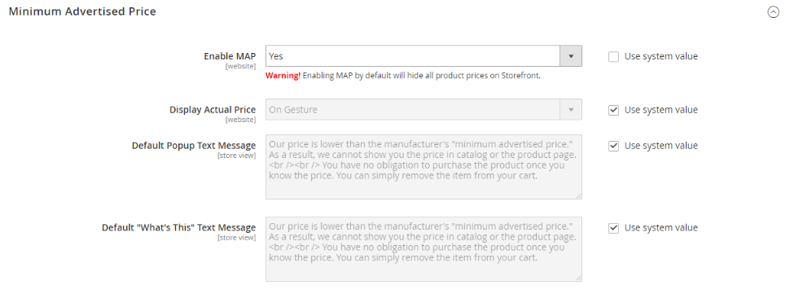

# [!UICONTROL Sales] > [!UICONTROL Sales]

{{config}}

## [!UICONTROL General]

<!-- zoom -->

<!-- [General](https://docs.magento.com/user-guide/marketing/sales-documents-ref-id.html) -->

| Champ | [Portée](../../getting-started/websites-stores-views.md#scope-settings) | Description |
|--- |--- |--- |
| [!UICONTROL Hide Customer IP] | Affichage de la boutique | Détermine si l&#39;adresse IP du client apparaît sur les commandes, les factures, les livraisons et les avoirs. Options : `Yes` / `No` |

{style="table-layout:auto"}

## [!UICONTROL Checkout Totals Sort Order]

<!-- zoom -->

<!-- [Checkout Totals Sort Order](https://docs.magento.com/user-guide/sales/checkout-totals-sort-order.html) -->

| Champ | [Portée](../../getting-started/websites-stores-views.md#scope-settings) | Description |
|--- |--- |--- |
| [!UICONTROL Subtotal] | Site internet | Nombre qui détermine à quel moment le sous-total est calculé par rapport aux autres totaux de passage en caisse. Valeur par défaut : `10` |
| [!UICONTROL Discount] | Site internet | Nombre qui détermine à quel moment la remise est calculée par rapport aux autres totaux de passage en caisse. Valeur par défaut : `20` |
| [!UICONTROL Shipping] | Site internet | Nombre qui détermine à quel moment la livraison est calculée par rapport à d’autres totaux de passage en caisse. Valeur par défaut : `30` |
| [!UICONTROL Tax] | Site internet | Nombre qui détermine le moment où la taxe est calculée par rapport aux autres totaux de passage en caisse. Valeur par défaut : `40` |
| [!UICONTROL Fixed Product Tax] | Site internet | Nombre qui détermine à quel moment la taxe sur les produits fixe est calculée par rapport aux autres totaux de passage en caisse. Valeur par défaut : `50` |
| [!UICONTROL Grand Total] | Site internet | Nombre qui détermine à quel moment le total général est calculé par rapport aux autres totaux de passage en caisse. Valeur par défaut : `100` |

{style="table-layout:auto"}

## [!UICONTROL Reorder]

<!-- zoom -->

<!-- [Reorder](https://docs.magento.com/user-guide/sales/reorders-allow.html) -->

| Champ | [Portée](../../getting-started/websites-stores-views.md#scope-settings) | Description |
|--- |--- |--- |
| [!UICONTROL Allow Reorder] | Affichage de la boutique | Détermine si les clients peuvent effectuer une réorganisation à partir de leurs comptes. Options : `Yes` / `No` |

{style="table-layout:auto"}

## [!UICONTROL Allow Zero Grand Total]

| Champ | [Portée](../../getting-started/websites-stores-views.md#scope-settings) | Description |
|--- |--- |--- |
| [!UICONTROL Allow Zero Grand Total for Credit Memo] | Affichage de la boutique | Détermine la possibilité de créer un avoir avec un total général nul. Options : `Yes` / `No` |

{style="table-layout:auto"}

## [!UICONTROL Invoice and Packing Slip Design]

<!-- zoom -->

<!-- [Invoice and Packing Slip Design](https://docs.magento.com/user-guide/marketing/sales-document-pdf-logo.html) -->

| Champ | [Portée](../../getting-started/websites-stores-views.md#scope-settings) | Description |
|--- |--- |--- |
| [!UICONTROL Logo for PDF Print-outs] | Affichage de la boutique | Identifie le fichier logo qui apparaît dans l&#39;en-tête des factures et des bons de livraison du PDF. Types de fichiers autorisés :  JPG/JPEG  TIF/TIFF  PNG |
| [!UICONTROL Logo for HTML Print View] | Affichage de la boutique | Identifie le fichier logo qui apparaît dans l&#39;en-tête de l&#39;affichage d&#39;impression du HTML des factures et des bons de livraison. Types de fichiers autorisés :  JPG/JPEG  GIF  PNG |
| [!UICONTROL Address] | Affichage de la boutique | Adresse du magasin telle que vous souhaitez qu&#39;elle apparaisse sur les factures et les bons de livraison. |

{style="table-layout:auto"}

## [!UICONTROL Minimum Order Amount]

<!-- zoom -->

<!-- [Minimum Order Amount](https://docs.magento.com/user-guide/sales/cart-minimum-order-amount.html) -->

| Champ | [Portée](../../getting-started/websites-stores-views.md#scope-settings) | Description |
|--- |--- |--- |
| [!UICONTROL Enable] | Site internet | Détermine si un montant de commande minimum est défini pour le site. Options : `Yes` / `No` |
| [!UICONTROL Minimum Amount] | Site internet | Spécifie le sous-total minimum, commande après application des remises. |
| [!UICONTROL Include Discount Amount] | Site internet | Détermine si le montant minimum de la commande inclut les remises appliquées. Options : `Yes` / `No` |
| [!UICONTROL Include Tax to Amount] | Site internet | Détermine si le montant de commande minimum inclut la taxe. Options : `Yes` / `No` |
| [!UICONTROL Description Message] | Affichage de la boutique | Détermine le message qui s’affiche en haut du panier lorsque le total du panier est inférieur au montant de commande minimal. Si rien n’est indiqué, le message par défaut suivant s’affiche : `Minimum order amount is $[minimum_amount]` |
| [!UICONTROL Error to Show in Shopping Cart] | Affichage de la boutique | Détermine le message qui s’affiche à partir du lien de panier ou de passage en caisse lorsque le montant de la commande est inférieur au montant minimal requis. Si rien n’est indiqué, un message par défaut s’affiche. |
| [!UICONTROL Validate Each Address Separately in Multi-address Checkout] | Site internet | Pour les commandes multi-articles, détermine si les articles de commande allant à des adresses séparées respectent largement le montant de commande minimum. Options : `Yes` / `No` |
| [!UICONTROL Multi-address Description Message] | Affichage de la boutique | Pour les commandes à plusieurs adresses, détermine le message qui apparaît dans le panier si les articles envoyés à une adresse sont inférieurs au montant de commande minimal. |
| [!UICONTROL Multi-address Error to Show in Shopping Cart] | Affichage de la boutique | Pour les commandes à plusieurs adresses, détermine le message qui s’affiche à partir du lien de panier ou de passage en caisse lorsque le montant de la commande est inférieur au montant minimum requis. Si rien n’est indiqué, un message par défaut s’affiche. |

{style="table-layout:auto"}

## [!UICONTROL Dashboard]

<!-- zoom -->

<!-- [Dashboard](https://docs.magento.com/user-guide/stores/admin-dashboard.html) -->

| Champ | [Portée](../../getting-started/websites-stores-views.md#scope-settings) | Description |
|--- |--- |--- |
| [!UICONTROL Use Aggregated Data] | Global | Détermine si des données de vente agrégées en temps réel sont utilisées pour produire des rapports instantanés de tableaux de bord. Si vous devez traiter une grande quantité de données, vous pouvez améliorer les performances en désactivant l’affichage des données en temps réel. Options : `Yes` / `No` |

{style="table-layout:auto"}

## [!UICONTROL Orders Cron Settings]

<!-- zoom -->

<!-- [Orders Cron Settings](https://docs.magento.com/user-guide/system/cron.html) -->

| Champ | [Portée](../../getting-started/websites-stores-views.md#scope-settings) | Description |
|--- |--- |--- |
| [!UICONTROL Pending Payment Order Lifetime] | Site internet | Détermine la durée de vie en minutes des commandes en attente. Paramètre par défaut : `480` minutes (8 heures) |

{style="table-layout:auto"}

## [!UICONTROL Gift Options]

<!-- zoom -->

<!-- [Gift Options](https://docs.magento.com/user-guide/sales/gift-options.html) -->

| Champ | [Portée](../../getting-started/websites-stores-views.md#scope-settings) | Description |
|--- |--- |--- |
| [!UICONTROL Allow Gift Messages on Order Level] | Site internet | Indiquez si un message cadeau peut être ajouté pour l’ensemble de la commande. |
| [!UICONTROL Allow Gift Messages on Order Items] | Site internet | Indiquez si un message cadeau peut être ajouté pour un article de commande individuel. |
| [!UICONTROL Allow Gift Wrapping on Order Level] | Site internet |  (Adobe Commerce uniquement) Indiquez si l’emballage-cadeau peut être ajouté à l’intégralité de la commande. |
| [!UICONTROL Allow Gift Wrapping for Order Items] | Site internet |  (Adobe Commerce uniquement) Indiquez si l’emballage-cadeau peut être ajouté pour l’élément de commande individuel. |
| [!UICONTROL Allow Gift Receipt] | Site internet |  (Adobe Commerce uniquement) Indiquez si un reçu cadeau peut être ajouté pour la commande. |
| [!UICONTROL Allow Printed Card] | Site internet |  (Adobe Commerce uniquement) Indiquez si une carte imprimée peut être ajoutée pour la commande. |
| [!UICONTROL Default Price for Printed Card] | Site internet |  (Adobe Commerce uniquement) Spécifiez le prix par défaut de la carte imprimée. |

{style="table-layout:auto"}

## [!UICONTROL Minimum Advertised Price]

<!-- zoom -->

<!-- [Minimum Advertised Price](https://docs.magento.com/user-guide/catalog/product-price-minimum-advertised.html) -->

| Champ | [Portée](../../getting-started/websites-stores-views.md#scope-settings) | Description |
|--- |--- |--- |
| [!UICONTROL Enable MAP] | Site internet | Active le prix minimum annoncé pour votre boutique. Options : `Yes` / `No` |
| [!UICONTROL Display Actual Price] | Site internet | Détermine où le prix réel d&#39;un produit est visible pour le client. Options :  **`In Cart`**- Affiche le prix réel du produit dans le panier. **`Before Order Confirmation`** : affiche le prix réel du produit à la fin du processus de passage en caisse, juste avant la confirmation de la commande.  **`On Gesture`**- Affiche le prix réel du produit dans une fenêtre contextuelle lorsque le client clique sur « Cliquer pour voir le prix » ou « Qu&#39;est-ce que c&#39;est ? » lien. |
| [!UICONTROL Default Popup Text Message] | Affichage de la boutique | Message texte qui s’affiche lorsque le client sélectionne le lien « Cliquer pour le prix » dans une liste de catégories ou une page d’affichage de produit. |
| [!UICONTROL Default "What's This" Text Message] | Affichage de la boutique | Message texte qui s’affiche lorsque le client clique sur le bouton « Qu’est-ce que c’est ? » lien à partir de la page vue du produit. |
| [!UICONTROL Manufacturer's Suggested Retail Price] | Global | Prix de détail suggéré par le fabricant (PDSF). |

{style="table-layout:auto"}

## [!UICONTROL Multicoupon Settings]

{{ee-feature}}

<!-- zoom -->

| Champ | [Portée](../../getting-started/websites-stores-views.md#scope-settings) | Description |
|--- |--- |--- |
| [!UICONTROL Maximum number of coupons per order] | Site internet | Détermine le nombre maximal de coupons autorisés par commande |

{style="table-layout:auto"}

## [!UICONTROL Order by SKU Settings]

{{ee-feature}}

<!-- zoom -->

<!-- [Order by SKU Settings](https://docs.magento.com/user-guide/customers/account-dashboard-order-by-sku.html) -->

<!-- zoom -->

| Champ | [Portée](../../getting-started/websites-stores-views.md#scope-settings) | Description |
|--- |--- |--- |
| [!UICONTROL Enable Order by SKU on My Account in Storefront] | Site internet | Détermine si l’option Classer par SKU est disponible dans le tableau de bord du compte client. Options :  **`Yes, for Everyone`**- L’onglet Classer par SKU s’affiche dans le tableau de bord du compte de tous les clients. **`Yes, for Specified Customer Groups`** - L’onglet Classer par SKU s’affiche dans le tableau de bord du compte pour les membres de groupes spécifiés ou d’un catalogue partagé.  **`No`**- L’onglet Commander par SKU n’est pas disponible dans le compte client. |
| [!UICONTROL Customer Groups] | Site internet | Détermine les groupes de clients. Options : `General` / `Retailer` / `Wholesale` |

{style="table-layout:auto"}

## [!UICONTROL Instant Purchase]

<!-- zoom -->

<!-- [Instant Purchase](https://docs.magento.com/user-guide/sales/checkout-instant-purchase.html) -->

| Champ | [Portée](../../getting-started/websites-stores-views.md#scope-settings) | Description |
|--- |--- |--- |
| [!UICONTROL Enabled] | Affichage de la boutique | Active l’achat instantané pour la vue de magasin, si le coffre est activé pour le mode de paiement, tel que le Braintree. Options : `Yes` / `No` |
| [!UICONTROL Button Text] | Affichage de la boutique | Spécifie le texte qui apparaît sur le bouton Achat instantané. Le texte par défaut est `Instant Purchase`. |

{style="table-layout:auto"}

## [!UICONTROL Rate Limiting]

<!-- zoom -->

| Champ | [Portée](../../getting-started/websites-stores-views.md#scope-settings) | Description |
|--------------------------------------------------------|--- |------------------------------------------------------------------------------------------------------------------------------------------------------------------------------------|
| [!UICONTROL Enable rate limiting for placing orders] | Affichage de la boutique | Détermine si la limitation de débit est utilisée pour passer des commandes depuis la vue du magasin (la valeur par défaut est `No`). Options : `Yes` / `No`. |
| [!UICONTROL Requests limit per authenticated customer] | Affichage de la boutique | Nombre de demandes d’achat qu’un client authentifié peut effectuer pendant la période. La limite par défaut est `10`. |
| [!UICONTROL Requests limit per guest] | Affichage de la boutique | Nombre de demandes d’achat qu’un client non authentifié peut effectuer au cours de la période spécifiée. La valeur par défaut est `50`. |
| [!UICONTROL Counter resets in a ...] | Affichage de la boutique | La période pendant laquelle un client authentifié/non authentifié peut effectuer un certain nombre de demandes d’achat (la valeur par défaut est `Minute`). Options : `Minute` / `Hour` /`Day` |

{style="table-layout:auto"}

## [!UICONTROL Orders, Invoices, Shipments, Credit Memos Archiving]

{{ee-feature}}

<!-- zoom -->

Pour plus d’informations sur la modification de ces paramètres, voir [Configuration de l’archive des commandes](../../stores-purchase/order-archive.md#configure-the-order-archive) dans le _Guide d’expérience d’achat et des magasins_.

| Champ | [Portée](../../getting-started/websites-stores-views.md#scope-settings) | Description |
|--- |--- |--- |
| [!UICONTROL Enable Archiving] | Global | Détermine si l&#39;archivage est activé. Options : `Yes` / `No` |
| [!UICONTROL Archive Orders Purchased] | Global | Détermine le nombre de jours qui s&#39;écoulent avant l&#39;archivage d&#39;une commande terminée. Valeur par défaut : `30` |
| [!UICONTROL Order  Statuses to be Archived] | Global | Détermine l’ [statut](../../stores-purchase/order-status.md) nombre d’ordres à archiver. Par défaut, les commandes dont le statut est Terminé ou Fermé sont archivées. Options : `Pending` / `Processing` / `Suspected Fraud` / `Complete` / `Closed` / `Canceled` / `On Hold` |

{style="table-layout:auto"}

## [!UICONTROL RMA Settings]

{{ee-feature}}

<!-- zoom -->

Pour plus d’informations sur la modification de ces paramètres, voir [Configurer les retours](../../stores-purchase/rma-configure.md) dans le _Guide d’expérience d’achat et des magasins_.

| Champ | [Portée](../../getting-started/websites-stores-views.md#scope-settings) | Description |
|--- |--- |--- |
| [!UICONTROL Enable RMA on Storefront] | Site internet | Détermine si les clients peuvent créer et afficher des demandes RMA à partir du storefront. Le retour client peut être appliqué aux commandes nouvelles et existantes. Par défaut, RMA n’est pas activé pour le storefront. Options : `Yes` / `No` |
| [!UICONTROL Enable RMA on Product Level] | Site internet | Détermine la valeur par défaut pour le champ Activer RMA dans les informations sur le produit. |
| [!UICONTROL Use Store Address] | Site internet | Détermine le nom et l&#39;adresse du contact utilisés pour les expéditions de marchandises retournées. Options :  **`Yes`**- Utilise le [Point d’origine](../../stores-purchase/shipping-settings.md#point-of-origin) adresse des paramètres d&#39;expédition. **`No`** : ouvre le formulaire d’adresse pour que vous puissiez saisir une autre adresse. |

{style="table-layout:auto"}
