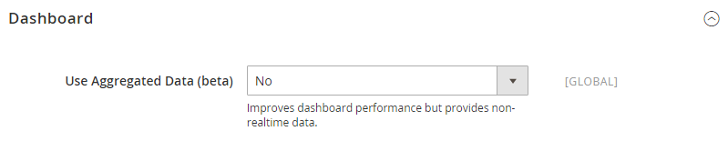
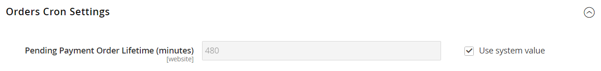

# [!UICONTROL Sales] > [!UICONTROL Sales]

{{config}}

## [!UICONTROL General]

<!-- zoom -->

<!-- [General](https://experienceleague.adobe.com/fr/docs/commerce-admin/stores-sales/site-store/sales-documents) -->

| Champ | [Portée](../../getting-started/websites-stores-views.md#scope-settings) | Description |
|--- |--- |--- |
| [!UICONTROL Hide Customer IP] | Affichage en magasin | Détermine si l’adresse IP du client apparaît sur les commandes, factures, envois et notes de crédit. Options : `Yes` / `No` |

{style="table-layout:auto"}

## [!UICONTROL Checkout Totals Sort Order]

<!-- zoom -->

<!-- [Checkout Totals Sort Order](https://experienceleague.adobe.com/fr/docs/commerce-admin/stores-sales/point-of-purchase/checkout/checkout-totals-sort-order) -->

| Champ | [Portée](../../getting-started/websites-stores-views.md#scope-settings) | Description |
|--- |--- |--- |
| [!UICONTROL Subtotal] | Site Web | Nombre qui détermine le moment où le sous-total est calculé par rapport aux autres totaux de passage en caisse. Valeur par défaut : `10` |
| [!UICONTROL Discount] | Site Web | Nombre qui détermine le moment où la remise est calculée par rapport aux autres totaux de passage en caisse. Valeur par défaut : `20` |
| [!UICONTROL Shipping] | Site Web | Nombre qui détermine le moment où l’expédition est calculée par rapport aux autres totaux de passage en caisse. Valeur par défaut : `30` |
| [!UICONTROL Tax] | Site Web | Nombre qui détermine le moment où la taxe est calculée par rapport aux autres totaux de passage en caisse. Valeur par défaut : `40` |
| [!UICONTROL Fixed Product Tax] | Site Web | Nombre qui détermine le moment où la taxe sur les produits fixe est calculée par rapport aux autres totaux de passage en caisse. Valeur par défaut : `50` |
| [!UICONTROL Grand Total] | Site Web | Nombre qui détermine le moment où le total général est calculé par rapport aux autres totaux de passage en caisse. Valeur par défaut : `100` |

{style="table-layout:auto"}

## [!UICONTROL Reorder]

<!-- zoom -->

<!-- [Reorder](https://experienceleague.adobe.com/fr/docs/commerce-admin/stores-sales/shopper-tools/reorders-allow) -->

| Champ | [Portée](../../getting-started/websites-stores-views.md#scope-settings) | Description |
|--- |--- |--- |
| [!UICONTROL Allow Reorder] | Affichage en magasin | Détermine si les clients peuvent effectuer une nouvelle commande à partir de leurs comptes. Options : `Yes` / `No` |

{style="table-layout:auto"}

## [!UICONTROL Allow Zero Grand Total]

| Champ | [Portée](../../getting-started/websites-stores-views.md#scope-settings) | Description |
|--- |--- |--- |
| [!UICONTROL Allow Zero Grand Total for Credit Memo] | Affichage en magasin | Détermine la possibilité de créer une note de crédit avec un total général zéro. Options : `Yes` / `No` |

{style="table-layout:auto"}

## [!UICONTROL Invoice and Packing Slip Design]

<!-- zoom -->

<!-- [Invoice and Packing Slip Design](https://experienceleague.adobe.com/fr/docs/commerce-admin/stores-sales/site-store/sales-documents) -->

| Champ | [Portée](../../getting-started/websites-stores-views.md#scope-settings) | Description |
|--- |--- |--- |
| [!UICONTROL Logo for PDF Print-outs] | Affichage en magasin | Identifie le fichier de logo qui apparaît dans l’en-tête des factures et des bordereaux d’emballage des PDF. Types de fichiers autorisés :  JPG/JPEG  TIF/TIFF  PNG |
| [!UICONTROL Logo for HTML Print View] | Affichage en magasin | Identifie le fichier de logo qui apparaît dans l’en-tête de la vue d’impression HTML des factures et des bordereaux d’emballage. Types de fichiers autorisés :  JPG /JPEG  GIF  PNG |
| [!UICONTROL Address] | Affichage en magasin | L’adresse du magasin telle que vous souhaitez la voir apparaître sur les factures et les bordereaux d’emballage. |

{style="table-layout:auto"}

## [!UICONTROL Minimum Order Amount]

<!-- zoom -->

<!-- [Minimum Order Amount](https://experienceleague.adobe.com/fr/docs/commerce-admin/stores-sales/point-of-purchase/cart/cart-configuration#minimum-order-amount) -->

| Champ | [Portée](../../getting-started/websites-stores-views.md#scope-settings) | Description |
|--- |--- |--- |
| [!UICONTROL Enable] | Site Web | Détermine si un montant de commande minimal est défini pour le site. Options : `Yes` / `No` |
| [!UICONTROL Minimum Amount] | Site Web | Indique le sous-total minimal, la commande après application des remises. |
| [!UICONTROL Include Discount Amount] | Site Web | Détermine si le montant minimum de la commande inclut les remises appliquées. Options : `Yes` / `No` |
| [!UICONTROL Include Tax to Amount] | Site Web | Détermine si le montant minimum de la commande inclut la taxe. Options : `Yes` / `No` |
| [!UICONTROL Description Message] | Affichage en magasin | Détermine le message qui s’affiche en haut du panier lorsque le total du panier est inférieur au montant minimum de la commande. Si rien n’est indiqué, le message par défaut suivant apparaît : `Minimum order amount is $[minimum_amount]` |
| [!UICONTROL Error to Show in Shopping Cart] | Affichage en magasin | Détermine le message qui apparaît à partir du mini panier ou du lien de passage en caisse lorsque le montant de la commande est inférieur au montant minimum requis. Si rien n’est indiqué, un message par défaut s’affiche. |
| [!UICONTROL Validate Each Address Separately in Multi-address Checkout] | Site Web | Pour les commandes à plusieurs articles, détermine si les articles de commande qui séparent les adresses correspondent bien au montant minimum de la commande. Options : `Yes` / `No` |
| [!UICONTROL Multi-address Description Message] | Affichage en magasin | Pour les commandes à plusieurs adresses, détermine le message qui s’affiche dans le panier si les articles envoyés à une adresse sont inférieurs au montant minimum de la commande. |
| [!UICONTROL Multi-address Error to Show in Shopping Cart] | Affichage en magasin | Pour les commandes à plusieurs adresses, détermine le message qui s’affiche à partir du mini panier ou du lien de passage en caisse lorsque le montant de la commande est inférieur au montant minimum requis. Si rien n’est indiqué, un message par défaut s’affiche. |

{style="table-layout:auto"}

## [!UICONTROL Dashboard]

<!-- zoom -->

<!-- [Dashboard](https://experienceleague.adobe.com/fr/docs/commerce-admin/start/admin/tools/admin-dashboard) -->

| Champ | [Portée](../../getting-started/websites-stores-views.md#scope-settings) | Description |
|--- |--- |--- |
| [!UICONTROL Use Aggregated Data] | Global | Détermine si des données de ventes agrégées en temps réel sont utilisées pour générer des rapports instantanés de tableau de bord. Si vous traitez une grande quantité de données, vous pouvez améliorer les performances en désactivant l’affichage des données en temps réel. Options : `Yes` / `No` |

{style="table-layout:auto"}

## [!UICONTROL Orders Cron Settings]

<!-- zoom -->

<!-- [Orders Cron Settings](https://experienceleague.adobe.com/fr/docs/commerce-admin/systems/tools/cron) -->

| Champ | [Portée](../../getting-started/websites-stores-views.md#scope-settings) | Description |
|--- |--- |--- |
| [!UICONTROL Pending Payment Order Lifetime] | Site Web | Détermine la durée de vie des commandes en attente en minutes. Paramètre par défaut : `480` minutes (8 heures) |

{style="table-layout:auto"}

## [!UICONTROL Gift Options]

<!-- zoom -->

<!-- [Gift Options](https://experienceleague.adobe.com/fr/docs/commerce-admin/stores-sales/point-of-purchase/cart/cart-configuration#gift-options) -->

| Champ | [Portée](../../getting-started/websites-stores-views.md#scope-settings) | Description |
|--- |--- |--- |
| [!UICONTROL Allow Gift Messages on Order Level] | Site Web | Indiquez si un message cadeau peut être ajouté pour l’ensemble de la commande. |
| [!UICONTROL Allow Gift Messages on Order Items] | Site Web | Indiquez si un message cadeau peut être ajouté pour un article de commande individuel. |
| [!UICONTROL Allow Gift Wrapping on Order Level] | Site Web |  (Adobe Commerce uniquement) Indiquez si l’encapsulation des cadeaux peut être ajoutée pour l’ensemble de la commande. |
| [!UICONTROL Allow Gift Wrapping for Order Items] | Site Web |  (Adobe Commerce uniquement) Indiquez si l’emballage cadeau peut être ajouté pour chaque article de commande. |
| [!UICONTROL Allow Gift Receipt] | Site Web |  (Adobe Commerce uniquement) Indiquez si un reçu de cadeau peut être ajouté pour la commande. |
| [!UICONTROL Allow Printed Card] | Site Web |  (Adobe Commerce uniquement) Indiquez si une carte imprimée peut être ajoutée pour la commande. |
| [!UICONTROL Default Price for Printed Card] | Site Web |  (Adobe Commerce uniquement) Spécifiez le prix par défaut de la carte imprimée. |

{style="table-layout:auto"}

## [!UICONTROL Minimum Advertised Price]

<!-- zoom -->

<!-- [Minimum Advertised Price](https://experienceleague.adobe.com/fr/docs/commerce-admin/catalog/products/pricing/product-price-minimum-advertised) -->

| Champ | [Portée](../../getting-started/websites-stores-views.md#scope-settings) | Description |
|--- |--- |--- |
| [!UICONTROL Enable MAP] | Site Web | Active le prix publicitaire minimum pour votre boutique. Options : `Yes` / `No` |
| [!UICONTROL Display Actual Price] | Site Web | Détermine où le prix réel d’un produit est visible pour le client. Options :  **`In Cart`**- Affiche le prix réel du produit dans le panier. **`Before Order Confirmation`** - Affiche le prix réel du produit à la fin du processus de passage en caisse, juste avant que la commande ne soit confirmée.  **`On Gesture`**- Affiche le prix réel du produit dans une fenêtre contextuelle lorsque le client clique sur &quot;Clic pour le prix&quot; ou &quot;Qu’est-ce que c’est ?&quot; lien. |
| [!UICONTROL Default Popup Text Message] | Affichage en magasin | Message texte qui s’affiche lorsque le client sélectionne le lien &quot;Clic pour le prix&quot; dans une liste de catégories ou une page de consultation de produit. |
| [!UICONTROL Default "What's This" Text Message] | Affichage en magasin | Le message texte qui s’affiche lorsque le client clique sur &quot;Qu’est-ce que c’est ?&quot; lien de la page d’affichage du produit. |
| [!UICONTROL Manufacturer's Suggested Retail Price] | Global | Le prix de détail proposé par le fabricant (MSRP). |

{style="table-layout:auto"}

## [!UICONTROL Multicoupon Settings]

{{ee-feature}}

<!-- zoom -->

| Champ | [Portée](../../getting-started/websites-stores-views.md#scope-settings) | Description |
|--- |--- |--- |
| [!UICONTROL Maximum number of coupons per order] | Site Web | Détermine le nombre maximal de bons autorisés par commande. Cette fonctionnalité est disponible uniquement dans les API d’administration, GraphQL et REST. Et il est **_non disponible_** dans Storefront. |

{style="table-layout:auto"}

## [!UICONTROL Order by SKU Settings]

{{ee-feature}}

<!-- zoom -->

<!-- [Order by SKU Settings](https://experienceleague.adobe.com/fr/docs/commerce-admin/stores-sales/point-of-purchase/cart/order-by-sku) -->

<!-- zoom -->

| Champ | [Portée](../../getting-started/websites-stores-views.md#scope-settings) | Description |
|--- |--- |--- |
| [!UICONTROL Enable Order by SKU on My Account in Storefront] | Site Web | Détermine si Commande par SKU est disponible dans le tableau de bord du compte client. Options :  **`Yes, for Everyone`**- L’onglet Ordre de tri par SKU s’affiche dans le tableau de bord du compte de tous les clients. **`Yes, for Specified Customer Groups`** - L’onglet Ordre par SKU s’affiche dans le tableau de bord du compte pour les membres de groupes spécifiés ou d’un catalogue partagé.  **`No`**- L’onglet Ordre par SKU n’est pas disponible dans le compte client. |
| [!UICONTROL Customer Groups] | Site Web | Détermine les groupes de clients. Options : `General` / `Retailer` / `Wholesale` |

{style="table-layout:auto"}

## [!UICONTROL Instant Purchase]

<!-- zoom -->

<!-- [Instant Purchase](https://experienceleague.adobe.com/fr/docs/commerce-admin/stores-sales/point-of-purchase/checkout-instant-purchase) -->

| Champ | [Portée](../../getting-started/websites-stores-views.md#scope-settings) | Description |
|--- |--- |--- |
| [!UICONTROL Enabled] | Affichage en magasin | Permet l’achat instantané pour la vue de magasin, si le mode de paiement, tel que Braintree, a la valeur Vault activée. Options : `Yes` / `No` |
| [!UICONTROL Button Text] | Affichage en magasin | Indique le texte qui s’affiche sur le bouton Achat instantané. Le texte par défaut est `Instant Purchase`. |

{style="table-layout:auto"}

## [!UICONTROL Rate Limiting]

<!-- zoom -->

| Champ | [Portée](../../getting-started/websites-stores-views.md#scope-settings) | Description |
|--------------------------------------------------------|--- |------------------------------------------------------------------------------------------------------------------------------------------------------------------------------------|
| [!UICONTROL Enable rate limiting for placing orders] | Affichage en magasin | Détermine si la limitation de débit est utilisée pour placer des commandes depuis la vue de magasin (la valeur par défaut est `No`). Options : `Yes` / `No`. |
| [!UICONTROL Requests limit per authenticated customer] | Affichage en magasin | Nombre de demandes d’achat qu’un client authentifié peut effectuer au cours de la période. La limite par défaut est `10`. |
| [!UICONTROL Requests limit per guest] | Affichage en magasin | Nombre de demandes d’achat qu’un client non authentifié peut effectuer au cours de la période spécifiée. La valeur par défaut est `50`. |
| [!UICONTROL Counter resets in a ...] | Affichage en magasin | La période pendant laquelle un client authentifié/non authentifié peut effectuer un certain nombre de demandes d’achat (la valeur par défaut est `Minute`). Options : `Minute` / `Hour` /`Day` |

{style="table-layout:auto"}

## [!UICONTROL Orders, Invoices, Shipments, Credit Memos Archiving]

{{ee-feature}}

<!-- zoom -->

Pour plus d’informations sur la modification de ces paramètres, voir [Configuration de l’archive de commande](../../stores-purchase/order-archive.md#configure-the-order-archive) dans le _Guide des magasins et de l’expérience d’achat_.

| Champ | [Portée](../../getting-started/websites-stores-views.md#scope-settings) | Description |
|--- |--- |--- |
| [!UICONTROL Enable Archiving] | Global | Détermine si l’archivage est activé. Options : `Yes` / `No` |
| [!UICONTROL Archive Orders Purchased] | Global | Détermine le nombre de jours qui s’écoulent avant qu’une commande terminée ne soit archivée. Valeur par défaut : `30` |
| [!UICONTROL Order  Statuses to be Archived] | Global | Détermine le [statut](../../stores-purchase/order-status.md) des commandes à archiver. Par défaut, les commandes dont le statut est Terminé ou Fermé sont archivées. Options : `Pending` / `Processing` / `Suspected Fraud` / `Complete` / `Closed` / `Canceled` / `On Hold` |

{style="table-layout:auto"}

## [!UICONTROL RMA Settings]

{{ee-feature}}

<!-- zoom -->

Pour plus d’informations sur la modification de ces paramètres, voir [Configuration des retours](../../stores-purchase/rma-configure.md) dans le _Guide des magasins et de l’expérience d’achat_.

| Champ | [Portée](../../getting-started/websites-stores-views.md#scope-settings) | Description |
|--- |--- |--- |
| [!UICONTROL Enable RMA on Storefront] | Site Web | Détermine si les clients peuvent créer et afficher des requêtes RMA à partir du storefront. La RAM peut être appliquée aux commandes nouvelles et existantes. Par défaut, la RAM n’est pas activée pour le storefront. Options : `Yes` / `No` |
| [!UICONTROL Enable RMA on Product Level] | Site Web | Détermine la valeur par défaut du champ Activer la RAM dans les informations sur les produits. |
| [!UICONTROL Use Store Address] | Site Web | Détermine le nom et l’adresse du contact utilisés pour les envois de marchandises renvoyées. Options :  **`Yes`**- Utilise l’adresse [Point d’origine](../../stores-purchase/shipping-settings.md#point-of-origin) des paramètres de livraison. **`No`** - Ouvre le formulaire d’adresse afin que vous puissiez saisir une autre adresse. |

{style="table-layout:auto"}
