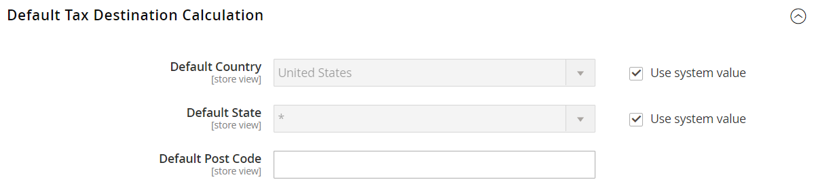

# [!UICONTROL Sales] > [!UICONTROL Tax]

>[!NOTE]
>
>Les versions 2.4.0 à 2.4.3 d’Adobe Commerce et de Magento Open Source comprenaient l’extension développée par le fournisseur Vertex utilisée pour l’intégration à [!UICONTROL Vertex Cloud]. À compter de la version 2.4.4, cette extension n’est plus fournie avec la version principale et doit être installée et mise à jour à partir du Commerce Marketplace. Le Marketplace permet également d’accéder à la documentation actuelle fournie par le développeur de l’extension.
>  
>Si l’extension groupée est activée et configurée, vous devez mettre à jour votre fichier compositeur.json dans le cadre du processus de mise à niveau 2.4.4 et gérer les mises à jour de l’extension. Voir [Mise à niveau des modules et des extensions](https://experienceleague.adobe.com/docs/commerce-operations/upgrade-guide/modules/upgrade.html) dans le _Guide de mise à niveau_ pour plus d’informations.

{{config}}

## [!UICONTROL Tax Classes]

<!-- zoom -->

Pour plus d’informations sur la modification de ces paramètres, voir [Classes fiscales](../../stores-purchase/tax-class.md) dans le _Guide d’expérience des magasins et des achats_.

| Champ | [Portée](../../getting-started/websites-stores-views.md#scope-settings) | Description |
|--- |--- |--- |
| [!UICONTROL Tax Class for Shipping] | Site Web | Identifie la classe de taxe utilisée pour l’expédition. Les options incluent toutes les classes de taxe de produit disponibles : `None` / `Taxable Goods` / `Shipping` / `Tax Exempt` |
| [!UICONTROL Tax Class for Gift Options] | Site Web |  (Adobe Commerce uniquement) Identifie la classe fiscale par défaut utilisée pour les options de cadeau. |
| [!UICONTROL Default Tax Class for Product] | Global | Identifie la classe de taxe par défaut utilisée pour les produits. |
| [!UICONTROL Default Tax Class for Customer] | Global | Identifie la classe de taxe par défaut utilisée pour les clients. |

{:style=&quot;table-layout:auto&quot;}

## [!UICONTROL Calculation Settings]

<!-- zoom -->

| Champ | [Portée](../../getting-started/websites-stores-views.md#scope-settings) | Description |
|--- |--- |--- |
| [!UICONTROL Tax Calculation Method Based On] | Site Web | Détermine la méthode de calcul de la taxe pour une commande. Options : **`Unit Price`**- Les calculs des taxes sont basés sur le prix unitaire de chaque produit. **`Row Total`** - Les calculs des taxes sont basés sur le total des lignes.  **`Total`**- Les calculs des taxes sont basés sur le total de la commande.  _** Remarque :**_Si une extension de calcul des taxes est installée à partir de Marketplace, comme _Vertex Cloud_, le service d’extension est répertorié en tant qu’option. |
| [!UICONTROL Tax Calculation Based On] | Site Web | Détermine si le calcul de la taxe est basé sur l’adresse de livraison, l’adresse de facturation ou l’origine de livraison. Options : `Shipping Address` / `Billing Address` / `Shipping Origin` |
| [!UICONTROL Catalog Prices] | Site Web | Détermine si les prix du catalogue incluent ou excluent la taxe. Options : `Excluding Tax` / `Including Tax` |
| [!UICONTROL Shipping Prices] | Site Web | Détermine les prix d’expédition en incluant ou en excluant la taxe. Options : `Excluding Tax` / `Including Tax` |
| [!UICONTROL Apply Customer Tax] | Site Web | Détermine si la taxe est appliquée avant ou après une remise. Options : `Before Discount` / `After Discount` |
| [!UICONTROL Apply Discount on Prices] | Site Web | Détermine si les prix de remise incluent ou excluent la taxe. Options : `Excluding Tax` / `Including Tax` |
| [!UICONTROL Apply Tax On] | Site Web | Détermine si la taxe s’applique au prix d’origine ou à un prix personnalisé, le cas échéant. Options : `Custom price if available` / `Original price only` |
| [!UICONTROL Enable Cross Border Trade] | Site Web | Lorsqu’elle est activée, applique une tarification cohérente par-delà les frontières des régions avec des taux d’imposition différents. Options : `Yes` / `No`   **_Remarque :_**Le recours au commerce transfrontalier ajuste la marge bénéficiaire par taux d&#39;imposition. |

{:style=&quot;table-layout:auto&quot;}

## [!UICONTROL Default Tax Destination Calculation]

<!-- zoom -->

| Champ | [Portée](../../getting-started/websites-stores-views.md#scope-settings) | Description |
|--- |--- |--- |
| [!UICONTROL Default Country] | Affichage en magasin | Détermine le pays sur lequel reposent les calculs fiscaux. |
| [!UICONTROL Default State] | Affichage en magasin | Détermine l’état sur lequel reposent les calculs fiscaux. Un astérisque (*) peut fonctionner comme un caractère générique pour indiquer tous les états du pays sélectionné. |
| [!UICONTROL Default Post Code] | Affichage en magasin | Identifie le code postal ou le code postal sur lequel reposent les calculs fiscaux. Un astérisque (*) peut fonctionner comme un caractère générique pour indiquer tous les codes postaux dans l’état sélectionné. |

{:style=&quot;table-layout:auto&quot;}

## [!UICONTROL Price Display Settings]

<!-- zoom -->

Pour plus d’informations sur la modification de ces paramètres, voir [Configuration des paramètres d’affichage des prix](../../stores-purchase/display-settings.md#configure-price-display-settings) dans le _Guide d’expérience des magasins et des achats_.

| Champ | [Portée](../../getting-started/websites-stores-views.md#scope-settings) | Description |
|--- |--- |--- |
| [!UICONTROL Display Product Prices in Catalog] | Affichage en magasin | Détermine si les prix des produits publiés dans le catalogue incluent ou excluent la taxe, ou affichent deux versions du prix ; l’une avec et l’autre sans taxe. Options : `Excluding Tax` / `Including Tax` / `Including and Excluding Tax`   **_Remarque :_**Si vous définissez le champ Afficher les prix des produits sur `Including Tax`, la taxe s’affiche uniquement si une règle fiscale correspond à l’origine de la taxe ou si une adresse du client correspond à la règle de taxe. Les événements qui peuvent déclencher une correspondance incluent la création d’un compte client, la connexion ou l’utilisation de l’outil d’estimation des taxes et des frais d’expédition dans le panier. |
| [!UICONTROL Display Shipping Prices] | Affichage en magasin | Détermine si les prix d’expédition incluent ou excluent la taxe, ou affichent deux versions du prix d’expédition ; l’une avec et l’autre sans taxe. Options : `Excluding Tax` / `Including Tax` / `Including and Excluding Tax` |

{:style=&quot;table-layout:auto&quot;}

## [!UICONTROL Shopping Cart Display Settings]

<!-- zoom -->

Pour plus d’informations sur la modification de ces paramètres, voir [Configuration des paramètres d’affichage du panier](../../stores-purchase/display-settings.md#step-2-configure-shopping-cart-display-settings) dans le _Guide d’expérience des magasins et des achats_.

| Champ | [Portée](../../getting-started/websites-stores-views.md#scope-settings) | Description |
|--- |--- |--- |
| [!UICONTROL Display Prices] | Affichage en magasin | Détermine si les prix du panier incluent ou excluent la taxe, ou affichent deux versions du prix : l’une avec et l’autre sans taxe. Options : `Excluding Tax` / `Including Tax` / `Including and Excluding Tax` |
| [!UICONTROL Display Subtotal|Store View] | Détermine si le sous-total du panier inclut ou exclut la taxe ou affiche deux versions du sous-total ; l’une avec et l’autre sans taxe. Options : `Excluding Tax` / `Including Tax` / `Including and Excluding Tax` |
| [!UICONTROL Display Shipping Amount] | Affichage en magasin | Détermine si le montant d’expédition du panier inclut ou exclut la taxe, ou affiche deux versions du montant d’expédition : l’une avec et l’autre sans taxe. Options : `Excluding Tax` / `Including Tax` / `Including and Excluding Tax` |
| [!UICONTROL Additionally Show Order Total Without Tax] | Affichage en magasin | Détermine si une ligne supplémentaire avec le montant total général sans taxe s’affiche dans le panier. Options : `Yes` / `No` |
| [!UICONTROL Display Full Tax Summary] | Affichage en magasin | Détermine si le panier comprend un résumé fiscal complet. Options : `Yes` / `No` |
| [!UICONTROL Display Zero Tax Subtotal] | Affichage en magasin | Détermine si le panier d’achat inclut un sous-total de taxe lorsque la taxe est égale à zéro. Options : `Yes` / `No` |

{:style=&quot;table-layout:auto&quot;}

## [!UICONTROL Orders, Invoices, Credit Memos Display Settings]

<!-- zoom -->

Pour plus d’informations sur la modification de ces paramètres, voir [Configuration des paramètres d’affichage de la commande, de la facture et de la note de crédit](../../stores-purchase/display-settings.md#step-3-configure-order-invoice-and-credit-memo-display-settings) dans le _Guide d’expérience des magasins et des achats_.

| Champ | [Portée](../../getting-started/websites-stores-views.md#scope-settings) | Description |
|--- |--- |--- |
| [!UICONTROL Display Prices] | Affichage en magasin | Détermine si les prix sur les documents de vente incluent ou excluent la taxe, ou si chaque document affiche deux versions du prix ; l’une avec et l’autre sans taxe. Options : `Excluding Tax` / `Including Tax` / `Including and Excluding Tax` |
| [!UICONTROL Display Subtotal] | Affichage en magasin | Détermine si le sous-total des documents de vente inclut ou exclut la taxe, ou si chaque document affiche deux versions du sous-total ; l’une avec et l’autre sans taxe. Options : `Excluding Tax` / `Including Tax` / `Including and Excluding Tax` |
| [!UICONTROL Display Shipping Amount] | Affichage en magasin | Détermine si le montant des frais d’expédition sur les documents de vente inclut ou exclut la taxe, ou si chaque document affiche deux versions du sous-total ; l’une avec et l’autre sans taxe. Options : `Excluding Tax` / `Including Tax` / `Including and Excluding Tax` |
| [!UICONTROL Additionally Show Order Total Without Tax] | Affichage en magasin | Détermine si une ligne supplémentaire avec le montant total général sans taxe s’affiche sur les documents de vente. Options : `Yes` / `No` |
| [!UICONTROL Display Full Tax Summary] | Affichage en magasin | Détermine si le résumé fiscal complet apparaît sur les documents de vente. Options : `Yes` / `No` |
| [!UICONTROL Display Zero Tax Subtotal] | Affichage en magasin | Détermine la section du sous-total des documents de vente qui s’affiche lorsqu’aucune taxe n’est perçue. Options : `Yes` / `No` |
| [!UICONTROL Display Gift Wrapping Prices] | Affichage en magasin |  (Adobe Commerce uniquement) Détermine si les prix d’emballage de cadeaux sont inclus dans le sous-total. Options : `Excluding Tax` / `Including Tax` / `Including and Excluding Tax` |
| [!UICONTROL Display Printed Card Prices] | Affichage en magasin |  (Adobe Commerce uniquement) Détermine si les prix des cartes imprimées sont inclus dans le sous-total. Options : `Excluding Tax` / `Including Tax` / `Including and Excluding Tax` |

{:style=&quot;table-layout:auto&quot;}

## [!UICONTROL Fixed Product Taxes]

<!-- zoom -->

Pour plus d’informations sur la modification de ces paramètres, voir [Taxe fixe sur les produits (FPT)](../../stores-purchase/fixed-product-tax.md) dans le _Guide d’expérience des magasins et des achats_.

| Champ | [Portée](../../getting-started/websites-stores-views.md#scope-settings) | Description |
|--- |--- |--- |
| [!UICONTROL Enable FPT] | Site Web | Détermine si FPT est disponible. Options : `Yes` / `No` |
| [!UICONTROL Display Prices in Product Lists] | Site Web | Contrôle l’affichage du FPT dans les listes de produits. Options :  **`Including FPT Only`** - Les prix affichés incluent les taxes sur les produits fixes. Le montant FPT n’est pas affiché séparément. **`Including FPT and FPT description`**- Les prix affichés incluent les taxes sur les produits fixes. Le montant FPT est affiché séparément. **`Excluding FPT. Including FPT description and final price`** - Les prix affichés ne comprennent pas les taxes sur les produits fixes. Le montant FPT est affiché séparément. **`Excluding FPT`**- Les prix affichés ne comprennent pas les taxes sur les produits fixes. Le montant FPT n’est pas affiché séparément. |
| Afficher le prix sur la page d’affichage des produits | Site Web | Contrôle l’affichage du FPT sur la page du produit. Options :  **`Including FPT Only`** - Les prix affichés incluent les taxes sur les produits fixes. Le montant FPT n’est pas affiché séparément. **`Including FPT and FPT description`**- Les prix affichés incluent les taxes sur les produits fixes. Le montant FPT est affiché séparément. **`Excluding FPT. Including FPT description and final price`** - Les prix affichés ne comprennent pas les taxes sur les produits fixes. Le montant FPT est affiché séparément. **`Excluding FPT`**- Les prix affichés ne comprennent pas les taxes sur les produits fixes. Le montant FPT n’est pas affiché séparément. |
| [!UICONTROL Display Prices in Sales Modules] | Site Web | Contrôle l’affichage du FPT dans le panier et lors du passage en caisse. Options :  **`Including FPT Only`** - Les prix affichés incluent les taxes sur les produits fixes. Le montant FPT n’est pas affiché séparément. **`Including FPT and FPT description`**- Les prix affichés incluent les taxes sur les produits fixes. Le montant FPT est affiché séparément. **`Excluding FPT. Including FPT description and final price`** - Les prix affichés ne comprennent pas les taxes sur les produits fixes. Le montant FPT est affiché séparément. **`Excluding FPT`**- Les prix affichés ne comprennent pas les taxes sur les produits fixes. Le montant FPT n’est pas affiché séparément. |
| [!UICONTROL Display Prices in Emails] | Site Web | Contrôle l’affichage du FPT dans le courrier électronique. Options :  **`Including FPT Only`** - Les prix affichés incluent les taxes sur les produits fixes. Le montant FPT n’est pas affiché séparément. **`Including FPT and FPT description`**- Les prix affichés incluent les taxes sur les produits fixes. Le montant FPT est affiché séparément. ** Exclure FPT. Inclusion de la description FPT et du prix final **- Les prix affichés ne comprennent pas les taxes sur les produits fixes. Le montant FPT est affiché séparément. **`Excluding FPT`** - Les prix affichés ne comprennent pas les taxes sur les produits fixes. Le montant FPT n’est pas affiché séparément. |
| [!UICONTROL Apply Discounts to FPT] | Site Web | Détermine si des remises peuvent être appliquées au montant FPT. Options : `Yes` / `No` |
| [!UICONTROL FPT Tax Configuration] | Site Web | Détermine le mode de calcul de la taxe FPT. Options :  **`Not Taxed`**- Sélectionnez cette option si votre juridiction fiscale ne taxe pas le TPT. (Par exemple, la Californie.) **`Taxed`** - Sélectionnez cette option si votre juridiction fiscale applique le TPT. (Par exemple, Canada.)  **`Loaded and Displayed with Tax`**- Cliquez sur cette option si FPT est ajouté au total de la commande avant d’appliquer la taxe. (Par exemple, les pays de l&#39;UE.) |
| [!UICONTROL Include FPT in Subtotal] | Site Web | Détermine si FPT est inclus dans le sous-total du panier. Options :  **`Yes`**- Inclut FPT dans le sous-total du panier. **`No`** - FPT n’est pas inclus dans le sous-total et est placé après le sous-total dans le panier. |

{:style=&quot;table-layout:auto&quot;}
