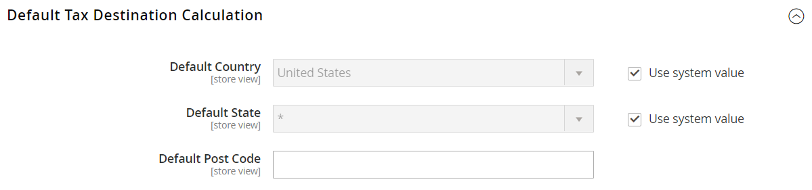
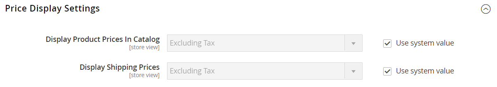

# [!UICONTROL Sales] > [!UICONTROL Tax]

>[!NOTE]
>
>Les versions 2.4.0 à 2.4.3 d’Adobe Commerce et de Magento Open Source incluaient l’extension développée par le fournisseur Vertex utilisée pour l’intégration à [!UICONTROL Vertex Cloud]. À compter de la version 2.4.4, cette extension n’est plus fournie avec la version de base et doit être installée et mise à jour à partir de Commerce Marketplace. La Marketplace permet également d’accéder à la documentation actuelle fournie par le développeur d’extensions.
>  >Si l’extension groupée est activée et configurée, vous devez mettre à jour votre fichier composer.json dans le cadre du processus de mise à niveau vers la version 2.4.4 et pour gérer les mises à jour d’extension à l’avenir. Voir [Mise à niveau des modules et des extensions](https://experienceleague.adobe.com/docs/commerce-operations/upgrade-guide/modules/upgrade.html) dans le _Guide de mise à niveau_ pour plus d’informations.

{{config}}

## [!UICONTROL Tax Classes]

<!-- zoom -->

Pour plus d’informations sur la modification de ces paramètres, voir [Classes de taxe](../../stores-purchase/tax-class.md) dans le _Guide de l’expérience d’achat et des magasins_.

| Champ | [Portée](../../getting-started/websites-stores-views.md#scope-settings) | Description |
|--- |--- |--- |
| [!UICONTROL Tax Class for Shipping] | Site internet | Identifie la classe de taxe utilisée pour l&#39;expédition. Les options incluent toutes les classes de taxe produit disponibles : `None` / `Taxable Goods` / `Shipping` / `Tax Exempt` |
| [!UICONTROL Tax Class for Gift Options] | Site internet |  (Adobe Commerce uniquement) Identifie la classe de taxe par défaut utilisée pour les options de cadeau. |
| [!UICONTROL Default Tax Class for Product] | Global | Identifie la classe de taxe par défaut utilisée pour les produits. |
| [!UICONTROL Default Tax Class for Customer] | Global | Identifie la classe de taxe par défaut utilisée pour les clients. |

{style="table-layout:auto"}

## [!UICONTROL Calculation Settings]

<!-- zoom -->

| Champ | [Portée](../../getting-started/websites-stores-views.md#scope-settings) | Description |
|--- |--- |--- |
| [!UICONTROL Tax Calculation Method Based On] | Site internet | Détermine la méthode utilisée pour calculer la taxe d&#39;une commande. Options :  **`Unit Price`**- Les calculs de taxe sont basés sur le prix unitaire de chaque produit. **`Row Total`** - Les calculs de taxe sont basés sur le total de la ligne.  **`Total`**- Les calculs de taxe sont basés sur le total de la commande.  _** Remarque :**_si une extension de calcul de taxe est installée à partir de Marketplace, par exemple _Vertex Cloud_, le service d&#39;extension est répertorié comme une option. |
| [!UICONTROL Tax Calculation Based On] | Site internet | Détermine si le calcul de la taxe est basé sur l&#39;adresse d&#39;expédition, l&#39;adresse de facturation ou l&#39;origine d&#39;expédition. Options : `Shipping Address` / `Billing Address` / `Shipping Origin` |
| [!UICONTROL Catalog Prices] | Site internet | Détermine si les prix du catalogue incluent ou excluent la taxe. Options : `Excluding Tax` / `Including Tax` |
| [!UICONTROL Shipping Prices] | Site internet | Détermine si les prix d&#39;expédition incluent ou excluent la taxe. Options : `Excluding Tax` / `Including Tax` |
| [!UICONTROL Apply Customer Tax] | Site internet | Détermine si la taxe est appliquée avant ou après une remise. Options : `Before Discount` / `After Discount` |
| [!UICONTROL Apply Discount on Prices] | Site internet | Détermine si les prix de remise incluent ou excluent la taxe. Options : `Excluding Tax` / `Including Tax` |
| [!UICONTROL Apply Tax On] | Site internet | Détermine si la taxe s&#39;applique au prix d&#39;origine ou à un prix personnalisé, le cas échéant. Options : `Custom price if available` / `Original price only` |
| [!UICONTROL Enable Cross Border Trade] | Site internet | Lorsque cette option est activée, applique une tarification cohérente au-delà des frontières des régions appliquant des taux de taxe différents. Options : `Yes` / `No`   **_Note:_** L&#39;utilisation du commerce transfrontalier ajuste la marge bénéficiaire par taux d&#39;imposition. |

{style="table-layout:auto"}

## [!UICONTROL Default Tax Destination Calculation]

<!-- zoom -->

| Champ | [Portée](../../getting-started/websites-stores-views.md#scope-settings) | Description |
|--- |--- |--- |
| [!UICONTROL Default Country] | Affichage de la boutique | Détermine le pays sur lequel les calculs de taxe sont basés. |
| [!UICONTROL Default State] | Affichage de la boutique | Détermine l&#39;état sur lequel les calculs de taxe sont basés. Un astérisque (*) peut servir de caractère générique pour indiquer tous les États du pays sélectionné. |
| [!UICONTROL Default Post Code] | Affichage de la boutique | Identifie le code postal sur lequel reposent les calculs de taxe. Un astérisque (*) peut servir de caractère générique pour indiquer tous les codes postaux dans l’état sélectionné. |

{style="table-layout:auto"}

## [!UICONTROL Price Display Settings]

<!-- zoom -->

Pour plus d’informations sur la modification de ces paramètres, voir [Configurer les paramètres d’affichage des prix](../../stores-purchase/display-settings.md#configure-price-display-settings) dans le _Guide des magasins et de l’expérience d’achat_.

| Champ | [Portée](../../getting-started/websites-stores-views.md#scope-settings) | Description |
|--- |--- |--- |
| [!UICONTROL Display Product Prices in Catalog] | Affichage de la boutique | Détermine si les prix des produits publiés dans le catalogue incluent ou excluent la taxe, ou affichent deux versions du prix ; l&#39;une avec et l&#39;autre sans taxe. Options : `Excluding Tax` / `Including Tax` / `Including and Excluding Tax`   **_Note:_** Si vous définissez le champ Afficher les prix des produits sur `Including Tax`, la taxe n&#39;apparaît que s&#39;il existe une règle de taxe correspondant à l&#39;origine de la taxe ou une adresse client correspondant à la règle de taxe. Les événements pouvant déclencher une correspondance incluent la création d’un compte client, la connexion ou l’utilisation de l’outil d’estimation Taxe et expédition dans le panier. |
| [!UICONTROL Display Shipping Prices] | Affichage de la boutique | Détermine si les prix d&#39;expédition incluent ou excluent la taxe ou affichent deux versions du prix d&#39;expédition ; l&#39;une avec et l&#39;autre sans taxe. Options : `Excluding Tax` / `Including Tax` / `Including and Excluding Tax` |

{style="table-layout:auto"}

## [!UICONTROL Shopping Cart Display Settings]

<!-- zoom -->

Pour plus d’informations sur la modification de ces paramètres, voir [Configurer les paramètres d’affichage du panier](../../stores-purchase/display-settings.md#step-2-configure-shopping-cart-display-settings) dans le _Guide des magasins et de l’expérience d’achat_.

| Champ | [Portée](../../getting-started/websites-stores-views.md#scope-settings) | Description |
|--- |--- |--- |
| [!UICONTROL Display Prices] | Affichage de la boutique | Détermine si les prix des paniers incluent ou excluent la taxe ou affichent deux versions du prix ; l&#39;une avec et l&#39;autre sans taxe. Options : `Excluding Tax` / `Including Tax` / `Including and Excluding Tax` |
| [!UICONTROL Display Subtotal|Store View] | Détermine si le sous-total du panier inclut ou exclut la taxe ou affiche deux versions du sous-total : l&#39;une avec et l&#39;autre sans taxe. Options : `Excluding Tax` / `Including Tax` / `Including and Excluding Tax` |
| [!UICONTROL Display Shipping Amount] | Affichage de la boutique | Détermine si le montant d&#39;expédition du panier inclut ou exclut la taxe ou affiche deux versions du montant d&#39;expédition ; l&#39;une avec et l&#39;autre sans taxe. Options : `Excluding Tax` / `Including Tax` / `Including and Excluding Tax` |
| [!UICONTROL Additionally Show Order Total Without Tax] | Affichage de la boutique | Détermine si une ligne supplémentaire avec le montant total général sans taxe s&#39;affiche dans le panier. Options : `Yes` / `No` |
| [!UICONTROL Display Full Tax Summary] | Affichage de la boutique | Détermine si le panier comprend une synthèse fiscale complète. Options : `Yes` / `No` |
| [!UICONTROL Display Zero Tax Subtotal] | Affichage de la boutique | Détermine si le panier inclut un sous-total de taxe lorsque la taxe est nulle. Options : `Yes` / `No` |

{style="table-layout:auto"}

## [!UICONTROL Orders, Invoices, Credit Memos Display Settings]

<!-- zoom -->

Pour plus d&#39;informations sur la modification de ces paramètres, voir [Configurer les paramètres d&#39;affichage de la commande, de la facture et de l&#39;avoir](../../stores-purchase/display-settings.md#step-3-configure-order-invoice-and-credit-memo-display-settings) dans le _Guide des magasins et de l&#39;expérience d&#39;achat_.

| Champ | [Portée](../../getting-started/websites-stores-views.md#scope-settings) | Description |
|--- |--- |--- |
| [!UICONTROL Display Prices] | Affichage de la boutique | Détermine si les prix des documents vente incluent ou excluent la taxe ou si chaque document affiche deux versions du prix : l&#39;une avec et l&#39;autre sans taxe. Options : `Excluding Tax` / `Including Tax` / `Including and Excluding Tax` |
| [!UICONTROL Display Subtotal] | Affichage de la boutique | Détermine si le sous-total des documents vente inclut ou exclut la taxe ou si chaque document affiche deux versions du sous-total : l&#39;une avec et l&#39;autre sans taxe. Options : `Excluding Tax` / `Including Tax` / `Including and Excluding Tax` |
| [!UICONTROL Display Shipping Amount] | Affichage de la boutique | Détermine si le montant d&#39;expédition sur les documents vente inclut ou exclut la taxe ou si chaque document affiche deux versions du sous-total : l&#39;une avec et l&#39;autre sans taxe. Options : `Excluding Tax` / `Including Tax` / `Including and Excluding Tax` |
| [!UICONTROL Additionally Show Order Total Without Tax] | Affichage de la boutique | Détermine si une ligne supplémentaire avec le montant total général sans taxe s&#39;affiche sur les documents vente. Options : `Yes` / `No` |
| [!UICONTROL Display Full Tax Summary] | Affichage de la boutique | Détermine si la synthèse de taxe complète apparaît sur les documents vente. Options : `Yes` / `No` |
| [!UICONTROL Display Zero Tax Subtotal] | Affichage de la boutique | Détermine la section de sous-total des documents vente qui s&#39;affiche lorsqu&#39;aucune taxe n&#39;est facturée. Options : `Yes` / `No` |
| [!UICONTROL Display Gift Wrapping Prices] | Affichage de la boutique |  (Adobe Commerce uniquement) Détermine si les prix de l’emballage-cadeau sont inclus dans le sous-total. Options : `Excluding Tax` / `Including Tax` / `Including and Excluding Tax` |
| [!UICONTROL Display Printed Card Prices] | Affichage de la boutique |  (Adobe Commerce uniquement) Détermine si les prix des cartes imprimées sont inclus dans le sous-total. Options : `Excluding Tax` / `Including Tax` / `Including and Excluding Tax` |

{style="table-layout:auto"}

## [!UICONTROL Fixed Product Taxes]

<!-- zoom -->

Pour plus d’informations sur la modification de ces paramètres, voir [Taxe fixe sur les produits (FPT)](../../stores-purchase/fixed-product-tax.md) dans le _Guide des magasins et de l’expérience d’achat_.

| Champ | [Portée](../../getting-started/websites-stores-views.md#scope-settings) | Description |
|--- |--- |--- |
| [!UICONTROL Enable FPT] | Site internet | Détermine si FPT est disponible. Options : `Yes` / `No` |
| [!UICONTROL Display Prices in Product Lists] | Site internet | Contrôle l’affichage FPT dans les listes de produits. Options :   **`Including FPT Only`** - Les prix affichés incluent les taxes fixes sur les produits. Le montant FPT n’est pas affiché séparément. **`Including FPT and FPT description`**- Les prix affichés incluent les taxes fixes sur les produits. Le montant FPT est affiché séparément. **`Excluding FPT. Including FPT description and final price`** - Les prix affichés n&#39;incluent pas les taxes fixes sur les produits. Le montant FPT est affiché séparément. **`Excluding FPT`**- Les prix affichés n&#39;incluent pas les taxes fixes sur les produits. Le montant FPT n’est pas affiché séparément. |
| [!UICONTROL Display Prices On Product View Page] | Site internet | Contrôle l’affichage FPT sur la page de produits. Options :   **`Including FPT Only`** - Les prix affichés incluent les taxes fixes sur les produits. Le montant FPT n’est pas affiché séparément. **`Including FPT and FPT description`**- Les prix affichés incluent les taxes fixes sur les produits. Le montant FPT est affiché séparément. **`Excluding FPT. Including FPT description and final price`** - Les prix affichés n&#39;incluent pas les taxes fixes sur les produits. Le montant FPT est affiché séparément. **`Excluding FPT`**- Les prix affichés n&#39;incluent pas les taxes fixes sur les produits. Le montant FPT n’est pas affiché séparément. |
| [!UICONTROL Display Prices in Sales Modules] | Site internet | Contrôle l’affichage du FPT dans le panier et lors du passage en caisse. Options :   **`Including FPT Only`** - Les prix affichés incluent les taxes fixes sur les produits. Le montant FPT n’est pas affiché séparément. **`Including FPT and FPT description`**- Les prix affichés incluent les taxes fixes sur les produits. Le montant FPT est affiché séparément. **`Excluding FPT. Including FPT description and final price`** - Les prix affichés n&#39;incluent pas les taxes fixes sur les produits. Le montant FPT est affiché séparément. **`Excluding FPT`**- Les prix affichés n&#39;incluent pas les taxes fixes sur les produits. Le montant FPT n’est pas affiché séparément. |
| [!UICONTROL Display Prices in Emails] | Site internet | Contrôle l’affichage du protocole FPT dans les e-mails. Options :   **`Including FPT Only`** - Les prix affichés incluent les taxes fixes sur les produits. Le montant FPT n’est pas affiché séparément. **`Including FPT and FPT description`**- Les prix affichés incluent les taxes fixes sur les produits. Le montant FPT est affiché séparément. ** Hors FPT. Incluant la description FPT et le prix final **- Les prix affichés n’incluent pas les taxes fixes sur les produits. Le montant FPT est affiché séparément. **`Excluding FPT`** - Les prix affichés n&#39;incluent pas les taxes fixes sur les produits. Le montant FPT n’est pas affiché séparément. |
| [!UICONTROL Apply Tax to FPT] | Site internet | Détermine si la taxe est appliquée au montant FPT. Options : `Yes` / `No` |
| [!UICONTROL Include FPT in Subtotal] | Site internet | Détermine si FPT est inclus dans le sous-total du panier. Options :  **`Yes`**- Inclut FPT dans le sous-total du panier. **`No`** - FPT n’est pas inclus dans le sous-total et est placé après le sous-total dans le panier. |

{style="table-layout:auto"}
