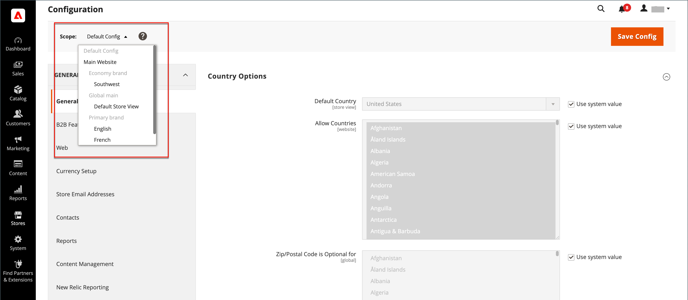
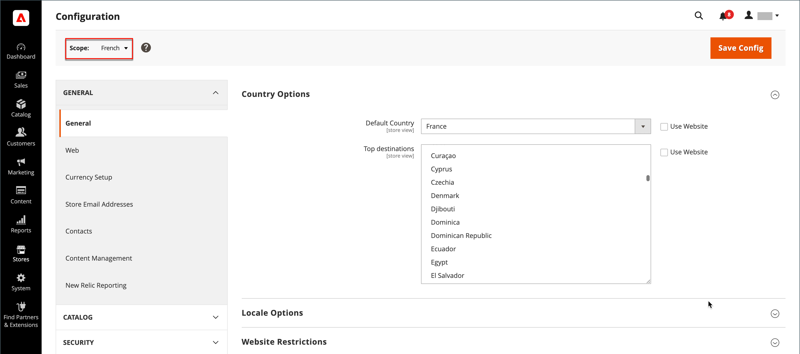

# Portée de la configuration

Le sélecteur Affichage de la boutique dans le coin supérieur gauche de nombreuses pages de configuration filtre l’affichage de la page pour une portée spécifique et définit la valeur de certaines entités utilisées par Commerce. Il répertorie chaque niveau de la hiérarchie par nom et est utilisé pour modifier la portée à un autre niveau. Tous les paramètres qui représentent la portée actuelle sont grisés, de sorte que seuls ceux qui représentent le paramètre de la portée actuelle sont disponibles. L’étendue est initialement définie sur _Configuration par défaut_. Pour les utilisateurs administrateurs avec un accès restreint, la liste des vues de magasin disponibles inclut uniquement celles auxquelles l’utilisateur a [autorisation](../systems/permissions.md) d’accéder.

| Niveau | Description |
|--- |--- |
| [!UICONTROL Default Config] | Configuration système par défaut. |
| [!UICONTROL Main Website] | Nom du site web au sommet de la hiérarchie. |
| [!UICONTROL Main Website Store] | Nom du magasin par défaut associé au site web parent. |
| [!UICONTROL Default Store View] | Nom de la vue de magasin par défaut associée au magasin parent. |
| [!UICONTROL Stores Configuration] | Atteint la grille Magasins et revient à choisir [!UICONTROL Stores] > [!UICONTROL All Stores] dans la barre latérale d’administration. |

{style="table-layout:auto"}

{width="700" zoomable="yes"}

## [!UICONTROL Use system value]

La case à cocher _[!UICONTROL Use System Value]_située à droite de nombreux paramètres de configuration permet d’appliquer ou de remplacer la valeur de champ par défaut dans la portée de la configuration actuelle. La valeur de champ par défaut ne peut pas être modifiée lorsque la case est cochée. Pour modifier la valeur, décochez la case et saisissez la nouvelle valeur. Vous êtes invité à confirmer chaque fois que vous modifiez la valeur système.

Le libellé de la case à cocher change en fonction de la portée actuelle et fait toujours référence au niveau parent qui se trouve un peu plus haut dans la hiérarchie de la portée. Étant donné que le niveau parent est un conteneur pour tous les éléments situés sous ce niveau, le paramètre de l’étendue du niveau parent est hérité, sauf s’il est remplacé.

## Options de valeur par défaut

| Case à cocher | Description |
|--- |--- |
| [!UICONTROL Use system value] | Cette case à cocher apparaît lorsque l&#39;étendue de la configuration est définie sur `Default Config`. |
| [!UICONTROL Use Default] | Cette case à cocher s’affiche lorsque l’étendue de la configuration est définie sur `Website` principal et fait référence au magasin par défaut affecté au site web. |
| [!UICONTROL Use Website] | Cette case à cocher s’affiche lorsque l’étendue de la configuration est définie sur une vue de magasin spécifique. Lorsqu’il est sélectionné, il utilise le paramètre du site web parent associé à la vue du magasin. Dans ce cas, le niveau de magasin est ignoré, car il est entendu qu’il s’applique au magasin par défaut associé au site web. |

{style="table-layout:auto"}

## Définir la portée

Avant d’effectuer un paramètre de configuration qui s’applique uniquement à un site web, un magasin ou une vue de magasin spécifique, procédez comme suit :

1. Dans la barre latérale _Admin_, effectuez l’une des opérations suivantes :

   - Pour la plupart des paramètres de configuration, accédez à **[!UICONTROL Stores]** > _[!UICONTROL Settings]_>**[!UICONTROL Configuration]**.

   - Pour [paramètres relatifs à la conception](../content-design/configuration.md), accédez à **[!UICONTROL Content]** > _[!UICONTROL Design]_>**[!UICONTROL Configuration]**. Ensuite, dans la grille, choisissez la vue de magasin applicable.

1. Accédez au paramètre de configuration à modifier et procédez comme suit :

   - Dans le coin supérieur gauche, définissez **[!UICONTROL Store View]** sur la vue spécifique à laquelle la configuration s’applique. Lorsque vous êtes invité à confirmer le changement de portée, cliquez sur **[!UICONTROL OK]**.

     Une case à cocher apparaît après chaque champ et des champs supplémentaires peuvent être disponibles.

   - Désélectionnez la case **[!UICONTROL Use system value]** après tout champ à modifier. Mettez ensuite à jour la valeur de la vue.

   - Répétez ce processus pour chaque champ qui doit être mis à jour sur la page.

   {width="700" zoomable="yes"}

1. Cliquez ensuite sur **[!UICONTROL Save Config]**.

## Référence rapide de la portée

| Portée | Description |
|--- |--- |
| **[!UICONTROL Global]** |  |
| Admin | Tous les sites web, magasins et affichages de magasin de l’installation sont gérés par le même administrateur. |
| Configuration par défaut | Les paramètres globaux [configuration par défaut](../getting-started/websites-stores-views.md#scope-settings) sont utilisés dans la hiérarchie du magasin, sauf s’ils sont remplacés à un niveau inférieur. |
| Catalogue | Le terme _catalogue_ fait référence à la base de données de produits dans son ensemble et est disponible dans toute l’installation. |
| Prix des produits | Les prix des produits peuvent être configurés pour l’application au niveau mondial ou au niveau du site web. |
| Configurations du produit | Les attributs utilisés comme options [produit configurable](../catalog/product-create-configurable.md) doivent avoir une portée globale. |
| Clients | Les comptes clients peuvent être configurés pour l’application au niveau mondial ou du site web. Chaque site web peut disposer d’un ensemble distinct de [comptes client](../customers/customer-account-scope.md) ou partager des comptes client avec d’autres sites web de l’installation. |
| **[!UICONTROL Website]** |  |
| Domaine | D’autres [sites web](../stores-purchase/introduction.md#store-structure) peuvent être configurés en tant que sous-domaines du domaine principal ou avoir des adresses IP et des domaines dédiés distincts. |
| Clients | Les comptes clients peuvent être configurés pour l’application au niveau mondial ou du site web. Chaque site web peut disposer d’un ensemble distinct de [comptes client](../customers/customer-account-scope.md) ou partager des comptes client avec d’autres sites web de l’installation. |
| Devise monétaire | Chaque site web peut se voir attribuer une [devise de base](../stores-purchase/currency-configuration.md) différente. La devise de base est utilisée pour traiter toutes les transactions, bien qu’une devise d’affichage différente puisse apparaître au client selon les paramètres régionaux de la vue du magasin. |
| Produits | Les produits individuels sont affectés à la hiérarchie au niveau du site web. La grille Produits répertorie tous les produits du catalogue et les sites web où ils sont disponibles. Le paramètre [Produit dans les sites web](../catalog/settings-basic-websites.md) identifie chaque site web sur lequel le produit est disponible. |
| Prix des produits | Les [prix des produits](../catalog/catalog-price-scope.md) peuvent être configurés pour l’application au niveau mondial ou au niveau du site web. |
| Modes de paiement | Les [Modes de paiement](../stores-purchase/payments.md) sont configurés au niveau du site web, bien que le titre et les instructions puissent être configurés pour chaque vue du magasin. |
| Extraire | Le [processus de passage en caisse](../stores-purchase/checkout-process.md) se déroule au niveau du site web, bien que certaines options d’affichage puissent être configurées pour chaque vue du magasin. Tous les magasins associés à un site web ont la même [configuration de passage en caisse](../stores-purchase/checkout-process.md#checkout-options). |
| Pays autorisés | Les pays autorisés peuvent être configurés au niveau du site web. Les paramètres [pays autorisés](../getting-started/store-details.md#country-options) sont utilisés lors du passage en caisse pour limiter la provenance d’un client. |
| **[!UICONTROL Store]** |  |
| Domaine | Avec plusieurs magasins, chaque magasin peut avoir le même domaine, un sous-domaine ou des domaines nettement différents. Pour plus d&#39;informations, voir [Ajouter des magasins](../stores-purchase/stores.md#add-stores). |
| Catégorie racine | Chaque magasin peut avoir un ensemble distinct de produits et un menu principal basé sur une catégorie « racine » et des sous-catégories. Chaque catalogue comporte une [catégorie racine](../catalog/category-root.md) qui est attribuée au niveau du magasin. |
| **[!UICONTROL Store View]** |  |
| Sous-catégories | Les [sous-catégories](../catalog/category-create.md#category-structure) qui constituent le menu principal (sous la racine) sont attribuées au niveau de l’affichage du magasin. |
| Locale | Chaque vue de magasin peut se voir attribuer un [paramètre régional](../getting-started/store-details.md#locale-options) différent. La devise d’affichage, les unités de mesure et l’interface d’administration sont spécifiques au paramètre régional. |
| Langues | Pour prendre en charge plusieurs langues, tout le contenu, y compris les descriptions de produits, doit être [traduit](../stores-purchase/store-localize.md#localize-products) pour chaque vue de magasin. |
| Afficher la devise | Une [devise d’affichage](../stores-purchase/currency-configuration.md) différente peut être utilisée pour chaque vue du magasin, bien que les transactions soient traitées au niveau du site web à l’aide de la devise de base. |

{style="table-layout:auto"}
